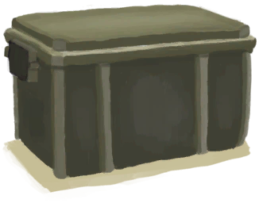
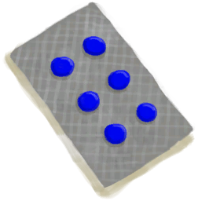
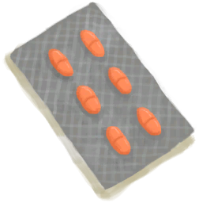
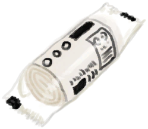

# Super Survival Trunk 2000  
> Trouble surviving? Super Survival Trunk 2000 is all you need!  
  
<table class="table table-bordered" data-toggle="table"  data-show-header="false"><thead style="display:none"><tr ><th  style="width:15%;text-align:left;vertical-align:top;"  >名称</th><th  style="text-align:left;vertical-align:top;"  >值</th></tr></thead><tr ><td  style="width:15%;text-align:left;vertical-align:top;"  >Unlock By</td><td  style="text-align:left;vertical-align:top;"  >Free</td></tr><tr ><td  style="width:15%;text-align:left;vertical-align:top;"  >Score</td><td  style="text-align:left;vertical-align:top;"  >-7500</td></tr><tr ><td  style="width:15%;text-align:left;vertical-align:top;"  >Equipped Card</td><td  style="text-align:left;vertical-align:top;"  >

  
  
</td></tr><tr ><td  style="width:15%;text-align:left;vertical-align:top;"  >Extra Cards</td><td  style="text-align:left;vertical-align:top;"  >

<a href="TrunkPerk.md" style="color:black">Super Survival Trunk 2000</a>

<a href="FirstAidKitTrunk.md" style="color:black">First Aid Kit</a>

<a href="Painkillers.md" style="color:black">Painkillers</a>

<a href="Painkillers.md" style="color:black">Painkillers</a>

<a href="Painkillers.md" style="color:black">Painkillers</a>

<a href="Antibiotics.md" style="color:black">Antibiotics</a>

<a href="Antibiotics.md" style="color:black">Antibiotics</a>

<a href="Antibiotics.md" style="color:black">Antibiotics</a>

<a href="AntiDiarrhoeaPills.md" style="color:black">Anti-Diarrhoea Pills</a>

<a href="AntiDiarrhoeaPills.md" style="color:black">Anti-Diarrhoea Pills</a>

<a href="AntiDiarrhoeaPills.md" style="color:black">Anti-Diarrhoea Pills</a>

<a href="WaterPurificationTablets.md" style="color:black">Water Purification Tablets</a>

<a href="WaterPurificationTablets.md" style="color:black">Water Purification Tablets</a>

<a href="WaterPurificationTablets.md" style="color:black">Water Purification Tablets</a>

<a href="WoundDressing.md" style="color:black">Wound Dressing</a>

<a href="WoundDressing.md" style="color:black">Wound Dressing</a>

<a href="WoundDressing.md" style="color:black">Wound Dressing</a>

<a href="WoundDressing.md" style="color:black">Wound Dressing</a>

<a href="WoundDressing.md" style="color:black">Wound Dressing</a>

<a href="WoundDressing.md" style="color:black">Wound Dressing</a>

<a href="FoodRationsPackage.md" style="color:black">Food Rations</a>

<a href="FoodRationsPackage.md" style="color:black">Food Rations</a>

<a href="WaterRationsPackage.md" style="color:black">Water Rations</a>

<a href="WaterRationsPackage.md" style="color:black">Water Rations</a>

<a href="PlasticBottleFull.md" style="color:black">Plastic Bottle</a>

<a href="PlasticBottleFull.md" style="color:black">Plastic Bottle</a>

<a href="PlasticBottleFull.md" style="color:black">Plastic Bottle</a>

<a href="PlasticBottleFull.md" style="color:black">Plastic Bottle</a>

<a href="PlasticBottleFull.md" style="color:black">Plastic Bottle</a>

<a href="PlasticBottleFull.md" style="color:black">Plastic Bottle</a>

<a href="FishingLine.md" style="color:black">Fishing Line</a>

<a href="FishingLine.md" style="color:black">Fishing Line</a>

<a href="FlareHand.md" style="color:black">Flare</a>

<a href="FlareHand.md" style="color:black">Flare</a>

<a href="FlareHand.md" style="color:black">Flare</a>

<a href="FlareHand.md" style="color:black">Flare</a>

<a href="PlasticSheet.md" style="color:black">Plastic Sheet</a>

<a href="PlasticSheet.md" style="color:black">Plastic Sheet</a>

  
  
</td></tr><tr ><td  style="width:15%;text-align:left;vertical-align:top;"  >Starting Status</td><td  style="text-align:left;vertical-align:top;"  >-</td></tr><tr ><td  style="width:15%;text-align:left;vertical-align:top;"  >Passive Status</td><td  style="text-align:left;vertical-align:top;"  >-</td></tr></tbody></table>  
  

