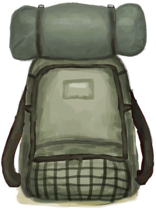
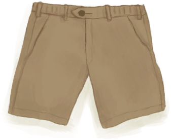
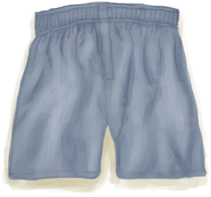
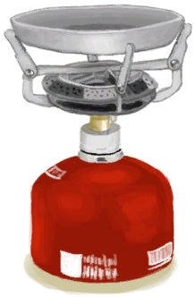

# Survivalist  
> "Start with survival equipment  
  
<table class="table table-bordered" data-toggle="table"  data-show-header="false"><thead style="display:none"><tr ><th  style="width:15%;text-align:left;vertical-align:top;"  >名称</th><th  style="text-align:left;vertical-align:top;"  >值</th></tr></thead><tr ><td  style="width:15%;text-align:left;vertical-align:top;"  >Unlock By</td><td  style="text-align:left;vertical-align:top;"  >1🌙</td></tr><tr ><td  style="width:15%;text-align:left;vertical-align:top;"  >Score</td><td  style="text-align:left;vertical-align:top;"  >-2500</td></tr><tr ><td  style="width:15%;text-align:left;vertical-align:top;"  >Equipped Card</td><td  style="text-align:left;vertical-align:top;"  >

<a href="HatSurvival.md" style="color:black">Survival Hat</a>

<a href="BackpackSurvivalist.md" style="color:black">Backpack</a>

<a href="T-Shirt.md" style="color:black">T-Shirt</a>

<a href="Shorts.md" style="color:black">Shorts</a>

<a href="Underwear.md" style="color:black">Underwear</a>

<a href="Socks.md" style="color:black">Socks</a>

<a href="MilitaryBoots.md" style="color:black">Military Boots</a>

  
  
</td></tr><tr ><td  style="width:15%;text-align:left;vertical-align:top;"  >Extra Cards</td><td  style="text-align:left;vertical-align:top;"  >

<a href="Canteen.md" style="color:black">Canteen</a>

<a href="KnifeMilitary.md" style="color:black">Military Knife</a>

<a href="AxeSurvival.md" style="color:black">Survival Axe</a>

<a href="GasCookerOff.md" style="color:black">Gas Cooker</a>

<a href="TentPacked.md" style="color:black">Packed Tent</a>

  
  
</td></tr><tr ><td  style="width:15%;text-align:left;vertical-align:top;"  >Starting Status</td><td  style="text-align:left;vertical-align:top;"  >-</td></tr><tr ><td  style="width:15%;text-align:left;vertical-align:top;"  >Passive Status</td><td  style="text-align:left;vertical-align:top;"  >-</td></tr></tbody></table>  
  

