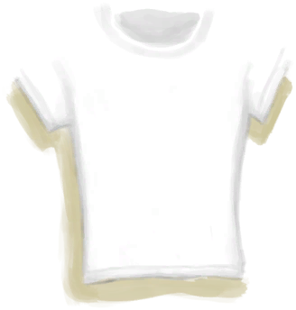

# Tourist  
> Start with tourist equipment.  
  
<table class="table table-bordered" data-toggle="table"  data-show-header="false"><thead style="display:none"><tr ><th  style="width:15%;text-align:left;vertical-align:top;"  >名称</th><th  style="text-align:left;vertical-align:top;"  >值</th></tr></thead><tr ><td  style="width:15%;text-align:left;vertical-align:top;"  >Unlock By</td><td  style="text-align:left;vertical-align:top;"  >20☀️</td></tr><tr ><td  style="width:15%;text-align:left;vertical-align:top;"  >Score</td><td  style="text-align:left;vertical-align:top;"  >-750</td></tr><tr ><td  style="width:15%;text-align:left;vertical-align:top;"  >Equipped Card</td><td  style="text-align:left;vertical-align:top;"  >

<a href="BackpackTourist.md" style="color:black">Backpack</a>

<a href="HawaiianShirt.md" style="color:black">Hawaiian Shirt</a>

<a href="T-Shirt.md" style="color:black">T-Shirt</a>

<a href="Shorts.md" style="color:black">Shorts</a>

<a href="Underwear.md" style="color:black">Underwear</a>

<a href="Socks.md" style="color:black">Socks</a>

<a href="Flipflops.md" style="color:black">Flipflops</a>

  
  
</td></tr><tr ><td  style="width:15%;text-align:left;vertical-align:top;"  >Extra Cards</td><td  style="text-align:left;vertical-align:top;"  >

<a href="SunScreen.md" style="color:black">Sun Screen</a>

<a href="ChickenSandwich.md" style="color:black">Chicken Sandwich</a>

<a href="PlasticBottleFull.md" style="color:black">Plastic Bottle</a>

<a href="Chocolate.md" style="color:black">Chocolate</a>

  
  
</td></tr><tr ><td  style="width:15%;text-align:left;vertical-align:top;"  >Starting Status</td><td  style="text-align:left;vertical-align:top;"  >-</td></tr><tr ><td  style="width:15%;text-align:left;vertical-align:top;"  >Passive Status</td><td  style="text-align:left;vertical-align:top;"  >-</td></tr></tbody></table>  
  

