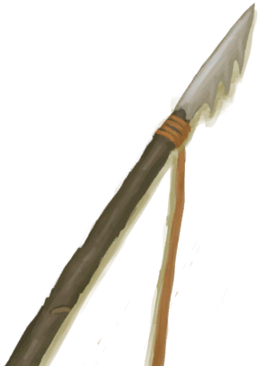

# Spearfisher  
> Good at spearfishing.  
  
<table class="table table-bordered" data-toggle="table"  data-show-header="false"><thead style="display:none"><tr ><th  style="width:15%;text-align:left;vertical-align:top;"  >名称</th><th  style="text-align:left;vertical-align:top;"  >值</th></tr></thead><tr ><td  style="width:15%;text-align:left;vertical-align:top;"  >Unlock By</td><td  style="text-align:left;vertical-align:top;"  >10☀️</td></tr><tr ><td  style="width:15%;text-align:left;vertical-align:top;"  >Score</td><td  style="text-align:left;vertical-align:top;"  >-1500</td></tr><tr ><td  style="width:15%;text-align:left;vertical-align:top;"  >Equipped Card</td><td  style="text-align:left;vertical-align:top;"  >

  
  
</td></tr><tr ><td  style="width:15%;text-align:left;vertical-align:top;"  >Extra Cards</td><td  style="text-align:left;vertical-align:top;"  >

<a href="Bp_FishingSpear.md" style="color:black">Fishing Spear</a>

<a href="Bp_Harpoon.md" style="color:black">Harpoon</a>

  
  
</td></tr><tr ><td  style="width:15%;text-align:left;vertical-align:top;"  >Starting Status</td><td  style="text-align:left;vertical-align:top;"  >[

[Spear Fishing(Skill)](Skill_SpearFishing.md)](Skill_SpearFishing.md)<b>+75</b></td></tr><tr ><td  style="width:15%;text-align:left;vertical-align:top;"  >Passive Status</td><td  style="text-align:left;vertical-align:top;"  >-</td></tr></tbody></table>  
  

