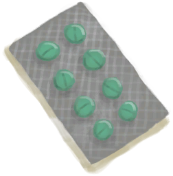

# Storage Compartments(未实装)  
> I can store things inside.  
  
<table class="table table-bordered" data-toggle="table"  data-show-header="false"><thead style="display:none"><tr ><th  style="width:50%;text-align:left;vertical-align:top;"  >title</th><th  style="width:50%;text-align:left;vertical-align:top;"  ></th></tr></thead><tr ><td  style="width:50%;text-align:left;vertical-align:top;"  >**Slots：**7  **Starting Cards：**

[

[First Aid Kit](FirstAidKitLifeRaft.md)](FirstAidKitLifeRaft.md)

[

[Food Rations](FoodRationsPackage.md)](FoodRationsPackage.md)

[

[Water Rations](WaterRationsPackage.md)](WaterRationsPackage.md)

[

[Oxygen Respirator](Oxygen.md)](Oxygen.md)

[

[Jerrycan](Jerrycan.md)](Jerrycan.md)

[

[Anti-Diarrhoea Pills](AntiDiarrhoeaPills.md)](AntiDiarrhoeaPills.md)

[

[Painkillers](Painkillers.md)](Painkillers.md)

[

[Antibiotics](Antibiotics.md)](Antibiotics.md)

[

[Wound Dressing](WoundDressing.md)](WoundDressing.md)(2)

  
  
  **过滤器：**~~[“Bag”](tag_Bag.md)~~  **WeightCapacity：**2000</td><td  style="width:50%;text-align:left;vertical-align:top;"  >

<a href="PlaneStorage.md" style="color:black">Storage Compartments</a>

</td></tr></tbody></table>  
  

