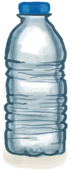
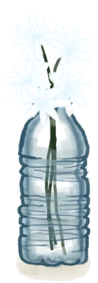

# Plastic Bottle  
> One man's trash is another man's treasure.  
  
<table class="table table-bordered" data-toggle="table"  data-show-header="false"><thead style="display:none"><tr ><th  style="width:50%;text-align:left;vertical-align:top;"  >title</th><th  style="width:50%;text-align:left;vertical-align:top;"  ></th></tr></thead><tr ><td  style="width:50%;text-align:left;vertical-align:top;"  >**Weight：**100  **Tag：**	[“Water Container”](tag_WaterContainer.md), [“Container Sealed”](tag_ContainerSealed.md)  **LiquidCapacity：**300</td><td  style="width:50%;text-align:left;vertical-align:top;"  >

<a href="PlasticBottleFull.md" style="color:black">Plastic Bottle</a>

</td></tr></tbody></table>  
  
## Got From  

Perk Effect

[Life Raft](Pk_1_LifeRaft.md)

Perk Effect

[Super Survival Trunk 2000](Pk_2_SurvivalTrunk.md)

Perk Effect

[Tourist](Pk_2_Tourist.md)

  
  
## Action  

<table><tr><td rowspan="2" style="width:200px;text-align:center;font-size:1.3em;font-weight:bold">

Collect Rain

</td><td></td></tr><tr><td></td></tr><tr><td colspan="2"><b>Require：</b>[

[Rain Value](RainValue.md)](RainValue.md): <b>1-5</b></td></tr><tr><td colspan="2">[Water](LQ_Water.md)(<b>+50</b>)</td></tr></table>
  
  
  
## Drag With  

<table style="margin-bottom:0px;"><tr><td style="width:40%;text-align:left; background-color:#FEFEFE"><b>With：</b>[

[Jasmine Flowers](JasmineFlowers.md)](JasmineFlowers.md)</td><td style="width:40%;font-size:1em;font-weight:bold;background-color:#FEFEFE">Add Flowers  </td></tr><tr style="background-color:#FFFFFF"><td style=""><b>Receiving：</b>→Dismiss</td><td style=""><b>Self：</b>→ [

[Jasmine Flowers](PlasticBottleJasmine.md)](PlasticBottleJasmine.md)</td></tr></table>
  
  
## Drag To  

[Bee Skep](BeeSkep.md)

[Swarming Bee Skep](BeeSkepSwarming.md)

[Trapped Macaque](CageTrapMacaque.md)

[Sow](BoarEnclosureFemale.md)

[Boar](BoarEnclosureMale.md)

[Piglet](BoarEnclosurePiglet.md)

[Sow](BoarTiedFemale.md)

[Boar](BoarTiedMale.md)

[Piglet](BoarTiedPiglet.md)

[Dog Friend](DogFriend.md)

[Goat](GoatEnclosureFemale.md)

[Juvenile Goat](GoatEnclosureKid.md)

[Lactating Goat](GoatEnclosureLactating.md)

[Male Goat](GoatEnclosureMale.md)

[Goat](GoatTiedFemale.md)

[Lactating Goat](GoatTiedFemaleLactating.md)

[Juvenile Goat](GoatTiedKid.md)

[Male Goat](GoatTiedMale.md)

[Grandfather](Grandfather.md)

[Grandfather](GrandfatherHealthy.md)

[Macaque Friend](MacaqueFriend.md)

[Wounded Macaque](MacaqueWounded.md)

[Sago Flatbread](SagoFlatbread.md)

[Water Ration](WaterRation.md)

[Dry Puddle(Wetlands)](Puddle.md)

[Reservoir](WaterReservoir.md)

[Reservoir(Full)](WaterReservoirFull.md)

[Reservoir (irrigating)](WaterReservoirIrrigating.md)

  
  
## Use In BluePrint  

<a href="Bp_HoneyCandy.md" style="color:black">Honey Candy</a>

  
  
  

