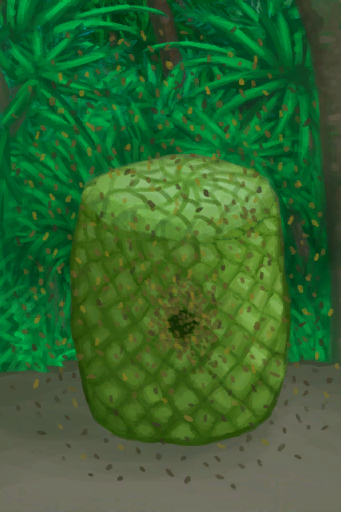

# Population Bees  
  

<b>Base Value: </b> 10000 
  

<b>Value Range: </b> 0 ~ 10000 
  

<b>Base Rate: </b> - 
  
## Statuses  

<table><tr style="height:2em;"><td style="background-color:#F0F0F0;text-align:center;width:180px;font-size:1.4em;font-weight:bold;vertical-align:middle;">
2000 ～ 3000

20% ～ 30%
</td><td colspan=2 style="font-size:1.1em;vertical-align:middle;background-color:#F9F9F9;">
<b>Small Population</b>

</td></tr><tr><td colspan=2><b>Effect：</b>[Population Bees](Pop_Bees.md)addition<b>+0.5</b></td></tr><tr><td colspan=2></td></tr><tr style="height:2em;"><td style="background-color:#F0F0F0;text-align:center;width:180px;font-size:1.4em;font-weight:bold;vertical-align:middle;">
3001 ～ 6000

30% ～ 60%
</td><td colspan=2 style="font-size:1.1em;vertical-align:middle;background-color:#F9F9F9;">
<b>Medium Population</b>

</td></tr><tr><td colspan=2><b>Effect：</b>[Population Bees](Pop_Bees.md)addition<b>+1</b></td></tr><tr><td colspan=2></td></tr><tr style="height:2em;"><td style="background-color:#F0F0F0;text-align:center;width:180px;font-size:1.4em;font-weight:bold;vertical-align:middle;">
6001 ～ 9000

60% ～ 90%
</td><td colspan=2 style="font-size:1.1em;vertical-align:middle;background-color:#F9F9F9;">
<b>Large Population</b>

</td></tr><tr><td colspan=2><b>Effect：</b>[Population Bees](Pop_Bees.md)addition<b>+1.5</b></td></tr><tr><td colspan=2></td></tr><tr style="height:2em;"><td style="background-color:#F0F0F0;text-align:center;width:180px;font-size:1.4em;font-weight:bold;vertical-align:middle;">
9001 ～ 1000

90% ～ 10%
</td><td colspan=2 style="font-size:1.1em;vertical-align:middle;background-color:#F9F9F9;">
<b>Very Large Population</b>

</td></tr><tr><td colspan=2><b>Effect：</b>[Population Bees](Pop_Bees.md)addition<b>+2</b></td></tr><tr><td colspan=2></td></tr></table>
  
## Change By  
<table class="table table-bordered" data-toggle="table"  ><thead style=""><tr ><th  style="text-align:left;vertical-align:top;"  >From</th><th  style="text-align:left;vertical-align:top;"  >Operation</th><th  style="text-align:left;vertical-align:top;"  data-sortable="true"  >Value</th></tr></thead><tr ><td  style="text-align:left;vertical-align:top;"  >[

[Swarming Bee Skep](BeeSkepSwarming.md)](BeeSkepSwarming.md)</td><td  style="text-align:left;vertical-align:top;"  >Transform</td><td  style="text-align:left;vertical-align:top;"  >1000</td></tr><tr ><td  style="text-align:left;vertical-align:top;"  >[

[Deep Jungle(Jungle)](DeepJungle.md)](DeepJungle.md)</td><td  style="text-align:left;vertical-align:top;"  >Explore</td><td  style="text-align:left;vertical-align:top;"  >-1000</td></tr></tbody></table>  
  
## Required By  
<table class="table table-bordered" data-toggle="table"  ><thead style=""><tr ><th  style="text-align:left;vertical-align:top;"  >From</th><th  style="text-align:left;vertical-align:top;"  >Operation</th><th  style="text-align:left;vertical-align:top;"  data-sortable="true"  >Value</th></tr></thead><tr ><td  style="text-align:left;vertical-align:top;"  >[Deep Jungle(Jungle)](DeepJungle.md)</td><td  style="text-align:left;vertical-align:top;"  >影响</td><td  style="text-align:left;vertical-align:top;"  >1000 ~ 10000</td></tr></tbody></table>  
  

