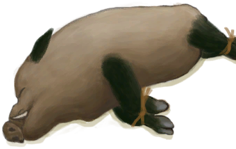

# Population Boars  
  

<b>Base Value: </b> 12000 
  

<b>Value Range: </b> 0 ~ 12000 
  

<b>Base Rate: </b> - 
  
## Statuses  

<table><tr style="height:2em;"><td style="background-color:#F0F0F0;text-align:center;width:180px;font-size:1.4em;font-weight:bold;vertical-align:middle;">
2000 ～ 3000

16% ～ 25%
</td><td colspan=2 style="font-size:1.1em;vertical-align:middle;background-color:#F9F9F9;">
<b>Small Population</b>

</td></tr><tr><td colspan=2><b>Effect：</b>[Population Boars](Pop_Boar.md)addition<b>+0.5</b></td></tr><tr><td colspan=2></td></tr><tr style="height:2em;"><td style="background-color:#F0F0F0;text-align:center;width:180px;font-size:1.4em;font-weight:bold;vertical-align:middle;">
3001 ～ 6000

25% ～ 50%
</td><td colspan=2 style="font-size:1.1em;vertical-align:middle;background-color:#F9F9F9;">
<b>Medium Population</b>

</td></tr><tr><td colspan=2><b>Effect：</b>[Population Boars](Pop_Boar.md)addition<b>+1</b></td></tr><tr><td colspan=2></td></tr><tr style="height:2em;"><td style="background-color:#F0F0F0;text-align:center;width:180px;font-size:1.4em;font-weight:bold;vertical-align:middle;">
6001 ～ 9000

50% ～ 75%
</td><td colspan=2 style="font-size:1.1em;vertical-align:middle;background-color:#F9F9F9;">
<b>Large Population</b>

</td></tr><tr><td colspan=2><b>Effect：</b>[Population Boars](Pop_Boar.md)addition<b>+1.5</b></td></tr><tr><td colspan=2></td></tr><tr style="height:2em;"><td style="background-color:#F0F0F0;text-align:center;width:180px;font-size:1.4em;font-weight:bold;vertical-align:middle;">
9001 ～ 12000

75% ～ 100%
</td><td colspan=2 style="font-size:1.1em;vertical-align:middle;background-color:#F9F9F9;">
<b>Very Large Population</b>

</td></tr><tr><td colspan=2><b>Effect：</b>[Population Boars](Pop_Boar.md)addition<b>+2</b></td></tr><tr><td colspan=2></td></tr></table>
  
## Change By  
<table class="table table-bordered" data-toggle="table"  ><thead style=""><tr ><th  style="text-align:left;vertical-align:top;"  >From</th><th  style="text-align:left;vertical-align:top;"  >Operation</th><th  style="text-align:left;vertical-align:top;"  data-sortable="true"  >Value</th></tr></thead><tr ><td  style="text-align:left;vertical-align:top;"  >[

[Sow](BoarEnclosureFemale.md)](BoarEnclosureFemale.md)</td><td  style="text-align:left;vertical-align:top;"  >Set Free</td><td  style="text-align:left;vertical-align:top;"  >1000</td></tr><tr ><td  style="text-align:left;vertical-align:top;"  >[

[Boar](BoarEnclosureMale.md)](BoarEnclosureMale.md)</td><td  style="text-align:left;vertical-align:top;"  >Set Free</td><td  style="text-align:left;vertical-align:top;"  >1000</td></tr><tr ><td  style="text-align:left;vertical-align:top;"  >[

[Piglet](BoarEnclosurePiglet.md)](BoarEnclosurePiglet.md)</td><td  style="text-align:left;vertical-align:top;"  >Set Free</td><td  style="text-align:left;vertical-align:top;"  >1000</td></tr><tr ><td  style="text-align:left;vertical-align:top;"  >[

[Sow](BoarTiedFemale.md)](BoarTiedFemale.md)</td><td  style="text-align:left;vertical-align:top;"  >Set Free</td><td  style="text-align:left;vertical-align:top;"  >1000</td></tr><tr ><td  style="text-align:left;vertical-align:top;"  >[

[Boar](BoarTiedMale.md)](BoarTiedMale.md)</td><td  style="text-align:left;vertical-align:top;"  >Set Free</td><td  style="text-align:left;vertical-align:top;"  >1000</td></tr><tr ><td  style="text-align:left;vertical-align:top;"  >[

[Piglet](BoarTiedPiglet.md)](BoarTiedPiglet.md)</td><td  style="text-align:left;vertical-align:top;"  >Set Free</td><td  style="text-align:left;vertical-align:top;"  >1000</td></tr><tr ><td  style="text-align:left;vertical-align:top;"  >[

[Wild Boar!(Event)](Event_BoarRummagingCrops.md)](Event_BoarRummagingCrops.md)</td><td  style="text-align:left;vertical-align:top;"  >Watch impotently...</td><td  style="text-align:left;vertical-align:top;"  >100</td></tr><tr ><td  style="text-align:left;vertical-align:top;"  >[

[Wild Boar!(Event)](Event_BoarRummagingFeed.md)](Event_BoarRummagingFeed.md)</td><td  style="text-align:left;vertical-align:top;"  >Watch impotently...</td><td  style="text-align:left;vertical-align:top;"  >100</td></tr><tr ><td  style="text-align:left;vertical-align:top;"  >[

[Wild Boar!(Event)](Event_BoarRummagingYamPlants.md)](Event_BoarRummagingYamPlants.md)</td><td  style="text-align:left;vertical-align:top;"  >Watch impotently...</td><td  style="text-align:left;vertical-align:top;"  >100</td></tr><tr ><td  style="text-align:left;vertical-align:top;"  >[

[Log Trap](LogTrap.md)](LogTrap.md)</td><td  style="text-align:left;vertical-align:top;"  >Catch Prey</td><td  style="text-align:left;vertical-align:top;"  >-1000</td></tr><tr ><td  style="text-align:left;vertical-align:top;"  >[

[Trapping Pit](TrappingPit.md)](TrappingPit.md)</td><td  style="text-align:left;vertical-align:top;"  >Catch Prey</td><td  style="text-align:left;vertical-align:top;"  >-1000</td></tr><tr ><td  style="text-align:left;vertical-align:top;"  >[

["I got him(Event)](Event_BoarFightMixedSuccess.md)](Event_BoarFightMixedSuccess.md)</td><td  style="text-align:left;vertical-align:top;"  >Continue</td><td  style="text-align:left;vertical-align:top;"  >-1000</td></tr><tr ><td  style="text-align:left;vertical-align:top;"  >[

[The Boar is down!(Event)](Event_BoarFightSuccess.md)](Event_BoarFightSuccess.md)</td><td  style="text-align:left;vertical-align:top;"  >Continue</td><td  style="text-align:left;vertical-align:top;"  >-1000</td></tr></tbody></table>  
  
## Required By  
<table class="table table-bordered" data-toggle="table"  ><thead style=""><tr ><th  style="text-align:left;vertical-align:top;"  >From</th><th  style="text-align:left;vertical-align:top;"  >Operation</th><th  style="text-align:left;vertical-align:top;"  data-sortable="true"  >Value</th></tr></thead><tr ><td  style="text-align:left;vertical-align:top;"  >[Log Trap](LogTrap.md)</td><td  style="text-align:left;vertical-align:top;"  >转化需要</td><td  style="text-align:left;vertical-align:top;"  >1000 ~ 12000</td></tr><tr ><td  style="text-align:left;vertical-align:top;"  >[Trapping Pit](TrappingPit.md)</td><td  style="text-align:left;vertical-align:top;"  >转化需要</td><td  style="text-align:left;vertical-align:top;"  >1000 ~ 12000</td></tr><tr ><td  style="text-align:left;vertical-align:top;"  >[Deep Jungle(Jungle)](DeepJungle.md)</td><td  style="text-align:left;vertical-align:top;"  >影响</td><td  style="text-align:left;vertical-align:top;"  >1000 ~ 12000</td></tr><tr ><td  style="text-align:left;vertical-align:top;"  >[Jungle](Jungle.md)</td><td  style="text-align:left;vertical-align:top;"  >影响</td><td  style="text-align:left;vertical-align:top;"  >1000 ~ 12000</td></tr><tr ><td  style="text-align:left;vertical-align:top;"  >[Jungle Highlands](JungleHighlands.md)</td><td  style="text-align:left;vertical-align:top;"  >影响</td><td  style="text-align:left;vertical-align:top;"  >1000 ~ 12000</td></tr><tr ><td  style="text-align:left;vertical-align:top;"  >[Wetland Jungle(Wetlands)](Wetlands.md)</td><td  style="text-align:left;vertical-align:top;"  >影响</td><td  style="text-align:left;vertical-align:top;"  >1000 ~ 12000</td></tr></tbody></table>  
  

