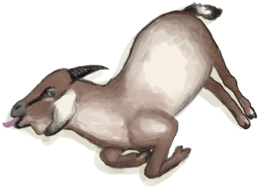

# Population Goats  
  

<b>Base Value: </b> 15000 
  

<b>Value Range: </b> 0 ~ 15000 
  

<b>Base Rate: </b> - 
  
## Statuses  

<table><tr style="height:2em;"><td style="background-color:#F0F0F0;text-align:center;width:180px;font-size:1.4em;font-weight:bold;vertical-align:middle;">
2000 ～ 3000

13% ～ 20%
</td><td colspan=2 style="font-size:1.1em;vertical-align:middle;background-color:#F9F9F9;">
<b>Small Population</b>

</td></tr><tr><td colspan=2><b>Effect：</b>[Population Goats](Pop_Goat.md)addition<b>+0.5</b></td></tr><tr><td colspan=2></td></tr><tr style="height:2em;"><td style="background-color:#F0F0F0;text-align:center;width:180px;font-size:1.4em;font-weight:bold;vertical-align:middle;">
3001 ～ 6000

20% ～ 40%
</td><td colspan=2 style="font-size:1.1em;vertical-align:middle;background-color:#F9F9F9;">
<b>Medium Population</b>

</td></tr><tr><td colspan=2><b>Effect：</b>[Population Goats](Pop_Goat.md)addition<b>+1</b></td></tr><tr><td colspan=2></td></tr><tr style="height:2em;"><td style="background-color:#F0F0F0;text-align:center;width:180px;font-size:1.4em;font-weight:bold;vertical-align:middle;">
6001 ～ 9000

40% ～ 60%
</td><td colspan=2 style="font-size:1.1em;vertical-align:middle;background-color:#F9F9F9;">
<b>Large Population</b>

</td></tr><tr><td colspan=2><b>Effect：</b>[Population Goats](Pop_Goat.md)addition<b>+1.5</b></td></tr><tr><td colspan=2></td></tr><tr style="height:2em;"><td style="background-color:#F0F0F0;text-align:center;width:180px;font-size:1.4em;font-weight:bold;vertical-align:middle;">
10001 ～ 15000

66% ～ 100%
</td><td colspan=2 style="font-size:1.1em;vertical-align:middle;background-color:#F9F9F9;">
<b>Very Large Population</b>

</td></tr><tr><td colspan=2><b>Effect：</b>[Population Goats](Pop_Goat.md)addition<b>+2</b></td></tr><tr><td colspan=2></td></tr></table>
  
## Change By  
<table class="table table-bordered" data-toggle="table"  ><thead style=""><tr ><th  style="text-align:left;vertical-align:top;"  >From</th><th  style="text-align:left;vertical-align:top;"  >Operation</th><th  style="text-align:left;vertical-align:top;"  data-sortable="true"  >Value</th></tr></thead><tr ><td  style="text-align:left;vertical-align:top;"  >[

[Goat](GoatEnclosureFemale.md)](GoatEnclosureFemale.md)</td><td  style="text-align:left;vertical-align:top;"  >Set Free</td><td  style="text-align:left;vertical-align:top;"  >1000</td></tr><tr ><td  style="text-align:left;vertical-align:top;"  >[

[Juvenile Goat](GoatEnclosureKid.md)](GoatEnclosureKid.md)</td><td  style="text-align:left;vertical-align:top;"  >Set Free</td><td  style="text-align:left;vertical-align:top;"  >1000</td></tr><tr ><td  style="text-align:left;vertical-align:top;"  >[

[Lactating Goat](GoatEnclosureLactating.md)](GoatEnclosureLactating.md)</td><td  style="text-align:left;vertical-align:top;"  >Set Free</td><td  style="text-align:left;vertical-align:top;"  >1000</td></tr><tr ><td  style="text-align:left;vertical-align:top;"  >[

[Male Goat](GoatEnclosureMale.md)](GoatEnclosureMale.md)</td><td  style="text-align:left;vertical-align:top;"  >Set Free</td><td  style="text-align:left;vertical-align:top;"  >1000</td></tr><tr ><td  style="text-align:left;vertical-align:top;"  >[

[Goat](GoatTiedFemale.md)](GoatTiedFemale.md)</td><td  style="text-align:left;vertical-align:top;"  >Set Free</td><td  style="text-align:left;vertical-align:top;"  >1000</td></tr><tr ><td  style="text-align:left;vertical-align:top;"  >[

[Lactating Goat](GoatTiedFemaleLactating.md)](GoatTiedFemaleLactating.md)</td><td  style="text-align:left;vertical-align:top;"  >Set Free</td><td  style="text-align:left;vertical-align:top;"  >1000</td></tr><tr ><td  style="text-align:left;vertical-align:top;"  >[

[Juvenile Goat](GoatTiedKid.md)](GoatTiedKid.md)</td><td  style="text-align:left;vertical-align:top;"  >Set Free</td><td  style="text-align:left;vertical-align:top;"  >1000</td></tr><tr ><td  style="text-align:left;vertical-align:top;"  >[

[Male Goat](GoatTiedMale.md)](GoatTiedMale.md)</td><td  style="text-align:left;vertical-align:top;"  >Set Free</td><td  style="text-align:left;vertical-align:top;"  >1000</td></tr><tr ><td  style="text-align:left;vertical-align:top;"  >[

[Log Trap](LogTrap.md)](LogTrap.md)</td><td  style="text-align:left;vertical-align:top;"  >Catch Prey</td><td  style="text-align:left;vertical-align:top;"  >-1000</td></tr><tr ><td  style="text-align:left;vertical-align:top;"  >[

[Trapping Pit](TrappingPit.md)](TrappingPit.md)</td><td  style="text-align:left;vertical-align:top;"  >Catch Prey</td><td  style="text-align:left;vertical-align:top;"  >-1000</td></tr><tr ><td  style="text-align:left;vertical-align:top;"  >[

[Got it!(Event)](Event_GoatFightSuccess.md)](Event_GoatFightSuccess.md)</td><td  style="text-align:left;vertical-align:top;"  >Continue</td><td  style="text-align:left;vertical-align:top;"  >-1000</td></tr></tbody></table>  
  
## Required By  
<table class="table table-bordered" data-toggle="table"  ><thead style=""><tr ><th  style="text-align:left;vertical-align:top;"  >From</th><th  style="text-align:left;vertical-align:top;"  >Operation</th><th  style="text-align:left;vertical-align:top;"  data-sortable="true"  >Value</th></tr></thead><tr ><td  style="text-align:left;vertical-align:top;"  >[Log Trap](LogTrap.md)</td><td  style="text-align:left;vertical-align:top;"  >转化需要</td><td  style="text-align:left;vertical-align:top;"  >1000 ~ 15000</td></tr><tr ><td  style="text-align:left;vertical-align:top;"  >[Trapping Pit](TrappingPit.md)</td><td  style="text-align:left;vertical-align:top;"  >转化需要</td><td  style="text-align:left;vertical-align:top;"  >1000 ~ 15000</td></tr><tr ><td  style="text-align:left;vertical-align:top;"  >[Eastern Grasslands](GrasslandsE.md)</td><td  style="text-align:left;vertical-align:top;"  >影响</td><td  style="text-align:left;vertical-align:top;"  >1000 ~ 15000</td></tr><tr ><td  style="text-align:left;vertical-align:top;"  >[Western Grasslands](GrasslandsW.md)</td><td  style="text-align:left;vertical-align:top;"  >影响</td><td  style="text-align:left;vertical-align:top;"  >1000 ~ 15000</td></tr><tr ><td  style="text-align:left;vertical-align:top;"  >[Eastern Highlands](HighlandsEastern.md)</td><td  style="text-align:left;vertical-align:top;"  >影响</td><td  style="text-align:left;vertical-align:top;"  >1000 ~ 15000</td></tr><tr ><td  style="text-align:left;vertical-align:top;"  >[Western Highlands](HighlandsWestern.md)</td><td  style="text-align:left;vertical-align:top;"  >影响</td><td  style="text-align:left;vertical-align:top;"  >1000 ~ 15000</td></tr></tbody></table>  
  

