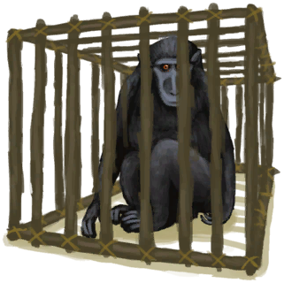
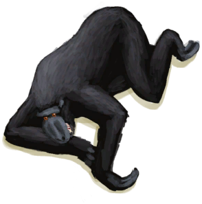

# Population Macaques  
  

<b>Base Value: </b> 25000 
  

<b>Value Range: </b> 0 ~ 25000 
  

<b>Base Rate: </b> - 
  
## Statuses  

<table><tr style="height:2em;"><td style="background-color:#F0F0F0;text-align:center;width:180px;font-size:1.4em;font-weight:bold;vertical-align:middle;">
2000 ～ 7500

8% ～ 30%
</td><td colspan=2 style="font-size:1.1em;vertical-align:middle;background-color:#F9F9F9;">
<b>Small Population</b>

</td></tr><tr><td colspan=2><b>Effect：</b>[Population Macaques](Pop_Macaque.md)addition<b>+0.5</b></td></tr><tr><td colspan=2></td></tr><tr style="height:2em;"><td style="background-color:#F0F0F0;text-align:center;width:180px;font-size:1.4em;font-weight:bold;vertical-align:middle;">
7501 ～ 15000

30% ～ 60%
</td><td colspan=2 style="font-size:1.1em;vertical-align:middle;background-color:#F9F9F9;">
<b>Medium Population</b>

</td></tr><tr><td colspan=2><b>Effect：</b>[Population Macaques](Pop_Macaque.md)addition<b>+1</b></td></tr><tr><td colspan=2></td></tr><tr style="height:2em;"><td style="background-color:#F0F0F0;text-align:center;width:180px;font-size:1.4em;font-weight:bold;vertical-align:middle;">
15001 ～ 20000

60% ～ 80%
</td><td colspan=2 style="font-size:1.1em;vertical-align:middle;background-color:#F9F9F9;">
<b>Large Population</b>

</td></tr><tr><td colspan=2><b>Effect：</b>[Population Macaques](Pop_Macaque.md)addition<b>+1.5</b></td></tr><tr><td colspan=2></td></tr><tr style="height:2em;"><td style="background-color:#F0F0F0;text-align:center;width:180px;font-size:1.4em;font-weight:bold;vertical-align:middle;">
20001 ～ 25000

80% ～ 100%
</td><td colspan=2 style="font-size:1.1em;vertical-align:middle;background-color:#F9F9F9;">
<b>Very Large Population</b>

</td></tr><tr><td colspan=2><b>Effect：</b>[Population Macaques](Pop_Macaque.md)addition<b>+2</b></td></tr><tr><td colspan=2></td></tr></table>
  
## Change By  
<table class="table table-bordered" data-toggle="table"  ><thead style=""><tr ><th  style="text-align:left;vertical-align:top;"  >From</th><th  style="text-align:left;vertical-align:top;"  >Operation</th><th  style="text-align:left;vertical-align:top;"  data-sortable="true"  >Value</th></tr></thead><tr ><td  style="text-align:left;vertical-align:top;"  >[

[Trapped Macaque](CageTrapMacaque.md)](CageTrapMacaque.md)</td><td  style="text-align:left;vertical-align:top;"  >Let Go</td><td  style="text-align:left;vertical-align:top;"  >1000</td></tr><tr ><td  style="text-align:left;vertical-align:top;"  >[

[Macaque(Event)](Event_MacaqueRaidRummaging.md)](Event_MacaqueRaidRummaging.md)</td><td  style="text-align:left;vertical-align:top;"  >Watch impotently...</td><td  style="text-align:left;vertical-align:top;"  >250</td></tr><tr ><td  style="text-align:left;vertical-align:top;"  >[

[Cage Trap](CageTrapPlaced.md)](CageTrapPlaced.md)</td><td  style="text-align:left;vertical-align:top;"  >Trap Triggered</td><td  style="text-align:left;vertical-align:top;"  >-1000</td></tr><tr ><td  style="text-align:left;vertical-align:top;"  >[

[Log Trap](LogTrap.md)](LogTrap.md)</td><td  style="text-align:left;vertical-align:top;"  >Catch Prey</td><td  style="text-align:left;vertical-align:top;"  >-1000</td></tr><tr ><td  style="text-align:left;vertical-align:top;"  >[

["I made it(Event)](Event_MacaqueDenFightMixedSuccess.md)](Event_MacaqueDenFightMixedSuccess.md)</td><td  style="text-align:left;vertical-align:top;"  >Continue</td><td  style="text-align:left;vertical-align:top;"  >-1000</td></tr><tr ><td  style="text-align:left;vertical-align:top;"  >[

[I made it!(Event)](Event_MacaqueDenFightSuccess.md)](Event_MacaqueDenFightSuccess.md)</td><td  style="text-align:left;vertical-align:top;"  >Continue</td><td  style="text-align:left;vertical-align:top;"  >-1000</td></tr><tr ><td  style="text-align:left;vertical-align:top;"  >[

["I got it(Event)](Event_MacaqueFightMixedSuccess.md)](Event_MacaqueFightMixedSuccess.md)</td><td  style="text-align:left;vertical-align:top;"  >Continue</td><td  style="text-align:left;vertical-align:top;"  >-1000</td></tr><tr ><td  style="text-align:left;vertical-align:top;"  >[

[The Macaque is down!(Event)](Event_MacaqueFightSuccess.md)](Event_MacaqueFightSuccess.md)</td><td  style="text-align:left;vertical-align:top;"  >Continue</td><td  style="text-align:left;vertical-align:top;"  >-1000</td></tr><tr ><td  style="text-align:left;vertical-align:top;"  >[

[The Macaque is down!(Event)](Event_MacaqueUndeadFightSuccess.md)](Event_MacaqueUndeadFightSuccess.md)(未实装)</td><td  style="text-align:left;vertical-align:top;"  >Continue</td><td  style="text-align:left;vertical-align:top;"  >-1000</td></tr><tr ><td  style="text-align:left;vertical-align:top;"  >[

[Trapped Macaque](CageTrapMacaque.md)](CageTrapMacaque.md)</td><td  style="text-align:left;vertical-align:top;"  >Transform</td><td  style="text-align:left;vertical-align:top;"  >-1000</td></tr><tr ><td  style="text-align:left;vertical-align:top;"  >[

[Trapped Macaque](CageTrapMacaque.md)](CageTrapMacaque.md)</td><td  style="text-align:left;vertical-align:top;"  >Dead of Thirst</td><td  style="text-align:left;vertical-align:top;"  >-1000</td></tr><tr ><td  style="text-align:left;vertical-align:top;"  >[

[Wounded Macaque](MacaqueWounded.md)](MacaqueWounded.md)</td><td  style="text-align:left;vertical-align:top;"  >Transform</td><td  style="text-align:left;vertical-align:top;"  >-1000</td></tr><tr ><td  style="text-align:left;vertical-align:top;"  >[

[Wounded Macaque](MacaqueWounded.md)](MacaqueWounded.md)</td><td  style="text-align:left;vertical-align:top;"  >Dead of Thirst</td><td  style="text-align:left;vertical-align:top;"  >-1000</td></tr><tr ><td  style="text-align:left;vertical-align:top;"  >[

[Macaque Den(Jungle Highlands)](MacaqueDenEntrance.md)](MacaqueDenEntrance.md)</td><td  style="text-align:left;vertical-align:top;"  >Revenge! ** With：**[Dynamite(On)](DynamiteOn.md)</td><td  style="text-align:left;vertical-align:top;"  >-20000</td></tr></tbody></table>  
  
## Required By  
<table class="table table-bordered" data-toggle="table"  ><thead style=""><tr ><th  style="text-align:left;vertical-align:top;"  >From</th><th  style="text-align:left;vertical-align:top;"  >Operation</th><th  style="text-align:left;vertical-align:top;"  data-sortable="true"  >Value</th></tr></thead><tr ><td  style="text-align:left;vertical-align:top;"  >[Cage Trap](CageTrapPlaced.md)</td><td  style="text-align:left;vertical-align:top;"  >转化需要</td><td  style="text-align:left;vertical-align:top;"  >1000 ~ 25000</td></tr><tr ><td  style="text-align:left;vertical-align:top;"  >[Log Trap](LogTrap.md)</td><td  style="text-align:left;vertical-align:top;"  >转化需要</td><td  style="text-align:left;vertical-align:top;"  >1000 ~ 25000</td></tr><tr ><td  style="text-align:left;vertical-align:top;"  >[Deep Jungle(Jungle)](DeepJungle.md)</td><td  style="text-align:left;vertical-align:top;"  >影响</td><td  style="text-align:left;vertical-align:top;"  >1000 ~ 25000</td></tr><tr ><td  style="text-align:left;vertical-align:top;"  >[Jungle](Jungle.md)</td><td  style="text-align:left;vertical-align:top;"  >影响</td><td  style="text-align:left;vertical-align:top;"  >1000 ~ 25000</td></tr><tr ><td  style="text-align:left;vertical-align:top;"  >[Jungle Highlands](JungleHighlands.md)</td><td  style="text-align:left;vertical-align:top;"  >影响</td><td  style="text-align:left;vertical-align:top;"  >1000 ~ 25000</td></tr><tr ><td  style="text-align:left;vertical-align:top;"  >[Wetland Jungle(Wetlands)](Wetlands.md)</td><td  style="text-align:left;vertical-align:top;"  >影响</td><td  style="text-align:left;vertical-align:top;"  >1000 ~ 25000</td></tr><tr ><td  style="text-align:left;vertical-align:top;"  >[Macaque Den(Jungle Highlands)](MacaqueDenEntrance.md)</td><td  style="text-align:left;vertical-align:top;"  >Macaques Exinct</td><td  style="text-align:left;vertical-align:top;"  >0 ~ 1999</td></tr></tbody></table>  
  

