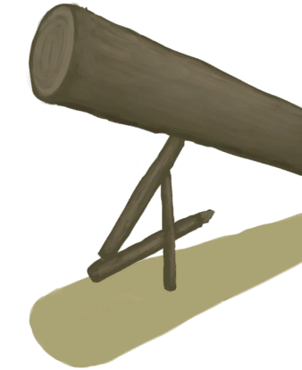

# Population Monitors  
  

<b>Base Value: </b> 14000 
  

<b>Value Range: </b> 0 ~ 14000 
  

<b>Base Rate: </b> - 
  
## Statuses  

<table><tr style="height:2em;"><td style="background-color:#F0F0F0;text-align:center;width:180px;font-size:1.4em;font-weight:bold;vertical-align:middle;">
2000 ～ 6000

14% ～ 42%
</td><td colspan=2 style="font-size:1.1em;vertical-align:middle;background-color:#F9F9F9;">
<b>Small Population</b>

</td></tr><tr><td colspan=2><b>Effect：</b>[Population Monitors](Pop_Monitor.md)addition<b>+0.5</b>, [Population Partridges](Pop_Partridge.md)addition<b>-1</b>, [Population Mouse](Pop_Mouse.md)addition<b>-1</b></td></tr><tr><td colspan=2></td></tr><tr style="height:2em;"><td style="background-color:#F0F0F0;text-align:center;width:180px;font-size:1.4em;font-weight:bold;vertical-align:middle;">
6001 ～ 10000

42% ～ 71%
</td><td colspan=2 style="font-size:1.1em;vertical-align:middle;background-color:#F9F9F9;">
<b>Medium Population</b>

</td></tr><tr><td colspan=2><b>Effect：</b>[Population Monitors](Pop_Monitor.md)addition<b>+0.75</b>, [Population Partridges](Pop_Partridge.md)addition<b>-2</b>, [Population Mouse](Pop_Mouse.md)addition<b>-2</b></td></tr><tr><td colspan=2></td></tr><tr style="height:2em;"><td style="background-color:#F0F0F0;text-align:center;width:180px;font-size:1.4em;font-weight:bold;vertical-align:middle;">
10001 ～ 14000

71% ～ 100%
</td><td colspan=2 style="font-size:1.1em;vertical-align:middle;background-color:#F9F9F9;">
<b>Large Population</b>

</td></tr><tr><td colspan=2><b>Effect：</b>[Population Monitors](Pop_Monitor.md)addition<b>+1</b>, [Population Partridges](Pop_Partridge.md)addition<b>-3</b>, [Population Mouse](Pop_Mouse.md)addition<b>-4</b></td></tr><tr><td colspan=2></td></tr></table>
  
## Change By  
<table class="table table-bordered" data-toggle="table"  ><thead style=""><tr ><th  style="text-align:left;vertical-align:top;"  >From</th><th  style="text-align:left;vertical-align:top;"  >Operation</th><th  style="text-align:left;vertical-align:top;"  data-sortable="true"  >Value</th></tr></thead><tr ><td  style="text-align:left;vertical-align:top;"  >[

[Monitor Lizard(Event)](Event_MonitorRummaging.md)](Event_MonitorRummaging.md)</td><td  style="text-align:left;vertical-align:top;"  >Watch impotently...</td><td  style="text-align:left;vertical-align:top;"  >100</td></tr><tr ><td  style="text-align:left;vertical-align:top;"  >[

[Log Trap](LogTrap.md)](LogTrap.md)</td><td  style="text-align:left;vertical-align:top;"  >Catch Prey</td><td  style="text-align:left;vertical-align:top;"  >-1000</td></tr><tr ><td  style="text-align:left;vertical-align:top;"  >[

[Trapping Pit](TrappingPit.md)](TrappingPit.md)</td><td  style="text-align:left;vertical-align:top;"  >Catch Prey</td><td  style="text-align:left;vertical-align:top;"  >-1000</td></tr><tr ><td  style="text-align:left;vertical-align:top;"  >[

["I got it(Event)](Event_MonitorFightMixedSuccess.md)](Event_MonitorFightMixedSuccess.md)</td><td  style="text-align:left;vertical-align:top;"  >Continue</td><td  style="text-align:left;vertical-align:top;"  >-1000</td></tr><tr ><td  style="text-align:left;vertical-align:top;"  >[

[The Lizard is down!(Event)](Event_MonitorFightSuccess.md)](Event_MonitorFightSuccess.md)</td><td  style="text-align:left;vertical-align:top;"  >Continue</td><td  style="text-align:left;vertical-align:top;"  >-1000</td></tr></tbody></table>  
  
## Required By  
<table class="table table-bordered" data-toggle="table"  ><thead style=""><tr ><th  style="text-align:left;vertical-align:top;"  >From</th><th  style="text-align:left;vertical-align:top;"  >Operation</th><th  style="text-align:left;vertical-align:top;"  data-sortable="true"  >Value</th></tr></thead><tr ><td  style="text-align:left;vertical-align:top;"  >[Cage Trap](CageTrapPlaced.md)</td><td  style="text-align:left;vertical-align:top;"  >转化需要</td><td  style="text-align:left;vertical-align:top;"  >1000 ~ 14000</td></tr><tr ><td  style="text-align:left;vertical-align:top;"  >[Deadfall Trap](DeadfallTrap.md)</td><td  style="text-align:left;vertical-align:top;"  >转化需要</td><td  style="text-align:left;vertical-align:top;"  >1000 ~ 14000</td></tr><tr ><td  style="text-align:left;vertical-align:top;"  >[Log Trap](LogTrap.md)</td><td  style="text-align:left;vertical-align:top;"  >转化需要</td><td  style="text-align:left;vertical-align:top;"  >1000 ~ 14000</td></tr><tr ><td  style="text-align:left;vertical-align:top;"  >[Snare Trap](SnareTrap.md)</td><td  style="text-align:left;vertical-align:top;"  >转化需要</td><td  style="text-align:left;vertical-align:top;"  >1000 ~ 14000</td></tr><tr ><td  style="text-align:left;vertical-align:top;"  >[Trapping Pit](TrappingPit.md)</td><td  style="text-align:left;vertical-align:top;"  >转化需要</td><td  style="text-align:left;vertical-align:top;"  >1000 ~ 14000</td></tr><tr ><td  style="text-align:left;vertical-align:top;"  >[Desolate Beach](DesolateBeach.md)</td><td  style="text-align:left;vertical-align:top;"  >影响</td><td  style="text-align:left;vertical-align:top;"  >1000 ~ 14000</td></tr><tr ><td  style="text-align:left;vertical-align:top;"  >[Eastern Grasslands](GrasslandsE.md)</td><td  style="text-align:left;vertical-align:top;"  >影响</td><td  style="text-align:left;vertical-align:top;"  >1000 ~ 14000</td></tr><tr ><td  style="text-align:left;vertical-align:top;"  >[Western Grasslands](GrasslandsW.md)</td><td  style="text-align:left;vertical-align:top;"  >影响</td><td  style="text-align:left;vertical-align:top;"  >1000 ~ 14000</td></tr><tr ><td  style="text-align:left;vertical-align:top;"  >[Mangrove Forest](Mangroves.md)</td><td  style="text-align:left;vertical-align:top;"  >影响</td><td  style="text-align:left;vertical-align:top;"  >1000 ~ 14000</td></tr></tbody></table>  
  

