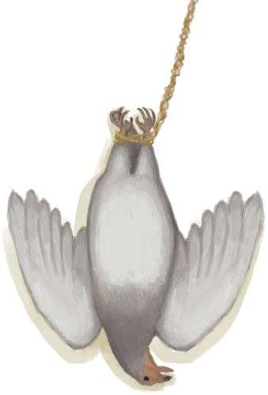

# Population Partridges  
  

<b>Base Value: </b> 40000 
  

<b>Value Range: </b> 0 ~ 40000 
  

<b>Base Rate: </b> - 
  
## Statuses  

<table><tr style="height:2em;"><td style="background-color:#F0F0F0;text-align:center;width:180px;font-size:1.4em;font-weight:bold;vertical-align:middle;">
2000 ～ 10000

5% ～ 25%
</td><td colspan=2 style="font-size:1.1em;vertical-align:middle;background-color:#F9F9F9;">
<b>Small Population</b>

</td></tr><tr><td colspan=2><b>Effect：</b>[Population Partridges](Pop_Partridge.md)addition<b>+2</b></td></tr><tr><td colspan=2></td></tr><tr style="height:2em;"><td style="background-color:#F0F0F0;text-align:center;width:180px;font-size:1.4em;font-weight:bold;vertical-align:middle;">
10001 ～ 20000

25% ～ 50%
</td><td colspan=2 style="font-size:1.1em;vertical-align:middle;background-color:#F9F9F9;">
<b>Medium Population</b>

</td></tr><tr><td colspan=2><b>Effect：</b>[Population Partridges](Pop_Partridge.md)addition<b>+3</b></td></tr><tr><td colspan=2></td></tr><tr style="height:2em;"><td style="background-color:#F0F0F0;text-align:center;width:180px;font-size:1.4em;font-weight:bold;vertical-align:middle;">
20001 ～ 30000

50% ～ 75%
</td><td colspan=2 style="font-size:1.1em;vertical-align:middle;background-color:#F9F9F9;">
<b>Large Population</b>

</td></tr><tr><td colspan=2><b>Effect：</b>[Population Partridges](Pop_Partridge.md)addition<b>+4</b></td></tr><tr><td colspan=2></td></tr><tr style="height:2em;"><td style="background-color:#F0F0F0;text-align:center;width:180px;font-size:1.4em;font-weight:bold;vertical-align:middle;">
30001 ～ 40000

75% ～ 100%
</td><td colspan=2 style="font-size:1.1em;vertical-align:middle;background-color:#F9F9F9;">
<b>Very Large Population</b>

</td></tr><tr><td colspan=2><b>Effect：</b>[Population Partridges](Pop_Partridge.md)addition<b>+5</b></td></tr><tr><td colspan=2></td></tr></table>
  
## Related Cards  
[Population Cobra](Pop_Cobra.md)  |  [Population Sea Krait](Pop_Krait.md)  |  [Population Monitors](Pop_Monitor.md)  
## Change By  
<table class="table table-bordered" data-toggle="table"  ><thead style=""><tr ><th  style="text-align:left;vertical-align:top;"  >From</th><th  style="text-align:left;vertical-align:top;"  >Operation</th><th  style="text-align:left;vertical-align:top;"  data-sortable="true"  >Value</th></tr></thead><tr ><td  style="text-align:left;vertical-align:top;"  >[

[Partridge](PartridgeFemaleLive.md)](PartridgeFemaleLive.md)</td><td  style="text-align:left;vertical-align:top;"  >Set Free</td><td  style="text-align:left;vertical-align:top;"  >1000</td></tr><tr ><td  style="text-align:left;vertical-align:top;"  >[

[Male Partridge](PartridgeMaleLive.md)](PartridgeMaleLive.md)</td><td  style="text-align:left;vertical-align:top;"  >Set Free</td><td  style="text-align:left;vertical-align:top;"  >1000</td></tr><tr ><td  style="text-align:left;vertical-align:top;"  >[

[Cage Trap](CageTrapPlaced.md)](CageTrapPlaced.md)</td><td  style="text-align:left;vertical-align:top;"  >Trap Triggered</td><td  style="text-align:left;vertical-align:top;"  >-1000</td></tr><tr ><td  style="text-align:left;vertical-align:top;"  >[

[Deadfall Trap](DeadfallTrap.md)](DeadfallTrap.md)</td><td  style="text-align:left;vertical-align:top;"  >Catch Prey</td><td  style="text-align:left;vertical-align:top;"  >-1000</td></tr><tr ><td  style="text-align:left;vertical-align:top;"  >[

[Snare Trap](SnareTrap.md)](SnareTrap.md)</td><td  style="text-align:left;vertical-align:top;"  >Catch Prey</td><td  style="text-align:left;vertical-align:top;"  >-1000</td></tr><tr ><td  style="text-align:left;vertical-align:top;"  >[

[Got it!(Event)](Event_PartridgeFightSuccess.md)](Event_PartridgeFightSuccess.md)</td><td  style="text-align:left;vertical-align:top;"  >Continue</td><td  style="text-align:left;vertical-align:top;"  >-1000</td></tr><tr ><td  style="text-align:left;vertical-align:top;"  >[

[A gift!(Event)](Event_DogFriendGift.md)](Event_DogFriendGift.md)</td><td  style="text-align:left;vertical-align:top;"  >Check Gift</td><td  style="text-align:left;vertical-align:top;"  >-1000</td></tr></tbody></table>  
  
## Required By  
<table class="table table-bordered" data-toggle="table"  ><thead style=""><tr ><th  style="text-align:left;vertical-align:top;"  >From</th><th  style="text-align:left;vertical-align:top;"  >Operation</th><th  style="text-align:left;vertical-align:top;"  data-sortable="true"  >Value</th></tr></thead><tr ><td  style="text-align:left;vertical-align:top;"  >[Deep Jungle(Jungle)](DeepJungle.md)</td><td  style="text-align:left;vertical-align:top;"  >影响</td><td  style="text-align:left;vertical-align:top;"  >2000 ~ 30000</td></tr><tr ><td  style="text-align:left;vertical-align:top;"  >[Jungle](Jungle.md)</td><td  style="text-align:left;vertical-align:top;"  >影响</td><td  style="text-align:left;vertical-align:top;"  >2000 ~ 30000</td></tr><tr ><td  style="text-align:left;vertical-align:top;"  >[Jungle Highlands](JungleHighlands.md)</td><td  style="text-align:left;vertical-align:top;"  >影响</td><td  style="text-align:left;vertical-align:top;"  >2000 ~ 30000</td></tr><tr ><td  style="text-align:left;vertical-align:top;"  >[Wetland Jungle(Wetlands)](Wetlands.md)</td><td  style="text-align:left;vertical-align:top;"  >影响</td><td  style="text-align:left;vertical-align:top;"  >2000 ~ 30000</td></tr><tr ><td  style="text-align:left;vertical-align:top;"  >[Cage Trap](CageTrapPlaced.md)</td><td  style="text-align:left;vertical-align:top;"  >转化需要</td><td  style="text-align:left;vertical-align:top;"  >1000 ~ 40000</td></tr><tr ><td  style="text-align:left;vertical-align:top;"  >[Deadfall Trap](DeadfallTrap.md)</td><td  style="text-align:left;vertical-align:top;"  >转化需要</td><td  style="text-align:left;vertical-align:top;"  >1000 ~ 40000</td></tr><tr ><td  style="text-align:left;vertical-align:top;"  >[Snare Trap](SnareTrap.md)</td><td  style="text-align:left;vertical-align:top;"  >转化需要</td><td  style="text-align:left;vertical-align:top;"  >1000 ~ 40000</td></tr><tr ><td  style="text-align:left;vertical-align:top;"  >[Deep Jungle(Jungle)](DeepJungle.md)</td><td  style="text-align:left;vertical-align:top;"  >影响</td><td  style="text-align:left;vertical-align:top;"  >1000 ~ 30000</td></tr><tr ><td  style="text-align:left;vertical-align:top;"  >[Eastern Grasslands](GrasslandsE.md)</td><td  style="text-align:left;vertical-align:top;"  >影响</td><td  style="text-align:left;vertical-align:top;"  >1000 ~ 30000</td></tr><tr ><td  style="text-align:left;vertical-align:top;"  >[Western Grasslands](GrasslandsW.md)</td><td  style="text-align:left;vertical-align:top;"  >影响</td><td  style="text-align:left;vertical-align:top;"  >1000 ~ 30000</td></tr><tr ><td  style="text-align:left;vertical-align:top;"  >[Western Highlands](HighlandsWestern.md)</td><td  style="text-align:left;vertical-align:top;"  >影响</td><td  style="text-align:left;vertical-align:top;"  >1000 ~ 30000</td></tr><tr ><td  style="text-align:left;vertical-align:top;"  >[Jungle](Jungle.md)</td><td  style="text-align:left;vertical-align:top;"  >影响</td><td  style="text-align:left;vertical-align:top;"  >1000 ~ 30000</td></tr><tr ><td  style="text-align:left;vertical-align:top;"  >[Jungle Highlands](JungleHighlands.md)</td><td  style="text-align:left;vertical-align:top;"  >影响</td><td  style="text-align:left;vertical-align:top;"  >1000 ~ 30000</td></tr><tr ><td  style="text-align:left;vertical-align:top;"  >[Secret Valley](SecretValley.md)</td><td  style="text-align:left;vertical-align:top;"  >影响</td><td  style="text-align:left;vertical-align:top;"  >1000 ~ 30000</td></tr><tr ><td  style="text-align:left;vertical-align:top;"  >[Wetland Jungle(Wetlands)](Wetlands.md)</td><td  style="text-align:left;vertical-align:top;"  >影响</td><td  style="text-align:left;vertical-align:top;"  >1000 ~ 30000</td></tr><tr ><td  style="text-align:left;vertical-align:top;"  >[A gift!(Event)](Event_DogFriendGift.md)</td><td  style="text-align:left;vertical-align:top;"  >影响</td><td  style="text-align:left;vertical-align:top;"  >0</td></tr></tbody></table>  
  

