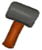
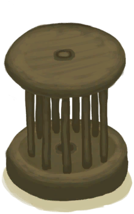

# Pottery Bonus  
> Shows how good your workplace is. Gives you a bonus to crafting.  
  

<b>Base Value: </b> 0 
  

<b>Value Range: </b> 0 ~ 1 
  

<b>Base Rate: </b> - 
  
## Statuses  

<table><tr style="height:2em;"><td style="background-color:#F0F0F0;text-align:center;width:180px;font-size:1.4em;font-weight:bold;vertical-align:middle;">
1

100%
</td><td colspan=2 style="font-size:1.1em;vertical-align:middle;background-color:#F9F9F9;">
<b>

Workplace</b>

&nbsp;&nbsp;Minor Effect
</td></tr><tr><td colspan=2><b>Effect on Action：</b>[“PotteryActionMinor(Group)”](PotteryActionMinor.md): , [

[Entertainment](Entertainment.md)](Entertainment.md)<b>+5</b> addition<b>-0.75</b>, [

[Stress](Stress.md)](Stress.md)<b>-2.5</b> addition<b>-0.75</b>, [

[Morale](Morale.md)](Morale.md)<b>+2.5</b> addition<b>-0.75</b>, TimeCost-1, , [“PotteryActionMajor(Group)”](PotteryActionMajor.md): , [

[Entertainment](Entertainment.md)](Entertainment.md)<b>+10</b> addition<b>-0.75</b>, [

[Stress](Stress.md)](Stress.md)<b>-10</b> addition<b>-0.75</b>, [

[Morale](Morale.md)](Morale.md)<b>+5</b> addition<b>-0.75</b>, TimeCost-2</td></tr><tr><td colspan=2></td></tr></table>
  
## Change By  
<table class="table table-bordered" data-toggle="table"  ><thead style=""><tr ><th  style="text-align:left;vertical-align:top;"  >From</th><th  style="text-align:left;vertical-align:top;"  >Operation</th><th  style="text-align:left;vertical-align:top;"  data-sortable="true"  >Value</th></tr></thead><tr ><td  style="text-align:left;vertical-align:top;"  >[

[Pottery Wheel](PotteryWheel.md)](PotteryWheel.md)</td><td  style="text-align:left;vertical-align:top;"  >Passive Effects</td><td  style="text-align:left;vertical-align:top;"  >1</td></tr></tbody></table>  
  

