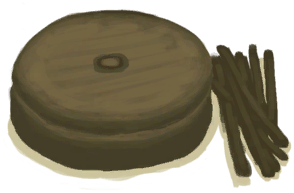

# Pottery Wheel  
> Should help me work with Clay.  
  
<table class="table table-bordered" data-toggle="table"  data-show-header="false"><thead style="display:none"><tr ><th  style="width:50%;text-align:left;vertical-align:top;"  >title</th><th  style="width:50%;text-align:left;vertical-align:top;"  ></th></tr></thead><tr ><td  style="width:50%;text-align:left;vertical-align:top;"  >** Cannot Be Trashed **  ** DoseNotPile **  **Weight：**1000  ** Effect: ** [

[Pottery Bonus](PotteryBonus.md)](PotteryBonus.md)<b>+1</b></td><td  style="width:50%;text-align:left;vertical-align:top;"  >

<a href="PotteryWheel.md" style="color:black">Pottery Wheel</a>

</td></tr></tbody></table>  
  
## Got From  

Place

[Dismantled PotteryWheel](PotteryWheelDismantled.md)

Craft BluePrint

[Pottery Wheel(BluePrint)](Bp_PotteryWheel.md)

  
  
## Action  

<table><tr><td rowspan="2" style="width:200px;text-align:center;font-size:1.3em;font-weight:bold">

Take apart and Pick Up

1h

</td><td>[“HandAction(Group)”](HandAction.md)</td></tr><tr><td><b>Self：</b>→ [

[Dismantled PotteryWheel](PotteryWheelDismantled.md)](PotteryWheelDismantled.md)</td></tr><tr><td colspan="2"><b>Require：</b>[

[Light](Light.md)](Light.md): <b>10-100</b></td></tr></table>
  
  
  
## Passive Effects  
<table class="table table-bordered" data-toggle="table"  ><thead style=""><tr ><th  style="text-align:left;vertical-align:top;"  >Name</th><th  style="text-align:left;vertical-align:top;"  data-sortable="true"  >Condition</th><th  style="text-align:left;vertical-align:top;"  data-sortable="true"  >Change(Each TP)</th><th  style="text-align:left;vertical-align:top;"  >Status</th></tr></thead><tr ><td  style="text-align:left;vertical-align:top;"  >Comfort</td><td  style="text-align:left;vertical-align:top;"  ></td><td  style="text-align:left;vertical-align:top;"  ></td><td  style="text-align:left;vertical-align:top;"  >[

[Comfort](Comfort.md)](Comfort.md)<b>+75</b></td></tr></tbody></table>  
  

