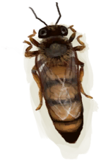

# Queen Bee  
> Could start a new colony with this!  
  
<table class="table table-bordered" data-toggle="table"  data-show-header="false"><thead style="display:none"><tr ><th  style="width:50%;text-align:left;vertical-align:top;"  >title</th><th  style="width:50%;text-align:left;vertical-align:top;"  ></th></tr></thead><tr ><td  style="width:50%;text-align:left;vertical-align:top;"  >**Weight：**10</td><td  style="width:50%;text-align:left;vertical-align:top;"  >

<a href="QueenBee.md" style="color:black">Queen Bee</a>

"Beehives can be found in the <b>Deep Jungles</b> of the island. Their honeycombs can be extracted for honey and wax</td></tr></tbody></table>  
  
## Got From  

** With：**[Sack](Sack.md)Trap Bees

[Swarming Bee Skep](BeeSkepSwarming.md)

Harvest

[Beehive](Beehive.md)

  
  
## Use In BluePrint  

<a href="Bp_BeeSkep.md" style="color:black">Bee Skep</a>

  
  
  
## Durability   

<table style="margin-bottom:0px;"><tr><td style="width:30%;text-align:left; background-color:#FEFEFE;font-size:1.3em;font-weight:bold;">Spoilage</td><td style="font-size:1em;background-color:#FEFEFE">Starting：278 -1/TP , Duration ：2d21h30m</td></tr><tr style="background-color:#FFFFFF"><td colspan=2>** On Zero： ** Self: → [

[Rotten Remains](RottenRemains.md)](RottenRemains.md)</td></tr></table>
  

