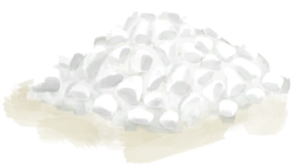

# Quinine Sulfate  
> Very good for treating Malaria.  
  
<table class="table table-bordered" data-toggle="table"  data-show-header="false"><thead style="display:none"><tr ><th  style="width:50%;text-align:left;vertical-align:top;"  >title</th><th  style="width:50%;text-align:left;vertical-align:top;"  ></th></tr></thead><tr ><td  style="width:50%;text-align:left;vertical-align:top;"  >**Weight：**10</td><td  style="width:50%;text-align:left;vertical-align:top;"  >

<a href="QuinineSulfate.md" style="color:black">Quinine Sulfate</a>

"Quinine can be extracted from the dried up bark of <b>Cinchona Trees</b>.  It is an essential medicine for the treatment and prevention of <b>Malaria</b>. Quinine Powder can be further processed into <b>Quinine Sulfate</b> which is even more effective against Malaria</td></tr></tbody></table>  
  
## Got From  

Craft BluePrint

[Quinine Sulfate(BluePrint)](Bp_QuinineSulfate.md)

  
  
## Action  

<table><tr><td rowspan="2" style="width:200px;text-align:center;font-size:1.3em;font-weight:bold">

Eat

</td><td></td></tr><tr><td><b>Self：</b>→Dismiss</td></tr><tr><td colspan="2"><b>StatChange：</b>[

[Quinine](Quinine.md)](Quinine.md)<b>+32</b>, [

[Morale](Morale.md)](Morale.md)<b>-5</b></td></tr></table>
  
  
  

