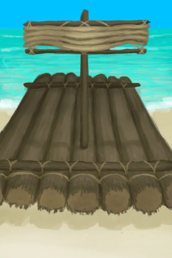
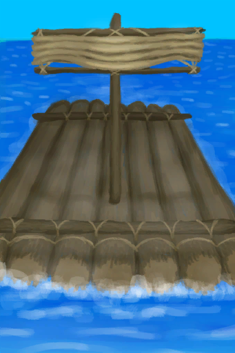

# Raft  
> My raft is ready. I should fill it with supplies before leaving.  
  
<table class="table table-bordered" data-toggle="table"  data-show-header="false"><thead style="display:none"><tr ><th  style="width:50%;text-align:left;vertical-align:top;"  >title</th><th  style="width:50%;text-align:left;vertical-align:top;"  ></th></tr></thead><tr ><td  style="width:50%;text-align:left;vertical-align:top;"  >** Unique On Board **</td><td  style="width:50%;text-align:left;vertical-align:top;"  >

<a href="RaftEntrance.md" style="color:black">Raft</a>

"When stranded on a tropical island</td></tr></tbody></table>  
  
## Got From  

Craft BluePrint

[Raft(BluePrint)](Bp_Raft.md)

  
  
## Action  

<table><tr><td rowspan="2" style="width:200px;text-align:center;font-size:1.3em;font-weight:bold">

Board the Raft

3m

</td><td></td></tr><tr><td></td></tr><tr><td colspan="2"><b>StatChange：</b>[On Raft](OnRaft.md)<b>+1</b></td></tr><tr><td colspan="2">[

[Raft(Environment)](Env_Raft.md)](Env_Raft.md)(<b>+1</b>), [

[Leave Raft](RaftExit.md)](RaftExit.md)(<b>+1</b>), [

[Start Journey](Start_Raft.md)](Start_Raft.md)(<b>+1</b>), [

[Raft](Raft.md)](Raft.md)(<b>+1</b>)</td></tr></table>
  
  
  
## Passive Effects  
<table class="table table-bordered" data-toggle="table"  ><thead style=""><tr ><th  style="text-align:left;vertical-align:top;"  >Name</th><th  style="text-align:left;vertical-align:top;"  data-sortable="true"  >Condition</th><th  style="text-align:left;vertical-align:top;"  data-sortable="true"  >Change(Each TP)</th><th  style="text-align:left;vertical-align:top;"  >Status</th></tr></thead><tr ><td  style="text-align:left;vertical-align:top;"  >Determination</td><td  style="text-align:left;vertical-align:top;"  ></td><td  style="text-align:left;vertical-align:top;"  ></td><td  style="text-align:left;vertical-align:top;"  >[

[Determination](Determination.md)](Determination.md)addition<b>+1</b></td></tr></tbody></table>  
  

