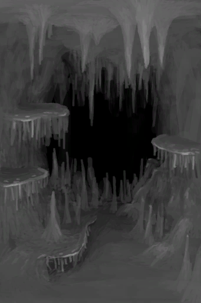
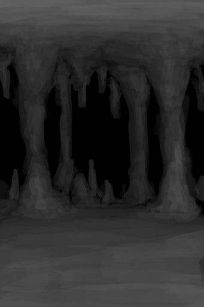

# Rain Value  
> How strong the rain is.  
> "Understanding the island's weather is crucial to survival. Clear days have a higher <b>Temperature and Sun Strength</b>  
  

<b>Base Value: </b> 0 
  

<b>Value Range: </b> 0 ~ 5 
  

<b>Base Rate: </b> - 
  
## Statuses  

<table><tr style="height:2em;"><td style="background-color:#F0F0F0;text-align:center;width:180px;font-size:1.4em;font-weight:bold;vertical-align:middle;">
1

20%
</td><td colspan=2 style="font-size:1.1em;vertical-align:middle;background-color:#F9F9F9;">
<b>

Light Rain</b>

</td></tr><tr><td colspan=2><b>Effect：</b>[

[Rain Exposure](RainExposure.md)](RainExposure.md)<b>+1</b>, [

[Bug Population](BugPopulation.md)](BugPopulation.md)<b>-2</b></td></tr><tr><td colspan=2></td></tr><tr style="height:2em;"><td style="background-color:#F0F0F0;text-align:center;width:180px;font-size:1.4em;font-weight:bold;vertical-align:middle;">
2

40%
</td><td colspan=2 style="font-size:1.1em;vertical-align:middle;background-color:#F9F9F9;">
<b>

Light Rain</b>

</td></tr><tr><td colspan=2><b>Effect：</b>[

[Rain Exposure](RainExposure.md)](RainExposure.md)<b>+2</b>, [

[Bug Population](BugPopulation.md)](BugPopulation.md)<b>-3</b></td></tr><tr><td colspan=2></td></tr><tr style="height:2em;"><td style="background-color:#F0F0F0;text-align:center;width:180px;font-size:1.4em;font-weight:bold;vertical-align:middle;">
3

60%
</td><td colspan=2 style="font-size:1.1em;vertical-align:middle;background-color:#F9F9F9;">
<b>

Light  Rain</b>

</td></tr><tr><td colspan=2><b>Effect：</b>[

[Rain Exposure](RainExposure.md)](RainExposure.md)<b>+3</b>, [

[Bug Population](BugPopulation.md)](BugPopulation.md)<b>-4</b></td></tr><tr><td colspan=2></td></tr><tr style="height:2em;"><td style="background-color:#F0F0F0;text-align:center;width:180px;font-size:1.4em;font-weight:bold;vertical-align:middle;">
4

80%
</td><td colspan=2 style="font-size:1.1em;vertical-align:middle;background-color:#F9F9F9;">
<b>

Moderate Rain</b>

</td></tr><tr><td colspan=2><b>Effect：</b>[

[Rain Exposure](RainExposure.md)](RainExposure.md)<b>+4</b>, [

[Bug Population](BugPopulation.md)](BugPopulation.md)<b>-5</b></td></tr><tr><td colspan=2><b>Effect on Action：</b>[“SlipperyAction(Group)”](SlipperyAction.md): , TimeCost+1</td></tr><tr><td colspan=2></td></tr><tr style="height:2em;"><td style="background-color:#F0F0F0;text-align:center;width:180px;font-size:1.4em;font-weight:bold;vertical-align:middle;">
5

100%
</td><td colspan=2 style="font-size:1.1em;vertical-align:middle;background-color:#F9F9F9;">
<b>

Strong Rain</b>

</td></tr><tr><td colspan=2><b>Effect：</b>[

[Rain Exposure](RainExposure.md)](RainExposure.md)<b>+5</b>, [

[Bug Population](BugPopulation.md)](BugPopulation.md)<b>-6</b></td></tr><tr><td colspan=2><b>Effect on Action：</b>[“SlipperyAction(Group)”](SlipperyAction.md): , TimeCost+1</td></tr><tr><td colspan=2></td></tr><tr style="height:2em;"><td style="background-color:#F0F0F0;text-align:center;width:180px;font-size:1.4em;font-weight:bold;vertical-align:middle;">
0

0%
</td><td colspan=2 style="font-size:1.1em;vertical-align:middle;background-color:#F9F9F9;">
<b>

No Rain</b>

</td></tr><tr><td colspan=2><b>Effect：</b>[

[Rain Exposure](RainExposure.md)](RainExposure.md)</td></tr><tr><td colspan=2></td></tr></table>
  
## Addition Change By  
<table class="table table-bordered" data-toggle="table"  ><thead style=""><tr ><th  style="text-align:left;vertical-align:top;"  >From</th><th  style="text-align:left;vertical-align:top;"  >Operation</th><th  style="text-align:left;vertical-align:top;"  >Value</th></tr></thead><tr ><td  style="text-align:left;vertical-align:top;"  >[Calm](OpenSea_Calm.md)</td><td  style="text-align:left;vertical-align:top;"  >Passive Effects</td><td  style="text-align:left;vertical-align:top;"  >addition+0</td></tr><tr ><td  style="text-align:left;vertical-align:top;"  >[Calm](OpenSea_CalmInfinite.md)</td><td  style="text-align:left;vertical-align:top;"  >Passive Effects</td><td  style="text-align:left;vertical-align:top;"  >addition+0</td></tr><tr ><td  style="text-align:left;vertical-align:top;"  >[Favourable Wind](OpenSea_Favourable.md)</td><td  style="text-align:left;vertical-align:top;"  >Passive Effects</td><td  style="text-align:left;vertical-align:top;"  >addition+0</td></tr><tr ><td  style="text-align:left;vertical-align:top;"  >[Clear](TropicalIsland_Clear.md)</td><td  style="text-align:left;vertical-align:top;"  >Passive Effects</td><td  style="text-align:left;vertical-align:top;"  >addition+0</td></tr><tr ><td  style="text-align:left;vertical-align:top;"  >[Clear](TropicalIsland_ClearInfinite.md)</td><td  style="text-align:left;vertical-align:top;"  >Passive Effects</td><td  style="text-align:left;vertical-align:top;"  >addition+0</td></tr><tr ><td  style="text-align:left;vertical-align:top;"  >[Clear](TropicalIsland_ClearStart.md)</td><td  style="text-align:left;vertical-align:top;"  >Passive Effects</td><td  style="text-align:left;vertical-align:top;"  >addition+0</td></tr><tr ><td  style="text-align:left;vertical-align:top;"  >[Cloudy](TropicalIsland_Cloudy.md)</td><td  style="text-align:left;vertical-align:top;"  >Passive Effects</td><td  style="text-align:left;vertical-align:top;"  >addition+0</td></tr></tbody></table>  
  
## Change By  
<table class="table table-bordered" data-toggle="table"  ><thead style=""><tr ><th  style="text-align:left;vertical-align:top;"  >From</th><th  style="text-align:left;vertical-align:top;"  >Operation</th><th  style="text-align:left;vertical-align:top;"  data-sortable="true"  >Value</th></tr></thead><tr ><td  style="text-align:left;vertical-align:top;"  >[

[Storm Behind](OpenSea_StormBehind.md)](OpenSea_StormBehind.md)</td><td  style="text-align:left;vertical-align:top;"  >Passive Effects</td><td  style="text-align:left;vertical-align:top;"  >5</td></tr><tr ><td  style="text-align:left;vertical-align:top;"  >[

[Storm Behind](OpenSea_StormBehindInfinite.md)](OpenSea_StormBehindInfinite.md)</td><td  style="text-align:left;vertical-align:top;"  >Passive Effects</td><td  style="text-align:left;vertical-align:top;"  >5</td></tr><tr ><td  style="text-align:left;vertical-align:top;"  >[

[Storm Front](OpenSea_StormFront.md)](OpenSea_StormFront.md)</td><td  style="text-align:left;vertical-align:top;"  >Passive Effects</td><td  style="text-align:left;vertical-align:top;"  >5</td></tr><tr ><td  style="text-align:left;vertical-align:top;"  >[

[Heavy Rain](TropicalIsland_HeavyRain.md)](TropicalIsland_HeavyRain.md)</td><td  style="text-align:left;vertical-align:top;"  >Passive Effects</td><td  style="text-align:left;vertical-align:top;"  >5</td></tr><tr ><td  style="text-align:left;vertical-align:top;"  >[

[Heavy Rain](TropicalIsland_HeavyRainInfinite.md)](TropicalIsland_HeavyRainInfinite.md)</td><td  style="text-align:left;vertical-align:top;"  >Passive Effects</td><td  style="text-align:left;vertical-align:top;"  >5</td></tr><tr ><td  style="text-align:left;vertical-align:top;"  >[

[Heavy Rain](TropicalIsland_HeavyRainLong.md)](TropicalIsland_HeavyRainLong.md)(未实装)</td><td  style="text-align:left;vertical-align:top;"  >Passive Effects</td><td  style="text-align:left;vertical-align:top;"  >5</td></tr><tr ><td  style="text-align:left;vertical-align:top;"  >[

[Heavy Rain](TropicalIsland_HeavyRainStart.md)](TropicalIsland_HeavyRainStart.md)(未实装)</td><td  style="text-align:left;vertical-align:top;"  >Passive Effects</td><td  style="text-align:left;vertical-align:top;"  >5</td></tr><tr ><td  style="text-align:left;vertical-align:top;"  >[

[Storm](TropicalIsland_Storm.md)](TropicalIsland_Storm.md)</td><td  style="text-align:left;vertical-align:top;"  >Passive Effects</td><td  style="text-align:left;vertical-align:top;"  >5</td></tr><tr ><td  style="text-align:left;vertical-align:top;"  >[

[Storm](TropicalIsland_StormInfinite.md)](TropicalIsland_StormInfinite.md)</td><td  style="text-align:left;vertical-align:top;"  >Passive Effects</td><td  style="text-align:left;vertical-align:top;"  >5</td></tr><tr ><td  style="text-align:left;vertical-align:top;"  >[

[Storm](TropicalIsland_StormStart.md)](TropicalIsland_StormStart.md)(未实装)</td><td  style="text-align:left;vertical-align:top;"  >Passive Effects</td><td  style="text-align:left;vertical-align:top;"  >5</td></tr><tr ><td  style="text-align:left;vertical-align:top;"  >[

[Very Favourable Wind](OpenSea_VeryFavourable.md)](OpenSea_VeryFavourable.md)</td><td  style="text-align:left;vertical-align:top;"  >Passive Effects</td><td  style="text-align:left;vertical-align:top;"  >3</td></tr><tr ><td  style="text-align:left;vertical-align:top;"  >[

[Very Favourable Wind](OpenSea_VeryFavourableInfinite.md)](OpenSea_VeryFavourableInfinite.md)</td><td  style="text-align:left;vertical-align:top;"  >Passive Effects</td><td  style="text-align:left;vertical-align:top;"  >3</td></tr><tr ><td  style="text-align:left;vertical-align:top;"  >[

[Very Unfavourable Wind](OpenSea_VeryUnFavourable.md)](OpenSea_VeryUnFavourable.md)</td><td  style="text-align:left;vertical-align:top;"  >Passive Effects</td><td  style="text-align:left;vertical-align:top;"  >3</td></tr><tr ><td  style="text-align:left;vertical-align:top;"  >[

[Light Rain](TropicalIsland_LightRain.md)](TropicalIsland_LightRain.md)</td><td  style="text-align:left;vertical-align:top;"  >Passive Effects</td><td  style="text-align:left;vertical-align:top;"  >3</td></tr><tr ><td  style="text-align:left;vertical-align:top;"  >[

[Light Rain](TropicalIsland_LightRainStart.md)](TropicalIsland_LightRainStart.md)(未实装)</td><td  style="text-align:left;vertical-align:top;"  >Passive Effects</td><td  style="text-align:left;vertical-align:top;"  >3</td></tr><tr ><td  style="text-align:left;vertical-align:top;"  >[

[High Chamber(Environment)](Env_CrystalChamber.md)](Env_CrystalChamber.md)</td><td  style="text-align:left;vertical-align:top;"  >Passive Effects</td><td  style="text-align:left;vertical-align:top;"  >-5</td></tr><tr ><td  style="text-align:left;vertical-align:top;"  >[

[Damp Chamber(Environment)](Env_DampChamber.md)](Env_DampChamber.md)</td><td  style="text-align:left;vertical-align:top;"  >Passive Effects</td><td  style="text-align:left;vertical-align:top;"  >-5</td></tr><tr ><td  style="text-align:left;vertical-align:top;"  >[

[Flooded Chamber(Environment)](Env_FloodedChamber.md)](Env_FloodedChamber.md)</td><td  style="text-align:left;vertical-align:top;"  >Passive Effects</td><td  style="text-align:left;vertical-align:top;"  >-5</td></tr><tr ><td  style="text-align:left;vertical-align:top;"  >[

[High Chamber(Environment)](Env_HighChamber.md)](Env_HighChamber.md)</td><td  style="text-align:left;vertical-align:top;"  >Passive Effects</td><td  style="text-align:left;vertical-align:top;"  >-5</td></tr><tr ><td  style="text-align:left;vertical-align:top;"  >[

[High Chamber(Environment)](Env_LowChamber.md)](Env_LowChamber.md)</td><td  style="text-align:left;vertical-align:top;"  >Passive Effects</td><td  style="text-align:left;vertical-align:top;"  >-5</td></tr><tr ><td  style="text-align:left;vertical-align:top;"  >[

[High Chamber(Environment)](Env_MidChamber.md)](Env_MidChamber.md)</td><td  style="text-align:left;vertical-align:top;"  >Passive Effects</td><td  style="text-align:left;vertical-align:top;"  >-5</td></tr><tr ><td  style="text-align:left;vertical-align:top;"  >[

[High Chamber(Environment)](Env_NarrowTunnel.md)](Env_NarrowTunnel.md)</td><td  style="text-align:left;vertical-align:top;"  >Passive Effects</td><td  style="text-align:left;vertical-align:top;"  >-5</td></tr></tbody></table>  
  
## Required By  
<table class="table table-bordered" data-toggle="table"  ><thead style=""><tr ><th  style="text-align:left;vertical-align:top;"  >From</th><th  style="text-align:left;vertical-align:top;"  >Operation</th><th  style="text-align:left;vertical-align:top;"  data-sortable="true"  >Value</th></tr></thead><tr ><td  style="text-align:left;vertical-align:top;"  >[Dry Crop Plot](CropPlotDry.md)</td><td  style="text-align:left;vertical-align:top;"  >Rain Water</td><td  style="text-align:left;vertical-align:top;"  >1 ~ 5</td></tr><tr ><td  style="text-align:left;vertical-align:top;"  >[Dry Mushroom Bed](MushroomBedDry.md)</td><td  style="text-align:left;vertical-align:top;"  >Rain Water</td><td  style="text-align:left;vertical-align:top;"  >1 ~ 5</td></tr><tr ><td  style="text-align:left;vertical-align:top;"  >[Dirt Pile](DirtPile.md)</td><td  style="text-align:left;vertical-align:top;"  >Make Mud</td><td  style="text-align:left;vertical-align:top;"  >1 ~ 5</td></tr><tr ><td  style="text-align:left;vertical-align:top;"  >[Perforated Coconut](CoconutPerforated.md)</td><td  style="text-align:left;vertical-align:top;"  >Collect Rain</td><td  style="text-align:left;vertical-align:top;"  >1 ~ 5</td></tr><tr ><td  style="text-align:left;vertical-align:top;"  >[Canteen](Canteen.md)</td><td  style="text-align:left;vertical-align:top;"  >Collect Rain</td><td  style="text-align:left;vertical-align:top;"  >1 ~ 5</td></tr><tr ><td  style="text-align:left;vertical-align:top;"  >[Clay Bowl](ClayBowl.md)</td><td  style="text-align:left;vertical-align:top;"  >Collect Rain</td><td  style="text-align:left;vertical-align:top;"  >1 ~ 5</td></tr><tr ><td  style="text-align:left;vertical-align:top;"  >[Clay Jar](ClayJar.md)</td><td  style="text-align:left;vertical-align:top;"  >Collect Rain</td><td  style="text-align:left;vertical-align:top;"  >1 ~ 5</td></tr><tr ><td  style="text-align:left;vertical-align:top;"  >[Jasmine Flowers](ClayJarJasmine.md)</td><td  style="text-align:left;vertical-align:top;"  >Collect Rain</td><td  style="text-align:left;vertical-align:top;"  >1 ~ 5</td></tr><tr ><td  style="text-align:left;vertical-align:top;"  >[Clay Vase](ClayVase.md)</td><td  style="text-align:left;vertical-align:top;"  >Collect Rain</td><td  style="text-align:left;vertical-align:top;"  >1 ~ 5</td></tr><tr ><td  style="text-align:left;vertical-align:top;"  >[Coconut Flask](CoconutFlask.md)</td><td  style="text-align:left;vertical-align:top;"  >Collect Rain</td><td  style="text-align:left;vertical-align:top;"  >1 ~ 5</td></tr><tr ><td  style="text-align:left;vertical-align:top;"  >[Coconut Shell](CoconutShell.md)</td><td  style="text-align:left;vertical-align:top;"  >Collect Rain</td><td  style="text-align:left;vertical-align:top;"  >1 ~ 5</td></tr><tr ><td  style="text-align:left;vertical-align:top;"  >[Cooking Pot](CookingPot.md)</td><td  style="text-align:left;vertical-align:top;"  >Collect Rain</td><td  style="text-align:left;vertical-align:top;"  >1 ~ 5</td></tr><tr ><td  style="text-align:left;vertical-align:top;"  >[Copper Bottle](CopperBottle.md)</td><td  style="text-align:left;vertical-align:top;"  >Collect Rain</td><td  style="text-align:left;vertical-align:top;"  >1 ~ 5</td></tr><tr ><td  style="text-align:left;vertical-align:top;"  >[Copper Jar](CopperJar.md)</td><td  style="text-align:left;vertical-align:top;"  >Collect Rain</td><td  style="text-align:left;vertical-align:top;"  >1 ~ 5</td></tr><tr ><td  style="text-align:left;vertical-align:top;"  >[Glazed Vase](GlazedVase.md)</td><td  style="text-align:left;vertical-align:top;"  >Collect Rain</td><td  style="text-align:left;vertical-align:top;"  >1 ~ 5</td></tr><tr ><td  style="text-align:left;vertical-align:top;"  >[Gourd Bottle](GourdBottle.md)</td><td  style="text-align:left;vertical-align:top;"  >Collect Rain</td><td  style="text-align:left;vertical-align:top;"  >1 ~ 5</td></tr><tr ><td  style="text-align:left;vertical-align:top;"  >[Jerrycan](Jerrycan.md)</td><td  style="text-align:left;vertical-align:top;"  >Collect Rain</td><td  style="text-align:left;vertical-align:top;"  >1 ~ 5</td></tr><tr ><td  style="text-align:left;vertical-align:top;"  >[Plastic Bottle](PlasticBottle.md)</td><td  style="text-align:left;vertical-align:top;"  >Collect Rain</td><td  style="text-align:left;vertical-align:top;"  >1 ~ 5</td></tr><tr ><td  style="text-align:left;vertical-align:top;"  >[Plastic Bottle(Full)](PlasticBottleFull.md)</td><td  style="text-align:left;vertical-align:top;"  >Collect Rain</td><td  style="text-align:left;vertical-align:top;"  >1 ~ 5</td></tr><tr ><td  style="text-align:left;vertical-align:top;"  >[Jasmine Flowers](PlasticBottleJasmine.md)</td><td  style="text-align:left;vertical-align:top;"  >Collect Rain</td><td  style="text-align:left;vertical-align:top;"  >1 ~ 5</td></tr><tr ><td  style="text-align:left;vertical-align:top;"  >[Waterskin](Waterskin.md)</td><td  style="text-align:left;vertical-align:top;"  >Collect Rain</td><td  style="text-align:left;vertical-align:top;"  >1 ~ 5</td></tr><tr ><td  style="text-align:left;vertical-align:top;"  >[Salt Water](LQ_WaterSalt.md)</td><td  style="text-align:left;vertical-align:top;"  >Replace during Rain</td><td  style="text-align:left;vertical-align:top;"  >1 ~ 5</td></tr><tr ><td  style="text-align:left;vertical-align:top;"  >[Shaft](ShaftFloodedChamberToCrystalChamber.md)</td><td  style="text-align:left;vertical-align:top;"  >影响</td><td  style="text-align:left;vertical-align:top;"  >1 ~ 5</td></tr><tr ><td  style="text-align:left;vertical-align:top;"  >[Shaft](ShaftLowChamberToMidChamber.md)</td><td  style="text-align:left;vertical-align:top;"  >影响</td><td  style="text-align:left;vertical-align:top;"  >1 ~ 5</td></tr><tr ><td  style="text-align:left;vertical-align:top;"  >[Hole](HighlandHoleEntrance.md)</td><td  style="text-align:left;vertical-align:top;"  >影响</td><td  style="text-align:left;vertical-align:top;"  >1 ~ 5</td></tr><tr ><td  style="text-align:left;vertical-align:top;"  >[Exit](HighlandHoleExit.md)</td><td  style="text-align:left;vertical-align:top;"  >影响</td><td  style="text-align:left;vertical-align:top;"  >1 ~ 5</td></tr><tr ><td  style="text-align:left;vertical-align:top;"  >[To Jungle Highlands(Secret Cove)](Path_CoveToJungleHighlands.md)</td><td  style="text-align:left;vertical-align:top;"  >影响</td><td  style="text-align:left;vertical-align:top;"  >1 ~ 5</td></tr><tr ><td  style="text-align:left;vertical-align:top;"  >[To Secret Cove(Jungle Highlands)](Path_JungleHighlandsToCove.md)</td><td  style="text-align:left;vertical-align:top;"  >影响</td><td  style="text-align:left;vertical-align:top;"  >1 ~ 5</td></tr><tr ><td  style="text-align:left;vertical-align:top;"  >[To Valley Cliffs](Path_JungleHighlandsToValley.md)</td><td  style="text-align:left;vertical-align:top;"  >影响</td><td  style="text-align:left;vertical-align:top;"  >1 ~ 5</td></tr><tr ><td  style="text-align:left;vertical-align:top;"  >[To Wetlands Cliff](Path_JungleHighlandsToWetlands.md)</td><td  style="text-align:left;vertical-align:top;"  >影响</td><td  style="text-align:left;vertical-align:top;"  >1 ~ 5</td></tr><tr ><td  style="text-align:left;vertical-align:top;"  >[To Jungle Highlands](Path_ValleyToJungleHighlands.md)</td><td  style="text-align:left;vertical-align:top;"  >影响</td><td  style="text-align:left;vertical-align:top;"  >1 ~ 5</td></tr><tr ><td  style="text-align:left;vertical-align:top;"  >[To Jungle Highlands(Wetlands)](Path_WetlandsToJungleHighlands.md)</td><td  style="text-align:left;vertical-align:top;"  >影响</td><td  style="text-align:left;vertical-align:top;"  >1 ~ 5</td></tr><tr ><td  style="text-align:left;vertical-align:top;"  >[Cleared Palm Tree](PalmTreeCleared.md)</td><td  style="text-align:left;vertical-align:top;"  >影响</td><td  style="text-align:left;vertical-align:top;"  >1 ~ 5</td></tr><tr ><td  style="text-align:left;vertical-align:top;"  >[Palm Tree](PalmTreeNew.md)</td><td  style="text-align:left;vertical-align:top;"  >影响</td><td  style="text-align:left;vertical-align:top;"  >1 ~ 5</td></tr><tr ><td  style="text-align:left;vertical-align:top;"  >[Palm Tree](PalmTreeNewMultiEventOld.md)</td><td  style="text-align:left;vertical-align:top;"  >影响</td><td  style="text-align:left;vertical-align:top;"  >1 ~ 5</td></tr><tr ><td  style="text-align:left;vertical-align:top;"  >[Palm Tree](PalmTreeOld.md)</td><td  style="text-align:left;vertical-align:top;"  >影响</td><td  style="text-align:left;vertical-align:top;"  >1 ~ 5</td></tr><tr ><td  style="text-align:left;vertical-align:top;"  >[Sap Station](PalmTreeSapStation.md)</td><td  style="text-align:left;vertical-align:top;"  >影响</td><td  style="text-align:left;vertical-align:top;"  >1 ~ 5</td></tr><tr ><td  style="text-align:left;vertical-align:top;"  >[Empty Sap Station(Empty)](PalmTreeSapStationEmpty.md)</td><td  style="text-align:left;vertical-align:top;"  >影响</td><td  style="text-align:left;vertical-align:top;"  >1 ~ 5</td></tr><tr ><td  style="text-align:left;vertical-align:top;"  >[Palm Tree](PalmTree_IH.md)</td><td  style="text-align:left;vertical-align:top;"  >影响</td><td  style="text-align:left;vertical-align:top;"  >1 ~ 5</td></tr><tr ><td  style="text-align:left;vertical-align:top;"  >[Palm Tree](PalmTree_Unique.md)</td><td  style="text-align:left;vertical-align:top;"  >Climb fo Coconuts</td><td  style="text-align:left;vertical-align:top;"  >1 ~ 3</td></tr><tr ><td  style="text-align:left;vertical-align:top;"  >[Palm Tree](PalmTree_Unique.md)</td><td  style="text-align:left;vertical-align:top;"  >Climb for Coconuts</td><td  style="text-align:left;vertical-align:top;"  >1 ~ 3</td></tr><tr ><td  style="text-align:left;vertical-align:top;"  >[Seagull Nest](SeagullNest.md)</td><td  style="text-align:left;vertical-align:top;"  >影响</td><td  style="text-align:left;vertical-align:top;"  >1 ~ 5</td></tr><tr ><td  style="text-align:left;vertical-align:top;"  >[Fibers](Fibers.md)</td><td  style="text-align:left;vertical-align:top;"  >Light Tinder ** With：**[Signaling Mirror](SignalingMirror.md) , [Glasses](Glasses.md)</td><td  style="text-align:left;vertical-align:top;"  >0</td></tr><tr ><td  style="text-align:left;vertical-align:top;"  >[Dry Leaves](LeavesDry.md)</td><td  style="text-align:left;vertical-align:top;"  >Light Tinder ** With：**[Signaling Mirror](SignalingMirror.md) , [Glasses](Glasses.md)</td><td  style="text-align:left;vertical-align:top;"  >0</td></tr><tr ><td  style="text-align:left;vertical-align:top;"  >[Nest](Nest.md)</td><td  style="text-align:left;vertical-align:top;"  >Light Tinder ** With：**[Signaling Mirror](SignalingMirror.md) , [Glasses](Glasses.md)</td><td  style="text-align:left;vertical-align:top;"  >0</td></tr><tr ><td  style="text-align:left;vertical-align:top;"  >[Papers](Papers.md)</td><td  style="text-align:left;vertical-align:top;"  >Light Tinder ** With：**[Signaling Mirror](SignalingMirror.md) , [Glasses](Glasses.md)</td><td  style="text-align:left;vertical-align:top;"  >0</td></tr><tr ><td  style="text-align:left;vertical-align:top;"  >[Wood Shavings](WoodShavings.md)</td><td  style="text-align:left;vertical-align:top;"  >Light Tinder ** With：**[Signaling Mirror](SignalingMirror.md) , [Glasses](Glasses.md)</td><td  style="text-align:left;vertical-align:top;"  >0</td></tr></tbody></table>  
  

