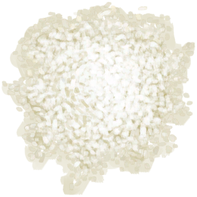

# Rice  
> Tasty.  
  
<table class="table table-bordered" data-toggle="table"  data-show-header="false"><thead style="display:none"><tr ><th  style="width:50%;text-align:left;vertical-align:top;"  >title</th><th  style="width:50%;text-align:left;vertical-align:top;"  ></th></tr></thead><tr ><td  style="width:50%;text-align:left;vertical-align:top;"  >**Weight：**25  **Tag：**	[“Cookable”](tag_Cookable.md), [“Feed Omnivorous”](tag_FeedOmnivorous.md), [“Feed”](tag_Feed.md), [“Feed Rich”](tag_FeedRich.md), [“Human Food”](tag_HumanFood.md), [“Medium Sugars”](tag_SugarsMedium.md), [“Salt can be added. ”](tag_Saltable.md), [“Chilli Powder can be added. ”](tag_Chilliable.md)</td><td  style="width:50%;text-align:left;vertical-align:top;"  >

<a href="RiceCooked.md" style="color:black">Rice</a>

"This water grass can be found in the hidden <b>Valley</b> that lies at the heart of the island. It can be farmed for a stable grain carbohydrate which doubles as grass feed for <b>Goats</b>.   Rice stalks must first be obtained with a <b>Cutting Tool</b>. Grain and straw can then be separated by <b>Threshing </b> the stalks. The rice grains must then be <b>Boiled</b> in water to make them edible.  <b>Rice Water</b></td></tr></tbody></table>  
  
## Got From  

Boiling Rice

[Soaked Rice](LQ_SoakedRice.md)

Boiling Rice

[Soaked Rice](LQ_SoakedRice.md)

Boiling Rice

[Soaked Rice](LQ_SoakedRice.md)

Boiling Rice

[Soaked Rice](LQ_SoakedRice.md)

Boiling Rice

[Soaked Rice](LQ_SoakedRice.md)

  
  
## Action  

<table><tr><td rowspan="2" style="width:200px;text-align:center;font-size:1.3em;font-weight:bold">

Eat

3m

</td><td>[“VegetarianAction(Group)”](VegetarianAction.md), [“EatingAction(Group)”](EatingAction.md)</td></tr><tr><td><b>Self：</b>→Dismiss</td></tr><tr><td colspan="2"><b>StatChange：</b>[

[Satiation](Satiation.md)](Satiation.md)<b>+30</b>, [

[Stomach](Stomach.md)](Stomach.md)<b>+25</b>, [

[Rice Effect](RiceEffect.md)](RiceEffect.md)<b>+4</b>, [

[Hydration ](Hydration.md)](Hydration.md)<b>-1</b>, [

[Saturation Rice](SaturationRice.md)](SaturationRice.md)<b>+35</b>, [

[Filth](Filth.md)](Filth.md)<b>+5</b>, [

[Stress](Stress.md)](Stress.md)<b>-7</b>, [

[Morale](Morale.md)](Morale.md)<b>+1</b></td></tr></table>
  
  
  
## Drag To  

[Boar Feeder](BoarFeeder.md)

[Boar Feeder(Empty)](BoarFeederEmpty.md)

[Compost Bin](CompostBin.md)

[Goat Feeder](GoatFeeder.md)

[Goat Feeder(Empty)](GoatFeederEmpty.md)

[Partridge Feeder](PartridgeFeeder.md)

[Partridge Feeder(Empty)](PartridgeFeederEmpty.md)

[Trapped Macaque](CageTrapMacaque.md)

[Chilli Powder](ChiliPowder.md)

[Sow](BoarEnclosureFemale.md)

[Boar](BoarEnclosureMale.md)

[Piglet](BoarEnclosurePiglet.md)

[Sow](BoarTiedFemale.md)

[Boar](BoarTiedMale.md)

[Piglet](BoarTiedPiglet.md)

[Goat](GoatEnclosureFemale.md)

[Juvenile Goat](GoatEnclosureKid.md)

[Lactating Goat](GoatEnclosureLactating.md)

[Male Goat](GoatEnclosureMale.md)

[Goat](GoatTiedFemale.md)

[Lactating Goat](GoatTiedFemaleLactating.md)

[Juvenile Goat](GoatTiedKid.md)

[Male Goat](GoatTiedMale.md)

[Grandfather](Grandfather.md)

[Grandfather](GrandfatherHealthy.md)

[Macaque Friend](MacaqueFriend.md)

[Wounded Macaque](MacaqueWounded.md)

[Chick](PartridgeChick.md)

[Partridge](PartridgeFemaleEnclosure.md)

[Partridge](PartridgeFemaleLive.md)

[Male Partridge](PartridgeMaleEnclosure.md)

[Male Partridge](PartridgeMaleLive.md)

[Salt](Salt.md)

  
  
## Use In BluePrint  

<a href="Bp_FeedBoar.md" style="color:black">Boar Feed</a>

<a href="Bp_EggFriedRice.md" style="color:black">Egg Fried Rice</a>

<a href="Bp_GoatStew.md" style="color:black">Goat Stew</a>

<a href="Bp_HoneyGlazedPork.md" style="color:black">Honey Glazed Pork</a>

<a href="Bp_Sushi.md" style="color:black">Sushi</a>

  
  
  
## Durability   

<table style="margin-bottom:0px;"><tr><td style="width:30%;text-align:left; background-color:#FEFEFE;font-size:1.3em;font-weight:bold;">Spoilage</td><td style="font-size:1em;background-color:#FEFEFE">Starting：480 -1/TP , Duration ：5d</td></tr><tr style="background-color:#FFFFFF"><td colspan=2>** On Zero： ** Self: → [

[Rotten Remains](RottenRemains.md)](RottenRemains.md)</td></tr></table>
  

<table style="margin-bottom:0px;"><tr><td style="width:30%;text-align:left; background-color:#FEFEFE;font-size:1.3em;font-weight:bold;">

</td><td style="font-size:1em;background-color:#FEFEFE">Starting：0 , Max：1 -</td></tr><tr style="background-color:#FFFFFF"><td colspan=2></td></tr></table>
  

<table style="margin-bottom:0px;"><tr><td style="width:30%;text-align:left; background-color:#FEFEFE;font-size:1.3em;font-weight:bold;">

</td><td style="font-size:1em;background-color:#FEFEFE">Starting：0 , Max：1 -</td></tr><tr style="background-color:#FFFFFF"><td colspan=2></td></tr></table>
  

