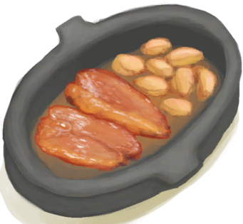

# Rice Grain  
> Can soak it on water and then boil it to make it edible.  
  
<table class="table table-bordered" data-toggle="table"  data-show-header="false"><thead style="display:none"><tr ><th  style="width:50%;text-align:left;vertical-align:top;"  >title</th><th  style="width:50%;text-align:left;vertical-align:top;"  ></th></tr></thead><tr ><td  style="width:50%;text-align:left;vertical-align:top;"  >**Weight：**25  **Tag：**	[“Cookable”](tag_Cookable.md), [“Feed”](tag_Feed.md), [“Feed Rich”](tag_FeedRich.md), [“Cookable”](tag_Cookable.md), [“Medium Sugars”](tag_SugarsMedium.md)</td><td  style="width:50%;text-align:left;vertical-align:top;"  >

<a href="RiceGrains.md" style="color:black">Rice Grain</a>

"This water grass can be found in the hidden <b>Valley</b> that lies at the heart of the island. It can be farmed for a stable grain carbohydrate which doubles as grass feed for <b>Goats</b>.   Rice stalks must first be obtained with a <b>Cutting Tool</b>. Grain and straw can then be separated by <b>Threshing </b> the stalks. The rice grains must then be <b>Boiled</b> in water to make them edible.  <b>Rice Water</b></td></tr></tbody></table>  
  
## Got From  

Thresh

[Rice Stalks](RiceStalks.md)

Transform

[Rice Stalks](RiceStalks.md)

  
  
## Drag With  

<table style="margin-bottom:0px;"><tr><td style="width:40%;text-align:left; background-color:#FEFEFE"><b>With：</b>[“Water for Crops”](tag_WaterFresh.md)</td><td style="width:40%;font-size:1em;font-weight:bold;background-color:#FEFEFE">Soak  </td></tr><tr><td colspan="2"><b>Require：</b>LiquidQuantity: 150</td></tr><tr style="background-color:#FFFFFF"><td style=""><b>Receiving：</b>→ [

[Soaked Rice](LQ_SoakedRice.md)](LQ_SoakedRice.md)</td><td style=""><b>Self：</b>→Dismiss</td></tr></table>
  

<table style="margin-bottom:0px;"><tr><td style="width:40%;text-align:left; background-color:#FEFEFE"><b>With：</b>[

[Boiling Water](LQ_WaterBoiling.md)](LQ_WaterBoiling.md)</td><td style="width:40%;font-size:1em;font-weight:bold;background-color:#FEFEFE">Soak  </td></tr><tr><td colspan="2"><b>Require：</b>LiquidQuantity: 150</td></tr><tr style="background-color:#FFFFFF"><td style=""><b>Receiving：</b>→ [

[Soaked Rice](LQ_SoakedRice.md)](LQ_SoakedRice.md)</td><td style=""><b>Self：</b>→Dismiss</td></tr></table>
  
  
## Drag To  

[Boar Feeder](BoarFeeder.md)

[Boar Feeder(Empty)](BoarFeederEmpty.md)

[Compost Bin](CompostBin.md)

[Empty Crop Plot(Empty)](CropPlotEmpty.md)

[Empty Rice Paddy(Empty)](RicePaddyEmpty.md)

[Goat Feeder](GoatFeeder.md)

[Goat Feeder(Empty)](GoatFeederEmpty.md)

[Partridge Feeder](PartridgeFeeder.md)

[Partridge Feeder(Empty)](PartridgeFeederEmpty.md)

[Trapped Macaque](CageTrapMacaque.md)

[Sow](BoarEnclosureFemale.md)

[Boar](BoarEnclosureMale.md)

[Piglet](BoarEnclosurePiglet.md)

[Sow](BoarTiedFemale.md)

[Boar](BoarTiedMale.md)

[Piglet](BoarTiedPiglet.md)

[Goat](GoatEnclosureFemale.md)

[Juvenile Goat](GoatEnclosureKid.md)

[Lactating Goat](GoatEnclosureLactating.md)

[Male Goat](GoatEnclosureMale.md)

[Goat](GoatTiedFemale.md)

[Lactating Goat](GoatTiedFemaleLactating.md)

[Juvenile Goat](GoatTiedKid.md)

[Male Goat](GoatTiedMale.md)

[Macaque Friend](MacaqueFriend.md)

[Wounded Macaque](MacaqueWounded.md)

[Chick](PartridgeChick.md)

[Partridge](PartridgeFemaleEnclosure.md)

[Partridge](PartridgeFemaleLive.md)

[Male Partridge](PartridgeMaleEnclosure.md)

[Male Partridge](PartridgeMaleLive.md)

  
  
## Use In BluePrint  

<a href="Bp_FeedBird.md" style="color:black">Bird Feed</a>

<a href="Bp_FeedBoar.md" style="color:black">Boar Feed</a>

<a href="Bp_GoatStew.md" style="color:black">Goat Stew</a>

<a href="Bp_HoneyGlazedPork.md" style="color:black">Honey Glazed Pork</a>

  
  
  

