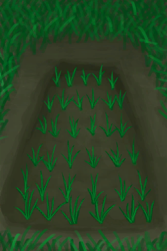

# Rice Paddy  
> I should keep it hydrated and wait for it to grow.  
  
<table class="table table-bordered" data-toggle="table"  data-show-header="false"><thead style="display:none"><tr ><th  style="width:50%;text-align:left;vertical-align:top;"  >title</th><th  style="width:50%;text-align:left;vertical-align:top;"  ></th></tr></thead><tr ><td  style="width:50%;text-align:left;vertical-align:top;"  >** DoseNotPile **  **Tag：**	[“Container Open”](tag_ContainerOpen.md), [“Container Open”](tag_ContainerDirty.md), [“Container Reservoir”](tag_ContainerReservoir.md), [“Paddy”](tag_Paddy.md)  **LiquidCapacity：**2000</td><td  style="width:50%;text-align:left;vertical-align:top;"  >

<a href="RicePaddy.md" style="color:black">Rice Paddy</a>

"These flooded fields can be used to grow large amounts of rice more effectively. Protecting them from <b>Pests</b> and ensuring a greater yield.  They need a <b>Shovel</td></tr></tbody></table>  
  
## Got From  

** With：**[Rice Grain](RiceGrains.md)Plant Rice

[Empty Rice Paddy(Empty)](RicePaddyEmpty.md)

  
  
## Durability   

<table style="margin-bottom:0px;"><tr><td style="width:30%;text-align:left; background-color:#FEFEFE;font-size:1.3em;font-weight:bold;">Progress</td><td style="font-size:1em;background-color:#FEFEFE">Starting：0 , Max：672 -1/TP , Duration ：7d</td></tr><tr style="background-color:#FFFFFF"><td colspan=2>** On Zero： ** Self: → [

[Empty Rice Paddy(Empty)](RicePaddyEmpty.md)](RicePaddyEmpty.md) ** On Full： ** Self: →Dismiss [

[Rice](RicePlant.md)](RicePlant.md)(<b>+20</b>)</td></tr></table>
  
## Passive Effects  
<table class="table table-bordered" data-toggle="table"  ><thead style=""><tr ><th  style="text-align:left;vertical-align:top;"  >Name</th><th  style="text-align:left;vertical-align:top;"  >Condition</th><th  style="text-align:left;vertical-align:top;"  >Change(Each TP)</th><th  style="text-align:left;vertical-align:top;"  data-sortable="true"  >Status</th></tr></thead><tr ><td  style="text-align:left;vertical-align:top;"  >Fertile</td><td  style="text-align:left;vertical-align:top;"  >** Require Card：** [“Fertile Environment”](tag_EnvFertile.md)</td><td  style="text-align:left;vertical-align:top;"  >Progress+0.25(0.03%)</td><td  style="text-align:left;vertical-align:top;"  ></td></tr><tr ><td  style="text-align:left;vertical-align:top;"  >Rain</td><td  style="text-align:left;vertical-align:top;"  >** Require Stat：** [

[Rain Value](RainValue.md)](RainValue.md): <b>1-5</b></td><td  style="text-align:left;vertical-align:top;"  >[Unsafe Water](LQ_WaterUnsafe.md)<b>+50</b></td><td  style="text-align:left;vertical-align:top;"  ></td></tr><tr ><td  style="text-align:left;vertical-align:top;"  >Grow</td><td  style="text-align:left;vertical-align:top;"  >** 需要放入：** [“Water for Crops”](tag_WaterFresh.md)</td><td  style="text-align:left;vertical-align:top;"  >Progress+2(0.29%)</td><td  style="text-align:left;vertical-align:top;"  ></td></tr><tr ><td  style="text-align:left;vertical-align:top;"  >Evaporate</td><td  style="text-align:left;vertical-align:top;"  ></td><td  style="text-align:left;vertical-align:top;"  >LiquidQuantity-4</td><td  style="text-align:left;vertical-align:top;"  ></td></tr></tbody></table>  
  

