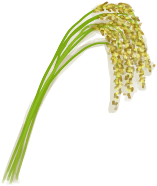
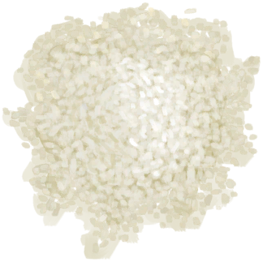

# Rice Stalks  
> Should thresh them to get the grain.  
  
<table class="table table-bordered" data-toggle="table"  data-show-header="false"><thead style="display:none"><tr ><th  style="width:50%;text-align:left;vertical-align:top;"  >title</th><th  style="width:50%;text-align:left;vertical-align:top;"  ></th></tr></thead><tr ><td  style="width:50%;text-align:left;vertical-align:top;"  >**Weight：**75  **Tag：**	[“Feed Herbivore”](tag_FeedHerb.md), [“Feed”](tag_Feed.md), [“Feed Rich”](tag_FeedRich.md), [“Cookable”](tag_Cookable.md), [“Medium Fibers”](tag_FibersMedium.md)</td><td  style="width:50%;text-align:left;vertical-align:top;"  >

<a href="RiceStalks.md" style="color:black">Rice Stalks</a>

"This water grass can be found in the hidden <b>Valley</b> that lies at the heart of the island. It can be farmed for a stable grain carbohydrate which doubles as grass feed for <b>Goats</b>.   Rice stalks must first be obtained with a <b>Cutting Tool</b>. Grain and straw can then be separated by <b>Threshing </b> the stalks. The rice grains must then be <b>Boiled</b> in water to make them edible.  <b>Rice Water</b></td></tr></tbody></table>  
  
## Got From  

** With：**[“Cutter”](tag_Cutter.md)Harvest

[Rice](RicePlant.md)

  
  
## Action  

<table><tr><td rowspan="2" style="width:200px;text-align:center;font-size:1.3em;font-weight:bold">

Thresh

15m

</td><td></td></tr><tr><td><b>Self：</b>→ [

[Rice Straw](RiceStraw.md)](RiceStraw.md)</td></tr><tr><td colspan="2"><b>StatChange：</b>[

[Stamina](Stamina.md)](Stamina.md)<b>-2</b></td></tr><tr><td colspan="2">[

[Rice Grain](RiceGrains.md)](RiceGrains.md)(<b>+1</b>)</td></tr></table>
  
  
  
## Drag To  

[Compost Bin](CompostBin.md)

[Goat Feeder](GoatFeeder.md)

[Goat Feeder(Empty)](GoatFeederEmpty.md)

[Trapped Macaque](CageTrapMacaque.md)

[Goat](GoatEnclosureFemale.md)

[Juvenile Goat](GoatEnclosureKid.md)

[Lactating Goat](GoatEnclosureLactating.md)

[Male Goat](GoatEnclosureMale.md)

[Goat](GoatTiedFemale.md)

[Lactating Goat](GoatTiedFemaleLactating.md)

[Juvenile Goat](GoatTiedKid.md)

[Male Goat](GoatTiedMale.md)

[Macaque Friend](MacaqueFriend.md)

[Wounded Macaque](MacaqueWounded.md)

  
  
## Durability   

<table style="margin-bottom:0px;"><tr><td style="width:30%;text-align:left; background-color:#FEFEFE;font-size:1.3em;font-weight:bold;">Spoilage</td><td style="font-size:1em;background-color:#FEFEFE">Starting：384 -1/TP , Duration ：4d</td></tr><tr style="background-color:#FFFFFF"><td colspan=2>** On Zero： ** Self: → [

[Rice Straw](RiceStraw.md)](RiceStraw.md) [

[Rice Grain](RiceGrains.md)](RiceGrains.md)(<b>+1</b>)</td></tr></table>
  

