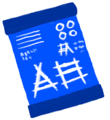

# Rice Straw  
> Can be used as fuel or animal feed.  
  
<table class="table table-bordered" data-toggle="table"  data-show-header="false"><thead style="display:none"><tr ><th  style="width:50%;text-align:left;vertical-align:top;"  >title</th><th  style="width:50%;text-align:left;vertical-align:top;"  ></th></tr></thead><tr ><td  style="width:50%;text-align:left;vertical-align:top;"  >**Weight：**100  **Tag：**	[“Leaves”](tag_Leaves.md), [“Fuel”](tag_Fuel.md), [“Feed Herbivore”](tag_FeedHerb.md), [“Temper”](tag_Temper.md), [“Medium Fibers”](tag_FibersMedium.md)</td><td  style="width:50%;text-align:left;vertical-align:top;"  >

<a href="RiceStraw.md" style="color:black">Rice Straw</a>

"This water grass can be found in the hidden <b>Valley</b> that lies at the heart of the island. It can be farmed for a stable grain carbohydrate which doubles as grass feed for <b>Goats</b>.   Rice stalks must first be obtained with a <b>Cutting Tool</b>. Grain and straw can then be separated by <b>Threshing </b> the stalks. The rice grains must then be <b>Boiled</b> in water to make them edible.  <b>Rice Water</b></td></tr></tbody></table>  
  
## Got From  

Dismantle

[Straw Cape](StrawCape.md)

Transform

[Straw Cape](StrawCape.md)

Thresh

[Rice Stalks](RiceStalks.md)

Transform

[Rice Stalks](RiceStalks.md)

  
  
## Drag To  

[Leaf Bed](LeafBed.md)

[Sheltered Leaf Bed](ShelteredLeafBed.md)

[Compost Bin](CompostBin.md)

[Alembic(Off)](AlembicOff.md)

[Alembic(On)](AlembicOn.md)

[Campfire](Campfire.md)

[Campfire(Off)](CampfireExtinguished.md)

[Clay Fire Pit](ClayFirePit.md)

[Clay Fire Pit(Off)](ClayFirePitExtinguished.md)

[Fire](Fire.md)

[Fire(Off)](FireExtinguished.md)

[Forge](Forge.md)

[Forge(Off)](ForgeExtinguished.md)

[Kiln](Kiln.md)

[Advanced Kiln](KilnAdvanced.md)

[Advanced Kiln(Off)](KilnAdvancedExtinguished.md)

[Kiln(Off)](KilnExtinguished.md)

[Stove](Stove.md)

[Stove(Off)](StoveExtinguished.md)

[Goat Feeder](GoatFeeder.md)

[Goat Feeder(Empty)](GoatFeederEmpty.md)

[Mud Pile](MudPile.md)

[Clay](Clay.md)

[Goat](GoatEnclosureFemale.md)

[Juvenile Goat](GoatEnclosureKid.md)

[Lactating Goat](GoatEnclosureLactating.md)

[Male Goat](GoatEnclosureMale.md)

[Goat](GoatTiedFemale.md)

[Lactating Goat](GoatTiedFemaleLactating.md)

[Juvenile Goat](GoatTiedKid.md)

[Male Goat](GoatTiedMale.md)

  
  
## Use In BluePrint  

<a href="Bp_FeedGoat.md" style="color:black">Goat Feed</a>

<a href="Bp_Leafbed.md" style="color:black">Leaf Bed</a>

<a href="Bp_MoldAxe.md" style="color:black">Axe Mold</a>

<a href="Bp_MoldKnife.md" style="color:black">Knife Mold</a>

<a href="Bp_MoldShovel.md" style="color:black">Shovel Mold</a>

<a href="Bp_MoldSpear.md" style="color:black">Spear Mold</a>

<a href="Bp_MushroomBed.md" style="color:black">Mushroom Bed</a>

<a href="Bp_Alembic.md" style="color:black">Alembic</a>

<a href="Bp_ClayBowl.md" style="color:black">Clay Bowl</a>

<a href="Bp_ClayFirePit.md" style="color:black">Clay Fire Pit</a>

<a href="Bp_ClayJar.md" style="color:black">Clay Jar</a>

<a href="Bp_ClayPotCooler.md" style="color:black">Clay Pot Cooler</a>

<a href="Bp_ClayVase.md" style="color:black">Clay Vase</a>

<a href="Bp_CookingPot.md" style="color:black">Cooking Pot</a>

<a href="Bp_GlazedVase.md" style="color:black">Glazed Vase</a>

<a href="Bp_StrawCape.md" style="color:black">Straw Cape</a>

  
  
  

