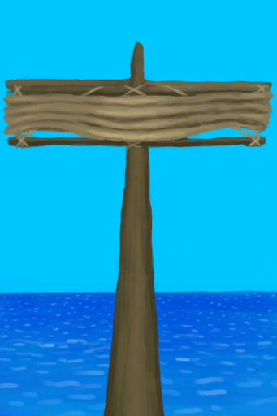
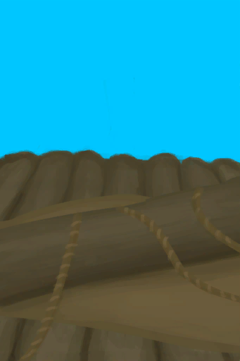

# Lowered Sail  
> I should raise it when the wind is favourable.  
  
<table class="table table-bordered" data-toggle="table"  data-show-header="false"><thead style="display:none"><tr ><th  style="width:50%;text-align:left;vertical-align:top;"  >title</th><th  style="width:50%;text-align:left;vertical-align:top;"  ></th></tr></thead><tr ><td  style="width:50%;text-align:left;vertical-align:top;"  >**Usage：**480</td><td  style="width:50%;text-align:left;vertical-align:top;"  >

<a href="SailDown_Raft.md" style="color:black">Lowered Sail</a>

"When stranded on a tropical island</td></tr></tbody></table>  
  
## Got From  

Transform

[Broken Sail](SailBroken_Raft.md)

Lower the Sail

[Raised Sail](SailUp_Raft.md)

Push raft to the water

[Start Journey](Start_Raft.md)

  
  
## Action  

<table><tr><td rowspan="2" style="width:200px;text-align:center;font-size:1.3em;font-weight:bold">

Raise the Sail

</td><td></td></tr><tr><td><b>Self：</b>→ [

[Raised Sail](SailUp_Raft.md)](SailUp_Raft.md)</td></tr></table>
  
  
  
## Drag With  

<table style="margin-bottom:0px;"><tr><td style="width:40%;text-align:left; background-color:#FEFEFE"><b>With：</b>[

[Fiber Cord](CordFiber.md)](CordFiber.md)</td><td style="width:40%;font-size:1em;font-weight:bold;background-color:#FEFEFE">Repair Sail (30m) </td></tr><tr><td colspan="2"><b>Require：</b>[

[Light](Light.md)](Light.md): <b>10-100</b></td></tr><tr style="background-color:#FFFFFF"><td style=""><b>Receiving：</b>→Dismiss</td><td style=""><b>Self：</b>Usage  <b>+96(20%)</b></td></tr></table>
  
  
## Durability   

<table style="margin-bottom:0px;"><tr><td style="width:30%;text-align:left; background-color:#FEFEFE;font-size:1.3em;font-weight:bold;">Usage</td><td style="font-size:1em;background-color:#FEFEFE">Starting：480 , Max：480 -1/TP , Duration ：5d</td></tr><tr style="background-color:#FFFFFF"><td colspan=2>** On Zero： ** Self: → [

[Broken Sail](SailBroken_Raft.md)](SailBroken_Raft.md)</td></tr></table>
  

