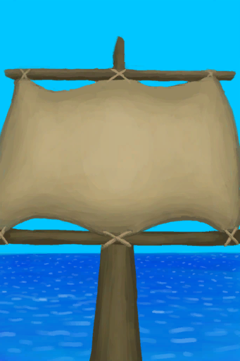
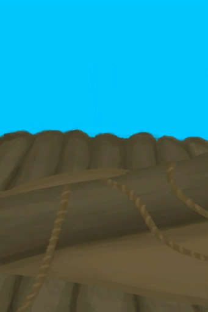

# Raised Sail  
> "I should lower it when the wind is not favourable  
  
<table class="table table-bordered" data-toggle="table"  data-show-header="false"><thead style="display:none"><tr ><th  style="width:50%;text-align:left;vertical-align:top;"  >title</th><th  style="width:50%;text-align:left;vertical-align:top;"  ></th></tr></thead><tr ><td  style="width:50%;text-align:left;vertical-align:top;"  >**Usage：**480</td><td  style="width:50%;text-align:left;vertical-align:top;"  >

<a href="SailUp_Raft.md" style="color:black">Raised Sail</a>

"When stranded on a tropical island</td></tr></tbody></table>  
  
## Got From  

Raise the Sail

[Lowered Sail](SailDown_Raft.md)

  
  
## Action  

<table><tr><td rowspan="2" style="width:200px;text-align:center;font-size:1.3em;font-weight:bold">

Lower the Sail

</td><td></td></tr><tr><td><b>Self：</b>→ [

[Lowered Sail](SailDown_Raft.md)](SailDown_Raft.md)</td></tr></table>
  
  
  
## Durability   

<table style="margin-bottom:0px;"><tr><td style="width:30%;text-align:left; background-color:#FEFEFE;font-size:1.3em;font-weight:bold;">Usage</td><td style="font-size:1em;background-color:#FEFEFE">Starting：480 , Max：480 -1/TP , Duration ：5d</td></tr><tr style="background-color:#FFFFFF"><td colspan=2>** On Zero： ** Self: → [

[Broken Sail](SailBroken_Raft.md)](SailBroken_Raft.md)</td></tr></table>
  
## Passive Effects  
<table class="table table-bordered" data-toggle="table"  ><thead style=""><tr ><th  style="text-align:left;vertical-align:top;"  >Name</th><th  style="text-align:left;vertical-align:top;"  >Condition</th><th  style="text-align:left;vertical-align:top;"  >Change(Each TP)</th><th  style="text-align:left;vertical-align:top;"  >Status</th></tr></thead><tr ><td  style="text-align:left;vertical-align:top;"  >Storm Back</td><td  style="text-align:left;vertical-align:top;"  >** Require Stat：** [Wind](Wind.md): <b>3-5</b></td><td  style="text-align:left;vertical-align:top;"  >Usage -3(-0.63%)</td><td  style="text-align:left;vertical-align:top;"  >[

[Distance](Distance.md)](Distance.md)addition<b>+3</b></td></tr><tr ><td  style="text-align:left;vertical-align:top;"  >Very Favourable Wind</td><td  style="text-align:left;vertical-align:top;"  >** Require Stat：** [Wind](Wind.md): <b>2-2</b></td><td  style="text-align:left;vertical-align:top;"  >Usage -1(-0.21%)</td><td  style="text-align:left;vertical-align:top;"  >[

[Distance](Distance.md)](Distance.md)addition<b>+2</b></td></tr><tr ><td  style="text-align:left;vertical-align:top;"  >Favourable Wind</td><td  style="text-align:left;vertical-align:top;"  >** Require Stat：** [Wind](Wind.md): <b>1-1</b></td><td  style="text-align:left;vertical-align:top;"  ></td><td  style="text-align:left;vertical-align:top;"  >[

[Distance](Distance.md)](Distance.md)addition<b>+1</b></td></tr><tr ><td  style="text-align:left;vertical-align:top;"  >Unfavourable Wind</td><td  style="text-align:left;vertical-align:top;"  >** Require Stat：** [Wind](Wind.md): <b>-1--1</b></td><td  style="text-align:left;vertical-align:top;"  >Usage -1(-0.21%)</td><td  style="text-align:left;vertical-align:top;"  >[

[Distance](Distance.md)](Distance.md)addition<b>-1.5</b></td></tr><tr ><td  style="text-align:left;vertical-align:top;"  >Very Unfavourable Wind</td><td  style="text-align:left;vertical-align:top;"  >** Require Stat：** [Wind](Wind.md): <b>-2--2</b></td><td  style="text-align:left;vertical-align:top;"  >Usage -2(-0.42%)</td><td  style="text-align:left;vertical-align:top;"  >[

[Distance](Distance.md)](Distance.md)addition<b>-2.5</b></td></tr><tr ><td  style="text-align:left;vertical-align:top;"  >Storm Front</td><td  style="text-align:left;vertical-align:top;"  >** Require Stat：** [Wind](Wind.md): <b>-5--3</b></td><td  style="text-align:left;vertical-align:top;"  >Usage -4(-0.84%)</td><td  style="text-align:left;vertical-align:top;"  >[

[Distance](Distance.md)](Distance.md)addition<b>-3.5</b></td></tr></tbody></table>  
  

