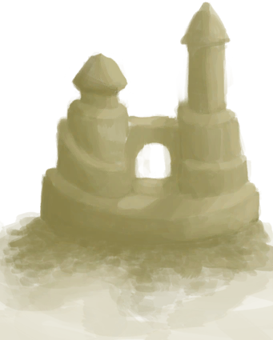

# Sand Castle  
> A nice sand castle. I'm proud of myself.  
  
<table class="table table-bordered" data-toggle="table"  data-show-header="false"><thead style="display:none"><tr ><th  style="width:50%;text-align:left;vertical-align:top;"  >title</th><th  style="width:50%;text-align:left;vertical-align:top;"  ></th></tr></thead><tr ><td  style="width:50%;text-align:left;vertical-align:top;"  >** Cannot Be Trashed **  **Weight：**150  **Tag：**	[“Large”](tag_Large.md)</td><td  style="width:50%;text-align:left;vertical-align:top;"  >

<a href="SandCastle.md" style="color:black">Sand Castle</a>

"Sand can be harvested from the beaches of the Island. It has some uses in certain blueprints and can also be used for <b>tempering Clay</b>.  Additionally</td></tr></tbody></table>  
  
## Got From  

Build a Sand Castle

[Sand(Atoll)](SandSource.md)

  
  
## Action  

<table><tr><td rowspan="2" style="width:200px;text-align:center;font-size:1.3em;font-weight:bold">

Destroy

</td><td></td></tr><tr><td><b>Self：</b>→Dismiss</td></tr></table>
  
  
  
## Drag With  
  
## Durability   

<table style="margin-bottom:0px;"><tr><td style="width:30%;text-align:left; background-color:#FEFEFE;font-size:1.3em;font-weight:bold;">Spoilage</td><td style="font-size:1em;background-color:#FEFEFE">Starting：96 , Max：96 -1/TP , Duration ：1d</td></tr><tr style="background-color:#FFFFFF"><td colspan=2>** On Zero： ** Self: → [

[Sand](Sand.md)](Sand.md)</td></tr></table>
  

