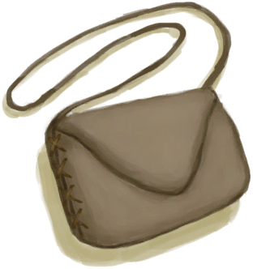

# Satchel  
> I can store things inside. <b>CAN BE EQUIPPED ON EQUIPMENT SLOTS</b>  
  
<table class="table table-bordered" data-toggle="table"  data-show-header="false"><thead style="display:none"><tr ><th  style="width:50%;text-align:left;vertical-align:top;"  >title</th><th  style="width:50%;text-align:left;vertical-align:top;"  ></th></tr></thead><tr ><td  style="width:50%;text-align:left;vertical-align:top;"  >** Cannot Be Trashed **  ** DoseNotPile **  **Weight：**250  **装备时减重：**-250  **Tag：**	[“Bag”](tag_Bag.md), [“Satchel”](tag_Satchel.md), [“Valuable”](tag_Valuable.md)  **Equipped Cards：**[“Shoulder Item”](eTag_Shoulder.md)  **Slots：**3  **过滤器：**~~[“Bag”](tag_Bag.md)~~ , ~~[“Large”](tag_Large.md)~~ , ~~[“Fire Source”](tag_FireSource.md)~~ , ~~[“Fire”](tag_Fire.md)~~ , ~~[“Spillable”](tag_Spillable.md)~~  **WeightCapacity：**350  **WeightRedution：**-300</td><td  style="width:50%;text-align:left;vertical-align:top;"  >

<a href="Satchel.md" style="color:black">Satchel</a>

A pouch made of <b>Leather</b> that is easy to <b>carry on yourself</b> and can hold a few provisions or small items.  Use <b>Cured Skin</b> and a <b>Fiber Cord and Needle</b> to sew it together.</td></tr></tbody></table>  
  
## Got From  

Craft BluePrint

[Satchel(BluePrint)](Bp_Satchel.md)

  
  
## Action  

<table><tr><td rowspan="2" style="width:200px;text-align:center;font-size:1.3em;font-weight:bold">

Dismantle

30m

</td><td>[“HandAction(Group)”](HandAction.md), [“CraftAction(Group)”](CraftAction.md)</td></tr><tr><td><b>Self：</b>→Dismiss</td></tr><tr><td colspan="2"><b>Require：</b>[

[Light](Light.md)](Light.md): <b>5-100</b></td></tr><tr><td colspan="2">[

[Cured Skin](CuredSkin.md)](CuredSkin.md)(<b>+2</b>), [

[Fiber Cord](CordFiber.md)](CordFiber.md)(<b>+2～+4</b>)</td></tr></table>
  
  
  

