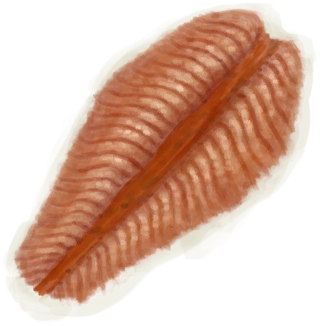

# Saturation Fish  
> Shows how tired you are of eating Fish. Lowers your morale and gets you nauseous if it gets too high.  
> If you eat too much of the same food you will start getting saturated of it. This will lower your <b>Morale</b> and even make you <b>Nauseous</b> if you gets too far.  For this reason it is usually better to alternate between different food types.  Drinking <b>Ginger Tea</b> can help decrease saturation and help stabilize your stomach. Being very <b>Hungry</b> will of course also decrease your saturation.  
  

<b>Base Value: </b> 0 
  

<b>Value Range: </b> 0 ~ 288 
  

<b>Base Rate: </b> -1 / /TP 
  
## Statuses  

<table><tr style="height:2em;"><td style="background-color:#F0F0F0;text-align:center;width:180px;font-size:1.4em;font-weight:bold;vertical-align:middle;">
193 ～ 288

67% ～ 100%
</td><td colspan=2 style="font-size:1.1em;vertical-align:middle;background-color:#F9F9F9;">
<b>

I'm so sick of eating Fish...</b>

</td></tr><tr><td colspan=2><b>Effect：</b>[

[Morale](Morale.md)](Morale.md)addition<b>-1.5</b>, [

[Nausea](Nausea.md)](Nausea.md)addition<b>+1.25</b></td></tr><tr><td colspan=2></td></tr><tr style="height:2em;"><td style="background-color:#F0F0F0;text-align:center;width:180px;font-size:1.4em;font-weight:bold;vertical-align:middle;">
97 ～ 192

33% ～ 66%
</td><td colspan=2 style="font-size:1.1em;vertical-align:middle;background-color:#F9F9F9;">
<b>

I'm a bit tired of eating Fish...</b>

</td></tr><tr><td colspan=2><b>Effect：</b>[

[Morale](Morale.md)](Morale.md)addition<b>-0.75</b></td></tr><tr><td colspan=2></td></tr></table>
  
## Related Cards  
[Satiation](Satiation.md)  |  [Ginger](GingerEffect.md)  
## Addition Change By  
<table class="table table-bordered" data-toggle="table"  ><thead style=""><tr ><th  style="text-align:left;vertical-align:top;"  >From</th><th  style="text-align:left;vertical-align:top;"  >Operation</th><th  style="text-align:left;vertical-align:top;"  >Value</th></tr></thead><tr ><td  style="text-align:left;vertical-align:top;"  >

[Inappetent](Pk_4_Inappetent.md)</td><td  style="text-align:left;vertical-align:top;"  >Perk Effect</td><td  style="text-align:left;vertical-align:top;"  >addition+0.5</td></tr><tr ><td  style="text-align:left;vertical-align:top;"  >

[Gluttonous](Pk_4_Gluttonous.md)</td><td  style="text-align:left;vertical-align:top;"  >Perk Effect</td><td  style="text-align:left;vertical-align:top;"  >addition-0.5</td></tr><tr ><td  style="text-align:left;vertical-align:top;"  >

[Specialized Kidneys](Pk_3_SpecializedKidneys.md)</td><td  style="text-align:left;vertical-align:top;"  >Perk Effect</td><td  style="text-align:left;vertical-align:top;"  >addition-1</td></tr></tbody></table>  
  
## Change By  
<table class="table table-bordered" data-toggle="table"  ><thead style=""><tr ><th  style="text-align:left;vertical-align:top;"  >From</th><th  style="text-align:left;vertical-align:top;"  >Operation</th><th  style="text-align:left;vertical-align:top;"  data-sortable="true"  >Value</th></tr></thead><tr ><td  style="text-align:left;vertical-align:top;"  >[

[Cooked Bonefish](BonefishCooked.md)](BonefishCooked.md)</td><td  style="text-align:left;vertical-align:top;"  >Eat Fish</td><td  style="text-align:left;vertical-align:top;"  >35</td></tr><tr ><td  style="text-align:left;vertical-align:top;"  >[

[Bonefish Meat](BonefishMeat.md)](BonefishMeat.md)</td><td  style="text-align:left;vertical-align:top;"  >Eat Fish</td><td  style="text-align:left;vertical-align:top;"  >35</td></tr><tr ><td  style="text-align:left;vertical-align:top;"  >[

[Smoked Bonefish](BonefishSmoked.md)](BonefishSmoked.md)</td><td  style="text-align:left;vertical-align:top;"  >Eat Fish</td><td  style="text-align:left;vertical-align:top;"  >35</td></tr><tr ><td  style="text-align:left;vertical-align:top;"  >[

[Fish N' Chips](FishNChips.md)](FishNChips.md)</td><td  style="text-align:left;vertical-align:top;"  >Eat</td><td  style="text-align:left;vertical-align:top;"  >35</td></tr><tr ><td  style="text-align:left;vertical-align:top;"  >[

[Fish Omelette](FishOmelette.md)](FishOmelette.md)</td><td  style="text-align:left;vertical-align:top;"  >Eat</td><td  style="text-align:left;vertical-align:top;"  >35</td></tr><tr ><td  style="text-align:left;vertical-align:top;"  >[

[Dried Fish](FishDried.md)](FishDried.md)</td><td  style="text-align:left;vertical-align:top;"  >Eat Fish</td><td  style="text-align:left;vertical-align:top;"  >35</td></tr><tr ><td  style="text-align:left;vertical-align:top;"  >[

[Salted Fish](FishSalted.md)](FishSalted.md)</td><td  style="text-align:left;vertical-align:top;"  >Eat Fish</td><td  style="text-align:left;vertical-align:top;"  >35</td></tr><tr ><td  style="text-align:left;vertical-align:top;"  >[

[Fish Taco](FishTaco.md)](FishTaco.md)</td><td  style="text-align:left;vertical-align:top;"  >Eat</td><td  style="text-align:left;vertical-align:top;"  >35</td></tr><tr ><td  style="text-align:left;vertical-align:top;"  >[

[Goatfish](Goatfish.md)](Goatfish.md)</td><td  style="text-align:left;vertical-align:top;"  >Eat Fish</td><td  style="text-align:left;vertical-align:top;"  >35</td></tr><tr ><td  style="text-align:left;vertical-align:top;"  >[

[Cooked Goatfish](GoatfishCooked.md)](GoatfishCooked.md)</td><td  style="text-align:left;vertical-align:top;"  >Eat Fish</td><td  style="text-align:left;vertical-align:top;"  >35</td></tr><tr ><td  style="text-align:left;vertical-align:top;"  >[

[Herring](Herring.md)](Herring.md)</td><td  style="text-align:left;vertical-align:top;"  >Eat Fish</td><td  style="text-align:left;vertical-align:top;"  >35</td></tr><tr ><td  style="text-align:left;vertical-align:top;"  >[

[Cooked Herring](HerringCooked.md)](HerringCooked.md)</td><td  style="text-align:left;vertical-align:top;"  >Eat Fish</td><td  style="text-align:left;vertical-align:top;"  >35</td></tr><tr ><td  style="text-align:left;vertical-align:top;"  >[

[Roasted Mudskipper](MudskipperCooked.md)](MudskipperCooked.md)</td><td  style="text-align:left;vertical-align:top;"  >Eat</td><td  style="text-align:left;vertical-align:top;"  >35</td></tr><tr ><td  style="text-align:left;vertical-align:top;"  >[

[Parrot Fish](ParrotFish.md)](ParrotFish.md)</td><td  style="text-align:left;vertical-align:top;"  >Eat Fish</td><td  style="text-align:left;vertical-align:top;"  >35</td></tr><tr ><td  style="text-align:left;vertical-align:top;"  >[

[Cooked Parrot Fish](ParrotFishCooked.md)](ParrotFishCooked.md)</td><td  style="text-align:left;vertical-align:top;"  >Eat Fish</td><td  style="text-align:left;vertical-align:top;"  >35</td></tr><tr ><td  style="text-align:left;vertical-align:top;"  >[

[Coconut Fish](CoconutFish.md)](CoconutFish.md)</td><td  style="text-align:left;vertical-align:top;"  >Eat</td><td  style="text-align:left;vertical-align:top;"  >30</td></tr><tr ><td  style="text-align:left;vertical-align:top;"  >[

[Drying Salted Fish](FishSaltedDrying.md)](FishSaltedDrying.md)</td><td  style="text-align:left;vertical-align:top;"  >Eat Fish</td><td  style="text-align:left;vertical-align:top;"  >30</td></tr><tr ><td  style="text-align:left;vertical-align:top;"  >[

[Smoked Goatfish](GoatfishSmoked.md)](GoatfishSmoked.md)</td><td  style="text-align:left;vertical-align:top;"  >Eat Fish</td><td  style="text-align:left;vertical-align:top;"  >30</td></tr><tr ><td  style="text-align:left;vertical-align:top;"  >[

[Grouper Meat](GrouperMeat.md)](GrouperMeat.md)(未实装)</td><td  style="text-align:left;vertical-align:top;"  >Eat Grouper meat</td><td  style="text-align:left;vertical-align:top;"  >30</td></tr><tr ><td  style="text-align:left;vertical-align:top;"  >[

[Cooked Grouper](GrouperMeatCooked.md)](GrouperMeatCooked.md)</td><td  style="text-align:left;vertical-align:top;"  >Eat Cooked Goatfish</td><td  style="text-align:left;vertical-align:top;"  >30</td></tr><tr ><td  style="text-align:left;vertical-align:top;"  >[

[Smoked Grouper](GrouperMeatSmoked.md)](GrouperMeatSmoked.md)</td><td  style="text-align:left;vertical-align:top;"  >Eat Smoked Goatfish</td><td  style="text-align:left;vertical-align:top;"  >30</td></tr><tr ><td  style="text-align:left;vertical-align:top;"  >[

[Smoked Herring](HerringSmoked.md)](HerringSmoked.md)(未实装)</td><td  style="text-align:left;vertical-align:top;"  >Eat Fish</td><td  style="text-align:left;vertical-align:top;"  >30</td></tr><tr ><td  style="text-align:left;vertical-align:top;"  >[

[Smoked Parrot Fish](ParrotFishSmoked.md)](ParrotFishSmoked.md)</td><td  style="text-align:left;vertical-align:top;"  >Eat Fish</td><td  style="text-align:left;vertical-align:top;"  >30</td></tr><tr ><td  style="text-align:left;vertical-align:top;"  >[

[Cooked Shark](SharkCooked.md)](SharkCooked.md)</td><td  style="text-align:left;vertical-align:top;"  >Eat</td><td  style="text-align:left;vertical-align:top;"  >30</td></tr><tr ><td  style="text-align:left;vertical-align:top;"  >[

[Shark Meat](SharkMeat.md)](SharkMeat.md)</td><td  style="text-align:left;vertical-align:top;"  >Eat</td><td  style="text-align:left;vertical-align:top;"  >30</td></tr><tr ><td  style="text-align:left;vertical-align:top;"  >[

[Smoked Shark](SharkSmoked.md)](SharkSmoked.md)</td><td  style="text-align:left;vertical-align:top;"  >Eat</td><td  style="text-align:left;vertical-align:top;"  >30</td></tr><tr ><td  style="text-align:left;vertical-align:top;"  >[

[Cooked Threadfin](ThreadfinCooked.md)](ThreadfinCooked.md)</td><td  style="text-align:left;vertical-align:top;"  >Eat</td><td  style="text-align:left;vertical-align:top;"  >30</td></tr><tr ><td  style="text-align:left;vertical-align:top;"  >[

[Threadfin Meat](ThreadfinMeat.md)](ThreadfinMeat.md)</td><td  style="text-align:left;vertical-align:top;"  >Eat</td><td  style="text-align:left;vertical-align:top;"  >30</td></tr><tr ><td  style="text-align:left;vertical-align:top;"  >[

[Smoked Threadfin](ThreadfinSmoked.md)](ThreadfinSmoked.md)</td><td  style="text-align:left;vertical-align:top;"  >Eat</td><td  style="text-align:left;vertical-align:top;"  >30</td></tr><tr ><td  style="text-align:left;vertical-align:top;"  >[

[Mudskipper](Mudskipper.md)](Mudskipper.md)</td><td  style="text-align:left;vertical-align:top;"  >Eat</td><td  style="text-align:left;vertical-align:top;"  >25</td></tr><tr ><td  style="text-align:left;vertical-align:top;"  >[

[Sushi](Sushi.md)](Sushi.md)</td><td  style="text-align:left;vertical-align:top;"  >Eat</td><td  style="text-align:left;vertical-align:top;"  >10</td></tr><tr ><td  style="text-align:left;vertical-align:top;"  >[

[Fish Scraps](FishScraps.md)](FishScraps.md)</td><td  style="text-align:left;vertical-align:top;"  >Eat Scraps</td><td  style="text-align:left;vertical-align:top;"  >5</td></tr><tr ><td  style="text-align:left;vertical-align:top;"  >[

[Cooked Fish Scraps](FishScrapsCooked.md)](FishScrapsCooked.md)</td><td  style="text-align:left;vertical-align:top;"  >Eat Scraps</td><td  style="text-align:left;vertical-align:top;"  >5</td></tr><tr ><td  style="text-align:left;vertical-align:top;"  >[

[Fish Slices](FishSlices.md)](FishSlices.md)</td><td  style="text-align:left;vertical-align:top;"  >Eat Slices</td><td  style="text-align:left;vertical-align:top;"  >5</td></tr><tr ><td  style="text-align:left;vertical-align:top;"  >[

[Cooked Fish Slices](FishSlicesCooked.md)](FishSlicesCooked.md)</td><td  style="text-align:left;vertical-align:top;"  >Eat Slices</td><td  style="text-align:left;vertical-align:top;"  >5</td></tr></tbody></table>  
  

