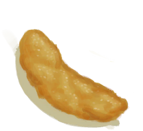

# Saturation Meat  
> Shows how tired you are of eating Meat. Lowers your morale and gets you nauseous if it gets too high.  
> If you eat too much of the same food you will start getting saturated of it. This will lower your <b>Morale</b> and even make you <b>Nauseous</b> if you gets too far.  For this reason it is usually better to alternate between different food types.  Drinking <b>Ginger Tea</b> can help decrease saturation and help stabilize your stomach. Being very <b>Hungry</b> will of course also decrease your saturation.  
  

<b>Base Value: </b> 0 
  

<b>Value Range: </b> 0 ~ 288 
  

<b>Base Rate: </b> -1 / /TP 
  
## Statuses  

<table><tr style="height:2em;"><td style="background-color:#F0F0F0;text-align:center;width:180px;font-size:1.4em;font-weight:bold;vertical-align:middle;">
193 ～ 288

67% ～ 100%
</td><td colspan=2 style="font-size:1.1em;vertical-align:middle;background-color:#F9F9F9;">
<b>

I'm so sick of eating Meat...</b>

</td></tr><tr><td colspan=2><b>Effect：</b>[

[Morale](Morale.md)](Morale.md)addition<b>-1.5</b>, [

[Nausea](Nausea.md)](Nausea.md)addition<b>+1.25</b></td></tr><tr><td colspan=2></td></tr><tr style="height:2em;"><td style="background-color:#F0F0F0;text-align:center;width:180px;font-size:1.4em;font-weight:bold;vertical-align:middle;">
97 ～ 192

33% ～ 66%
</td><td colspan=2 style="font-size:1.1em;vertical-align:middle;background-color:#F9F9F9;">
<b>

I'm a bit tired of eating Meat...</b>

</td></tr><tr><td colspan=2><b>Effect：</b>[

[Morale](Morale.md)](Morale.md)addition<b>-0.75</b></td></tr><tr><td colspan=2></td></tr></table>
  
## Related Cards  
[Satiation](Satiation.md)  |  [Ginger](GingerEffect.md)  
## Addition Change By  
<table class="table table-bordered" data-toggle="table"  ><thead style=""><tr ><th  style="text-align:left;vertical-align:top;"  >From</th><th  style="text-align:left;vertical-align:top;"  >Operation</th><th  style="text-align:left;vertical-align:top;"  >Value</th></tr></thead><tr ><td  style="text-align:left;vertical-align:top;"  >

[Inappetent](Pk_4_Inappetent.md)</td><td  style="text-align:left;vertical-align:top;"  >Perk Effect</td><td  style="text-align:left;vertical-align:top;"  >addition+0.5</td></tr><tr ><td  style="text-align:left;vertical-align:top;"  >

[Gluttonous](Pk_4_Gluttonous.md)</td><td  style="text-align:left;vertical-align:top;"  >Perk Effect</td><td  style="text-align:left;vertical-align:top;"  >addition-0.5</td></tr></tbody></table>  
  
## Change By  
<table class="table table-bordered" data-toggle="table"  ><thead style=""><tr ><th  style="text-align:left;vertical-align:top;"  >From</th><th  style="text-align:left;vertical-align:top;"  >Operation</th><th  style="text-align:left;vertical-align:top;"  data-sortable="true"  >Value</th></tr></thead><tr ><td  style="text-align:left;vertical-align:top;"  >[

[Fat](Fat.md)](Fat.md)</td><td  style="text-align:left;vertical-align:top;"  >Eat</td><td  style="text-align:left;vertical-align:top;"  >100</td></tr><tr ><td  style="text-align:left;vertical-align:top;"  >[

[Boar Meat](BoarMeat.md)](BoarMeat.md)</td><td  style="text-align:left;vertical-align:top;"  >Eat</td><td  style="text-align:left;vertical-align:top;"  >45</td></tr><tr ><td  style="text-align:left;vertical-align:top;"  >[

[Cooked Boar Meat](BoarMeatCooked.md)](BoarMeatCooked.md)</td><td  style="text-align:left;vertical-align:top;"  >Eat</td><td  style="text-align:left;vertical-align:top;"  >45</td></tr><tr ><td  style="text-align:left;vertical-align:top;"  >[

[Dried Boar Meat](BoarMeatDried.md)](BoarMeatDried.md)</td><td  style="text-align:left;vertical-align:top;"  >Eat</td><td  style="text-align:left;vertical-align:top;"  >45</td></tr><tr ><td  style="text-align:left;vertical-align:top;"  >[

[Cured Boar Meat](BoarMeatSalted.md)](BoarMeatSalted.md)</td><td  style="text-align:left;vertical-align:top;"  >Eat</td><td  style="text-align:left;vertical-align:top;"  >45</td></tr><tr ><td  style="text-align:left;vertical-align:top;"  >[

[Smoked Boar Meat](BoarMeatSmoked.md)](BoarMeatSmoked.md)</td><td  style="text-align:left;vertical-align:top;"  >Eat</td><td  style="text-align:left;vertical-align:top;"  >45</td></tr><tr ><td  style="text-align:left;vertical-align:top;"  >[

[Goat Meat](GoatMeat.md)](GoatMeat.md)</td><td  style="text-align:left;vertical-align:top;"  >Eat</td><td  style="text-align:left;vertical-align:top;"  >45</td></tr><tr ><td  style="text-align:left;vertical-align:top;"  >[

[Cooked Goat Meat](GoatMeatCooked.md)](GoatMeatCooked.md)</td><td  style="text-align:left;vertical-align:top;"  >Eat</td><td  style="text-align:left;vertical-align:top;"  >45</td></tr><tr ><td  style="text-align:left;vertical-align:top;"  >[

[Dried Goat Meat](GoatMeatDried.md)](GoatMeatDried.md)</td><td  style="text-align:left;vertical-align:top;"  >Eat</td><td  style="text-align:left;vertical-align:top;"  >45</td></tr><tr ><td  style="text-align:left;vertical-align:top;"  >[

[Cured Goat Meat](GoatMeatSalted.md)](GoatMeatSalted.md)</td><td  style="text-align:left;vertical-align:top;"  >Eat</td><td  style="text-align:left;vertical-align:top;"  >45</td></tr><tr ><td  style="text-align:left;vertical-align:top;"  >[

[Smoked Goat Meat](GoatMeatSmoked.md)](GoatMeatSmoked.md)</td><td  style="text-align:left;vertical-align:top;"  >Eat</td><td  style="text-align:left;vertical-align:top;"  >45</td></tr><tr ><td  style="text-align:left;vertical-align:top;"  >[

[Macaque Meat](MacaqueMeat.md)](MacaqueMeat.md)</td><td  style="text-align:left;vertical-align:top;"  >Eat</td><td  style="text-align:left;vertical-align:top;"  >45</td></tr><tr ><td  style="text-align:left;vertical-align:top;"  >[

[Cooked Macaque Meat](MacaqueMeatCooked.md)](MacaqueMeatCooked.md)</td><td  style="text-align:left;vertical-align:top;"  >Eat</td><td  style="text-align:left;vertical-align:top;"  >45</td></tr><tr ><td  style="text-align:left;vertical-align:top;"  >[

[Dried Macaque Meat](MacaqueMeatDried.md)](MacaqueMeatDried.md)</td><td  style="text-align:left;vertical-align:top;"  >Eat</td><td  style="text-align:left;vertical-align:top;"  >45</td></tr><tr ><td  style="text-align:left;vertical-align:top;"  >[

[Cured Macaque Meat](MacaqueMeatSalted.md)](MacaqueMeatSalted.md)</td><td  style="text-align:left;vertical-align:top;"  >Eat</td><td  style="text-align:left;vertical-align:top;"  >45</td></tr><tr ><td  style="text-align:left;vertical-align:top;"  >[

[Smoked Macaque Meat](MacaqueMeatSmoked.md)](MacaqueMeatSmoked.md)</td><td  style="text-align:left;vertical-align:top;"  >Eat</td><td  style="text-align:left;vertical-align:top;"  >45</td></tr><tr ><td  style="text-align:left;vertical-align:top;"  >[

[Cured Meat](MeatSaltedDried.md)](MeatSaltedDried.md)</td><td  style="text-align:left;vertical-align:top;"  >Eat</td><td  style="text-align:left;vertical-align:top;"  >45</td></tr><tr ><td  style="text-align:left;vertical-align:top;"  >[

[Roasted Bat](BatCooked.md)](BatCooked.md)</td><td  style="text-align:left;vertical-align:top;"  >Eat</td><td  style="text-align:left;vertical-align:top;"  >35</td></tr><tr ><td  style="text-align:left;vertical-align:top;"  >[

[Macaque Skewers](MacaqueSkewers.md)](MacaqueSkewers.md)</td><td  style="text-align:left;vertical-align:top;"  >Eat</td><td  style="text-align:left;vertical-align:top;"  >35</td></tr><tr ><td  style="text-align:left;vertical-align:top;"  >[

[Drying Boar Meat](BoarMeatSaltedDrying.md)](BoarMeatSaltedDrying.md)</td><td  style="text-align:left;vertical-align:top;"  >Eat</td><td  style="text-align:left;vertical-align:top;"  >30</td></tr><tr ><td  style="text-align:left;vertical-align:top;"  >[

[Goat Stew](GoatStew.md)](GoatStew.md)</td><td  style="text-align:left;vertical-align:top;"  >Eat</td><td  style="text-align:left;vertical-align:top;"  >30</td></tr><tr ><td  style="text-align:left;vertical-align:top;"  >[

[Hearty Feast](HeartyFeast.md)](HeartyFeast.md)</td><td  style="text-align:left;vertical-align:top;"  >Eat</td><td  style="text-align:left;vertical-align:top;"  >30</td></tr><tr ><td  style="text-align:left;vertical-align:top;"  >[

[Honey Glazed Pork](HoneyGlazedPork.md)](HoneyGlazedPork.md)</td><td  style="text-align:left;vertical-align:top;"  >Eat</td><td  style="text-align:left;vertical-align:top;"  >30</td></tr><tr ><td  style="text-align:left;vertical-align:top;"  >[

[Drying Goat Meat](GoatMeatSaltedDrying.md)](GoatMeatSaltedDrying.md)</td><td  style="text-align:left;vertical-align:top;"  >Eat</td><td  style="text-align:left;vertical-align:top;"  >30</td></tr><tr ><td  style="text-align:left;vertical-align:top;"  >[

[Drying Macaque Meat](MacaqueMeatSaltedDrying.md)](MacaqueMeatSaltedDrying.md)</td><td  style="text-align:left;vertical-align:top;"  >Eat</td><td  style="text-align:left;vertical-align:top;"  >30</td></tr><tr ><td  style="text-align:left;vertical-align:top;"  >[

[Drying Meat](MeatSaltedDrying.md)](MeatSaltedDrying.md)</td><td  style="text-align:left;vertical-align:top;"  >Eat</td><td  style="text-align:left;vertical-align:top;"  >30</td></tr><tr ><td  style="text-align:left;vertical-align:top;"  >[

[Bone Broth](BoneBroth.md)](BoneBroth.md)</td><td  style="text-align:left;vertical-align:top;"  >Drink</td><td  style="text-align:left;vertical-align:top;"  >15</td></tr><tr ><td  style="text-align:left;vertical-align:top;"  >[

[Dead Mouse](Mouse.md)](Mouse.md)</td><td  style="text-align:left;vertical-align:top;"  >Eat</td><td  style="text-align:left;vertical-align:top;"  >15</td></tr><tr ><td  style="text-align:left;vertical-align:top;"  >[

[Roasted Mouse](MouseCooked.md)](MouseCooked.md)</td><td  style="text-align:left;vertical-align:top;"  >Eat</td><td  style="text-align:left;vertical-align:top;"  >15</td></tr><tr ><td  style="text-align:left;vertical-align:top;"  >[

[Skinned Mouse](MouseSkinned.md)](MouseSkinned.md)(未实装)</td><td  style="text-align:left;vertical-align:top;"  >Eat</td><td  style="text-align:left;vertical-align:top;"  >15</td></tr><tr ><td  style="text-align:left;vertical-align:top;"  >[

[Protein Bar](ProteinBar.md)](ProteinBar.md)</td><td  style="text-align:left;vertical-align:top;"  >Eat</td><td  style="text-align:left;vertical-align:top;"  >15</td></tr><tr ><td  style="text-align:left;vertical-align:top;"  >[

[Fried Banana](FriedBanana.md)](FriedBanana.md)</td><td  style="text-align:left;vertical-align:top;"  >Eat</td><td  style="text-align:left;vertical-align:top;"  >10</td></tr></tbody></table>  
  

