# Saturation Vegetables  
> Shows how tired you are of eating Vegetables. Lowers your morale and gets you nauseous if it gets too high.  
> If you eat too much of the same food you will start getting saturated of it. This will lower your <b>Morale</b> and even make you <b>Nauseous</b> if you gets too far.  For this reason it is usually better to alternate between different food types.  Drinking <b>Ginger Tea</b> can help decrease saturation and help stabilize your stomach. Being very <b>Hungry</b> will of course also decrease your saturation.  
  

<b>Base Value: </b> 0 
  

<b>Value Range: </b> 0 ~ 288 
  

<b>Base Rate: </b> -1 / /TP 
  
## Statuses  

<table><tr style="height:2em;"><td style="background-color:#F0F0F0;text-align:center;width:180px;font-size:1.4em;font-weight:bold;vertical-align:middle;">
193 ～ 288

67% ～ 100%
</td><td colspan=2 style="font-size:1.1em;vertical-align:middle;background-color:#F9F9F9;">
<b>

I'm so sick of eating Vegetables...</b>

</td></tr><tr><td colspan=2><b>Effect：</b>[

[Morale](Morale.md)](Morale.md)addition<b>-1.5</b>, [

[Nausea](Nausea.md)](Nausea.md)addition<b>+1.25</b></td></tr><tr><td colspan=2></td></tr><tr style="height:2em;"><td style="background-color:#F0F0F0;text-align:center;width:180px;font-size:1.4em;font-weight:bold;vertical-align:middle;">
97 ～ 192

33% ～ 66%
</td><td colspan=2 style="font-size:1.1em;vertical-align:middle;background-color:#F9F9F9;">
<b>

I'm a bit tired of eating Vegetables...</b>

</td></tr><tr><td colspan=2><b>Effect：</b>[

[Morale](Morale.md)](Morale.md)addition<b>-0.75</b></td></tr><tr><td colspan=2></td></tr></table>
  
## Related Cards  
[Satiation](Satiation.md)  |  [Ginger](GingerEffect.md)  
## Addition Change By  
<table class="table table-bordered" data-toggle="table"  ><thead style=""><tr ><th  style="text-align:left;vertical-align:top;"  >From</th><th  style="text-align:left;vertical-align:top;"  >Operation</th><th  style="text-align:left;vertical-align:top;"  >Value</th></tr></thead><tr ><td  style="text-align:left;vertical-align:top;"  >

[Inappetent](Pk_4_Inappetent.md)</td><td  style="text-align:left;vertical-align:top;"  >Perk Effect</td><td  style="text-align:left;vertical-align:top;"  >addition+0.5</td></tr><tr ><td  style="text-align:left;vertical-align:top;"  >

[Gluttonous](Pk_4_Gluttonous.md)</td><td  style="text-align:left;vertical-align:top;"  >Perk Effect</td><td  style="text-align:left;vertical-align:top;"  >addition-0.5</td></tr></tbody></table>  
  
## Change By  
<table class="table table-bordered" data-toggle="table"  ><thead style=""><tr ><th  style="text-align:left;vertical-align:top;"  >From</th><th  style="text-align:left;vertical-align:top;"  >Operation</th><th  style="text-align:left;vertical-align:top;"  data-sortable="true"  >Value</th></tr></thead><tr ><td  style="text-align:left;vertical-align:top;"  >[

[Jungle Salad](JungleSalad.md)](JungleSalad.md)</td><td  style="text-align:left;vertical-align:top;"  >Eat</td><td  style="text-align:left;vertical-align:top;"  >75</td></tr><tr ><td  style="text-align:left;vertical-align:top;"  >[

[Banana Stem](BananaStem.md)](BananaStem.md)</td><td  style="text-align:left;vertical-align:top;"  >Eat Banana Stem</td><td  style="text-align:left;vertical-align:top;"  >45</td></tr><tr ><td  style="text-align:left;vertical-align:top;"  >[

[Lemongrass](LemongrassStalks.md)](LemongrassStalks.md)</td><td  style="text-align:left;vertical-align:top;"  >Eat</td><td  style="text-align:left;vertical-align:top;"  >45</td></tr><tr ><td  style="text-align:left;vertical-align:top;"  >[

[Aloe Vera Gel](AloeVeraGel.md)](AloeVeraGel.md)</td><td  style="text-align:left;vertical-align:top;"  >Eat</td><td  style="text-align:left;vertical-align:top;"  >35</td></tr><tr ><td  style="text-align:left;vertical-align:top;"  >[

[Chillies](Chilies.md)](Chilies.md)</td><td  style="text-align:left;vertical-align:top;"  >Eat</td><td  style="text-align:left;vertical-align:top;"  >35</td></tr><tr ><td  style="text-align:left;vertical-align:top;"  >[
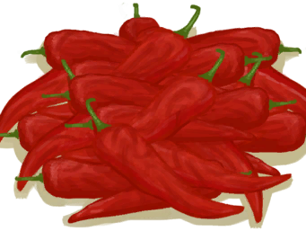
[Dried Chilies](ChiliesDried.md)](ChiliesDried.md)</td><td  style="text-align:left;vertical-align:top;"  >Eat</td><td  style="text-align:left;vertical-align:top;"  >35</td></tr><tr ><td  style="text-align:left;vertical-align:top;"  >[
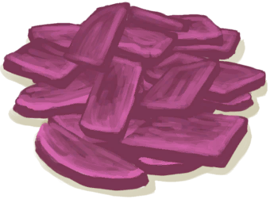
[Cut Yam](YamCut.md)](YamCut.md)</td><td  style="text-align:left;vertical-align:top;"  >Eat</td><td  style="text-align:left;vertical-align:top;"  >35</td></tr><tr ><td  style="text-align:left;vertical-align:top;"  >[

[Soaked Sago](LQ_SoakedSago.md)](LQ_SoakedSago.md)</td><td  style="text-align:left;vertical-align:top;"  >Eat</td><td  style="text-align:left;vertical-align:top;"  >35</td></tr><tr ><td  style="text-align:left;vertical-align:top;"  >[
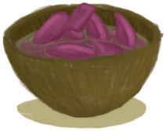
[Soaked Yam](LQ_SoakedYam.md)](LQ_SoakedYam.md)</td><td  style="text-align:left;vertical-align:top;"  >Eat</td><td  style="text-align:left;vertical-align:top;"  >35</td></tr><tr ><td  style="text-align:left;vertical-align:top;"  >[

[China Rose](ChinaRoseFlowers.md)](ChinaRoseFlowers.md)</td><td  style="text-align:left;vertical-align:top;"  >Eat</td><td  style="text-align:left;vertical-align:top;"  >30</td></tr><tr ><td  style="text-align:left;vertical-align:top;"  >[
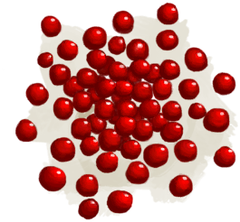
[Coffee Berries](CoffeeBerries.md)](CoffeeBerries.md)</td><td  style="text-align:left;vertical-align:top;"  >Eat</td><td  style="text-align:left;vertical-align:top;"  >30</td></tr><tr ><td  style="text-align:left;vertical-align:top;"  >[
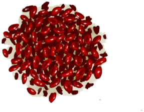
[Coffee Berry Pulp](CoffeeBerryPulp.md)](CoffeeBerryPulp.md)</td><td  style="text-align:left;vertical-align:top;"  >Eat</td><td  style="text-align:left;vertical-align:top;"  >30</td></tr><tr ><td  style="text-align:left;vertical-align:top;"  >[

[Island Chicken](IslandChicken.md)](IslandChicken.md)</td><td  style="text-align:left;vertical-align:top;"  >Eat</td><td  style="text-align:left;vertical-align:top;"  >30</td></tr><tr ><td  style="text-align:left;vertical-align:top;"  >[
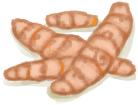
[Ginger](Ginger.md)](Ginger.md)</td><td  style="text-align:left;vertical-align:top;"  >Eat</td><td  style="text-align:left;vertical-align:top;"  >30</td></tr><tr ><td  style="text-align:left;vertical-align:top;"  >[

[Dried Ginger](GingerDried.md)](GingerDried.md)</td><td  style="text-align:left;vertical-align:top;"  >Eat</td><td  style="text-align:left;vertical-align:top;"  >30</td></tr><tr ><td  style="text-align:left;vertical-align:top;"  >[
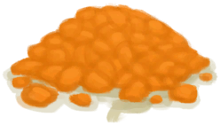
[Ground Ginger](GingerGround.md)](GingerGround.md)</td><td  style="text-align:left;vertical-align:top;"  >Eat</td><td  style="text-align:left;vertical-align:top;"  >30</td></tr><tr ><td  style="text-align:left;vertical-align:top;"  >[

[Jasmine Flowers](JasmineFlowers.md)](JasmineFlowers.md)</td><td  style="text-align:left;vertical-align:top;"  >Eat</td><td  style="text-align:left;vertical-align:top;"  >30</td></tr><tr ><td  style="text-align:left;vertical-align:top;"  >[

[Ground Jasmine Flowers](JasmineFlowersGround.md)](JasmineFlowersGround.md)</td><td  style="text-align:left;vertical-align:top;"  >Eat</td><td  style="text-align:left;vertical-align:top;"  >30</td></tr><tr ><td  style="text-align:left;vertical-align:top;"  >[
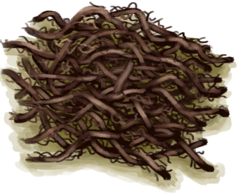
[Kava Root](KavaRoot.md)](KavaRoot.md)</td><td  style="text-align:left;vertical-align:top;"  >Eat Root</td><td  style="text-align:left;vertical-align:top;"  >30</td></tr><tr ><td  style="text-align:left;vertical-align:top;"  >[
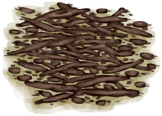
[Ground Kava Root](KavaRootGround.md)](KavaRootGround.md)</td><td  style="text-align:left;vertical-align:top;"  >Eat Ground Root</td><td  style="text-align:left;vertical-align:top;"  >30</td></tr><tr ><td  style="text-align:left;vertical-align:top;"  >[

[Ground Lemongrass](LemonGrassGround.md)](LemonGrassGround.md)</td><td  style="text-align:left;vertical-align:top;"  >Eat</td><td  style="text-align:left;vertical-align:top;"  >30</td></tr><tr ><td  style="text-align:left;vertical-align:top;"  >[
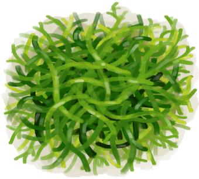
[Seaweed](Seaweed.md)](Seaweed.md)</td><td  style="text-align:left;vertical-align:top;"  >Eat</td><td  style="text-align:left;vertical-align:top;"  >30</td></tr><tr ><td  style="text-align:left;vertical-align:top;"  >[

[Ground Snake Grass](SnakeGrassGround.md)](SnakeGrassGround.md)</td><td  style="text-align:left;vertical-align:top;"  >Eat</td><td  style="text-align:left;vertical-align:top;"  >30</td></tr><tr ><td  style="text-align:left;vertical-align:top;"  >[

[Ground Spider Lily](SpiderLilyGround.md)](SpiderLilyGround.md)</td><td  style="text-align:left;vertical-align:top;"  >Eat</td><td  style="text-align:left;vertical-align:top;"  >30</td></tr><tr ><td  style="text-align:left;vertical-align:top;"  >[

[Spider Lily Leaves](SpiderLilyLeaves.md)](SpiderLilyLeaves.md)</td><td  style="text-align:left;vertical-align:top;"  >Eat</td><td  style="text-align:left;vertical-align:top;"  >30</td></tr><tr ><td  style="text-align:left;vertical-align:top;"  >[

[Dried Spider Lily Leaves](SpiderLilyLeavesDried.md)](SpiderLilyLeavesDried.md)</td><td  style="text-align:left;vertical-align:top;"  >Eat</td><td  style="text-align:left;vertical-align:top;"  >30</td></tr><tr ><td  style="text-align:left;vertical-align:top;"  >[

[Goat Stew](GoatStew.md)](GoatStew.md)</td><td  style="text-align:left;vertical-align:top;"  >Eat</td><td  style="text-align:left;vertical-align:top;"  >25</td></tr><tr ><td  style="text-align:left;vertical-align:top;"  >[
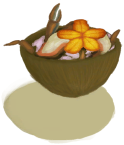
[Seafood Cup](SeafoodCup.md)](SeafoodCup.md)</td><td  style="text-align:left;vertical-align:top;"  >Eat</td><td  style="text-align:left;vertical-align:top;"  >25</td></tr><tr ><td  style="text-align:left;vertical-align:top;"  >[

[Dried Kava Root](KavaRootDried.md)](KavaRootDried.md)</td><td  style="text-align:left;vertical-align:top;"  >Eat Root</td><td  style="text-align:left;vertical-align:top;"  >25</td></tr><tr ><td  style="text-align:left;vertical-align:top;"  >[

[Macaque Skewers](MacaqueSkewers.md)](MacaqueSkewers.md)</td><td  style="text-align:left;vertical-align:top;"  >Eat</td><td  style="text-align:left;vertical-align:top;"  >10</td></tr><tr ><td  style="text-align:left;vertical-align:top;"  >[

[Yam Curry](YamCurry.md)](YamCurry.md)</td><td  style="text-align:left;vertical-align:top;"  >Eat</td><td  style="text-align:left;vertical-align:top;"  >10</td></tr></tbody></table>  
  

