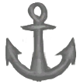

# Seamanship  
> "If you're not used to it  
  

<b>Base Value: </b> 0 
  

<b>Value Range: </b> 0 ~ 128 
  

<b>Base Rate: </b> -0.15 / /TP 
  
## Statuses  

<table><tr style="height:2em;"><td style="background-color:#F0F0F0;text-align:center;width:180px;font-size:1.4em;font-weight:bold;vertical-align:middle;">
0 ～ 25

0% ～ 19%
</td><td colspan=2 style="font-size:1.1em;vertical-align:middle;background-color:#F9F9F9;">
<b>

No Resistance</b>

</td></tr><tr><td colspan=2><b>Effect：</b>[

[Sea Sickness](SeaSickness.md)](SeaSickness.md)</td></tr><tr><td colspan=2></td></tr><tr style="height:2em;"><td style="background-color:#F0F0F0;text-align:center;width:180px;font-size:1.4em;font-weight:bold;vertical-align:middle;">
26 ～ 50

20% ～ 39%
</td><td colspan=2 style="font-size:1.1em;vertical-align:middle;background-color:#F9F9F9;">
<b>

Minor Resistance</b>

</td></tr><tr><td colspan=2><b>Effect：</b>[

[Sea Sickness](SeaSickness.md)](SeaSickness.md)addition<b>-0.5</b></td></tr><tr><td colspan=2></td></tr><tr style="height:2em;"><td style="background-color:#F0F0F0;text-align:center;width:180px;font-size:1.4em;font-weight:bold;vertical-align:middle;">
51 ～ 75

39% ～ 58%
</td><td colspan=2 style="font-size:1.1em;vertical-align:middle;background-color:#F9F9F9;">
<b>

Medium Resistance</b>

</td></tr><tr><td colspan=2><b>Effect：</b>[

[Sea Sickness](SeaSickness.md)](SeaSickness.md)addition<b>-1</b></td></tr><tr><td colspan=2></td></tr><tr style="height:2em;"><td style="background-color:#F0F0F0;text-align:center;width:180px;font-size:1.4em;font-weight:bold;vertical-align:middle;">
76 ～ 100

59% ～ 78%
</td><td colspan=2 style="font-size:1.1em;vertical-align:middle;background-color:#F9F9F9;">
<b>

High Resistance</b>

</td></tr><tr><td colspan=2><b>Effect：</b>[

[Sea Sickness](SeaSickness.md)](SeaSickness.md)addition<b>-2</b></td></tr><tr><td colspan=2></td></tr><tr style="height:2em;"><td style="background-color:#F0F0F0;text-align:center;width:180px;font-size:1.4em;font-weight:bold;vertical-align:middle;">
101 ～ 128

78% ～ 100%
</td><td colspan=2 style="font-size:1.1em;vertical-align:middle;background-color:#F9F9F9;">
<b>

Extreme Resistance</b>

</td></tr><tr><td colspan=2><b>Effect：</b>[

[Sea Sickness](SeaSickness.md)](SeaSickness.md)addition<b>-4</b></td></tr><tr><td colspan=2></td></tr></table>
  
## Related Cards  
[Sea Sickness](SeaSickness.md)  
## Change By  
<table class="table table-bordered" data-toggle="table"  ><thead style=""><tr ><th  style="text-align:left;vertical-align:top;"  >From</th><th  style="text-align:left;vertical-align:top;"  >Operation</th><th  style="text-align:left;vertical-align:top;"  data-sortable="true"  >Value</th></tr></thead><tr ><td  style="text-align:left;vertical-align:top;"  >

[Sailor](Pk_4_Sailor.md)</td><td  style="text-align:left;vertical-align:top;"  >Perk Effect</td><td  style="text-align:left;vertical-align:top;"  >128 ~ 0</td></tr></tbody></table>  
  

