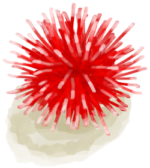
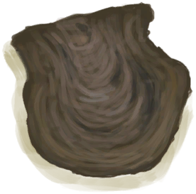
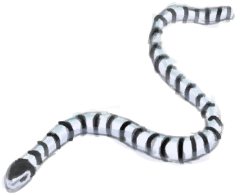
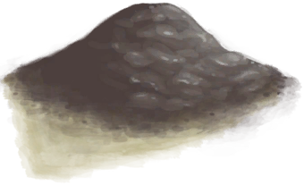
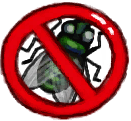
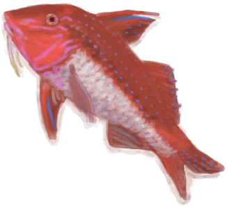
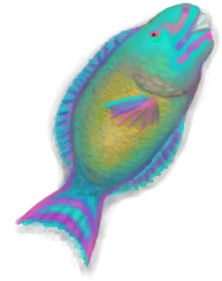
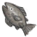
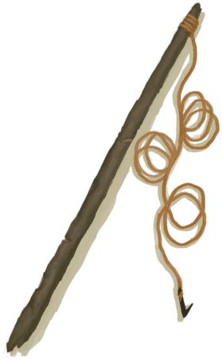
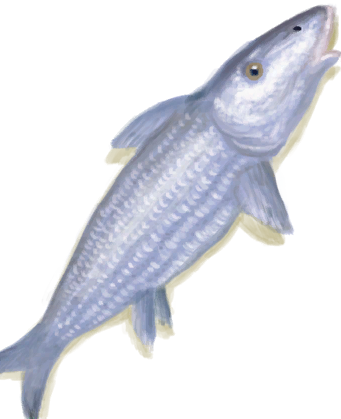

# Sea  
> Could go for a swim or try to get some fish with the right equipment.  
  
<table class="table table-bordered" data-toggle="table"  data-show-header="false"><thead style="display:none"><tr ><th  style="width:50%;text-align:left;vertical-align:top;"  >title</th><th  style="width:50%;text-align:left;vertical-align:top;"  ></th></tr></thead><tr ><td  style="width:50%;text-align:left;vertical-align:top;"  >** Unique On Board **  **Environment：**[Bay(Environment)](Env_Bay.md)  **Tag：**	[“Shallow Water”](tag_ShallowWater.md), [“Sea”](tag_Sea.md)</td><td  style="width:50%;text-align:left;vertical-align:top;"  >

<a href="Sea_Bay.md" style="color:black">Sea</a>

"Being stranded on an Island means you'll be surrounded by the Sea</td></tr></tbody></table>  
  
## Action  

<table><tr><td rowspan="2" style="width:200px;text-align:center;font-size:1.3em;font-weight:bold">

Drink

3m

</td><td></td></tr><tr><td></td></tr><tr><td colspan="2"><b>Require：</b>[if Kidneys](IfKidneys.md): <b>1-1</b></td></tr><tr><td colspan="2"><b>StatChange：</b>[

[Hydration ](Hydration.md)](Hydration.md)<b>+40</b>, [

[Sodium](Sodium.md)](Sodium.md)<b>+250</b></td></tr></table>
  

<table><tr><td rowspan="2" style="width:200px;text-align:center;font-size:1.3em;font-weight:bold">

Dive

30m

</td><td>[“ClimbAction(Group)”](ClimbAction.md)</td></tr><tr><td></td></tr><tr><td colspan="2"><b>Require：</b>[

[Light](Light.md)](Light.md): <b>10-100</b>, [

[Stamina](Stamina.md)](Stamina.md): <b>11-32</b></td></tr><tr><td colspan="2"><b>CardChanges：</b>装备中的[“Legs (Inner)”](tag_Clothing.md)

  <b>+12(100%)</b></td></tr><tr><td colspan="2"><b>StatChange：</b>[

[Wetness](Wetness.md)](Wetness.md)<b>+100</b>, [

[Stamina](Stamina.md)](Stamina.md)<b>-10</b>, [

[Morale](Morale.md)](Morale.md)<b>+4</b>, [

[Stress](Stress.md)](Stress.md)<b>-48</b>, [

[Entertainment](Entertainment.md)](Entertainment.md)<b>+16</b>, [

[Filth](Filth.md)](Filth.md)<b>-75</b>, [

[Aloe Gel Protection](AloeVeraGelProtection.md)](AloeVeraGelProtection.md)<b>-50</b>, [

[Swimming(Skill)](Skill_Swimming.md)](Skill_Swimming.md)<b>+1</b></td></tr><tr><td colspan="2">

<table style="margin-bottom:3px;"><tr><td rowspan=2 style="text-align:center" width="80px">
Base Weight

0
</td><td style="font-size:0.6em;line-height:0.6em;font-weight:bold">Conch</td></tr><tr><td>[

[Conch](Conch.md)](Conch.md)(<b>+1</b>)[Population Conch](Pop_Conch.md)<b>-1000</b></td></tr><tr><td colspan=2><li>[Population Conch](Pop_Conch.md) in <b>1000～30000</b>, weight<b>+1～+60</b></li></td></tr></table>

<table style="margin-bottom:3px;"><tr><td rowspan=2 style="text-align:center" width="80px">
Base Weight

0
</td><td style="font-size:0.6em;line-height:0.6em;font-weight:bold">Urchin</td></tr><tr><td>[

[Urchin](Urchin.md)](Urchin.md)(<b>+1</b>)[Urchin Population](Pop_Urchin.md)<b>-1000</b></td></tr><tr><td colspan=2><li>[Urchin Population](Pop_Urchin.md) in <b>1000～6000</b>, weight<b>+1～+15</b></li></td></tr></table>

<table style="margin-bottom:3px;"><tr><td rowspan=2 style="text-align:center" width="80px">
Base Weight

0
</td><td style="font-size:0.6em;line-height:0.6em;font-weight:bold">Oyster</td></tr><tr><td>[

[Oyster](Oyster.md)](Oyster.md)(<b>+1～+4</b>)[Oyster Population](Pop_Oyster.md)<b>-1000</b></td></tr><tr><td colspan=2><li>[Oyster Population](Pop_Oyster.md) in <b>1000～30000</b>, weight<b>+1～+60</b></li></td></tr></table>

<table style="margin-bottom:3px;"><tr><td rowspan=2 style="text-align:center" width="80px">
Base Weight

0
</td><td style="font-size:0.6em;line-height:0.6em;font-weight:bold">Shark</td></tr><tr><td>[

[A Shark!(Event)](Event_SharkFight.md)](Event_SharkFight.md)(<b>+1</b>)</td></tr><tr><td colspan=2><li>[Population Shark](Pop_Shark.md) in <b>1000～3000</b>, weight<b>+1～+10</b>，否则权重-1000000</li><li>[“Fish Scrap”](tag_FishScrap.md) On *Hand*，Weight<b>+1</b>(Stackable),</li><li>[“Fish”](tag_Fish.md) On *Hand*，Weight<b>+5</b>(Stackable),</li><li>[“Feed”](tag_Meat.md) On *Hand*，Weight<b>+5</b>(Stackable),</li><li>[“Open Wound”](tag_OpenWound.md) On *Hand/Board*，Weight<b>+10</b>(Stackable),</li></td></tr></table>

<table style="margin-bottom:3px;"><tr><td rowspan=2 style="text-align:center" width="80px">
Base Weight

100
</td><td style="font-size:0.6em;line-height:0.6em;font-weight:bold">Seaweed</td></tr><tr><td>[

[Seaweed](Seaweed.md)](Seaweed.md)(<b>+2～+3</b>)</td></tr></table>

<table style="margin-bottom:3px;"><tr><td rowspan=2 style="text-align:center" width="80px">
Base Weight

10
</td><td style="font-size:0.6em;line-height:0.6em;font-weight:bold">Sea Krait</td></tr><tr><td>[

[A Sea Krait!!(Event)](Event_SeaKraitSwim.md)](Event_SeaKraitSwim.md)(<b>+1</b>)</td></tr></table>

<table style="margin-bottom:3px;"><tr><td rowspan=2 style="text-align:center" width="80px">
Base Weight

30
</td><td style="font-size:0.6em;line-height:0.6em;font-weight:bold">Stone</td></tr><tr><td>[

[Stone](Stone.md)](Stone.md)(<b>+1</b>)</td></tr></table>

<table style="margin-bottom:3px;"><tr><td rowspan=2 style="text-align:center" width="80px">
Base Weight

10
</td><td style="font-size:0.6em;line-height:0.6em;font-weight:bold">Coral❗2 limit</td></tr><tr><td>[

[Coral](Coral.md)](Coral.md)(<b>+1</b>)</td></tr></table>

<table style="margin-bottom:3px;"><tr><td rowspan=2 style="text-align:center" width="80px">
Base Weight

0
</td><td style="font-size:0.6em;line-height:0.6em;font-weight:bold">Giant Conch</td></tr><tr><td>[

[Giant Conch](GiantConch.md)](GiantConch.md)(<b>+1</b>)</td></tr></table>

<table style="margin-bottom:3px;"><tr><td rowspan=2 style="text-align:center" width="80px">
Base Weight

225
</td><td style="font-size:0.6em;line-height:0.6em;font-weight:bold">Nothing</td></tr><tr><td></td></tr><tr><td colspan=2><li>[

[Swimming(Skill)](Skill_Swimming.md)](Skill_Swimming.md) in <b>0～150</b>, weight <b>+0～-220</b></li></td></tr></table>
<button class="btn btn-secondary btn-sm" style="" data-toggle="modal" onclick="setCollectionDataBase64('eyJ0aXRsZSI6IlNpbXVsYXRvcjogRGl2ZSAoU2VhKSIsImNvbGxlY3Rpb25zIjpbeyJkcm9wIjoiPGRpdiBzdHlsZT1cIndpZHRoOjI1cHg7ZGlzcGxheTppbmxpbmUtYmxvY2s7dGV4dC1hbGlnbjpjZW50ZXJcIj48aW1nIGRlY29kaW5nPVwiYXN5bmNcIiBzcmM9XCJTcHJpdGUvQ29uY2gucG5nXCIgaHJlZj1cImEubWRcIiBzdHlsZT1cIm1heC13aWR0aDoyNXB4O21heC1oZWlnaHQ6MjVweDtcIj48L2Rpdj5Db25jaCIsImJhc2UiOjAsImNvbmRpdGlvbiI6W3sia2V5IjoiUG9wX0NvbmNoIiwidGl0bGUiOiJQb3B1bGF0aW9uIENvbmNoIiwidHlwZSI6InJhbmdlIiwibWF4IjpbMCwzMDAwMF0sInJhbmdlIjpbMTAwMCwzMDAwMF0sIndlaWdodCI6WzEsNjBdLCJkZWZhdWx0VmFsdWUiOjMwMDAwLCJ3aGVuT3V0T2ZSYW5nZSI6MH1dfSx7ImRyb3AiOiI8ZGl2IHN0eWxlPVwid2lkdGg6MjVweDtkaXNwbGF5OmlubGluZS1ibG9jazt0ZXh0LWFsaWduOmNlbnRlclwiPjxpbWcgZGVjb2Rpbmc9XCJhc3luY1wiIHNyYz1cIlNwcml0ZS9VcmNoaW4ucG5nXCIgaHJlZj1cImEubWRcIiBzdHlsZT1cIm1heC13aWR0aDoyNXB4O21heC1oZWlnaHQ6MjVweDtcIj48L2Rpdj5VcmNoaW4iLCJiYXNlIjowLCJjb25kaXRpb24iOlt7ImtleSI6IlBvcF9VcmNoaW4iLCJ0aXRsZSI6IlVyY2hpbiBQb3B1bGF0aW9uIiwidHlwZSI6InJhbmdlIiwibWF4IjpbMCw2MDAwXSwicmFuZ2UiOlsxMDAwLDYwMDBdLCJ3ZWlnaHQiOlsxLDE1XSwiZGVmYXVsdFZhbHVlIjo2MDAwLCJ3aGVuT3V0T2ZSYW5nZSI6MH1dfSx7ImRyb3AiOiI8ZGl2IHN0eWxlPVwid2lkdGg6MjVweDtkaXNwbGF5OmlubGluZS1ibG9jazt0ZXh0LWFsaWduOmNlbnRlclwiPjxpbWcgZGVjb2Rpbmc9XCJhc3luY1wiIHNyYz1cIlNwcml0ZS9PeXN0ZXIucG5nXCIgaHJlZj1cImEubWRcIiBzdHlsZT1cIm1heC13aWR0aDoyNXB4O21heC1oZWlnaHQ6MjVweDtcIj48L2Rpdj5PeXN0ZXIiLCJiYXNlIjowLCJjb25kaXRpb24iOlt7ImtleSI6IlBvcF9PeXN0ZXIiLCJ0aXRsZSI6Ik95c3RlciBQb3B1bGF0aW9uIiwidHlwZSI6InJhbmdlIiwibWF4IjpbMCwzMDAwMF0sInJhbmdlIjpbMTAwMCwzMDAwMF0sIndlaWdodCI6WzEsNjBdLCJkZWZhdWx0VmFsdWUiOjMwMDAwLCJ3aGVuT3V0T2ZSYW5nZSI6MH1dfSx7ImRyb3AiOiI8ZGl2IHN0eWxlPVwid2lkdGg6MjVweDtkaXNwbGF5OmlubGluZS1ibG9jazt0ZXh0LWFsaWduOmNlbnRlclwiPjxpbWcgZGVjb2Rpbmc9XCJhc3luY1wiIHNyYz1cIlNwcml0ZS9TaGFya0V2ZW50LnBuZ1wiIGhyZWY9XCJhLm1kXCIgc3R5bGU9XCJtYXgtd2lkdGg6MjVweDttYXgtaGVpZ2h0OjI1cHg7XCI+PC9kaXY+QSBTaGFyayEoRXZlbnQpIiwiYmFzZSI6MCwiY29uZGl0aW9uIjpbeyJrZXkiOiJQb3BfU2hhcmsiLCJ0aXRsZSI6IlBvcHVsYXRpb24gU2hhcmsiLCJ0eXBlIjoicmFuZ2UiLCJtYXgiOlswLDMwMDBdLCJyYW5nZSI6WzEwMDAsMzAwMF0sIndlaWdodCI6WzEsMTBdLCJkZWZhdWx0VmFsdWUiOjMwMDAsIndoZW5PdXRPZlJhbmdlIjoyfSx7ImtleSI6InRhZ19GaXNoU2NyYXBfYW1vdW50IiwidGl0bGUiOiLigJxGaXNoIFNjcmFw4oCdIiwidHlwZSI6InJhbmdlIiwicmFuZ2UiOlswLDIwXSwibWF4IjpbMCwyMF0sIndlaWdodCI6WzAsMjBdLCJkZWZhdWx0VmFsdWUiOjAsIndoZW5PdXRPZlJhbmdlIjowLCJtYXhTdGFja0dyb3VwIjoiIn0seyJrZXkiOiJ0YWdfRmlzaF9hbW91bnQiLCJ0aXRsZSI6IuKAnEZpc2jigJ0iLCJ0eXBlIjoicmFuZ2UiLCJyYW5nZSI6WzAsMjBdLCJtYXgiOlswLDIwXSwid2VpZ2h0IjpbMCwxMDBdLCJkZWZhdWx0VmFsdWUiOjAsIndoZW5PdXRPZlJhbmdlIjowLCJtYXhTdGFja0dyb3VwIjoiIn0seyJrZXkiOiJ0YWdfTWVhdF9hbW91bnQiLCJ0aXRsZSI6IuKAnEZlZWTigJ0iLCJ0eXBlIjoicmFuZ2UiLCJyYW5nZSI6WzAsMjBdLCJtYXgiOlswLDIwXSwid2VpZ2h0IjpbMCwxMDBdLCJkZWZhdWx0VmFsdWUiOjAsIndoZW5PdXRPZlJhbmdlIjowLCJtYXhTdGFja0dyb3VwIjoiIn0seyJrZXkiOiJ0YWdfT3BlbldvdW5kX2Ftb3VudCIsInRpdGxlIjoi4oCcT3BlbiBXb3VuZOKAnSIsInR5cGUiOiJyYW5nZSIsInJhbmdlIjpbMCwyMF0sIm1heCI6WzAsMjBdLCJ3ZWlnaHQiOlswLDIwMF0sImRlZmF1bHRWYWx1ZSI6MCwid2hlbk91dE9mUmFuZ2UiOjAsIm1heFN0YWNrR3JvdXAiOiIifV19LHsiZHJvcCI6IjxkaXYgc3R5bGU9XCJ3aWR0aDoyNXB4O2Rpc3BsYXk6aW5saW5lLWJsb2NrO3RleHQtYWxpZ246Y2VudGVyXCI+PGltZyBkZWNvZGluZz1cImFzeW5jXCIgc3JjPVwiU3ByaXRlL1NlYXdlZWQucG5nXCIgaHJlZj1cImEubWRcIiBzdHlsZT1cIm1heC13aWR0aDoyNXB4O21heC1oZWlnaHQ6MjVweDtcIj48L2Rpdj5TZWF3ZWVkIiwiYmFzZSI6MTAwLCJjb25kaXRpb24iOltdfSx7ImRyb3AiOiI8ZGl2IHN0eWxlPVwid2lkdGg6MjVweDtkaXNwbGF5OmlubGluZS1ibG9jazt0ZXh0LWFsaWduOmNlbnRlclwiPjxpbWcgZGVjb2Rpbmc9XCJhc3luY1wiIHNyYz1cIlNwcml0ZS9TZWFLcmFpdC5wbmdcIiBocmVmPVwiYS5tZFwiIHN0eWxlPVwibWF4LXdpZHRoOjI1cHg7bWF4LWhlaWdodDoyNXB4O1wiPjwvZGl2PkEgU2VhIEtyYWl0ISEoRXZlbnQpIiwiYmFzZSI6MTAsImNvbmRpdGlvbiI6W119LHsiZHJvcCI6IjxkaXYgc3R5bGU9XCJ3aWR0aDoyNXB4O2Rpc3BsYXk6aW5saW5lLWJsb2NrO3RleHQtYWxpZ246Y2VudGVyXCI+PGltZyBkZWNvZGluZz1cImFzeW5jXCIgc3JjPVwiU3ByaXRlL1N0b25lLnBuZ1wiIGhyZWY9XCJhLm1kXCIgc3R5bGU9XCJtYXgtd2lkdGg6MjVweDttYXgtaGVpZ2h0OjI1cHg7XCI+PC9kaXY+U3RvbmUiLCJiYXNlIjozMCwiY29uZGl0aW9uIjpbXX0seyJkcm9wIjoiPGRpdiBzdHlsZT1cIndpZHRoOjI1cHg7ZGlzcGxheTppbmxpbmUtYmxvY2s7dGV4dC1hbGlnbjpjZW50ZXJcIj48aW1nIGRlY29kaW5nPVwiYXN5bmNcIiBzcmM9XCJTcHJpdGUvQ29uY2gucG5nXCIgaHJlZj1cImEubWRcIiBzdHlsZT1cIm1heC13aWR0aDoyNXB4O21heC1oZWlnaHQ6MjVweDtcIj48L2Rpdj5HaWFudCBDb25jaCIsImJhc2UiOjAsImNvbmRpdGlvbiI6W119LHsiZHJvcCI6Ii0iLCJiYXNlIjoyMjUsImNvbmRpdGlvbiI6W3sia2V5IjoiU2tpbGxfU3dpbW1pbmciLCJ0aXRsZSI6IlN3aW1taW5nKFNraWxsKSIsInR5cGUiOiJyYW5nZSIsIm1heCI6WzAsMTUwXSwicmFuZ2UiOlswLDE1MF0sIndlaWdodCI6WzAsLTIyMF0sImRlZmF1bHRWYWx1ZSI6MCwid2hlbk91dE9mUmFuZ2UiOjF9XX0seyJkcm9wIjoiPGRpdiBzdHlsZT1cIndpZHRoOjI1cHg7ZGlzcGxheTppbmxpbmUtYmxvY2s7dGV4dC1hbGlnbjpjZW50ZXJcIj48aW1nIGRlY29kaW5nPVwiYXN5bmNcIiBzcmM9XCJTcHJpdGUvQ29yYWwucG5nXCIgaHJlZj1cImEubWRcIiBzdHlsZT1cIm1heC13aWR0aDoyNXB4O21heC1oZWlnaHQ6MjVweDtcIj48L2Rpdj5Db3JhbCIsImJhc2UiOjEwLCJjb25kaXRpb24iOltdLCJpc0xpbWl0Ijp0cnVlfV19')" data-target="#modelCollectionSimulator">Simulator</button>
</td></tr></table>
  

<table><tr><td rowspan="2" style="width:200px;text-align:center;font-size:1.3em;font-weight:bold">

Wash yourself

15m

</td><td>[“HandAction(Group)”](HandAction.md)</td></tr><tr><td></td></tr><tr><td colspan="2"><b>CardChanges：</b>装备中的[“Legs (Inner)”](tag_Clothing.md)

  <b>+12(100%)</b>, 所有[Cobra Spit](W_CobraSpit.md)Fuel  <b>-75</b></td></tr><tr><td colspan="2"><b>StatChange：</b>[

[Wetness](Wetness.md)](Wetness.md)<b>+100</b> (/TP), [

[Morale](Morale.md)](Morale.md)<b>+1</b>, [

[Filth](Filth.md)](Filth.md)<b>-150</b>, [

[Mud Protection](MudProtection.md)](MudProtection.md)<b>-50</b>, [

[Aloe Gel Protection](AloeVeraGelProtection.md)](AloeVeraGelProtection.md)<b>-50</b>, [

[Bug Repellent](BugRepellentApplied.md)](BugRepellentApplied.md)<b>-50</b>, [

[Sun Protection](SunProtection.md)](SunProtection.md)<b>-50</b></td></tr></table>
  

<table><tr><td rowspan="2" style="width:200px;text-align:center;font-size:1.3em;font-weight:bold">

Return to the sea

</td><td></td></tr><tr><td></td></tr><tr><td colspan="2"><b>Require：</b>[Mermaid Final Action](MermaidFinalAction.md): <b>2-2</b></td></tr></table>
  
  
  
## Drag With  

<table style="margin-bottom:0px;"><tr><td style="width:40%;text-align:left; background-color:#FEFEFE"><b>With：</b>[“Spear T1”](tag_Spear.md)</td><td style="width:40%;font-size:1em;font-weight:bold;background-color:#FEFEFE">Spear Fish (30m) [“HandAction(Group)”](HandAction.md)</td></tr><tr><td colspan="2"><b>Require：</b>[

[Light](Light.md)](Light.md): <b>10-100</b></td></tr><tr style="background-color:#FFFFFF"><td style=""><b>Receiving：</b>Usage  <b>-1</b></td><td style=""><b>Self：</b></td></tr><tr><td colspan="2"><b>StatChange：</b>[

[Wetness](Wetness.md)](Wetness.md)<b>+60</b>, [

[Spear Fishing(Skill)](Skill_SpearFishing.md)](Skill_SpearFishing.md)<b>+0.5</b>, [

[Morale](Morale.md)](Morale.md)<b>+1</b></td></tr><tr><td colspan="2">

<table style="margin-bottom:3px;"><tr><td rowspan=2 style="text-align:center" width="80px">
Base Weight

27
</td><td style="font-size:0.6em;line-height:0.6em;font-weight:bold">Nothing</td></tr><tr><td></td></tr><tr><td colspan=2><li>[

[Spear Fishing(Skill)](Skill_SpearFishing.md)](Skill_SpearFishing.md) in <b>0～150</b>, weight <b>+0～-20</b></li><li>Sea Damagein<b>0～100(0%～10%)</b>, weight<b>+0～+1000</b></li><li>[

[Fishing Spear](SpearFishing.md)](SpearFishing.md) On *Hand/Board*，Weight<b>-5</b>,</li></td></tr></table>

<table style="margin-bottom:3px;"><tr><td rowspan=2 style="text-align:center" width="80px">
Base Weight

6
</td><td style="font-size:0.6em;line-height:0.6em;font-weight:bold">Goatfish</td></tr><tr><td>[

[Goatfish](Goatfish.md)](Goatfish.md)(<b>+1</b>)</td></tr></table>

<table style="margin-bottom:3px;"><tr><td rowspan=2 style="text-align:center" width="80px">
Base Weight

6
</td><td style="font-size:0.6em;line-height:0.6em;font-weight:bold">Parrot Fish</td></tr><tr><td>[

[Parrot Fish](ParrotFish.md)](ParrotFish.md)(<b>+1</b>)</td></tr></table>

<table style="margin-bottom:3px;"><tr><td rowspan=2 style="text-align:center" width="80px">
Base Weight

2
</td><td style="font-size:0.6em;line-height:0.6em;font-weight:bold">Sea Krait</td></tr><tr><td>[

[Dead Sea Krait](SeaKraitDead.md)](SeaKraitDead.md)(<b>+1</b>)[Population Sea Krait](Pop_Krait.md)<b>-1000</b></td></tr><tr><td colspan=2><li>[Population Sea Krait](Pop_Krait.md) in <b>1000～12000</b>, weight<b>-2～+0</b>，否则权重-1000000</li></td></tr></table>

<table style="margin-bottom:3px;"><tr><td rowspan=2 style="text-align:center" width="80px">
Base Weight

2
</td><td style="font-size:0.6em;line-height:0.6em;font-weight:bold">Sea Krait Bite</td></tr><tr><td>[

[A Sea Krait!!(Event)](Event_SeaKraitStep.md)](Event_SeaKraitStep.md)(<b>+1</b>)</td></tr><tr><td colspan=2><li>[

[Spear Fishing(Skill)](Skill_SpearFishing.md)](Skill_SpearFishing.md) in <b>30～150</b>, weight<b>+0～-2</b></li><li>[Population Sea Krait](Pop_Krait.md) in <b>1000～12000</b>, weight<b>-2～+0</b>，否则权重-1000000</li><li>[Counter](Counter.md) in <b>0～2880</b>, weight<b>-999</b></li></td></tr></table>
<button class="btn btn-secondary btn-sm" style="" data-toggle="modal" onclick="setCollectionDataBase64('eyJ0aXRsZSI6IlNpbXVsYXRvcjogU3BlYXIgRmlzaCAoU2VhKSIsImNvbGxlY3Rpb25zIjpbeyJkcm9wIjoiLSIsImJhc2UiOjI3LCJjb25kaXRpb24iOlt7ImtleSI6IlNraWxsX1NwZWFyRmlzaGluZyIsInRpdGxlIjoiU3BlYXIgRmlzaGluZyhTa2lsbCkiLCJ0eXBlIjoicmFuZ2UiLCJtYXgiOlswLDE1MF0sInJhbmdlIjpbMCwxNTBdLCJ3ZWlnaHQiOlswLC0yMF0sImRlZmF1bHRWYWx1ZSI6MCwid2hlbk91dE9mUmFuZ2UiOjF9LHsia2V5IjoiU3BlY2lhbDEiLCJ0aXRsZSI6IlNlYSBEYW1hZ2UiLCJ0eXBlIjoicmFuZ2UiLCJtYXgiOlswLDEwMF0sInJhbmdlIjpbMCwxMDBdLCJ3ZWlnaHQiOlswLDEwMDBdLCJkZWZhdWx0VmFsdWUiOjAsIndoZW5PdXRPZlJhbmdlIjowfSx7ImtleSI6IlNwZWFyRmlzaGluZyIsInRpdGxlIjoiPGRpdiBzdHlsZT1cIndpZHRoOjIwcHg7ZGlzcGxheTppbmxpbmUtYmxvY2s7dGV4dC1hbGlnbjpjZW50ZXJcIj48aW1nIGRlY29kaW5nPVwiYXN5bmNcIiBzcmM9XCJTcHJpdGUvU3BlYXJGaXNoaW5nLnBuZ1wiIGhyZWY9XCJhLm1kXCIgc3R5bGU9XCJtYXgtd2lkdGg6MjBweDttYXgtaGVpZ2h0OjIwcHg7XCI+PC9kaXY+RmlzaGluZyBTcGVhciBPbiAqSGFuZC9Cb2FyZCrvvIwiLCJ0eXBlIjoidG9nZ2xlIiwicmFuZ2UiOlswLDFdLCJtYXgiOlswLDFdLCJ3ZWlnaHQiOlswLC01XSwiZGVmYXVsdFZhbHVlIjowLCJ3aGVuT3V0T2ZSYW5nZSI6MCwibWF4U3RhY2tHcm91cCI6IiJ9XX0seyJkcm9wIjoiPGRpdiBzdHlsZT1cIndpZHRoOjI1cHg7ZGlzcGxheTppbmxpbmUtYmxvY2s7dGV4dC1hbGlnbjpjZW50ZXJcIj48aW1nIGRlY29kaW5nPVwiYXN5bmNcIiBzcmM9XCJTcHJpdGUvR29hdGZpc2gucG5nXCIgaHJlZj1cImEubWRcIiBzdHlsZT1cIm1heC13aWR0aDoyNXB4O21heC1oZWlnaHQ6MjVweDtcIj48L2Rpdj5Hb2F0ZmlzaCIsImJhc2UiOjYsImNvbmRpdGlvbiI6W119LHsiZHJvcCI6IjxkaXYgc3R5bGU9XCJ3aWR0aDoyNXB4O2Rpc3BsYXk6aW5saW5lLWJsb2NrO3RleHQtYWxpZ246Y2VudGVyXCI+PGltZyBkZWNvZGluZz1cImFzeW5jXCIgc3JjPVwiU3ByaXRlL1BhcnJvdEZpc2gucG5nXCIgaHJlZj1cImEubWRcIiBzdHlsZT1cIm1heC13aWR0aDoyNXB4O21heC1oZWlnaHQ6MjVweDtcIj48L2Rpdj5QYXJyb3QgRmlzaCIsImJhc2UiOjYsImNvbmRpdGlvbiI6W119LHsiZHJvcCI6IjxkaXYgc3R5bGU9XCJ3aWR0aDoyNXB4O2Rpc3BsYXk6aW5saW5lLWJsb2NrO3RleHQtYWxpZ246Y2VudGVyXCI+PGltZyBkZWNvZGluZz1cImFzeW5jXCIgc3JjPVwiU3ByaXRlL1NlYUtyYWl0Q2FyY2Fzcy5wbmdcIiBocmVmPVwiYS5tZFwiIHN0eWxlPVwibWF4LXdpZHRoOjI1cHg7bWF4LWhlaWdodDoyNXB4O1wiPjwvZGl2PkRlYWQgU2VhIEtyYWl0IiwiYmFzZSI6MiwiY29uZGl0aW9uIjpbeyJrZXkiOiJQb3BfS3JhaXQiLCJ0aXRsZSI6IlBvcHVsYXRpb24gU2VhIEtyYWl0IiwidHlwZSI6InJhbmdlIiwibWF4IjpbMCwxMjAwMF0sInJhbmdlIjpbMTAwMCwxMjAwMF0sIndlaWdodCI6Wy0yLDBdLCJkZWZhdWx0VmFsdWUiOjEyMDAwLCJ3aGVuT3V0T2ZSYW5nZSI6Mn1dfSx7ImRyb3AiOiI8ZGl2IHN0eWxlPVwid2lkdGg6MjVweDtkaXNwbGF5OmlubGluZS1ibG9jazt0ZXh0LWFsaWduOmNlbnRlclwiPjxpbWcgZGVjb2Rpbmc9XCJhc3luY1wiIHNyYz1cIlNwcml0ZS9TZWFLcmFpdC5wbmdcIiBocmVmPVwiYS5tZFwiIHN0eWxlPVwibWF4LXdpZHRoOjI1cHg7bWF4LWhlaWdodDoyNXB4O1wiPjwvZGl2PkEgU2VhIEtyYWl0ISEoRXZlbnQpIiwiYmFzZSI6MiwiY29uZGl0aW9uIjpbeyJrZXkiOiJTa2lsbF9TcGVhckZpc2hpbmciLCJ0aXRsZSI6IlNwZWFyIEZpc2hpbmcoU2tpbGwpIiwidHlwZSI6InJhbmdlIiwibWF4IjpbMCwxNTBdLCJyYW5nZSI6WzMwLDE1MF0sIndlaWdodCI6WzAsLTJdLCJkZWZhdWx0VmFsdWUiOjAsIndoZW5PdXRPZlJhbmdlIjowfSx7ImtleSI6IlBvcF9LcmFpdCIsInRpdGxlIjoiUG9wdWxhdGlvbiBTZWEgS3JhaXQiLCJ0eXBlIjoicmFuZ2UiLCJtYXgiOlswLDEyMDAwXSwicmFuZ2UiOlsxMDAwLDEyMDAwXSwid2VpZ2h0IjpbLTIsMF0sImRlZmF1bHRWYWx1ZSI6MTIwMDAsIndoZW5PdXRPZlJhbmdlIjoyfSx7ImtleSI6IkNvdW50ZXIiLCJ0aXRsZSI6IkNvdW50ZXIiLCJ0eXBlIjoicmFuZ2UiLCJtYXgiOlswLDk5OTk5OV0sInJhbmdlIjpbMCwyODgwXSwid2VpZ2h0IjpbLTk5OSwtOTk5XSwiZGVmYXVsdFZhbHVlIjowLCJ3aGVuT3V0T2ZSYW5nZSI6MH1dfV19')" data-target="#modelCollectionSimulator">Simulator</button>
</td></tr></table>
  

<table style="margin-bottom:0px;"><tr><td style="width:40%;text-align:left; background-color:#FEFEFE"><b>With：</b>[“Fishing Line”](tag_FishingLine.md)</td><td style="width:40%;font-size:1em;font-weight:bold;background-color:#FEFEFE">Fish (1h) </td></tr><tr style="background-color:#FFFFFF"><td style=""><b>Receiving：</b>Usage  <b>-1(-3.33%)</b></td><td style=""><b>Self：</b></td></tr><tr><td colspan="2"><b>StatChange：</b>[

[Morale](Morale.md)](Morale.md)<b>+1</b>, [

[Fishing(Skill)](Skill_Fishing.md)](Skill_Fishing.md)<b>+1</b>, [

[Stress](Stress.md)](Stress.md)<b>-50</b></td></tr><tr><td colspan="2">

<table style="margin-bottom:3px;"><tr><td rowspan=2 style="text-align:center" width="80px">
Base Weight

30
</td><td style="font-size:0.6em;line-height:0.6em;font-weight:bold">Nothing</td></tr><tr><td></td></tr><tr><td colspan=2><li>[

[Fishing(Skill)](Skill_Fishing.md)](Skill_Fishing.md) in <b>0～150</b>, weight<b>+0～-15</b></li><li>Sea Damagein<b>0～1000(0%～100%)</b>, weight<b>+0～+100</b></li><li>[

[Fishing Rod](FishingRod.md)](FishingRod.md) On *Hand*，Weight<b>-5</b>(Stackable),</li></td></tr></table>

<table style="margin-bottom:3px;"><tr><td rowspan=2 style="text-align:center" width="80px">
Base Weight

3
</td><td style="font-size:0.6em;line-height:0.6em;font-weight:bold">Parrot Fish</td></tr><tr><td>[

[Parrot Fish](ParrotFish.md)](ParrotFish.md)(<b>+1</b>)</td></tr></table>

<table style="margin-bottom:3px;"><tr><td rowspan=2 style="text-align:center" width="80px">
Base Weight

3
</td><td style="font-size:0.6em;line-height:0.6em;font-weight:bold">Goat Fish</td></tr><tr><td>[

[Goatfish](Goatfish.md)](Goatfish.md)(<b>+1</b>)</td></tr></table>

<table style="margin-bottom:3px;"><tr><td rowspan=2 style="text-align:center" width="80px">
Base Weight

1
</td><td style="font-size:0.6em;line-height:0.6em;font-weight:bold">Bonefish</td></tr><tr><td>[

[Bonefish](Bonefish.md)](Bonefish.md)(<b>+1</b>)</td></tr></table>
<button class="btn btn-secondary btn-sm" style="" data-toggle="modal" onclick="setCollectionDataBase64('eyJ0aXRsZSI6IlNpbXVsYXRvcjogRmlzaCAoU2VhKSIsImNvbGxlY3Rpb25zIjpbeyJkcm9wIjoiLSIsImJhc2UiOjMwLCJjb25kaXRpb24iOlt7ImtleSI6IlNraWxsX0Zpc2hpbmciLCJ0aXRsZSI6IkZpc2hpbmcoU2tpbGwpIiwidHlwZSI6InJhbmdlIiwibWF4IjpbMCwxNTBdLCJyYW5nZSI6WzAsMTUwXSwid2VpZ2h0IjpbMCwtMTVdLCJkZWZhdWx0VmFsdWUiOjAsIndoZW5PdXRPZlJhbmdlIjowfSx7ImtleSI6IlNwZWNpYWwxIiwidGl0bGUiOiJTZWEgRGFtYWdlIiwidHlwZSI6InJhbmdlIiwibWF4IjpbMCwxMDAwXSwicmFuZ2UiOlswLDEwMDBdLCJ3ZWlnaHQiOlswLDEwMF0sImRlZmF1bHRWYWx1ZSI6MCwid2hlbk91dE9mUmFuZ2UiOjB9LHsia2V5IjoiRmlzaGluZ1JvZF9hbW91bnQiLCJ0aXRsZSI6IkZpc2hpbmcgUm9kIiwidHlwZSI6InJhbmdlIiwicmFuZ2UiOlswLDIwXSwibWF4IjpbMCwyMF0sIndlaWdodCI6WzAsLTEwMF0sImRlZmF1bHRWYWx1ZSI6MCwid2hlbk91dE9mUmFuZ2UiOjAsIm1heFN0YWNrR3JvdXAiOiIifV19LHsiZHJvcCI6IjxkaXYgc3R5bGU9XCJ3aWR0aDoyNXB4O2Rpc3BsYXk6aW5saW5lLWJsb2NrO3RleHQtYWxpZ246Y2VudGVyXCI+PGltZyBkZWNvZGluZz1cImFzeW5jXCIgc3JjPVwiU3ByaXRlL1BhcnJvdEZpc2gucG5nXCIgaHJlZj1cImEubWRcIiBzdHlsZT1cIm1heC13aWR0aDoyNXB4O21heC1oZWlnaHQ6MjVweDtcIj48L2Rpdj5QYXJyb3QgRmlzaCIsImJhc2UiOjMsImNvbmRpdGlvbiI6W119LHsiZHJvcCI6IjxkaXYgc3R5bGU9XCJ3aWR0aDoyNXB4O2Rpc3BsYXk6aW5saW5lLWJsb2NrO3RleHQtYWxpZ246Y2VudGVyXCI+PGltZyBkZWNvZGluZz1cImFzeW5jXCIgc3JjPVwiU3ByaXRlL0dvYXRmaXNoLnBuZ1wiIGhyZWY9XCJhLm1kXCIgc3R5bGU9XCJtYXgtd2lkdGg6MjVweDttYXgtaGVpZ2h0OjI1cHg7XCI+PC9kaXY+R29hdGZpc2giLCJiYXNlIjozLCJjb25kaXRpb24iOltdfSx7ImRyb3AiOiI8ZGl2IHN0eWxlPVwid2lkdGg6MjVweDtkaXNwbGF5OmlubGluZS1ibG9jazt0ZXh0LWFsaWduOmNlbnRlclwiPjxpbWcgZGVjb2Rpbmc9XCJhc3luY1wiIHNyYz1cIlNwcml0ZS9Cb25lZmlzaC5wbmdcIiBocmVmPVwiYS5tZFwiIHN0eWxlPVwibWF4LXdpZHRoOjI1cHg7bWF4LWhlaWdodDoyNXB4O1wiPjwvZGl2PkJvbmVmaXNoIiwiYmFzZSI6MSwiY29uZGl0aW9uIjpbXX1dfQ==')" data-target="#modelCollectionSimulator">Simulator</button>
</td></tr></table>
  

<table style="margin-bottom:0px;"><tr><td style="width:40%;text-align:left; background-color:#FEFEFE"><b>With：</b>[“Fishing Line Bait”](tag_FishingLineBait.md)</td><td style="width:40%;font-size:1em;font-weight:bold;background-color:#FEFEFE">Fish (1h) </td></tr><tr style="background-color:#FFFFFF"><td style=""><b>Receiving：</b>Usage  <b>-1(-3.33%)</b>, Bait

  <b>-1(-100%)</b></td><td style=""><b>Self：</b></td></tr><tr><td colspan="2"><b>StatChange：</b>[

[Morale](Morale.md)](Morale.md)<b>+1</b>, [

[Fishing(Skill)](Skill_Fishing.md)](Skill_Fishing.md)<b>+1</b>, [

[Stress](Stress.md)](Stress.md)<b>-50</b></td></tr><tr><td colspan="2">

<table style="margin-bottom:3px;"><tr><td rowspan=2 style="text-align:center" width="80px">
Base Weight

15
</td><td style="font-size:0.6em;line-height:0.6em;font-weight:bold">Nothing</td></tr><tr><td></td></tr><tr><td colspan=2><li>[

[Fishing(Skill)](Skill_Fishing.md)](Skill_Fishing.md) in <b>0～150</b>, weight<b>+0～-10</b></li><li>Sea Damagein<b>0～1000(0%～100%)</b>, weight<b>+0～+100</b></li><li>[

[Fishing Rod (baited)](FishingRodBait.md)](FishingRodBait.md) On *Hand*，Weight<b>-4</b>(Stackable),</li></td></tr></table>

<table style="margin-bottom:3px;"><tr><td rowspan=2 style="text-align:center" width="80px">
Base Weight

10
</td><td style="font-size:0.6em;line-height:0.6em;font-weight:bold">Parrot Fish</td></tr><tr><td>[

[Parrot Fish](ParrotFish.md)](ParrotFish.md)(<b>+1</b>)</td></tr></table>

<table style="margin-bottom:3px;"><tr><td rowspan=2 style="text-align:center" width="80px">
Base Weight

10
</td><td style="font-size:0.6em;line-height:0.6em;font-weight:bold">Goat Fish</td></tr><tr><td>[

[Goatfish](Goatfish.md)](Goatfish.md)(<b>+1</b>)</td></tr></table>

<table style="margin-bottom:3px;"><tr><td rowspan=2 style="text-align:center" width="80px">
Base Weight

5
</td><td style="font-size:0.6em;line-height:0.6em;font-weight:bold">Bonefish</td></tr><tr><td>[

[Bonefish](Bonefish.md)](Bonefish.md)(<b>+1</b>)</td></tr></table>
<button class="btn btn-secondary btn-sm" style="" data-toggle="modal" onclick="setCollectionDataBase64('eyJ0aXRsZSI6IlNpbXVsYXRvcjogRmlzaCAoU2VhKSIsImNvbGxlY3Rpb25zIjpbeyJkcm9wIjoiLSIsImJhc2UiOjE1LCJjb25kaXRpb24iOlt7ImtleSI6IlNraWxsX0Zpc2hpbmciLCJ0aXRsZSI6IkZpc2hpbmcoU2tpbGwpIiwidHlwZSI6InJhbmdlIiwibWF4IjpbMCwxNTBdLCJyYW5nZSI6WzAsMTUwXSwid2VpZ2h0IjpbMCwtMTBdLCJkZWZhdWx0VmFsdWUiOjAsIndoZW5PdXRPZlJhbmdlIjowfSx7ImtleSI6IlNwZWNpYWwxIiwidGl0bGUiOiJTZWEgRGFtYWdlIiwidHlwZSI6InJhbmdlIiwibWF4IjpbMCwxMDAwXSwicmFuZ2UiOlswLDEwMDBdLCJ3ZWlnaHQiOlswLDEwMF0sImRlZmF1bHRWYWx1ZSI6MCwid2hlbk91dE9mUmFuZ2UiOjB9LHsia2V5IjoiRmlzaGluZ1JvZEJhaXRfYW1vdW50IiwidGl0bGUiOiJGaXNoaW5nIFJvZCAoYmFpdGVkKSIsInR5cGUiOiJyYW5nZSIsInJhbmdlIjpbMCwyMF0sIm1heCI6WzAsMjBdLCJ3ZWlnaHQiOlswLC04MF0sImRlZmF1bHRWYWx1ZSI6MCwid2hlbk91dE9mUmFuZ2UiOjAsIm1heFN0YWNrR3JvdXAiOiIifV19LHsiZHJvcCI6IjxkaXYgc3R5bGU9XCJ3aWR0aDoyNXB4O2Rpc3BsYXk6aW5saW5lLWJsb2NrO3RleHQtYWxpZ246Y2VudGVyXCI+PGltZyBkZWNvZGluZz1cImFzeW5jXCIgc3JjPVwiU3ByaXRlL1BhcnJvdEZpc2gucG5nXCIgaHJlZj1cImEubWRcIiBzdHlsZT1cIm1heC13aWR0aDoyNXB4O21heC1oZWlnaHQ6MjVweDtcIj48L2Rpdj5QYXJyb3QgRmlzaCIsImJhc2UiOjEwLCJjb25kaXRpb24iOltdfSx7ImRyb3AiOiI8ZGl2IHN0eWxlPVwid2lkdGg6MjVweDtkaXNwbGF5OmlubGluZS1ibG9jazt0ZXh0LWFsaWduOmNlbnRlclwiPjxpbWcgZGVjb2Rpbmc9XCJhc3luY1wiIHNyYz1cIlNwcml0ZS9Hb2F0ZmlzaC5wbmdcIiBocmVmPVwiYS5tZFwiIHN0eWxlPVwibWF4LXdpZHRoOjI1cHg7bWF4LWhlaWdodDoyNXB4O1wiPjwvZGl2PkdvYXRmaXNoIiwiYmFzZSI6MTAsImNvbmRpdGlvbiI6W119LHsiZHJvcCI6IjxkaXYgc3R5bGU9XCJ3aWR0aDoyNXB4O2Rpc3BsYXk6aW5saW5lLWJsb2NrO3RleHQtYWxpZ246Y2VudGVyXCI+PGltZyBkZWNvZGluZz1cImFzeW5jXCIgc3JjPVwiU3ByaXRlL0JvbmVmaXNoLnBuZ1wiIGhyZWY9XCJhLm1kXCIgc3R5bGU9XCJtYXgtd2lkdGg6MjVweDttYXgtaGVpZ2h0OjI1cHg7XCI+PC9kaXY+Qm9uZWZpc2giLCJiYXNlIjo1LCJjb25kaXRpb24iOltdfV19')" data-target="#modelCollectionSimulator">Simulator</button>
</td></tr></table>
  

<table style="margin-bottom:0px;"><tr><td style="width:40%;text-align:left; background-color:#FEFEFE"><b>With：</b>[

[Fish Trap](FishTrap.md)](FishTrap.md)</td><td style="width:40%;font-size:1em;font-weight:bold;background-color:#FEFEFE">Deploy (15m) </td></tr><tr><td colspan="2"><b>Require：</b>[

[Light](Light.md)](Light.md): <b>10-100</b></td></tr><tr style="background-color:#FFFFFF"><td style=""><b>Receiving：</b>→ [

[Fish Trap](FishTrapDeployed.md)](FishTrapDeployed.md)</td><td style=""><b>Self：</b></td></tr></table>
  

<table style="margin-bottom:0px;"><tr><td style="width:40%;text-align:left; background-color:#FEFEFE"><b>With：</b>[

[Dynamite(On)](DynamiteOn.md)](DynamiteOn.md)</td><td style="width:40%;font-size:1em;font-weight:bold;background-color:#FEFEFE">Boom! (30m) </td></tr><tr style="background-color:#FFFFFF"><td style=""><b>Receiving：</b>→Dismiss</td><td style=""><b>Self：</b>Sea Damage  <b>+500(50%)</b></td></tr><tr><td colspan="2">[

[Goatfish](Goatfish.md)](Goatfish.md)(<b>+8～+16</b>), [

[Parrot Fish](ParrotFish.md)](ParrotFish.md)(<b>+8～+16</b>)</td></tr></table>
  
  
## Drag To  

[Soap](SoapDry.md)

[Wet Soap](SoapWet.md)

  
  
## Durability   

<table style="margin-bottom:0px;"><tr><td style="width:30%;text-align:left; background-color:#FEFEFE;font-size:1.3em;font-weight:bold;">Sea Damage</td><td style="font-size:1em;background-color:#FEFEFE">Starting：0 , Max：1000 -0.5/TP , Duration ：20d20h</td></tr><tr style="background-color:#FFFFFF"><td colspan=2></td></tr></table>
  

