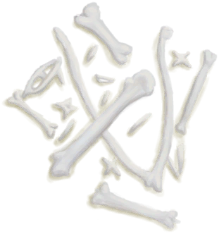

# Seagull Charm  
> A charm holding the spirit of a seagull. Should help me with fishing.  <b>MUST BE EQUIPPED ON EQUIPMENT SLOT TO WORK</b>  
  
<table class="table table-bordered" data-toggle="table"  data-show-header="false"><thead style="display:none"><tr ><th  style="width:50%;text-align:left;vertical-align:top;"  >title</th><th  style="width:50%;text-align:left;vertical-align:top;"  ></th></tr></thead><tr ><td  style="width:50%;text-align:left;vertical-align:top;"  >**Weight：**100  **装备时减重：**-100  **Tag：**	[“Neck”](tag_Neck.md), [“Legs (Inner)”](tag_Clothing.md), [“Pretty”](tag_Pretty.md)  **Equipped Cards：**[“Neck”](eTag_Neck.md)  **Usage：**2688  ** Effect: ** [

[Morale](Morale.md)](Morale.md)addition<b>+0.25</b> [

[Mental Structure](Structure.md)](Structure.md)addition<b>+0.1</b> [

[Spear Fishing(Skill)](Skill_SpearFishing.md)](Skill_SpearFishing.md)<b>+5</b></td><td  style="width:50%;text-align:left;vertical-align:top;"  >

<a href="SeagullCharm.md" style="color:black">Seagull Charm</a>

</td></tr></tbody></table>  
  
## Got From  

Craft BluePrint

[Seagull Charm(BluePrint)](Bp_SeagullCharm.md)

  
  
## Durability   

<table style="margin-bottom:0px;"><tr><td style="width:30%;text-align:left; background-color:#FEFEFE;font-size:1.3em;font-weight:bold;">Usage</td><td style="font-size:1em;background-color:#FEFEFE">Starting：2688 , Max：2688 -</td></tr><tr style="background-color:#FFFFFF"><td colspan=2>** On Zero： ** Self: →Dismiss [

[Fiber Cord](CordFiber.md)](CordFiber.md)(<b>+2</b>), [

[Bird Bones](BonesBird.md)](BonesBird.md)(<b>+1</b>), [

[Feathers](Feathers.md)](Feathers.md)(<b>+1～+2</b>)</td></tr></table>
  

