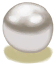

# Sea Hound Carcass  
> "The carcass of a large sea beast  
  
<table class="table table-bordered" data-toggle="table"  data-show-header="false"><thead style="display:none"><tr ><th  style="width:50%;text-align:left;vertical-align:top;"  >title</th><th  style="width:50%;text-align:left;vertical-align:top;"  ></th></tr></thead><tr ><td  style="width:50%;text-align:left;vertical-align:top;"  >**Weight：**2000  **Tag：**	[“Large”](tag_Large.md), [“Feed”](tag_Meat.md)</td><td  style="width:50%;text-align:left;vertical-align:top;"  >

<a href="SeahoundCarcass.md" style="color:black">Sea Hound Carcass</a>

</td></tr></tbody></table>  
  
## Got From  

Continue

["I got it(Event)](Event_SeahoundFightMixedSuccess.md)

Continue

[The Seahound is down!(Event)](Event_SeahoundFightSuccess.md)

  
  
## Drag With  

<table style="margin-bottom:0px;"><tr><td style="width:40%;text-align:left; background-color:#FEFEFE"><b>With：</b>[

[Obsidian Knife](KnifeObsidian.md)](KnifeObsidian.md)</td><td style="width:40%;font-size:1em;font-weight:bold;background-color:#FEFEFE">Cut Meat (1h) [“HandAction(Group)”](HandAction.md), [“CraftAction(Group)”](CraftAction.md)</td></tr><tr><td colspan="2"><b>Require：</b>[

[Light](Light.md)](Light.md): <b>10-100</b></td></tr><tr style="background-color:#FFFFFF"><td style=""><b>Receiving：</b>Usage  <b>-2</b></td><td style=""><b>Self：</b>→Dismiss</td></tr><tr><td colspan="2"><b>StatChange：</b>[

[Filth](Filth.md)](Filth.md)<b>+10</b></td></tr><tr><td colspan="2">

<table style="margin-bottom:3px;"><tr><td rowspan=2 style="text-align:center" width="80px">
Base Weight

2
</td><td style="font-size:0.6em;line-height:0.6em;font-weight:bold">Seahound Meat</td></tr><tr><td>[

[Seahound Meat](Seahoundmeat.md)](Seahoundmeat.md)(<b>+8～+12</b>), [

[Fish Scraps](FishScraps.md)](FishScraps.md)(<b>+4～+12</b>), [

[Fat](Fat.md)](Fat.md)(<b>+2</b>)</td></tr></table>

<table style="margin-bottom:3px;"><tr><td rowspan=2 style="text-align:center" width="80px">
Base Weight

1
</td><td style="font-size:0.6em;line-height:0.6em;font-weight:bold">Metal</td></tr><tr><td>[

[Seahound Meat](Seahoundmeat.md)](Seahoundmeat.md)(<b>+8～+12</b>), [

[Fish Scraps](FishScraps.md)](FishScraps.md)(<b>+4～+12</b>), [

[Fat](Fat.md)](Fat.md)(<b>+2</b>), [

[Metal Scrap](MetalScrap.md)](MetalScrap.md)(<b>+1</b>)</td></tr></table>

<table style="margin-bottom:3px;"><tr><td rowspan=2 style="text-align:center" width="80px">
Base Weight

1
</td><td style="font-size:0.6em;line-height:0.6em;font-weight:bold">Pearl</td></tr><tr><td>[

[Seahound Meat](Seahoundmeat.md)](Seahoundmeat.md)(<b>+8～+12</b>), [

[Fish Scraps](FishScraps.md)](FishScraps.md)(<b>+4～+12</b>), [

[Fat](Fat.md)](Fat.md)(<b>+2</b>), [

[Pearl](Pearl.md)](Pearl.md)(<b>+1</b>)</td></tr></table>

</td></tr></table>
  

<table style="margin-bottom:0px;"><tr><td style="width:40%;text-align:left; background-color:#FEFEFE"><b>With：</b>[“Cutter”](tag_Cutter.md)</td><td style="width:40%;font-size:1em;font-weight:bold;background-color:#FEFEFE">Cut Meat (1h30m) [“HandAction(Group)”](HandAction.md), [“CraftAction(Group)”](CraftAction.md)</td></tr><tr><td colspan="2"><b>Require：</b>[

[Light](Light.md)](Light.md): <b>10-100</b></td></tr><tr style="background-color:#FFFFFF"><td style=""><b>Receiving：</b>Usage  <b>-2(-1.33%)</b></td><td style=""><b>Self：</b>→Dismiss</td></tr><tr><td colspan="2"><b>StatChange：</b>[

[Filth](Filth.md)](Filth.md)<b>+10</b></td></tr><tr><td colspan="2">

<table style="margin-bottom:3px;"><tr><td rowspan=2 style="text-align:center" width="80px">
Base Weight

2
</td><td style="font-size:0.6em;line-height:0.6em;font-weight:bold">Seahound Meat</td></tr><tr><td>[

[Seahound Meat](Seahoundmeat.md)](Seahoundmeat.md)(<b>+8～+12</b>), [

[Fish Scraps](FishScraps.md)](FishScraps.md)(<b>+4～+12</b>), [

[Fat](Fat.md)](Fat.md)(<b>+2</b>)</td></tr></table>

<table style="margin-bottom:3px;"><tr><td rowspan=2 style="text-align:center" width="80px">
Base Weight

1
</td><td style="font-size:0.6em;line-height:0.6em;font-weight:bold">Metal</td></tr><tr><td>[

[Seahound Meat](Seahoundmeat.md)](Seahoundmeat.md)(<b>+8～+12</b>), [

[Fish Scraps](FishScraps.md)](FishScraps.md)(<b>+4～+12</b>), [

[Fat](Fat.md)](Fat.md)(<b>+2</b>), [

[Metal Scrap](MetalScrap.md)](MetalScrap.md)(<b>+1</b>)</td></tr></table>

<table style="margin-bottom:3px;"><tr><td rowspan=2 style="text-align:center" width="80px">
Base Weight

1
</td><td style="font-size:0.6em;line-height:0.6em;font-weight:bold">Pearl</td></tr><tr><td>[

[Seahound Meat](Seahoundmeat.md)](Seahoundmeat.md)(<b>+8～+12</b>), [

[Fish Scraps](FishScraps.md)](FishScraps.md)(<b>+4～+12</b>), [

[Fat](Fat.md)](Fat.md)(<b>+2</b>), [

[Pearl](Pearl.md)](Pearl.md)(<b>+1</b>)</td></tr></table>

</td></tr></table>
  
  
## Drag To  

[Dog Friend](DogFriend.md)

  
  
## Durability   

<table style="margin-bottom:0px;"><tr><td style="width:30%;text-align:left; background-color:#FEFEFE;font-size:1.3em;font-weight:bold;">Spoilage</td><td style="font-size:1em;background-color:#FEFEFE">Starting：192 -1/TP , Duration ：2d</td></tr><tr style="background-color:#FFFFFF"><td colspan=2>** On Zero： ** Self: → [

[Rotten Remains](RottenRemains.md)](RottenRemains.md)</td></tr></table>
  

