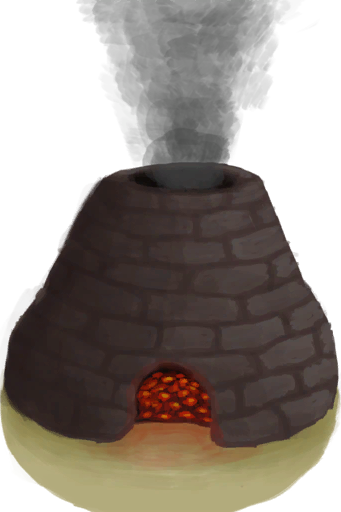

# Pretty Seashells  
> "A nice collection of seashells  
  
<table class="table table-bordered" data-toggle="table"  data-show-header="false"><thead style="display:none"><tr ><th  style="width:50%;text-align:left;vertical-align:top;"  >title</th><th  style="width:50%;text-align:left;vertical-align:top;"  ></th></tr></thead><tr ><td  style="width:50%;text-align:left;vertical-align:top;"  >**Weight：**25  **Tag：**	[“Seashell”](tag_Seashell.md), [“Pretty”](tag_Pretty.md)</td><td  style="width:50%;text-align:left;vertical-align:top;"  >

<a href="SeashellsPretty.md" style="color:black">Pretty Seashells</a>

"There are plenty of beautiful seashells in the <b>Beaches</b> of the island.  Their colourful nature makes them ideal for making <b>Necklaces</td></tr></tbody></table>  
  
## Got From  

Break

[Seashell Necklace](SeashellNecklace.md)

Transform

[Seashell Necklace](SeashellNecklace.md)

Explore

[Atoll](Atoll.md)

Go for a Walk

[Bay](Bay.md)

Go for a Walk

[Beach](Beach.md)

Explore

[Bird Rock](BirdRock.md)

Explore

[Secret Cove](Cove.md)

Explore

[Desolate Beach](DesolateBeach.md)

Explore

[Rocks](Rocks.md)

  
  
## Use In BluePrint  

<a href="Bp_FishBait.md" style="color:black">Fish Bait</a>

<a href="Bp_SeashellNecklace.md" style="color:black">Seashell Necklace</a>

  
  
  
## Use To Transform  
<table class="table table-bordered" data-toggle="table"  ><thead style=""><tr ><th  style="text-align:left;vertical-align:top;"  >Transform to</th><th  style="text-align:left;vertical-align:top;"  >Container</th></tr></thead><tr ><td  style="text-align:left;vertical-align:top;"  >[

[Quicklime](Quicklime.md)](Quicklime.md)</td><td  style="text-align:left;vertical-align:top;"  >[

[Kiln](Kiln.md)](Kiln.md)</td></tr><tr ><td  style="text-align:left;vertical-align:top;"  >[

[Quicklime](Quicklime.md)](Quicklime.md)</td><td  style="text-align:left;vertical-align:top;"  >[

[Advanced Kiln](KilnAdvanced.md)](KilnAdvanced.md)</td></tr></tbody></table>  
  

