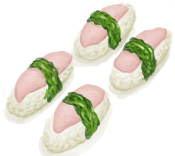
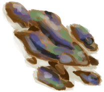

# Seaweed  
> Edible.  
  
<table class="table table-bordered" data-toggle="table"  data-show-header="false"><thead style="display:none"><tr ><th  style="width:50%;text-align:left;vertical-align:top;"  >title</th><th  style="width:50%;text-align:left;vertical-align:top;"  ></th></tr></thead><tr ><td  style="width:50%;text-align:left;vertical-align:top;"  >**Weight：**50  **Tag：**	[“Cookable”](tag_Cookable.md), [“Feed Herbivore”](tag_FeedHerb.md), [“Feed”](tag_Feed.md), [“Medium Sugars”](tag_SugarsMedium.md)</td><td  style="width:50%;text-align:left;vertical-align:top;"  >

<a href="Seaweed.md" style="color:black">Seaweed</a>

</td></tr></tbody></table>  
  
## Got From  

Forage

[Tide Pool(Rocks)](TidePool.md)

Dive

[Sea(Bay)](Sea_Bay.md)

Dive

[Sea(Desolate Beach)](Sea_DesolateBeach.md)

Dive

[Sea(Mangrove Forest)](Sea_Mangroves.md)

  
  
## Action  

<table><tr><td rowspan="2" style="width:200px;text-align:center;font-size:1.3em;font-weight:bold">

Eat

15m

</td><td>[“VegetarianAction(Group)”](VegetarianAction.md), [“EatingAction(Group)”](EatingAction.md)</td></tr><tr><td><b>Self：</b>→Dismiss</td></tr><tr><td colspan="2"><b>StatChange：</b>[

[Satiation](Satiation.md)](Satiation.md)<b>+15</b>, [

[Stomach](Stomach.md)](Stomach.md)<b>+2</b>, [

[Hydration ](Hydration.md)](Hydration.md)<b>+5</b>, [

[Saturation Vegetables](SaturationVegetables.md)](SaturationVegetables.md)<b>+30</b></td></tr></table>
  
  
  
## Drag To  

[Mermaid nest](MermaidNest.md)

[Boar Feeder](BoarFeeder.md)

[Boar Feeder(Empty)](BoarFeederEmpty.md)

[Compost Bin](CompostBin.md)

[Goat Feeder](GoatFeeder.md)

[Goat Feeder(Empty)](GoatFeederEmpty.md)

[Partridge Feeder](PartridgeFeeder.md)

[Partridge Feeder(Empty)](PartridgeFeederEmpty.md)

[Trapped Macaque](CageTrapMacaque.md)

[Sow](BoarEnclosureFemale.md)

[Boar](BoarEnclosureMale.md)

[Piglet](BoarEnclosurePiglet.md)

[Sow](BoarTiedFemale.md)

[Boar](BoarTiedMale.md)

[Piglet](BoarTiedPiglet.md)

[Goat](GoatEnclosureFemale.md)

[Juvenile Goat](GoatEnclosureKid.md)

[Lactating Goat](GoatEnclosureLactating.md)

[Male Goat](GoatEnclosureMale.md)

[Goat](GoatTiedFemale.md)

[Lactating Goat](GoatTiedFemaleLactating.md)

[Juvenile Goat](GoatTiedKid.md)

[Male Goat](GoatTiedMale.md)

[Macaque Friend](MacaqueFriend.md)

[Wounded Macaque](MacaqueWounded.md)

[Chick](PartridgeChick.md)

[Partridge](PartridgeFemaleEnclosure.md)

[Partridge](PartridgeFemaleLive.md)

[Male Partridge](PartridgeMaleEnclosure.md)

[Male Partridge](PartridgeMaleLive.md)

  
  
## Use In BluePrint  

<a href="Bp_MermaidNest.md" style="color:black">Mermaid Nest</a>

<a href="Bp_BoneBroth.md" style="color:black">Bone Broth</a>

<a href="Bp_ChickenSandwich.md" style="color:black">Chicken Sandwich</a>

<a href="Bp_CoconutFish.md" style="color:black">Coconut Fish</a>

<a href="Bp_FishOmelette.md" style="color:black">Fish Omelette</a>

<a href="Bp_FishTaco.md" style="color:black">Fish Taco</a>

<a href="Bp_FriedPuffballs.md" style="color:black">Fried Puffballs</a>

<a href="Bp_GoatStew.md" style="color:black">Goat Stew</a>

<a href="Bp_IslandChicken.md" style="color:black">Island Chicken</a>

<a href="Bp_JungleSalad.md" style="color:black">Jungle Salad</a>

<a href="Bp_SeafoodCup.md" style="color:black">Seafood Cup</a>

<a href="Bp_Sushi.md" style="color:black">Sushi</a>

  
  
  
## Durability   

<table style="margin-bottom:0px;"><tr><td style="width:30%;text-align:left; background-color:#FEFEFE;font-size:1.3em;font-weight:bold;">Spoilage</td><td style="font-size:1em;background-color:#FEFEFE">Starting：192 -1/TP , Duration ：2d</td></tr><tr style="background-color:#FFFFFF"><td colspan=2>** On Zero： ** Self: → [

[Rotten Remains](RottenRemains.md)](RottenRemains.md)</td></tr></table>
  

