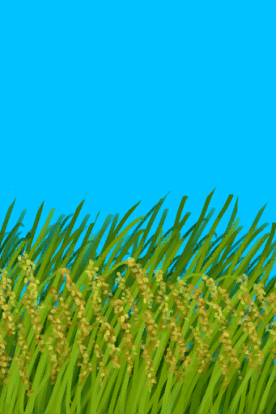
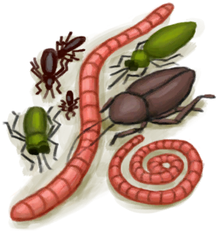

# Secret Valley  
> "A lush green valley  
  

<a href="SecretValley.md" style="color:black">Secret Valley</a>

<a href="DeepJungle.md" style="color:black">Deep Jungle</a>

  
  
<table class="table table-bordered" data-toggle="table"  data-show-header="false"><thead style="display:none"><tr ><th  style="width:50%;text-align:left;vertical-align:top;"  >title</th><th  style="width:50%;text-align:left;vertical-align:top;"  data-sortable="true"  ></th></tr></thead><tr ><td  style="width:50%;text-align:left;vertical-align:top;"  >** Unique On Board **  **Environment：**[Secret Valley(Environment)](Env_SecretValley.md)  **Tag：**	[“Trees for Snare Traps”](tag_SnareCompatible.md)  ** EnvironmentEffect: ** [

[Bug Population](BugPopulation.md)](BugPopulation.md)<b>+1</b> [

[Light](Light.md)](Light.md)<b>+10</b>  ** Improvements: ** [Path](Imp_Path.md) , [Irrigation System](Imp_Irrigation.md)</td><td  style="width:50%;text-align:left;vertical-align:top;"  ></td></tr></tbody></table>  
  
## Exploration  
<table class="table table-bordered" data-toggle="table"  ><thead style=""><tr ><th  style="text-align:left;vertical-align:top;"  >Progress</th><th  style="text-align:left;vertical-align:top;"  >Target</th></tr></thead><tr ><td  style="text-align:left;vertical-align:top;"  >25%</td><td  style="text-align:left;vertical-align:top;"  >[To Deep Jungle(Secret Valley)](Path_ValleyToDeepJungle.md)</td></tr><tr ><td  style="text-align:left;vertical-align:top;"  >100%</td><td  style="text-align:left;vertical-align:top;"  >[Area Explored(Event)(Secret Valley)](Event_SecretValleyExplored.md)</td></tr></tbody></table>  
  
## Action  

<table><tr><td rowspan="2" style="width:200px;text-align:center;font-size:1.3em;font-weight:bold">

Explore

15m

</td><td>[“LegAction(Group)”](LegAction.md)</td></tr><tr><td></td></tr><tr><td colspan="2"><b>Require：</b>[

[Light](Light.md)](Light.md): <b>10-100</b></td></tr><tr><td colspan="2"><b>StatChange：</b>[

[Foot Damage](FootDamage.md)](FootDamage.md)<b>+20</b>, [

[Stamina](Stamina.md)](Stamina.md)<b>-4</b>, [

[Stress](Stress.md)](Stress.md)<b>-10</b>, [

[Filth](Filth.md)](Filth.md)<b>+1</b>, [TV Grasslands - Explore](TV_GrasslandsExplore.md)<b>+1</b></td></tr><tr><td colspan="2">

<table style="margin-bottom:3px;"><tr><td rowspan=2 style="text-align:center" width="80px">
Base Weight

400
</td><td style="font-size:0.6em;line-height:0.6em;font-weight:bold">Dry Leaves</td></tr><tr><td>[

[Dry Leaves](LeavesDry.md)](LeavesDry.md)(<b>+1～+2</b>)</td></tr></table>

<table style="margin-bottom:3px;"><tr><td rowspan=2 style="text-align:center" width="80px">
Base Weight

400
</td><td style="font-size:0.6em;line-height:0.6em;font-weight:bold">Sticks</td></tr><tr><td>[

[Sticks](Sticks.md)](Sticks.md)(<b>+1～+2</b>)</td></tr></table>

<table style="margin-bottom:3px;"><tr><td rowspan=2 style="text-align:center" width="80px">
Base Weight

2000
</td><td style="font-size:0.6em;line-height:0.6em;font-weight:bold">Stone First❗1 limit</td></tr><tr><td>[

[Stone](Stone.md)](Stone.md)(<b>+1</b>)</td></tr></table>

<table style="margin-bottom:3px;"><tr><td rowspan=2 style="text-align:center" width="80px">
Base Weight

400
</td><td style="font-size:0.6em;line-height:0.6em;font-weight:bold">Stones❗8 limit</td></tr><tr><td>[

[Stone](Stone.md)](Stone.md)(<b>+1</b>)</td></tr></table>

<table style="margin-bottom:3px;"><tr><td rowspan=2 style="text-align:center" width="80px">
Base Weight

0
</td><td style="font-size:0.6em;line-height:0.6em;font-weight:bold">Supply Crate</td></tr><tr><td>[

[Supply Capsule](TV_SupplyCapsule.md)](TV_SupplyCapsule.md)(<b>+1</b>)[

[TV Grasslands](TV_Grasslands.md)](TV_Grasslands.md)<b>-1</b></td></tr><tr><td colspan=2><li>[

[TV Grasslands](TV_Grasslands.md)](TV_Grasslands.md) in <b>1</b>, weight<b>+100</b></li><li>[TV Grasslands - Explore](TV_GrasslandsExplore.md) in <b>0～9</b>, weight<b>-999</b></li></td></tr></table>

<table style="margin-bottom:3px;"><tr><td rowspan=2 style="text-align:center" width="80px">
Base Weight

300
</td><td style="font-size:0.6em;line-height:0.6em;font-weight:bold">Heavy Stone❗4 limit</td></tr><tr><td>[

[Heavy Stone](StoneHeavy.md)](StoneHeavy.md)(<b>+1</b>)</td></tr></table>

<table style="margin-bottom:3px;"><tr><td rowspan=2 style="text-align:center" width="80px">
Base Weight

0
</td><td style="font-size:0.6em;line-height:0.6em;font-weight:bold">Partridge Spotted</td></tr><tr><td>[

[A partridge!(Event)](Event_PartridgeFight.md)](Event_PartridgeFight.md)(<b>+1</b>)</td></tr><tr><td colspan=2><li>[Population Partridges](Pop_Partridge.md) in <b>1000～30000</b>, weight <b>+100～+200</b></li><li>[

[Eyesight](Myopia.md)](Myopia.md) in <b>1～3</b>, weight <b>-100～-200</b></li></td></tr></table>

<table style="margin-bottom:3px;"><tr><td rowspan=2 style="text-align:center" width="80px">
Base Weight

300
</td><td style="font-size:0.6em;line-height:0.6em;font-weight:bold">Wood</td></tr><tr><td>[

[Wood](Wood.md)](Wood.md)(<b>+1</b>)</td></tr></table>

<table style="margin-bottom:3px;"><tr><td rowspan=2 style="text-align:center" width="80px">
Base Weight

100000
</td><td style="font-size:0.6em;line-height:0.6em;font-weight:bold">Small Tree</td></tr><tr><td>[

[Small Tree](SmallTree.md)](SmallTree.md)(<b>+1</b>)</td></tr></table>

<table style="margin-bottom:3px;"><tr><td rowspan=2 style="text-align:center" width="80px">
Base Weight

0
</td><td style="font-size:0.6em;line-height:0.6em;font-weight:bold">Lemon Grass</td></tr><tr><td>[

[Lemongrass](Lemongrass.md)](Lemongrass.md)(<b>+1</b>)[Highlands Lemon Grass](LemonGrass_HighlandsPop.md)<b>-1000</b></td></tr><tr><td colspan=2><li>[

[Herbology(Skill)](Skill_Herbology.md)](Skill_Herbology.md) in <b>0～150(0%～100%)</b>, weight<b>-400～+0</b></li><li>[Highlands Lemon Grass](LemonGrass_HighlandsPop.md) in <b>1000～20000</b>, weight<b>+100～+600</b></li><li>[

[Eyesight](Myopia.md)](Myopia.md) in <b>1～3</b>, weight <b>-100～-200</b></li></td></tr></table>

<table style="margin-bottom:3px;"><tr><td rowspan=2 style="text-align:center" width="80px">
Base Weight

0
</td><td style="font-size:0.6em;line-height:0.6em;font-weight:bold">Rice</td></tr><tr><td>[

[Rice](RicePlant.md)](RicePlant.md)(<b>+1</b>)[Valley Rice](Rice_ValleyPop.md)<b>-1000</b></td></tr><tr><td colspan=2><li>[

[Herbology(Skill)](Skill_Herbology.md)](Skill_Herbology.md) in <b>0～150(0%～100%)</b>, weight<b>-400～+0</b></li><li>[Valley Rice](Rice_ValleyPop.md) in <b>1000～10000</b>, weight<b>+100～+500</b></li><li>[

[Eyesight](Myopia.md)](Myopia.md) in <b>1～3</b>, weight <b>-100～-200</b></li></td></tr></table>

<table style="margin-bottom:3px;"><tr><td rowspan=2 style="text-align:center" width="80px">
Base Weight

0
</td><td style="font-size:0.6em;line-height:0.6em;font-weight:bold">Drone Encounter</td></tr><tr><td>[

[Attack Drone!(Event)](Event_DroneFight.md)](Event_DroneFight.md)(<b>+1</b>)</td></tr><tr><td colspan=2><li>[Island Drones](Pop_Drone.md) in <b>1000～4000</b>, weight<b>+10～+50</b></li><li>[

[Eyesight](Myopia.md)](Myopia.md) in <b>1～3</b>, weight<b>+0</b></li><li>[“Fight Event”](tag_FightEvent.md) On *Hand/Board*，Weight<b>-999999</b>(Stackable),</li></td></tr></table>
<button class="btn btn-secondary btn-sm" style="" data-toggle="modal" onclick="setCollectionDataBase64('eyJ0aXRsZSI6IlNpbXVsYXRvcjogRXhwbG9yZSAoU2VjcmV0IFZhbGxleSkiLCJjb2xsZWN0aW9ucyI6W3siZHJvcCI6IjxkaXYgc3R5bGU9XCJ3aWR0aDoyNXB4O2Rpc3BsYXk6aW5saW5lLWJsb2NrO3RleHQtYWxpZ246Y2VudGVyXCI+PGltZyBkZWNvZGluZz1cImFzeW5jXCIgc3JjPVwiU3ByaXRlL1RpbmRlci5wbmdcIiBocmVmPVwiYS5tZFwiIHN0eWxlPVwibWF4LXdpZHRoOjI1cHg7bWF4LWhlaWdodDoyNXB4O1wiPjwvZGl2PkRyeSBMZWF2ZXMiLCJiYXNlIjo0MDAsImNvbmRpdGlvbiI6W119LHsiZHJvcCI6IjxkaXYgc3R5bGU9XCJ3aWR0aDoyNXB4O2Rpc3BsYXk6aW5saW5lLWJsb2NrO3RleHQtYWxpZ246Y2VudGVyXCI+PGltZyBkZWNvZGluZz1cImFzeW5jXCIgc3JjPVwiU3ByaXRlL0tpbmRsaW5nLnBuZ1wiIGhyZWY9XCJhLm1kXCIgc3R5bGU9XCJtYXgtd2lkdGg6MjVweDttYXgtaGVpZ2h0OjI1cHg7XCI+PC9kaXY+U3RpY2tzIiwiYmFzZSI6NDAwLCJjb25kaXRpb24iOltdfSx7ImRyb3AiOiI8ZGl2IHN0eWxlPVwid2lkdGg6MjVweDtkaXNwbGF5OmlubGluZS1ibG9jazt0ZXh0LWFsaWduOmNlbnRlclwiPjxpbWcgZGVjb2Rpbmc9XCJhc3luY1wiIHNyYz1cIlNwcml0ZS9UVkNyYXRlLnBuZ1wiIGhyZWY9XCJhLm1kXCIgc3R5bGU9XCJtYXgtd2lkdGg6MjVweDttYXgtaGVpZ2h0OjI1cHg7XCI+PC9kaXY+U3VwcGx5IENhcHN1bGUiLCJiYXNlIjowLCJjb25kaXRpb24iOlt7ImtleSI6IlRWX0dyYXNzbGFuZHMiLCJ0aXRsZSI6IlRWIEdyYXNzbGFuZHMiLCJ0eXBlIjoicmFuZ2UiLCJtYXgiOlswLDFdLCJyYW5nZSI6WzEsMV0sIndlaWdodCI6WzEwMCwxMDBdLCJkZWZhdWx0VmFsdWUiOjAsIndoZW5PdXRPZlJhbmdlIjowfSx7ImtleSI6IlRWX0dyYXNzbGFuZHNFeHBsb3JlIiwidGl0bGUiOiJUViBHcmFzc2xhbmRzIC0gRXhwbG9yZSIsInR5cGUiOiJyYW5nZSIsIm1heCI6WzAsMjBdLCJyYW5nZSI6WzAsOV0sIndlaWdodCI6Wy05OTksLTk5OV0sImRlZmF1bHRWYWx1ZSI6MCwid2hlbk91dE9mUmFuZ2UiOjB9XX0seyJkcm9wIjoiPGRpdiBzdHlsZT1cIndpZHRoOjI1cHg7ZGlzcGxheTppbmxpbmUtYmxvY2s7dGV4dC1hbGlnbjpjZW50ZXJcIj48aW1nIGRlY29kaW5nPVwiYXN5bmNcIiBzcmM9XCJTcHJpdGUvUGFydHJpZGdlRXZlbnQucG5nXCIgaHJlZj1cImEubWRcIiBzdHlsZT1cIm1heC13aWR0aDoyNXB4O21heC1oZWlnaHQ6MjVweDtcIj48L2Rpdj5BIHBhcnRyaWRnZSEoRXZlbnQpIiwiYmFzZSI6MCwiY29uZGl0aW9uIjpbeyJrZXkiOiJQb3BfUGFydHJpZGdlIiwidGl0bGUiOiJQb3B1bGF0aW9uIFBhcnRyaWRnZXMiLCJ0eXBlIjoicmFuZ2UiLCJtYXgiOlswLDQwMDAwXSwicmFuZ2UiOlsxMDAwLDMwMDAwXSwid2VpZ2h0IjpbMTAwLDIwMF0sImRlZmF1bHRWYWx1ZSI6NDAwMDAsIndoZW5PdXRPZlJhbmdlIjoxfSx7ImtleSI6Ik15b3BpYSIsInRpdGxlIjoiRXllc2lnaHQiLCJ0eXBlIjoicmFuZ2UiLCJtYXgiOlswLDNdLCJyYW5nZSI6WzEsM10sIndlaWdodCI6Wy0xMDAsLTIwMF0sImRlZmF1bHRWYWx1ZSI6MCwid2hlbk91dE9mUmFuZ2UiOjF9XX0seyJkcm9wIjoiPGRpdiBzdHlsZT1cIndpZHRoOjI1cHg7ZGlzcGxheTppbmxpbmUtYmxvY2s7dGV4dC1hbGlnbjpjZW50ZXJcIj48aW1nIGRlY29kaW5nPVwiYXN5bmNcIiBzcmM9XCJTcHJpdGUvRmlyZXdvb2QucG5nXCIgaHJlZj1cImEubWRcIiBzdHlsZT1cIm1heC13aWR0aDoyNXB4O21heC1oZWlnaHQ6MjVweDtcIj48L2Rpdj5Xb29kIiwiYmFzZSI6MzAwLCJjb25kaXRpb24iOltdfSx7ImRyb3AiOiI8ZGl2IHN0eWxlPVwid2lkdGg6MjVweDtkaXNwbGF5OmlubGluZS1ibG9jazt0ZXh0LWFsaWduOmNlbnRlclwiPjxpbWcgZGVjb2Rpbmc9XCJhc3luY1wiIHNyYz1cIlNwcml0ZS9TbWFsbFRyZWUucG5nXCIgaHJlZj1cImEubWRcIiBzdHlsZT1cIm1heC13aWR0aDoyNXB4O21heC1oZWlnaHQ6MjVweDtcIj48L2Rpdj5TbWFsbCBUcmVlIiwiYmFzZSI6MTAwMDAwLCJjb25kaXRpb24iOltdLCJpc1VuaXF1ZSI6dHJ1ZX0seyJkcm9wIjoiPGRpdiBzdHlsZT1cIndpZHRoOjI1cHg7ZGlzcGxheTppbmxpbmUtYmxvY2s7dGV4dC1hbGlnbjpjZW50ZXJcIj48aW1nIGRlY29kaW5nPVwiYXN5bmNcIiBzcmM9XCJTcHJpdGUvTGVtb25HcmFzcy5wbmdcIiBocmVmPVwiYS5tZFwiIHN0eWxlPVwibWF4LXdpZHRoOjI1cHg7bWF4LWhlaWdodDoyNXB4O1wiPjwvZGl2PkxlbW9uZ3Jhc3MiLCJiYXNlIjowLCJjb25kaXRpb24iOlt7ImtleSI6IlNraWxsX0hlcmJvbG9neSIsInRpdGxlIjoiSGVyYm9sb2d5KFNraWxsKSIsInR5cGUiOiJyYW5nZSIsIm1heCI6WzAsMTUwXSwicmFuZ2UiOlswLDE1MF0sIndlaWdodCI6Wy00MDAsMF0sImRlZmF1bHRWYWx1ZSI6MCwid2hlbk91dE9mUmFuZ2UiOjB9LHsia2V5IjoiTGVtb25HcmFzc19IaWdobGFuZHNQb3AiLCJ0aXRsZSI6IkhpZ2hsYW5kcyBMZW1vbiBHcmFzcyIsInR5cGUiOiJyYW5nZSIsIm1heCI6WzAsMjAwMDBdLCJyYW5nZSI6WzEwMDAsMjAwMDBdLCJ3ZWlnaHQiOlsxMDAsNjAwXSwiZGVmYXVsdFZhbHVlIjoyMDAwMCwid2hlbk91dE9mUmFuZ2UiOjB9LHsia2V5IjoiTXlvcGlhIiwidGl0bGUiOiJFeWVzaWdodCIsInR5cGUiOiJyYW5nZSIsIm1heCI6WzAsM10sInJhbmdlIjpbMSwzXSwid2VpZ2h0IjpbLTEwMCwtMjAwXSwiZGVmYXVsdFZhbHVlIjowLCJ3aGVuT3V0T2ZSYW5nZSI6MX1dfSx7ImRyb3AiOiI8ZGl2IHN0eWxlPVwid2lkdGg6MjVweDtkaXNwbGF5OmlubGluZS1ibG9jazt0ZXh0LWFsaWduOmNlbnRlclwiPjxpbWcgZGVjb2Rpbmc9XCJhc3luY1wiIHNyYz1cIlNwcml0ZS9SaWNlUGxhbnQucG5nXCIgaHJlZj1cImEubWRcIiBzdHlsZT1cIm1heC13aWR0aDoyNXB4O21heC1oZWlnaHQ6MjVweDtcIj48L2Rpdj5SaWNlIiwiYmFzZSI6MCwiY29uZGl0aW9uIjpbeyJrZXkiOiJTa2lsbF9IZXJib2xvZ3kiLCJ0aXRsZSI6IkhlcmJvbG9neShTa2lsbCkiLCJ0eXBlIjoicmFuZ2UiLCJtYXgiOlswLDE1MF0sInJhbmdlIjpbMCwxNTBdLCJ3ZWlnaHQiOlstNDAwLDBdLCJkZWZhdWx0VmFsdWUiOjAsIndoZW5PdXRPZlJhbmdlIjowfSx7ImtleSI6IlJpY2VfVmFsbGV5UG9wIiwidGl0bGUiOiJWYWxsZXkgUmljZSIsInR5cGUiOiJyYW5nZSIsIm1heCI6WzAsMTAwMDBdLCJyYW5nZSI6WzEwMDAsMTAwMDBdLCJ3ZWlnaHQiOlsxMDAsNTAwXSwiZGVmYXVsdFZhbHVlIjoxMDAwMCwid2hlbk91dE9mUmFuZ2UiOjB9LHsia2V5IjoiTXlvcGlhIiwidGl0bGUiOiJFeWVzaWdodCIsInR5cGUiOiJyYW5nZSIsIm1heCI6WzAsM10sInJhbmdlIjpbMSwzXSwid2VpZ2h0IjpbLTEwMCwtMjAwXSwiZGVmYXVsdFZhbHVlIjowLCJ3aGVuT3V0T2ZSYW5nZSI6MX1dfSx7ImRyb3AiOiI8ZGl2IHN0eWxlPVwid2lkdGg6MjVweDtkaXNwbGF5OmlubGluZS1ibG9jazt0ZXh0LWFsaWduOmNlbnRlclwiPjxpbWcgZGVjb2Rpbmc9XCJhc3luY1wiIHNyYz1cIlNwcml0ZS9Ecm9uZS5wbmdcIiBocmVmPVwiYS5tZFwiIHN0eWxlPVwibWF4LXdpZHRoOjI1cHg7bWF4LWhlaWdodDoyNXB4O1wiPjwvZGl2PkF0dGFjayBEcm9uZSEoRXZlbnQpIiwiYmFzZSI6MCwiY29uZGl0aW9uIjpbeyJrZXkiOiJQb3BfRHJvbmUiLCJ0aXRsZSI6IklzbGFuZCBEcm9uZXMiLCJ0eXBlIjoicmFuZ2UiLCJtYXgiOlswLDQwMDBdLCJyYW5nZSI6WzEwMDAsNDAwMF0sIndlaWdodCI6WzEwLDUwXSwiZGVmYXVsdFZhbHVlIjowLCJ3aGVuT3V0T2ZSYW5nZSI6MH0seyJrZXkiOiJNeW9waWEiLCJ0aXRsZSI6IkV5ZXNpZ2h0IiwidHlwZSI6InJhbmdlIiwibWF4IjpbMCwzXSwicmFuZ2UiOlsxLDNdLCJ3ZWlnaHQiOlswLDBdLCJkZWZhdWx0VmFsdWUiOjAsIndoZW5PdXRPZlJhbmdlIjowfSx7ImtleSI6InRhZ19GaWdodEV2ZW50X2Ftb3VudCIsInRpdGxlIjoi4oCcRmlnaHQgRXZlbnTigJ0iLCJ0eXBlIjoicmFuZ2UiLCJyYW5nZSI6WzAsMjBdLCJtYXgiOlswLDIwXSwid2VpZ2h0IjpbMCwtMTk5OTk5ODBdLCJkZWZhdWx0VmFsdWUiOjAsIndoZW5PdXRPZlJhbmdlIjowLCJtYXhTdGFja0dyb3VwIjoiIn1dfSx7ImRyb3AiOiI8ZGl2IHN0eWxlPVwid2lkdGg6MjVweDtkaXNwbGF5OmlubGluZS1ibG9jazt0ZXh0LWFsaWduOmNlbnRlclwiPjxpbWcgZGVjb2Rpbmc9XCJhc3luY1wiIHNyYz1cIlNwcml0ZS9TdG9uZS5wbmdcIiBocmVmPVwiYS5tZFwiIHN0eWxlPVwibWF4LXdpZHRoOjI1cHg7bWF4LWhlaWdodDoyNXB4O1wiPjwvZGl2PlN0b25lIiwiYmFzZSI6MjAwMCwiY29uZGl0aW9uIjpbXSwiaXNMaW1pdCI6dHJ1ZX0seyJkcm9wIjoiPGRpdiBzdHlsZT1cIndpZHRoOjI1cHg7ZGlzcGxheTppbmxpbmUtYmxvY2s7dGV4dC1hbGlnbjpjZW50ZXJcIj48aW1nIGRlY29kaW5nPVwiYXN5bmNcIiBzcmM9XCJTcHJpdGUvU3RvbmUucG5nXCIgaHJlZj1cImEubWRcIiBzdHlsZT1cIm1heC13aWR0aDoyNXB4O21heC1oZWlnaHQ6MjVweDtcIj48L2Rpdj5TdG9uZSIsImJhc2UiOjQwMCwiY29uZGl0aW9uIjpbXSwiaXNMaW1pdCI6dHJ1ZX0seyJkcm9wIjoiPGRpdiBzdHlsZT1cIndpZHRoOjI1cHg7ZGlzcGxheTppbmxpbmUtYmxvY2s7dGV4dC1hbGlnbjpjZW50ZXJcIj48aW1nIGRlY29kaW5nPVwiYXN5bmNcIiBzcmM9XCJTcHJpdGUvU2FuZHN0b25lLnBuZ1wiIGhyZWY9XCJhLm1kXCIgc3R5bGU9XCJtYXgtd2lkdGg6MjVweDttYXgtaGVpZ2h0OjI1cHg7XCI+PC9kaXY+SGVhdnkgU3RvbmUiLCJiYXNlIjozMDAsImNvbmRpdGlvbiI6W10sImlzTGltaXQiOnRydWV9XX0=')" data-target="#modelCollectionSimulator">Simulator</button>
</td></tr></table>
  
  
  
## Drag With  

<table style="margin-bottom:0px;"><tr><td style="width:40%;text-align:left; background-color:#FEFEFE"><b>With：</b>[“Shovel”](tag_Shovel.md)</td><td style="width:40%;font-size:1em;font-weight:bold;background-color:#FEFEFE">Dig Up Soil (30m) [“HandAction(Group)”](HandAction.md)</td></tr><tr><td colspan="2"><b>Require：</b>[

[Light](Light.md)](Light.md): <b>10-100</b>, [

[Stamina](Stamina.md)](Stamina.md): <b>11-32</b></td></tr><tr style="background-color:#FFFFFF"><td style=""><b>Receiving：</b>Usage  <b>-1(-2%)</b></td><td style=""><b>Self：</b></td></tr><tr><td colspan="2"><b>StatChange：</b>[

[Stamina](Stamina.md)](Stamina.md)<b>-4</b>, [

[Hand Damage](HandDamage.md)](HandDamage.md)<b>+20</b></td></tr><tr><td colspan="2">[

[Dirt Pile](DirtPile.md)](DirtPile.md)(<b>+3</b>), [

[Bugs](Bugs.md)](Bugs.md)(<b>+0～+1</b>)</td></tr></table>
  
  

