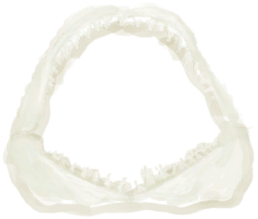
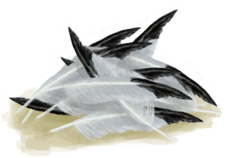

# Shark Headpiece  
> A headpiece containing the spirit of a shark. It will make me stronger in combat.  <b>MUST BE EQUIPPED ON EQUIPMENT SLOT TO WORK</b>  
  
<table class="table table-bordered" data-toggle="table"  data-show-header="false"><thead style="display:none"><tr ><th  style="width:50%;text-align:left;vertical-align:top;"  >title</th><th  style="width:50%;text-align:left;vertical-align:top;"  ></th></tr></thead><tr ><td  style="width:50%;text-align:left;vertical-align:top;"  >**Weight：**100  **装备时减重：**-100  **Tag：**	[“Mask”](tag_Mask.md), [“Legs (Inner)”](tag_Clothing.md)  **Equipped Cards：**[“Mask”](eTag_Mask.md)  **Usage：**2880  ** Effect: ** [

[Spear Fighting(Skill)](Skill_SpearFighting.md)](Skill_SpearFighting.md)<b>+5</b> [

[Spear Fishing(Skill)](Skill_SpearFishing.md)](Skill_SpearFishing.md)<b>+5</b></td><td  style="width:50%;text-align:left;vertical-align:top;"  >

<a href="SharkHeadpiece.md" style="color:black">Shark Headpiece</a>

</td></tr></tbody></table>  
  
## Got From  

Craft BluePrint

[Shark Headpiece(BluePrint)](Bp_SharkHeadpiece.md)

  
  
## Action  

<table><tr><td rowspan="2" style="width:200px;text-align:center;font-size:1.3em;font-weight:bold">

Dismantle

15m

</td><td></td></tr><tr><td><b>Self：</b>→Dismiss</td></tr><tr><td colspan="2">[

[Shark Jaws](SharkJaws.md)](SharkJaws.md)(<b>+1</b>), [

[Feathers](Feathers.md)](Feathers.md)(<b>+3</b>), [

[Fiber Cord](CordFiber.md)](CordFiber.md)(<b>+2</b>)</td></tr></table>
  
  
  
## Drag With  

<table style="margin-bottom:0px;"><tr><td style="width:40%;text-align:left; background-color:#FEFEFE"><b>With：</b>[“Threaded Needle”](tag_ThreadedNeedle.md)</td><td style="width:40%;font-size:1em;font-weight:bold;background-color:#FEFEFE">Repair (30m) [“HandAction(Group)”](HandAction.md), [“CraftAction(Group)”](CraftAction.md)</td></tr><tr style="background-color:#FFFFFF"><td style=""><b>Receiving：</b>

  <b>-1(-33.33%)</b>, Special1  <b>-1(-100%)</b></td><td style=""><b>Self：</b>Usage  <b>+800(27.78%)</b></td></tr></table>
  
  
## Durability   

<table style="margin-bottom:0px;"><tr><td style="width:30%;text-align:left; background-color:#FEFEFE;font-size:1.3em;font-weight:bold;">Usage</td><td style="font-size:1em;background-color:#FEFEFE">Starting：2880 , Max：2880 -</td></tr><tr style="background-color:#FFFFFF"><td colspan=2></td></tr></table>
  

