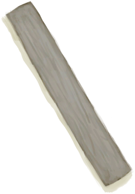

# Shelf  
> "A simple shelf  
  
<table class="table table-bordered" data-toggle="table"  data-show-header="false"><thead style="display:none"><tr ><th  style="width:50%;text-align:left;vertical-align:top;"  >title</th><th  style="width:50%;text-align:left;vertical-align:top;"  ></th></tr></thead><tr ><td  style="width:50%;text-align:left;vertical-align:top;"  >** Can Be Renamed **  ** DoseNotPile **  **Weight：**250  **Tag：**	[“Bag”](tag_Bag.md)  **WeightCapacity：**600  **WeightRedution：**-600</td><td  style="width:50%;text-align:left;vertical-align:top;"  >

<a href="Shelf.md" style="color:black">Shelf</a>

"Easy to build</td></tr></tbody></table>  
  
## Got From  

Craft BluePrint

[Shelf(BluePrint)](Bp_Shelf.md)

  
  
## Action  

<table><tr><td rowspan="2" style="width:200px;text-align:center;font-size:1.3em;font-weight:bold">

Dismantle

30m

</td><td></td></tr><tr><td><b>Self：</b>→Dismiss</td></tr><tr><td colspan="2">[

[Wooden Plank](Plank.md)](Plank.md)(<b>+2</b>)</td></tr></table>
  
  
  
## Passive Effects  
<table class="table table-bordered" data-toggle="table"  ><thead style=""><tr ><th  style="text-align:left;vertical-align:top;"  >Name</th><th  style="text-align:left;vertical-align:top;"  >Condition</th><th  style="text-align:left;vertical-align:top;"  data-sortable="true"  >Change(Each TP)</th><th  style="text-align:left;vertical-align:top;"  >Status</th></tr></thead><tr ><td  style="text-align:left;vertical-align:top;"  >Decoration Comfort</td><td  style="text-align:left;vertical-align:top;"  >** 需要放入：** [“Decoration”](tag_Decoration.md)</td><td  style="text-align:left;vertical-align:top;"  ></td><td  style="text-align:left;vertical-align:top;"  >[

[Comfort](Comfort.md)](Comfort.md)<b>+10</b></td></tr><tr ><td  style="text-align:left;vertical-align:top;"  >Decoration Advanced Comfort</td><td  style="text-align:left;vertical-align:top;"  >** 需要放入：** [“Decoration Advanced”](tag_DecorationAdv.md)</td><td  style="text-align:left;vertical-align:top;"  ></td><td  style="text-align:left;vertical-align:top;"  >[

[Comfort](Comfort.md)](Comfort.md)<b>+15</b></td></tr></tbody></table>  
  

