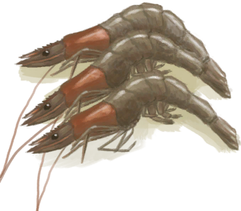

# “ShellfishAction(Group)”  

Eat [

[Bugs](Bugs.md)](Bugs.md)

Eat [

[Conch Meat](ConchMeat.md)](ConchMeat.md)

Eat [

[Cooked Conch Meat](ConchMeatCooked.md)](ConchMeatCooked.md)

Eat [

[Soft Conch Meat](ConchMeatSoft.md)](ConchMeatSoft.md)

Eat [

[Cooked Soft Conch Meat](ConchMeatSoftCooked.md)](ConchMeatSoftCooked.md)

Eat [

[Seafood Cup](SeafoodCup.md)](SeafoodCup.md)

Eat Crab [

[Crab](Crab.md)](Crab.md)

Eat Crab [

[Cooked Crab](CrabCooked.md)](CrabCooked.md)

Eat [

[Oyster Meat](OysterMeat.md)](OysterMeat.md)

Eat [

[Butter Baked Oyster](OysterMeatBaked.md)](OysterMeatBaked.md)

Eat [

[Cooked Oyster](OysterMeatCooked.md)](OysterMeatCooked.md)

Eat [

[Prawns](Prawns.md)](Prawns.md)

Eat [

[Roasted Prawns](PrawnsCooked.md)](PrawnsCooked.md)

Eat [

[Urchin Meat](UrchinMeat.md)](UrchinMeat.md)

Eat [

[Cooked Urchin](UrchinMeatCooked.md)](UrchinMeatCooked.md)

  
  

