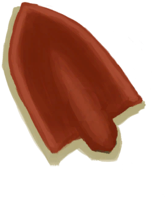
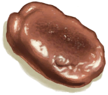
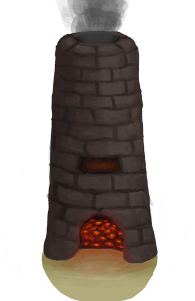
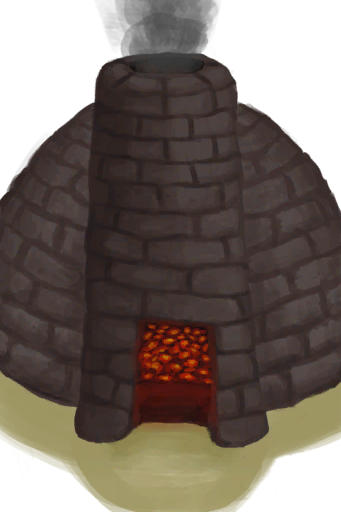

# Shovel Head  
> Can be used to make a shovel.  
  
<table class="table table-bordered" data-toggle="table"  data-show-header="false"><thead style="display:none"><tr ><th  style="width:50%;text-align:left;vertical-align:top;"  >title</th><th  style="width:50%;text-align:left;vertical-align:top;"  ></th></tr></thead><tr ><td  style="width:50%;text-align:left;vertical-align:top;"  >**Weight：**100  **Tag：**	[“Scraper”](tag_Scraper.md), [“Hammer”](tag_Hammer.md), [“Heavy”](tag_Heavy.md), [“Big Copper Object”](tag_CopperBig.md)</td><td  style="width:50%;text-align:left;vertical-align:top;"  >

<a href="ShovelHead.md" style="color:black">Shovel Head</a>

"Useful tools for digging</td></tr></tbody></table>  
  
## Got From  

Shovel Head

[Shovel Mold](MoldShovel.md)

Smelt Shovel Head

[Shovel Mold](MoldShovel.md)

Dismantle

[Copper Shovel](ShovelCopper.md)

Transform

[Copper Shovel](ShovelCopper.md)

  
  
## Drag To  

[Copper Vein(High Chamber)](CopperVein.md)

[Dirt Pile](DirtPile.md)

[Stove(Off)](StoveExtinguished.md)

[Mud Pile](MudPile.md)

[Watering Trough](WateringTrough.md)

[Bone Splinters](BoneSplinters.md)

[Bones](Bones.md)

[Charcoal](Charcoal.md)

[Coconut](Coconut.md)

[Husked Coconut](CoconutHusked.md)

[Perforated Coconut](CoconutPerforated.md)

[Rotten Coconut](CoconutRotten.md)

[Conch](Conch.md)

[Copper Decoration](CopperDecoration_Mold.md)

[Feathers](Feathers.md)

[Dried Chilies](ChiliesDried.md)

[Conch Meat](ConchMeat.md)

[Ginger](Ginger.md)

[Dried Ginger](GingerDried.md)

[Jasmine Flowers](JasmineFlowers.md)

[Kava Root](KavaRoot.md)

[Dried Kava Root](KavaRootDried.md)

[Lemongrass](LemongrassStalks.md)

[Snake Grass](SnakeGrass.md)

[Spider Lily Leaves](SpiderLilyLeaves.md)

[Dried Spider Lily Leaves](SpiderLilyLeavesDried.md)

[Geode](Geode.md)

[Giant Conch](GiantConch.md)

[Burnt Mortar](MortarBurnt.md)

[Mud Brick](MudBrick.md)

[Niter Crystals](NiterCrystals.md)

[Oyster](Oyster.md)

[Burnt Stone](StoneBurnt.md)

[Burnt Heavy Stone](StoneHeavyBurnt.md)

[Tropical Almonds](TropicalAlmonds.md)

[Urchin](Urchin.md)

[Brimstone Vent(Volcano)](VentBrimstone.md)

[Weston](Weston.md)

[Narrow Passage(High Chamber)](CrystalChamberEntranceClosed.md)

[Narrow Passage(Damp Chamber)](DarkCaveCaveEntranceClosed.md)

[Narrow Passage(High Chamber)](DarkChamberCaveEntranceClosed.md)

[Narrow Passage(High Chamber)](FloodedChamberEntranceClosed.md)

[Narrow Passage(Tunnel)](HighChamberEntranceClosed.md)

[Water Filter](WaterFilter.md)

  
  
## Use In BluePrint  

<a href="Bp_CopperShovel.md" style="color:black">Copper Shovel</a>

  
  
  
## Use To Transform  
<table class="table table-bordered" data-toggle="table"  ><thead style=""><tr ><th  style="text-align:left;vertical-align:top;"  >Transform to</th><th  style="text-align:left;vertical-align:top;"  >Container</th></tr></thead><tr ><td  style="text-align:left;vertical-align:top;"  >[

[Copper](Copper.md)](Copper.md)</td><td  style="text-align:left;vertical-align:top;"  >[

[Forge](Forge.md)](Forge.md)</td></tr><tr ><td  style="text-align:left;vertical-align:top;"  >[

[Copper](Copper.md)](Copper.md)</td><td  style="text-align:left;vertical-align:top;"  >[

[Advanced Kiln](KilnAdvanced.md)](KilnAdvanced.md)</td></tr></tbody></table>  
  

