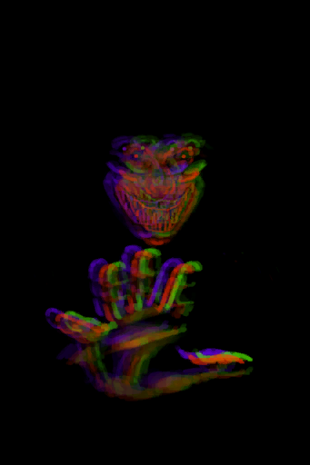

# Archery(Skill)  
> Shows how good you are with bows and arrows. Increases your success chances when hunting with this weapon.  
> "Archery is the skill required for using <b>Bows and Arrows</b> successfully. Hunting with ranged weapons like this is <b>safer</b> than going with a Spear but it does require a bit more skill to make it effective. In addition to this  
  

<b>Base Value: </b> 0 
  

<b>Value Range: </b> 0 ~ 150 
  

<b>Base Rate: </b> - 
  

<b>Staleness: </b>Staleness multiplier 80% in 3h(stack:2) 
  
## Change By  
<table class="table table-bordered" data-toggle="table"  ><thead style=""><tr ><th  style="text-align:left;vertical-align:top;"  >From</th><th  style="text-align:left;vertical-align:top;"  >Operation</th><th  style="text-align:left;vertical-align:top;"  data-sortable="true"  >Value</th></tr></thead><tr ><td  style="text-align:left;vertical-align:top;"  >[

[I see a Boar!(Event)](Event_BoarFight.md)](Event_BoarFight.md)</td><td  style="text-align:left;vertical-align:top;"  >Attack with Bow!</td><td  style="text-align:left;vertical-align:top;"  >1</td></tr><tr ><td  style="text-align:left;vertical-align:top;"  >[

[A wild Boar!(Event)](Event_BoarFightRaid.md)](Event_BoarFightRaid.md)</td><td  style="text-align:left;vertical-align:top;"  >Attack with Bow!</td><td  style="text-align:left;vertical-align:top;"  >1</td></tr><tr ><td  style="text-align:left;vertical-align:top;"  >[

[Spitting Cobra!(Event)](Event_CobraFight.md)](Event_CobraFight.md)</td><td  style="text-align:left;vertical-align:top;"  >Attack with Bow!</td><td  style="text-align:left;vertical-align:top;"  >1</td></tr><tr ><td  style="text-align:left;vertical-align:top;"  >[

[Attack Drone!(Event)](Event_DroneFight.md)](Event_DroneFight.md)</td><td  style="text-align:left;vertical-align:top;"  >Attack with Bow!</td><td  style="text-align:left;vertical-align:top;"  >1</td></tr><tr ><td  style="text-align:left;vertical-align:top;"  >[

[The Enemy is here!(Event)](Event_EnemyFight.md)](Event_EnemyFight.md)</td><td  style="text-align:left;vertical-align:top;"  >Attack with Bow!</td><td  style="text-align:left;vertical-align:top;"  >1</td></tr><tr ><td  style="text-align:left;vertical-align:top;"  >[

[A Goat!(Event)](Event_GoatFight.md)](Event_GoatFight.md)</td><td  style="text-align:left;vertical-align:top;"  >Attack with Bow</td><td  style="text-align:left;vertical-align:top;"  >1</td></tr><tr ><td  style="text-align:left;vertical-align:top;"  >[

[The Hunter is here(Event)](Event_HunterFight.md)](Event_HunterFight.md)</td><td  style="text-align:left;vertical-align:top;"  >Attack with Bow!</td><td  style="text-align:left;vertical-align:top;"  >1</td></tr><tr ><td  style="text-align:left;vertical-align:top;"  >[

[The Macaques attack!(Event)](Event_MacaqueDenFight.md)](Event_MacaqueDenFight.md)</td><td  style="text-align:left;vertical-align:top;"  >Attack with Bow!</td><td  style="text-align:left;vertical-align:top;"  >1</td></tr><tr ><td  style="text-align:left;vertical-align:top;"  >[

[A Macaque!(Event)](Event_MacaqueFight.md)](Event_MacaqueFight.md)</td><td  style="text-align:left;vertical-align:top;"  >Attack with Bow!</td><td  style="text-align:left;vertical-align:top;"  >1</td></tr><tr ><td  style="text-align:left;vertical-align:top;"  >[

[A Macaque!(Event)](Event_MacaqueFightRaid.md)](Event_MacaqueFightRaid.md)</td><td  style="text-align:left;vertical-align:top;"  >Attack with Bow!</td><td  style="text-align:left;vertical-align:top;"  >1</td></tr><tr ><td  style="text-align:left;vertical-align:top;"  >[

[A Macaque!(Event)](Event_MacaqueUndeadFight.md)](Event_MacaqueUndeadFight.md)(未实装)</td><td  style="text-align:left;vertical-align:top;"  >Attack with Bow!</td><td  style="text-align:left;vertical-align:top;"  >1</td></tr><tr ><td  style="text-align:left;vertical-align:top;"  >[

[A Monitor Lizard!(Event)(Cave)](Event_MonitorFight.md)](Event_MonitorFight.md)</td><td  style="text-align:left;vertical-align:top;"  >Attack with Bow!</td><td  style="text-align:left;vertical-align:top;"  >1</td></tr><tr ><td  style="text-align:left;vertical-align:top;"  >[

[A partridge!(Event)](Event_PartridgeFight.md)](Event_PartridgeFight.md)</td><td  style="text-align:left;vertical-align:top;"  >Attack with Bow</td><td  style="text-align:left;vertical-align:top;"  >1</td></tr><tr ><td  style="text-align:left;vertical-align:top;"  >[

[A seagull!(Event)](Event_SeagullFight.md)](Event_SeagullFight.md)</td><td  style="text-align:left;vertical-align:top;"  >Attack with Bow</td><td  style="text-align:left;vertical-align:top;"  >1</td></tr><tr ><td  style="text-align:left;vertical-align:top;"  >[

[A seagull!(Event)](Event_SeagullRaid.md)](Event_SeagullRaid.md)</td><td  style="text-align:left;vertical-align:top;"  >Attack with Bow</td><td  style="text-align:left;vertical-align:top;"  >1</td></tr><tr ><td  style="text-align:left;vertical-align:top;"  >[

[A seagull!(Event)](Event_SeagullRaidCrop.md)](Event_SeagullRaidCrop.md)(未实装)</td><td  style="text-align:left;vertical-align:top;"  >Attack with Bow</td><td  style="text-align:left;vertical-align:top;"  >1</td></tr><tr ><td  style="text-align:left;vertical-align:top;"  >[

[A Seahound!(Event)](Event_SeahoundFight.md)](Event_SeahoundFight.md)</td><td  style="text-align:left;vertical-align:top;"  >Attack with Bow!</td><td  style="text-align:left;vertical-align:top;"  >1</td></tr><tr ><td  style="text-align:left;vertical-align:top;"  >[

[Bat Colony(Bat Cave)](BatColony.md)](BatColony.md)</td><td  style="text-align:left;vertical-align:top;"  >Attack with Bow!</td><td  style="text-align:left;vertical-align:top;"  >1</td></tr><tr ><td  style="text-align:left;vertical-align:top;"  >[

[Rustic Bow](BowRustic.md)](BowRustic.md)</td><td  style="text-align:left;vertical-align:top;"  >Train</td><td  style="text-align:left;vertical-align:top;"  >1</td></tr><tr ><td  style="text-align:left;vertical-align:top;"  >[

[Loaded Rustic Bow](BowRustic_Copper.md)](BowRustic_Copper.md)(未实装)</td><td  style="text-align:left;vertical-align:top;"  >Practice</td><td  style="text-align:left;vertical-align:top;"  >1</td></tr><tr ><td  style="text-align:left;vertical-align:top;"  >[

[Loaded Rustic Bow](BowRustic_Simple.md)](BowRustic_Simple.md)(未实装)</td><td  style="text-align:left;vertical-align:top;"  >Practice</td><td  style="text-align:left;vertical-align:top;"  >1</td></tr></tbody></table>  
  
## Required By  
<table class="table table-bordered" data-toggle="table"  ><thead style=""><tr ><th  style="text-align:left;vertical-align:top;"  >From</th><th  style="text-align:left;vertical-align:top;"  >Operation</th><th  style="text-align:left;vertical-align:top;"  data-sortable="true"  >Value</th></tr></thead><tr ><td  style="text-align:left;vertical-align:top;"  >[Archery Improved!(Event)](Event_SkillArchery4.md)</td><td  style="text-align:left;vertical-align:top;"  >Event</td><td  style="text-align:left;vertical-align:top;"  >150</td></tr><tr ><td  style="text-align:left;vertical-align:top;"  >[Archery Improved!(Event)](Event_SkillArchery3.md)</td><td  style="text-align:left;vertical-align:top;"  >Event</td><td  style="text-align:left;vertical-align:top;"  >70 ~ 150</td></tr><tr ><td  style="text-align:left;vertical-align:top;"  >[Archery Improved!(Event)](Event_SkillArchery2.md)</td><td  style="text-align:left;vertical-align:top;"  >Event</td><td  style="text-align:left;vertical-align:top;"  >30 ~ 150</td></tr><tr ><td  style="text-align:left;vertical-align:top;"  >[Archery Improved!(Event)](Event_SkillArchery1.md)</td><td  style="text-align:left;vertical-align:top;"  >Event</td><td  style="text-align:left;vertical-align:top;"  >10 ~ 150</td></tr><tr ><td  style="text-align:left;vertical-align:top;"  >[A Goat!(Event)](Event_GoatFight.md)</td><td  style="text-align:left;vertical-align:top;"  >影响</td><td  style="text-align:left;vertical-align:top;"  >1 ~ 150</td></tr><tr ><td  style="text-align:left;vertical-align:top;"  >[A partridge!(Event)](Event_PartridgeFight.md)</td><td  style="text-align:left;vertical-align:top;"  >影响</td><td  style="text-align:left;vertical-align:top;"  >1 ~ 150</td></tr><tr ><td  style="text-align:left;vertical-align:top;"  >[A seagull!(Event)](Event_SeagullFight.md)</td><td  style="text-align:left;vertical-align:top;"  >影响</td><td  style="text-align:left;vertical-align:top;"  >1 ~ 150</td></tr><tr ><td  style="text-align:left;vertical-align:top;"  >[A seagull!(Event)](Event_SeagullRaid.md)</td><td  style="text-align:left;vertical-align:top;"  >影响</td><td  style="text-align:left;vertical-align:top;"  >1 ~ 150</td></tr><tr ><td  style="text-align:left;vertical-align:top;"  >[A seagull!(Event)](Event_SeagullRaidCrop.md)</td><td  style="text-align:left;vertical-align:top;"  >影响</td><td  style="text-align:left;vertical-align:top;"  >1 ~ 150</td></tr><tr ><td  style="text-align:left;vertical-align:top;"  >[I see a Boar!(Event)](Event_BoarFight.md)</td><td  style="text-align:left;vertical-align:top;"  >影响</td><td  style="text-align:left;vertical-align:top;"  >0 ~ 150</td></tr><tr ><td  style="text-align:left;vertical-align:top;"  >[A wild Boar!(Event)](Event_BoarFightRaid.md)</td><td  style="text-align:left;vertical-align:top;"  >影响</td><td  style="text-align:left;vertical-align:top;"  >0 ~ 150</td></tr><tr ><td  style="text-align:left;vertical-align:top;"  >[Spitting Cobra!(Event)](Event_CobraFight.md)</td><td  style="text-align:left;vertical-align:top;"  >影响</td><td  style="text-align:left;vertical-align:top;"  >0 ~ 150</td></tr><tr ><td  style="text-align:left;vertical-align:top;"  >[Spitting Cobra!(Event)](Event_CobraFight.md)</td><td  style="text-align:left;vertical-align:top;"  >影响</td><td  style="text-align:left;vertical-align:top;"  >0 ~ 100</td></tr><tr ><td  style="text-align:left;vertical-align:top;"  >[Attack Drone!(Event)](Event_DroneFight.md)</td><td  style="text-align:left;vertical-align:top;"  >影响</td><td  style="text-align:left;vertical-align:top;"  >0 ~ 150</td></tr><tr ><td  style="text-align:left;vertical-align:top;"  >[Attack Drone!(Event)](Event_DroneFight.md)</td><td  style="text-align:left;vertical-align:top;"  >影响</td><td  style="text-align:left;vertical-align:top;"  >0 ~ 100</td></tr><tr ><td  style="text-align:left;vertical-align:top;"  >[The Enemy is here!(Event)](Event_EnemyFight.md)</td><td  style="text-align:left;vertical-align:top;"  >影响</td><td  style="text-align:left;vertical-align:top;"  >0 ~ 150</td></tr><tr ><td  style="text-align:left;vertical-align:top;"  >[The Hunter is here(Event)](Event_HunterFight.md)</td><td  style="text-align:left;vertical-align:top;"  >影响</td><td  style="text-align:left;vertical-align:top;"  >0 ~ 150</td></tr><tr ><td  style="text-align:left;vertical-align:top;"  >[The Macaques attack!(Event)](Event_MacaqueDenFight.md)</td><td  style="text-align:left;vertical-align:top;"  >影响</td><td  style="text-align:left;vertical-align:top;"  >0 ~ 150</td></tr><tr ><td  style="text-align:left;vertical-align:top;"  >[The Macaques attack!(Event)](Event_MacaqueDenFight.md)</td><td  style="text-align:left;vertical-align:top;"  >影响</td><td  style="text-align:left;vertical-align:top;"  >0 ~ 100</td></tr><tr ><td  style="text-align:left;vertical-align:top;"  >[A Macaque!(Event)](Event_MacaqueFight.md)</td><td  style="text-align:left;vertical-align:top;"  >影响</td><td  style="text-align:left;vertical-align:top;"  >0 ~ 150</td></tr><tr ><td  style="text-align:left;vertical-align:top;"  >[A Macaque!(Event)](Event_MacaqueFight.md)</td><td  style="text-align:left;vertical-align:top;"  >影响</td><td  style="text-align:left;vertical-align:top;"  >0 ~ 100</td></tr><tr ><td  style="text-align:left;vertical-align:top;"  >[A Macaque!(Event)](Event_MacaqueFightRaid.md)</td><td  style="text-align:left;vertical-align:top;"  >影响</td><td  style="text-align:left;vertical-align:top;"  >0 ~ 150</td></tr><tr ><td  style="text-align:left;vertical-align:top;"  >[A Macaque!(Event)](Event_MacaqueUndeadFight.md)</td><td  style="text-align:left;vertical-align:top;"  >影响</td><td  style="text-align:left;vertical-align:top;"  >0 ~ 150</td></tr><tr ><td  style="text-align:left;vertical-align:top;"  >[A Macaque!(Event)](Event_MacaqueUndeadFight.md)</td><td  style="text-align:left;vertical-align:top;"  >影响</td><td  style="text-align:left;vertical-align:top;"  >0 ~ 100</td></tr><tr ><td  style="text-align:left;vertical-align:top;"  >[A Monitor Lizard!(Event)(Cave)](Event_MonitorFight.md)</td><td  style="text-align:left;vertical-align:top;"  >影响</td><td  style="text-align:left;vertical-align:top;"  >0 ~ 150</td></tr><tr ><td  style="text-align:left;vertical-align:top;"  >[A Monitor Lizard!(Event)(Cave)](Event_MonitorFight.md)</td><td  style="text-align:left;vertical-align:top;"  >影响</td><td  style="text-align:left;vertical-align:top;"  >0 ~ 100</td></tr><tr ><td  style="text-align:left;vertical-align:top;"  >[A Seahound!(Event)](Event_SeahoundFight.md)</td><td  style="text-align:left;vertical-align:top;"  >影响</td><td  style="text-align:left;vertical-align:top;"  >0 ~ 150</td></tr><tr ><td  style="text-align:left;vertical-align:top;"  >[A Seahound!(Event)](Event_SeahoundFight.md)</td><td  style="text-align:left;vertical-align:top;"  >影响</td><td  style="text-align:left;vertical-align:top;"  >0 ~ 100</td></tr><tr ><td  style="text-align:left;vertical-align:top;"  >[Bat Colony(Bat Cave)](BatColony.md)</td><td  style="text-align:left;vertical-align:top;"  >影响</td><td  style="text-align:left;vertical-align:top;"  >0 ~ 150</td></tr></tbody></table>  
  

