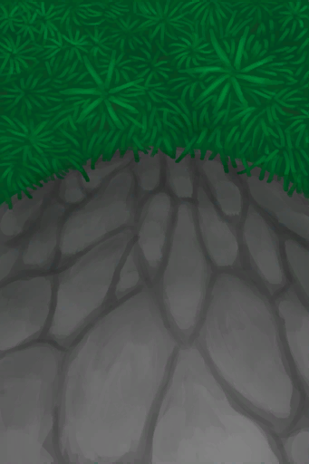

# Climbing(Skill)  
> Shows how good you are at climbing. Lowers your chances of getting hurt when climbing.  
> "Climbing is a useful skill to have as it allows you to get coconuts from <b>Palm Trees</b> and take numerous shortcuts by climbing the different <b>Cliffs</b> of the islands .  This skill lowers your chances of getting hurt when climbing any type of surface  
  

<b>Base Value: </b> 0 
  

<b>Value Range: </b> 0 ~ 150 
  

<b>Base Rate: </b> - 
  

<b>Staleness: </b>Staleness multiplier 80% in 3h(stack:2) 
  
## Change By  
<table class="table table-bordered" data-toggle="table"  ><thead style=""><tr ><th  style="text-align:left;vertical-align:top;"  >From</th><th  style="text-align:left;vertical-align:top;"  >Operation</th><th  style="text-align:left;vertical-align:top;"  data-sortable="true"  >Value</th></tr></thead><tr ><td  style="text-align:left;vertical-align:top;"  >[

[Shaft](ShaftFloodedChamberToCrystalChamber.md)](ShaftFloodedChamberToCrystalChamber.md)</td><td  style="text-align:left;vertical-align:top;"  >Train Climbing</td><td  style="text-align:left;vertical-align:top;"  >1</td></tr><tr ><td  style="text-align:left;vertical-align:top;"  >[

[Shaft](ShaftLowChamberToMidChamber.md)](ShaftLowChamberToMidChamber.md)</td><td  style="text-align:left;vertical-align:top;"  >Train Climbing</td><td  style="text-align:left;vertical-align:top;"  >1</td></tr><tr ><td  style="text-align:left;vertical-align:top;"  >[

[Hole](HighlandHoleEntrance.md)](HighlandHoleEntrance.md)</td><td  style="text-align:left;vertical-align:top;"  >Climb down</td><td  style="text-align:left;vertical-align:top;"  >1</td></tr><tr ><td  style="text-align:left;vertical-align:top;"  >[

[Exit](HighlandHoleExit.md)](HighlandHoleExit.md)</td><td  style="text-align:left;vertical-align:top;"  >Climb Up</td><td  style="text-align:left;vertical-align:top;"  >1</td></tr><tr ><td  style="text-align:left;vertical-align:top;"  >[

[To Jungle Highlands(Secret Cove)](Path_CoveToJungleHighlands.md)](Path_CoveToJungleHighlands.md)</td><td  style="text-align:left;vertical-align:top;"  >Climb Up</td><td  style="text-align:left;vertical-align:top;"  >1</td></tr><tr ><td  style="text-align:left;vertical-align:top;"  >[

[To Jungle Highlands(Secret Cove)](Path_CoveToJungleHighlands.md)](Path_CoveToJungleHighlands.md)</td><td  style="text-align:left;vertical-align:top;"  >Train Climbing</td><td  style="text-align:left;vertical-align:top;"  >1</td></tr><tr ><td  style="text-align:left;vertical-align:top;"  >[

[To Secret Cove(Jungle Highlands)](Path_JungleHighlandsToCove.md)](Path_JungleHighlandsToCove.md)</td><td  style="text-align:left;vertical-align:top;"  >Climb Down</td><td  style="text-align:left;vertical-align:top;"  >1</td></tr><tr ><td  style="text-align:left;vertical-align:top;"  >[

[To Valley Cliffs](Path_JungleHighlandsToValley.md)](Path_JungleHighlandsToValley.md)(未实装)</td><td  style="text-align:left;vertical-align:top;"  >Climb Down</td><td  style="text-align:left;vertical-align:top;"  >1</td></tr><tr ><td  style="text-align:left;vertical-align:top;"  >[

[To Wetlands Cliff](Path_JungleHighlandsToWetlands.md)](Path_JungleHighlandsToWetlands.md)</td><td  style="text-align:left;vertical-align:top;"  >Climb</td><td  style="text-align:left;vertical-align:top;"  >1</td></tr><tr ><td  style="text-align:left;vertical-align:top;"  >[

[To Jungle Highlands](Path_ValleyToJungleHighlands.md)](Path_ValleyToJungleHighlands.md)(未实装)</td><td  style="text-align:left;vertical-align:top;"  >Climb Up</td><td  style="text-align:left;vertical-align:top;"  >1</td></tr><tr ><td  style="text-align:left;vertical-align:top;"  >[

[To Jungle Highlands](Path_ValleyToJungleHighlands.md)](Path_ValleyToJungleHighlands.md)(未实装)</td><td  style="text-align:left;vertical-align:top;"  >Train Climbing</td><td  style="text-align:left;vertical-align:top;"  >1</td></tr><tr ><td  style="text-align:left;vertical-align:top;"  >[

[To Jungle Highlands(Wetlands)](Path_WetlandsToJungleHighlands.md)](Path_WetlandsToJungleHighlands.md)</td><td  style="text-align:left;vertical-align:top;"  >Climb Up</td><td  style="text-align:left;vertical-align:top;"  >1</td></tr><tr ><td  style="text-align:left;vertical-align:top;"  >[

[To Jungle Highlands(Wetlands)](Path_WetlandsToJungleHighlands.md)](Path_WetlandsToJungleHighlands.md)</td><td  style="text-align:left;vertical-align:top;"  >Train Climbing</td><td  style="text-align:left;vertical-align:top;"  >1</td></tr><tr ><td  style="text-align:left;vertical-align:top;"  >[

[Cleared Palm Tree](PalmTreeCleared.md)](PalmTreeCleared.md)</td><td  style="text-align:left;vertical-align:top;"  >Train Climbing</td><td  style="text-align:left;vertical-align:top;"  >1</td></tr><tr ><td  style="text-align:left;vertical-align:top;"  >[

[Palm Tree](PalmTreeNew.md)](PalmTreeNew.md)</td><td  style="text-align:left;vertical-align:top;"  >Climb</td><td  style="text-align:left;vertical-align:top;"  >1</td></tr><tr ><td  style="text-align:left;vertical-align:top;"  >[

[Palm Tree](PalmTreeNew.md)](PalmTreeNew.md)</td><td  style="text-align:left;vertical-align:top;"  >Train Climbing</td><td  style="text-align:left;vertical-align:top;"  >1</td></tr><tr ><td  style="text-align:left;vertical-align:top;"  >[

[Palm Tree](PalmTreeNewMultiEventOld.md)](PalmTreeNewMultiEventOld.md)</td><td  style="text-align:left;vertical-align:top;"  >Climb</td><td  style="text-align:left;vertical-align:top;"  >1</td></tr><tr ><td  style="text-align:left;vertical-align:top;"  >[

[Palm Tree](PalmTreeNewMultiEventOld.md)](PalmTreeNewMultiEventOld.md)</td><td  style="text-align:left;vertical-align:top;"  >Train Climbing</td><td  style="text-align:left;vertical-align:top;"  >1</td></tr><tr ><td  style="text-align:left;vertical-align:top;"  >[

[Palm Tree](PalmTreeOld.md)](PalmTreeOld.md)(未实装)</td><td  style="text-align:left;vertical-align:top;"  >Climb</td><td  style="text-align:left;vertical-align:top;"  >1</td></tr><tr ><td  style="text-align:left;vertical-align:top;"  >[

[Palm Tree](PalmTreeOld.md)](PalmTreeOld.md)(未实装)</td><td  style="text-align:left;vertical-align:top;"  >Train Climbing</td><td  style="text-align:left;vertical-align:top;"  >1</td></tr><tr ><td  style="text-align:left;vertical-align:top;"  >[

[Sap Station](PalmTreeSapStation.md)](PalmTreeSapStation.md)(未实装)</td><td  style="text-align:left;vertical-align:top;"  >Climb</td><td  style="text-align:left;vertical-align:top;"  >1</td></tr><tr ><td  style="text-align:left;vertical-align:top;"  >[

[Sap Station](PalmTreeSapStation.md)](PalmTreeSapStation.md)(未实装)</td><td  style="text-align:left;vertical-align:top;"  >Train Climbing</td><td  style="text-align:left;vertical-align:top;"  >1</td></tr><tr ><td  style="text-align:left;vertical-align:top;"  >[

[Empty Sap Station(Empty)](PalmTreeSapStationEmpty.md)](PalmTreeSapStationEmpty.md)(未实装)</td><td  style="text-align:left;vertical-align:top;"  >Climb</td><td  style="text-align:left;vertical-align:top;"  >1</td></tr><tr ><td  style="text-align:left;vertical-align:top;"  >[

[Empty Sap Station(Empty)](PalmTreeSapStationEmpty.md)](PalmTreeSapStationEmpty.md)(未实装)</td><td  style="text-align:left;vertical-align:top;"  >Train Climbing</td><td  style="text-align:left;vertical-align:top;"  >1</td></tr><tr ><td  style="text-align:left;vertical-align:top;"  >[

[Palm Tree](PalmTree_IH.md)](PalmTree_IH.md)(未实装)</td><td  style="text-align:left;vertical-align:top;"  >Climb</td><td  style="text-align:left;vertical-align:top;"  >1</td></tr><tr ><td  style="text-align:left;vertical-align:top;"  >[

[Palm Tree](PalmTree_Unique.md)](PalmTree_Unique.md)(未实装)</td><td  style="text-align:left;vertical-align:top;"  >Climb fo Coconuts</td><td  style="text-align:left;vertical-align:top;"  >1</td></tr><tr ><td  style="text-align:left;vertical-align:top;"  >[

[Palm Tree](PalmTree_Unique.md)](PalmTree_Unique.md)(未实装)</td><td  style="text-align:left;vertical-align:top;"  >Climb for Coconuts</td><td  style="text-align:left;vertical-align:top;"  >1</td></tr><tr ><td  style="text-align:left;vertical-align:top;"  >[

[Seagull Nest](SeagullNest.md)](SeagullNest.md)</td><td  style="text-align:left;vertical-align:top;"  >Climb</td><td  style="text-align:left;vertical-align:top;"  >1</td></tr><tr ><td  style="text-align:left;vertical-align:top;"  >[

[Shaft](ShaftCrystalChamberToFloodedChamber.md)](ShaftCrystalChamberToFloodedChamber.md)</td><td  style="text-align:left;vertical-align:top;"  >Climb Down</td><td  style="text-align:left;vertical-align:top;"  >0.25</td></tr><tr ><td  style="text-align:left;vertical-align:top;"  >[

[Shaft](ShaftFloodedChamberToCrystalChamber.md)](ShaftFloodedChamberToCrystalChamber.md)</td><td  style="text-align:left;vertical-align:top;"  >Climb Up</td><td  style="text-align:left;vertical-align:top;"  >0.25</td></tr><tr ><td  style="text-align:left;vertical-align:top;"  >[

[Shaft(High Chamber)](ShaftHighChamberToMidChamber.md)](ShaftHighChamberToMidChamber.md)</td><td  style="text-align:left;vertical-align:top;"  >Climb Down</td><td  style="text-align:left;vertical-align:top;"  >0.25</td></tr><tr ><td  style="text-align:left;vertical-align:top;"  >[

[Shaft](ShaftLowChamberToMidChamber.md)](ShaftLowChamberToMidChamber.md)</td><td  style="text-align:left;vertical-align:top;"  >Climb Up</td><td  style="text-align:left;vertical-align:top;"  >0.25</td></tr><tr ><td  style="text-align:left;vertical-align:top;"  >[

[Shaft](ShaftMidChamberToHighChamber.md)](ShaftMidChamberToHighChamber.md)</td><td  style="text-align:left;vertical-align:top;"  >Climb Up</td><td  style="text-align:left;vertical-align:top;"  >0.25</td></tr><tr ><td  style="text-align:left;vertical-align:top;"  >[

[Shaft(High Chamber)](ShaftMidChamberToLowChamber.md)](ShaftMidChamberToLowChamber.md)</td><td  style="text-align:left;vertical-align:top;"  >Climb Down</td><td  style="text-align:left;vertical-align:top;"  >0.25</td></tr></tbody></table>  
  
## Required By  
<table class="table table-bordered" data-toggle="table"  ><thead style=""><tr ><th  style="text-align:left;vertical-align:top;"  >From</th><th  style="text-align:left;vertical-align:top;"  >Operation</th><th  style="text-align:left;vertical-align:top;"  data-sortable="true"  >Value</th></tr></thead><tr ><td  style="text-align:left;vertical-align:top;"  >[Shaft](ShaftCrystalChamberToFloodedChamber.md)</td><td  style="text-align:left;vertical-align:top;"  >影响</td><td  style="text-align:left;vertical-align:top;"  >100 ~ 150</td></tr><tr ><td  style="text-align:left;vertical-align:top;"  >[Shaft](ShaftFloodedChamberToCrystalChamber.md)</td><td  style="text-align:left;vertical-align:top;"  >影响</td><td  style="text-align:left;vertical-align:top;"  >100 ~ 150</td></tr><tr ><td  style="text-align:left;vertical-align:top;"  >[Shaft(High Chamber)](ShaftHighChamberToMidChamber.md)</td><td  style="text-align:left;vertical-align:top;"  >影响</td><td  style="text-align:left;vertical-align:top;"  >100 ~ 150</td></tr><tr ><td  style="text-align:left;vertical-align:top;"  >[Shaft](ShaftLowChamberToMidChamber.md)</td><td  style="text-align:left;vertical-align:top;"  >影响</td><td  style="text-align:left;vertical-align:top;"  >100 ~ 150</td></tr><tr ><td  style="text-align:left;vertical-align:top;"  >[Shaft](ShaftMidChamberToHighChamber.md)</td><td  style="text-align:left;vertical-align:top;"  >影响</td><td  style="text-align:left;vertical-align:top;"  >100 ~ 150</td></tr><tr ><td  style="text-align:left;vertical-align:top;"  >[Shaft(High Chamber)](ShaftMidChamberToLowChamber.md)</td><td  style="text-align:left;vertical-align:top;"  >影响</td><td  style="text-align:left;vertical-align:top;"  >100 ~ 150</td></tr><tr ><td  style="text-align:left;vertical-align:top;"  >[Hole](HighlandHoleEntrance.md)</td><td  style="text-align:left;vertical-align:top;"  >影响</td><td  style="text-align:left;vertical-align:top;"  >100 ~ 150</td></tr><tr ><td  style="text-align:left;vertical-align:top;"  >[Exit](HighlandHoleExit.md)</td><td  style="text-align:left;vertical-align:top;"  >影响</td><td  style="text-align:left;vertical-align:top;"  >100 ~ 150</td></tr><tr ><td  style="text-align:left;vertical-align:top;"  >[To Jungle Highlands(Secret Cove)](Path_CoveToJungleHighlands.md)</td><td  style="text-align:left;vertical-align:top;"  >影响</td><td  style="text-align:left;vertical-align:top;"  >100 ~ 150</td></tr><tr ><td  style="text-align:left;vertical-align:top;"  >[To Secret Cove(Jungle Highlands)](Path_JungleHighlandsToCove.md)</td><td  style="text-align:left;vertical-align:top;"  >影响</td><td  style="text-align:left;vertical-align:top;"  >100 ~ 150</td></tr><tr ><td  style="text-align:left;vertical-align:top;"  >[To Valley Cliffs](Path_JungleHighlandsToValley.md)</td><td  style="text-align:left;vertical-align:top;"  >影响</td><td  style="text-align:left;vertical-align:top;"  >100 ~ 150</td></tr><tr ><td  style="text-align:left;vertical-align:top;"  >[To Wetlands Cliff](Path_JungleHighlandsToWetlands.md)</td><td  style="text-align:left;vertical-align:top;"  >影响</td><td  style="text-align:left;vertical-align:top;"  >100 ~ 150</td></tr><tr ><td  style="text-align:left;vertical-align:top;"  >[To Jungle Highlands](Path_ValleyToJungleHighlands.md)</td><td  style="text-align:left;vertical-align:top;"  >影响</td><td  style="text-align:left;vertical-align:top;"  >100 ~ 150</td></tr><tr ><td  style="text-align:left;vertical-align:top;"  >[To Jungle Highlands(Wetlands)](Path_WetlandsToJungleHighlands.md)</td><td  style="text-align:left;vertical-align:top;"  >影响</td><td  style="text-align:left;vertical-align:top;"  >100 ~ 150</td></tr><tr ><td  style="text-align:left;vertical-align:top;"  >[Palm Tree](PalmTreeNew.md)</td><td  style="text-align:left;vertical-align:top;"  >影响</td><td  style="text-align:left;vertical-align:top;"  >100 ~ 150</td></tr><tr ><td  style="text-align:left;vertical-align:top;"  >[Palm Tree](PalmTreeNewMultiEventOld.md)</td><td  style="text-align:left;vertical-align:top;"  >影响</td><td  style="text-align:left;vertical-align:top;"  >100 ~ 150</td></tr><tr ><td  style="text-align:left;vertical-align:top;"  >[Palm Tree](PalmTreeOld.md)</td><td  style="text-align:left;vertical-align:top;"  >影响</td><td  style="text-align:left;vertical-align:top;"  >100 ~ 150</td></tr><tr ><td  style="text-align:left;vertical-align:top;"  >[Sap Station](PalmTreeSapStation.md)</td><td  style="text-align:left;vertical-align:top;"  >影响</td><td  style="text-align:left;vertical-align:top;"  >100 ~ 150</td></tr><tr ><td  style="text-align:left;vertical-align:top;"  >[Empty Sap Station(Empty)](PalmTreeSapStationEmpty.md)</td><td  style="text-align:left;vertical-align:top;"  >影响</td><td  style="text-align:left;vertical-align:top;"  >100 ~ 150</td></tr><tr ><td  style="text-align:left;vertical-align:top;"  >[Palm Tree](PalmTree_Unique.md)</td><td  style="text-align:left;vertical-align:top;"  >Climb for Coconuts</td><td  style="text-align:left;vertical-align:top;"  >26 ~ 75</td></tr><tr ><td  style="text-align:left;vertical-align:top;"  >[Shaft](ShaftCrystalChamberToFloodedChamber.md)</td><td  style="text-align:left;vertical-align:top;"  >影响</td><td  style="text-align:left;vertical-align:top;"  >0 ~ 100</td></tr><tr ><td  style="text-align:left;vertical-align:top;"  >[Shaft](ShaftFloodedChamberToCrystalChamber.md)</td><td  style="text-align:left;vertical-align:top;"  >影响</td><td  style="text-align:left;vertical-align:top;"  >0 ~ 150</td></tr><tr ><td  style="text-align:left;vertical-align:top;"  >[Shaft(High Chamber)](ShaftHighChamberToMidChamber.md)</td><td  style="text-align:left;vertical-align:top;"  >影响</td><td  style="text-align:left;vertical-align:top;"  >0 ~ 100</td></tr><tr ><td  style="text-align:left;vertical-align:top;"  >[Shaft](ShaftLowChamberToMidChamber.md)</td><td  style="text-align:left;vertical-align:top;"  >影响</td><td  style="text-align:left;vertical-align:top;"  >0 ~ 150</td></tr><tr ><td  style="text-align:left;vertical-align:top;"  >[Shaft](ShaftMidChamberToHighChamber.md)</td><td  style="text-align:left;vertical-align:top;"  >影响</td><td  style="text-align:left;vertical-align:top;"  >0 ~ 150</td></tr><tr ><td  style="text-align:left;vertical-align:top;"  >[Shaft(High Chamber)](ShaftMidChamberToLowChamber.md)</td><td  style="text-align:left;vertical-align:top;"  >影响</td><td  style="text-align:left;vertical-align:top;"  >0 ~ 100</td></tr><tr ><td  style="text-align:left;vertical-align:top;"  >[Hole](HighlandHoleEntrance.md)</td><td  style="text-align:left;vertical-align:top;"  >影响</td><td  style="text-align:left;vertical-align:top;"  >0 ~ 100</td></tr><tr ><td  style="text-align:left;vertical-align:top;"  >[Exit](HighlandHoleExit.md)</td><td  style="text-align:left;vertical-align:top;"  >影响</td><td  style="text-align:left;vertical-align:top;"  >0 ~ 100</td></tr><tr ><td  style="text-align:left;vertical-align:top;"  >[To Jungle Highlands(Secret Cove)](Path_CoveToJungleHighlands.md)</td><td  style="text-align:left;vertical-align:top;"  >影响</td><td  style="text-align:left;vertical-align:top;"  >0 ~ 150</td></tr><tr ><td  style="text-align:left;vertical-align:top;"  >[To Secret Cove(Jungle Highlands)](Path_JungleHighlandsToCove.md)</td><td  style="text-align:left;vertical-align:top;"  >影响</td><td  style="text-align:left;vertical-align:top;"  >0 ~ 100</td></tr><tr ><td  style="text-align:left;vertical-align:top;"  >[To Valley Cliffs](Path_JungleHighlandsToValley.md)</td><td  style="text-align:left;vertical-align:top;"  >影响</td><td  style="text-align:left;vertical-align:top;"  >0 ~ 100</td></tr><tr ><td  style="text-align:left;vertical-align:top;"  >[To Wetlands Cliff](Path_JungleHighlandsToWetlands.md)</td><td  style="text-align:left;vertical-align:top;"  >影响</td><td  style="text-align:left;vertical-align:top;"  >0 ~ 100</td></tr><tr ><td  style="text-align:left;vertical-align:top;"  >[To Jungle Highlands](Path_ValleyToJungleHighlands.md)</td><td  style="text-align:left;vertical-align:top;"  >影响</td><td  style="text-align:left;vertical-align:top;"  >0 ~ 150</td></tr><tr ><td  style="text-align:left;vertical-align:top;"  >[To Jungle Highlands(Wetlands)](Path_WetlandsToJungleHighlands.md)</td><td  style="text-align:left;vertical-align:top;"  >影响</td><td  style="text-align:left;vertical-align:top;"  >0 ~ 150</td></tr><tr ><td  style="text-align:left;vertical-align:top;"  >[Cleared Palm Tree](PalmTreeCleared.md)</td><td  style="text-align:left;vertical-align:top;"  >影响</td><td  style="text-align:left;vertical-align:top;"  >0 ~ 150</td></tr><tr ><td  style="text-align:left;vertical-align:top;"  >[Palm Tree](PalmTreeNew.md)</td><td  style="text-align:left;vertical-align:top;"  >影响</td><td  style="text-align:left;vertical-align:top;"  >0 ~ 150</td></tr><tr ><td  style="text-align:left;vertical-align:top;"  >[Palm Tree](PalmTreeNewMultiEventOld.md)</td><td  style="text-align:left;vertical-align:top;"  >影响</td><td  style="text-align:left;vertical-align:top;"  >0 ~ 150</td></tr><tr ><td  style="text-align:left;vertical-align:top;"  >[Palm Tree](PalmTreeOld.md)</td><td  style="text-align:left;vertical-align:top;"  >影响</td><td  style="text-align:left;vertical-align:top;"  >0 ~ 150</td></tr><tr ><td  style="text-align:left;vertical-align:top;"  >[Sap Station](PalmTreeSapStation.md)</td><td  style="text-align:left;vertical-align:top;"  >影响</td><td  style="text-align:left;vertical-align:top;"  >0 ~ 100</td></tr><tr ><td  style="text-align:left;vertical-align:top;"  >[Sap Station](PalmTreeSapStation.md)</td><td  style="text-align:left;vertical-align:top;"  >影响</td><td  style="text-align:left;vertical-align:top;"  >0 ~ 150</td></tr><tr ><td  style="text-align:left;vertical-align:top;"  >[Empty Sap Station(Empty)](PalmTreeSapStationEmpty.md)</td><td  style="text-align:left;vertical-align:top;"  >影响</td><td  style="text-align:left;vertical-align:top;"  >0 ~ 100</td></tr><tr ><td  style="text-align:left;vertical-align:top;"  >[Empty Sap Station(Empty)](PalmTreeSapStationEmpty.md)</td><td  style="text-align:left;vertical-align:top;"  >影响</td><td  style="text-align:left;vertical-align:top;"  >0 ~ 150</td></tr><tr ><td  style="text-align:left;vertical-align:top;"  >[Palm Tree](PalmTree_IH.md)</td><td  style="text-align:left;vertical-align:top;"  >影响</td><td  style="text-align:left;vertical-align:top;"  >0 ~ 100</td></tr><tr ><td  style="text-align:left;vertical-align:top;"  >[Palm Tree](PalmTree_Unique.md)</td><td  style="text-align:left;vertical-align:top;"  >Climb for Coconuts</td><td  style="text-align:left;vertical-align:top;"  >0 ~ 25</td></tr><tr ><td  style="text-align:left;vertical-align:top;"  >[Seagull Nest](SeagullNest.md)</td><td  style="text-align:left;vertical-align:top;"  >影响</td><td  style="text-align:left;vertical-align:top;"  >0 ~ 100</td></tr></tbody></table>  
  

