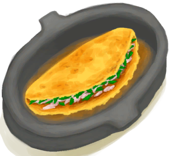

# Cooking(Skill)  
> Shows how good you are at cooking. Unlocks new recipes as it gets higher.  
> Cooking is a skill that will grant you new <b>Cooking Recipes</b> as it gets higher.  It can be increased by preparing <b>meals</b> or by <b>roasting</b> food on a fire.  
  

<b>Base Value: </b> 0 
  

<b>Value Range: </b> 0 ~ 150 
  

<b>Base Rate: </b> - 
  

<b>Staleness: </b>Staleness multiplier 80% in 3h(stack:2) 
  
## Change By  
<table class="table table-bordered" data-toggle="table"  ><thead style=""><tr ><th  style="text-align:left;vertical-align:top;"  >From</th><th  style="text-align:left;vertical-align:top;"  >Operation</th><th  style="text-align:left;vertical-align:top;"  data-sortable="true"  >Value</th></tr></thead><tr ><td  style="text-align:left;vertical-align:top;"  >[

[Bone Broth(BluePrint)](Bp_BoneBroth.md)](Bp_BoneBroth.md)</td><td  style="text-align:left;vertical-align:top;"  >Craft BluePrint</td><td  style="text-align:left;vertical-align:top;"  >0.5</td></tr><tr ><td  style="text-align:left;vertical-align:top;"  >[

[Butter(BluePrint)](Bp_Butter.md)](Bp_Butter.md)</td><td  style="text-align:left;vertical-align:top;"  >Craft BluePrint</td><td  style="text-align:left;vertical-align:top;"  >0.5</td></tr><tr ><td  style="text-align:left;vertical-align:top;"  >[

[Butter Baked Oysters(BluePrint)](Bp_ButterBakedOysters.md)](Bp_ButterBakedOysters.md)</td><td  style="text-align:left;vertical-align:top;"  >Craft BluePrint</td><td  style="text-align:left;vertical-align:top;"  >0.5</td></tr><tr ><td  style="text-align:left;vertical-align:top;"  >[

[Candied Ginger(BluePrint)](Bp_CandiedGinger.md)](Bp_CandiedGinger.md)</td><td  style="text-align:left;vertical-align:top;"  >Craft BluePrint</td><td  style="text-align:left;vertical-align:top;"  >0.5</td></tr><tr ><td  style="text-align:left;vertical-align:top;"  >[

[Cheese(BluePrint)](Bp_Cheese.md)](Bp_Cheese.md)</td><td  style="text-align:left;vertical-align:top;"  >Craft BluePrint</td><td  style="text-align:left;vertical-align:top;"  >0.5</td></tr><tr ><td  style="text-align:left;vertical-align:top;"  >[

[Chicken Sandwich(BluePrint)](Bp_ChickenSandwich.md)](Bp_ChickenSandwich.md)</td><td  style="text-align:left;vertical-align:top;"  >Craft BluePrint</td><td  style="text-align:left;vertical-align:top;"  >0.5</td></tr><tr ><td  style="text-align:left;vertical-align:top;"  >[

[Coconut Fish(BluePrint)](Bp_CoconutFish.md)](Bp_CoconutFish.md)</td><td  style="text-align:left;vertical-align:top;"  >Craft BluePrint</td><td  style="text-align:left;vertical-align:top;"  >0.5</td></tr><tr ><td  style="text-align:left;vertical-align:top;"  >[

[Drunken Crab(BluePrint)](Bp_DrunkenCrab.md)](Bp_DrunkenCrab.md)</td><td  style="text-align:left;vertical-align:top;"  >Craft BluePrint</td><td  style="text-align:left;vertical-align:top;"  >0.5</td></tr><tr ><td  style="text-align:left;vertical-align:top;"  >[

[Egg Fried Rice(BluePrint)](Bp_EggFriedRice.md)](Bp_EggFriedRice.md)</td><td  style="text-align:left;vertical-align:top;"  >Craft BluePrint</td><td  style="text-align:left;vertical-align:top;"  >0.5</td></tr><tr ><td  style="text-align:left;vertical-align:top;"  >[

[Fish N' Chips(BluePrint)](Bp_FishNChips.md)](Bp_FishNChips.md)</td><td  style="text-align:left;vertical-align:top;"  >Craft BluePrint</td><td  style="text-align:left;vertical-align:top;"  >0.5</td></tr><tr ><td  style="text-align:left;vertical-align:top;"  >[

[Fish Omelette(BluePrint)](Bp_FishOmelette.md)](Bp_FishOmelette.md)</td><td  style="text-align:left;vertical-align:top;"  >Craft BluePrint</td><td  style="text-align:left;vertical-align:top;"  >0.5</td></tr><tr ><td  style="text-align:left;vertical-align:top;"  >[

[Fish Taco(BluePrint)](Bp_FishTaco.md)](Bp_FishTaco.md)</td><td  style="text-align:left;vertical-align:top;"  >Craft BluePrint</td><td  style="text-align:left;vertical-align:top;"  >0.5</td></tr><tr ><td  style="text-align:left;vertical-align:top;"  >[

[Fried Bananas(BluePrint)](Bp_FriedBananas.md)](Bp_FriedBananas.md)</td><td  style="text-align:left;vertical-align:top;"  >Craft BluePrint</td><td  style="text-align:left;vertical-align:top;"  >0.5</td></tr><tr ><td  style="text-align:left;vertical-align:top;"  >[

[Fried Puffballs(BluePrint)](Bp_FriedPuffballs.md)](Bp_FriedPuffballs.md)</td><td  style="text-align:left;vertical-align:top;"  >Craft BluePrint</td><td  style="text-align:left;vertical-align:top;"  >0.5</td></tr><tr ><td  style="text-align:left;vertical-align:top;"  >[

[Goat Stew(BluePrint)](Bp_GoatStew.md)](Bp_GoatStew.md)</td><td  style="text-align:left;vertical-align:top;"  >Craft BluePrint</td><td  style="text-align:left;vertical-align:top;"  >0.5</td></tr><tr ><td  style="text-align:left;vertical-align:top;"  >[

[Hearty Feast(BluePrint)](Bp_HeartyFeast.md)](Bp_HeartyFeast.md)</td><td  style="text-align:left;vertical-align:top;"  >Craft BluePrint</td><td  style="text-align:left;vertical-align:top;"  >0.5</td></tr><tr ><td  style="text-align:left;vertical-align:top;"  >[

[Honey Candy(BluePrint)](Bp_HoneyCandy.md)](Bp_HoneyCandy.md)</td><td  style="text-align:left;vertical-align:top;"  >Craft BluePrint</td><td  style="text-align:left;vertical-align:top;"  >0.5</td></tr><tr ><td  style="text-align:left;vertical-align:top;"  >[

[Honey Glazed Pork(BluePrint)](Bp_HoneyGlazedPork.md)](Bp_HoneyGlazedPork.md)</td><td  style="text-align:left;vertical-align:top;"  >Craft BluePrint</td><td  style="text-align:left;vertical-align:top;"  >0.5</td></tr><tr ><td  style="text-align:left;vertical-align:top;"  >[

[Island Chicken(BluePrint)](Bp_IslandChicken.md)](Bp_IslandChicken.md)</td><td  style="text-align:left;vertical-align:top;"  >Craft BluePrint</td><td  style="text-align:left;vertical-align:top;"  >0.5</td></tr><tr ><td  style="text-align:left;vertical-align:top;"  >[

[Jungle Salad(BluePrint)](Bp_JungleSalad.md)](Bp_JungleSalad.md)</td><td  style="text-align:left;vertical-align:top;"  >Craft BluePrint</td><td  style="text-align:left;vertical-align:top;"  >0.5</td></tr><tr ><td  style="text-align:left;vertical-align:top;"  >[

[Lizard Fry(BluePrint)](Bp_LizardFry.md)](Bp_LizardFry.md)</td><td  style="text-align:left;vertical-align:top;"  >Craft BluePrint</td><td  style="text-align:left;vertical-align:top;"  >0.5</td></tr><tr ><td  style="text-align:left;vertical-align:top;"  >[

[Macaque Skewers(BluePrint)](Bp_MacaqueSkewers.md)](Bp_MacaqueSkewers.md)</td><td  style="text-align:left;vertical-align:top;"  >Craft BluePrint</td><td  style="text-align:left;vertical-align:top;"  >0.5</td></tr><tr ><td  style="text-align:left;vertical-align:top;"  >[

[Protein Bar(BluePrint)](Bp_ProteinBar.md)](Bp_ProteinBar.md)</td><td  style="text-align:left;vertical-align:top;"  >Craft BluePrint</td><td  style="text-align:left;vertical-align:top;"  >0.5</td></tr><tr ><td  style="text-align:left;vertical-align:top;"  >[

[Sago Cake(BluePrint)](Bp_SagoCake.md)](Bp_SagoCake.md)</td><td  style="text-align:left;vertical-align:top;"  >Craft BluePrint</td><td  style="text-align:left;vertical-align:top;"  >0.5</td></tr><tr ><td  style="text-align:left;vertical-align:top;"  >[

[Sago Slime(BluePrint)](Bp_SagoSlime.md)](Bp_SagoSlime.md)</td><td  style="text-align:left;vertical-align:top;"  >Craft BluePrint</td><td  style="text-align:left;vertical-align:top;"  >0.5</td></tr><tr ><td  style="text-align:left;vertical-align:top;"  >[

[Seafood Cup(BluePrint)](Bp_SeafoodCup.md)](Bp_SeafoodCup.md)</td><td  style="text-align:left;vertical-align:top;"  >Craft BluePrint</td><td  style="text-align:left;vertical-align:top;"  >0.5</td></tr><tr ><td  style="text-align:left;vertical-align:top;"  >[

[Sushi(BluePrint)](Bp_Sushi.md)](Bp_Sushi.md)</td><td  style="text-align:left;vertical-align:top;"  >Craft BluePrint</td><td  style="text-align:left;vertical-align:top;"  >0.5</td></tr><tr ><td  style="text-align:left;vertical-align:top;"  >[

[Yam Curry(BluePrint)](Bp_YamCurry.md)](Bp_YamCurry.md)</td><td  style="text-align:left;vertical-align:top;"  >Craft BluePrint</td><td  style="text-align:left;vertical-align:top;"  >0.5</td></tr><tr ><td  style="text-align:left;vertical-align:top;"  >[

[Yam Jam(BluePrint)](Bp_YamJam.md)](Bp_YamJam.md)</td><td  style="text-align:left;vertical-align:top;"  >Craft BluePrint</td><td  style="text-align:left;vertical-align:top;"  >0.5</td></tr><tr ><td  style="text-align:left;vertical-align:top;"  >[

[Honey(BluePrint)](Bp_Honey.md)](Bp_Honey.md)</td><td  style="text-align:left;vertical-align:top;"  >Craft BluePrint</td><td  style="text-align:left;vertical-align:top;"  >0.25</td></tr><tr ><td  style="text-align:left;vertical-align:top;"  >[

[Coconut Milk(BluePrint)](Bp_CoconutMilk.md)](Bp_CoconutMilk.md)</td><td  style="text-align:left;vertical-align:top;"  >Craft BluePrint</td><td  style="text-align:left;vertical-align:top;"  >0.25</td></tr><tr ><td  style="text-align:left;vertical-align:top;"  >[

[Tonic Water(BluePrint)](Bp_TonicWater.md)](Bp_TonicWater.md)</td><td  style="text-align:left;vertical-align:top;"  >Craft BluePrint</td><td  style="text-align:left;vertical-align:top;"  >0.25</td></tr></tbody></table>  
  
## Required By  
<table class="table table-bordered" data-toggle="table"  ><thead style=""><tr ><th  style="text-align:left;vertical-align:top;"  >From</th><th  style="text-align:left;vertical-align:top;"  >Operation</th><th  style="text-align:left;vertical-align:top;"  data-sortable="true"  >Value</th></tr></thead><tr ><td  style="text-align:left;vertical-align:top;"  >[Cooking Improved!(Event)](Event_SkillCooking4.md)</td><td  style="text-align:left;vertical-align:top;"  >Event</td><td  style="text-align:left;vertical-align:top;"  >150</td></tr><tr ><td  style="text-align:left;vertical-align:top;"  >[Cooking Improved!(Event)](Event_SkillCooking3.md)</td><td  style="text-align:left;vertical-align:top;"  >Event</td><td  style="text-align:left;vertical-align:top;"  >70 ~ 150</td></tr><tr ><td  style="text-align:left;vertical-align:top;"  >[Cooking Improved!(Event)](Event_SkillCooking2.md)</td><td  style="text-align:left;vertical-align:top;"  >Event</td><td  style="text-align:left;vertical-align:top;"  >30 ~ 150</td></tr><tr ><td  style="text-align:left;vertical-align:top;"  >[Cooking Improved!(Event)](Event_SkillCooking1.md)</td><td  style="text-align:left;vertical-align:top;"  >Event</td><td  style="text-align:left;vertical-align:top;"  >10 ~ 150</td></tr></tbody></table>  
  

