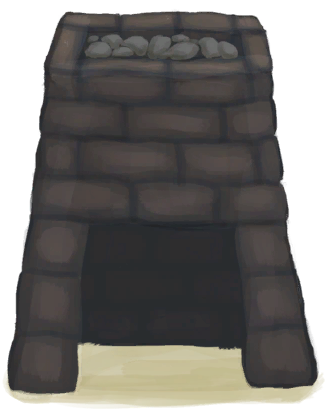
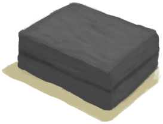
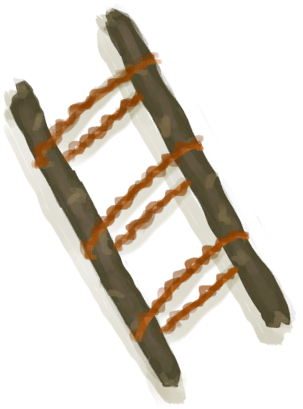

# Crafting(Skill)  
> Shows how good you are at crafting. Unlocks new recipes as it gets higher.  
  

<b>Base Value: </b> 0 
  

<b>Value Range: </b> 0 ~ 150 
  

<b>Base Rate: </b> - 
  

<b>Staleness: </b>Staleness multiplier 80% in 3h(stack:2) 
  
## Change By  
<table class="table table-bordered" data-toggle="table"  ><thead style=""><tr ><th  style="text-align:left;vertical-align:top;"  >From</th><th  style="text-align:left;vertical-align:top;"  >Operation</th><th  style="text-align:left;vertical-align:top;"  data-sortable="true"  >Value</th></tr></thead><tr ><td  style="text-align:left;vertical-align:top;"  >[

[Mud Hut(BluePrint)](Bp_MudHut.md)](Bp_MudHut.md)</td><td  style="text-align:left;vertical-align:top;"  >Craft BluePrint</td><td  style="text-align:left;vertical-align:top;"  >10</td></tr><tr ><td  style="text-align:left;vertical-align:top;"  >[

[Raft(BluePrint)](Bp_Raft.md)](Bp_Raft.md)</td><td  style="text-align:left;vertical-align:top;"  >Craft BluePrint</td><td  style="text-align:left;vertical-align:top;"  >10</td></tr><tr ><td  style="text-align:left;vertical-align:top;"  >[

[Stone Hut(BluePrint)](Bp_StoneHut.md)](Bp_StoneHut.md)</td><td  style="text-align:left;vertical-align:top;"  >Craft BluePrint</td><td  style="text-align:left;vertical-align:top;"  >10</td></tr><tr ><td  style="text-align:left;vertical-align:top;"  >[

[Enclosure(BluePrint)](Bp_Enclosure.md)](Bp_Enclosure.md)</td><td  style="text-align:left;vertical-align:top;"  >Craft BluePrint</td><td  style="text-align:left;vertical-align:top;"  >5</td></tr><tr ><td  style="text-align:left;vertical-align:top;"  >[

[Shed(BluePrint)](Bp_Shed.md)](Bp_Shed.md)</td><td  style="text-align:left;vertical-align:top;"  >Craft BluePrint</td><td  style="text-align:left;vertical-align:top;"  >5</td></tr><tr ><td  style="text-align:left;vertical-align:top;"  >[

[Supply Chest(BluePrint)](Bp_SupplyChest.md)](Bp_SupplyChest.md)</td><td  style="text-align:left;vertical-align:top;"  >Craft BluePrint</td><td  style="text-align:left;vertical-align:top;"  >3</td></tr><tr ><td  style="text-align:left;vertical-align:top;"  >[

[Rustic Bed(BluePrint)](Bp_BedRustic.md)](Bp_BedRustic.md)</td><td  style="text-align:left;vertical-align:top;"  >Craft BluePrint</td><td  style="text-align:left;vertical-align:top;"  >2</td></tr><tr ><td  style="text-align:left;vertical-align:top;"  >[

[Ceremonial Dagger(BluePrint)](Bp_CeremonialDagger.md)](Bp_CeremonialDagger.md)</td><td  style="text-align:left;vertical-align:top;"  >Craft BluePrint</td><td  style="text-align:left;vertical-align:top;"  >2</td></tr><tr ><td  style="text-align:left;vertical-align:top;"  >[

[Forge(BluePrint)](Bp_Forge.md)](Bp_Forge.md)</td><td  style="text-align:left;vertical-align:top;"  >Craft BluePrint</td><td  style="text-align:left;vertical-align:top;"  >2</td></tr><tr ><td  style="text-align:left;vertical-align:top;"  >[

[Kiln(BluePrint)](Bp_Kiln.md)](Bp_Kiln.md)</td><td  style="text-align:left;vertical-align:top;"  >Craft BluePrint</td><td  style="text-align:left;vertical-align:top;"  >2</td></tr><tr ><td  style="text-align:left;vertical-align:top;"  >[

[Advanced Kiln(BluePrint)](Bp_KilnAdvanced.md)](Bp_KilnAdvanced.md)</td><td  style="text-align:left;vertical-align:top;"  >Craft BluePrint</td><td  style="text-align:left;vertical-align:top;"  >2</td></tr><tr ><td  style="text-align:left;vertical-align:top;"  >[

[Loom(BluePrint)](Bp_Loom.md)](Bp_Loom.md)</td><td  style="text-align:left;vertical-align:top;"  >Craft BluePrint</td><td  style="text-align:left;vertical-align:top;"  >2</td></tr><tr ><td  style="text-align:left;vertical-align:top;"  >[

[Salt Bed(BluePrint)](Bp_SaltBed.md)](Bp_SaltBed.md)</td><td  style="text-align:left;vertical-align:top;"  >Craft BluePrint</td><td  style="text-align:left;vertical-align:top;"  >2</td></tr><tr ><td  style="text-align:left;vertical-align:top;"  >[

[Shower(BluePrint)](Bp_Shower.md)](Bp_Shower.md)</td><td  style="text-align:left;vertical-align:top;"  >Craft BluePrint</td><td  style="text-align:left;vertical-align:top;"  >2</td></tr><tr ><td  style="text-align:left;vertical-align:top;"  >[

[Stove(BluePrint)](Bp_Stove.md)](Bp_Stove.md)</td><td  style="text-align:left;vertical-align:top;"  >Craft BluePrint</td><td  style="text-align:left;vertical-align:top;"  >2</td></tr><tr ><td  style="text-align:left;vertical-align:top;"  >[

[Water Filter(BluePrint)](Bp_WaterFilter.md)](Bp_WaterFilter.md)</td><td  style="text-align:left;vertical-align:top;"  >Craft BluePrint</td><td  style="text-align:left;vertical-align:top;"  >2</td></tr><tr ><td  style="text-align:left;vertical-align:top;"  >[

[Water Reservoir(BluePrint)](Bp_WaterReservoir.md)](Bp_WaterReservoir.md)</td><td  style="text-align:left;vertical-align:top;"  >Craft BluePrint</td><td  style="text-align:left;vertical-align:top;"  >2</td></tr><tr ><td  style="text-align:left;vertical-align:top;"  >[

[Watering Trough(BluePrint)](Bp_WateringTrough.md)](Bp_WateringTrough.md)</td><td  style="text-align:left;vertical-align:top;"  >Craft BluePrint</td><td  style="text-align:left;vertical-align:top;"  >2</td></tr><tr ><td  style="text-align:left;vertical-align:top;"  >[

[Wooden Bed(BluePrint)](Bp_BedWooden.md)](Bp_BedWooden.md)</td><td  style="text-align:left;vertical-align:top;"  >Craft BluePrint</td><td  style="text-align:left;vertical-align:top;"  >1</td></tr><tr ><td  style="text-align:left;vertical-align:top;"  >[

[Empty Skep(BluePrint)(Empty)](Bp_BeeSkepEmpty.md)](Bp_BeeSkepEmpty.md)</td><td  style="text-align:left;vertical-align:top;"  >Craft BluePrint</td><td  style="text-align:left;vertical-align:top;"  >1</td></tr><tr ><td  style="text-align:left;vertical-align:top;"  >[

[Bee Smoker(BluePrint)](Bp_BeeSmoker.md)](Bp_BeeSmoker.md)</td><td  style="text-align:left;vertical-align:top;"  >Craft BluePrint</td><td  style="text-align:left;vertical-align:top;"  >1</td></tr><tr ><td  style="text-align:left;vertical-align:top;"  >[

[Boar Feeder(BluePrint)](Bp_BoarFeeder.md)](Bp_BoarFeeder.md)</td><td  style="text-align:left;vertical-align:top;"  >Craft BluePrint</td><td  style="text-align:left;vertical-align:top;"  >1</td></tr><tr ><td  style="text-align:left;vertical-align:top;"  >[

[Bone Knife(BluePrint)](Bp_BoneKnife.md)](Bp_BoneKnife.md)</td><td  style="text-align:left;vertical-align:top;"  >Craft BluePrint</td><td  style="text-align:left;vertical-align:top;"  >1</td></tr><tr ><td  style="text-align:left;vertical-align:top;"  >[

[Bow(BluePrint)](Bp_Bow.md)](Bp_Bow.md)</td><td  style="text-align:left;vertical-align:top;"  >Craft BluePrint</td><td  style="text-align:left;vertical-align:top;"  >1</td></tr><tr ><td  style="text-align:left;vertical-align:top;"  >[

[Broom(BluePrint)](Bp_Broom.md)](Bp_Broom.md)</td><td  style="text-align:left;vertical-align:top;"  >Craft BluePrint</td><td  style="text-align:left;vertical-align:top;"  >1</td></tr><tr ><td  style="text-align:left;vertical-align:top;"  >[

[Campfire(BluePrint)](Bp_Campfire.md)](Bp_Campfire.md)</td><td  style="text-align:left;vertical-align:top;"  >Craft BluePrint</td><td  style="text-align:left;vertical-align:top;"  >1</td></tr><tr ><td  style="text-align:left;vertical-align:top;"  >[

[Candles(BluePrint)](Bp_Candles.md)](Bp_Candles.md)</td><td  style="text-align:left;vertical-align:top;"  >Craft BluePrint</td><td  style="text-align:left;vertical-align:top;"  >1</td></tr><tr ><td  style="text-align:left;vertical-align:top;"  >[

[Citronella Candles(BluePrint)](Bp_CandlesCitronella.md)](Bp_CandlesCitronella.md)</td><td  style="text-align:left;vertical-align:top;"  >Craft BluePrint</td><td  style="text-align:left;vertical-align:top;"  >1</td></tr><tr ><td  style="text-align:left;vertical-align:top;"  >[

[Jasmine Candles(BluePrint)](Bp_CandlesJasmine.md)](Bp_CandlesJasmine.md)</td><td  style="text-align:left;vertical-align:top;"  >Craft BluePrint</td><td  style="text-align:left;vertical-align:top;"  >1</td></tr><tr ><td  style="text-align:left;vertical-align:top;"  >[

[Cellar(BluePrint)](Bp_Cellar.md)](Bp_Cellar.md)</td><td  style="text-align:left;vertical-align:top;"  >Craft BluePrint</td><td  style="text-align:left;vertical-align:top;"  >1</td></tr><tr ><td  style="text-align:left;vertical-align:top;"  >[

[Chair(BluePrint)](Bp_Chair.md)](Bp_Chair.md)</td><td  style="text-align:left;vertical-align:top;"  >Craft BluePrint</td><td  style="text-align:left;vertical-align:top;"  >1</td></tr><tr ><td  style="text-align:left;vertical-align:top;"  >[

[Chest(BluePrint)](Bp_Chest.md)](Bp_Chest.md)</td><td  style="text-align:left;vertical-align:top;"  >Craft BluePrint</td><td  style="text-align:left;vertical-align:top;"  >1</td></tr><tr ><td  style="text-align:left;vertical-align:top;"  >[

[Cistern(BluePrint)](Bp_Cistern.md)](Bp_Cistern.md)</td><td  style="text-align:left;vertical-align:top;"  >Craft BluePrint</td><td  style="text-align:left;vertical-align:top;"  >1</td></tr><tr ><td  style="text-align:left;vertical-align:top;"  >[

[Compost Bin(BluePrint)](Bp_CompostBin.md)](Bp_CompostBin.md)</td><td  style="text-align:left;vertical-align:top;"  >Craft BluePrint</td><td  style="text-align:left;vertical-align:top;"  >1</td></tr><tr ><td  style="text-align:left;vertical-align:top;"  >[

[Copper Axe(BluePrint)](Bp_CopperAxe.md)](Bp_CopperAxe.md)</td><td  style="text-align:left;vertical-align:top;"  >Craft BluePrint</td><td  style="text-align:left;vertical-align:top;"  >1</td></tr><tr ><td  style="text-align:left;vertical-align:top;"  >[

[Copper Shovel(BluePrint)](Bp_CopperShovel.md)](Bp_CopperShovel.md)</td><td  style="text-align:left;vertical-align:top;"  >Craft BluePrint</td><td  style="text-align:left;vertical-align:top;"  >1</td></tr><tr ><td  style="text-align:left;vertical-align:top;"  >[

[Copper Spear(BluePrint)](Bp_CopperSpear.md)](Bp_CopperSpear.md)</td><td  style="text-align:left;vertical-align:top;"  >Craft BluePrint</td><td  style="text-align:left;vertical-align:top;"  >1</td></tr><tr ><td  style="text-align:left;vertical-align:top;"  >[

[Drum(BluePrint)](Bp_Drum.md)](Bp_Drum.md)</td><td  style="text-align:left;vertical-align:top;"  >Craft BluePrint</td><td  style="text-align:left;vertical-align:top;"  >1</td></tr><tr ><td  style="text-align:left;vertical-align:top;"  >[

[Drying Rack(BluePrint)](Bp_DryingRack.md)](Bp_DryingRack.md)</td><td  style="text-align:left;vertical-align:top;"  >Craft BluePrint</td><td  style="text-align:left;vertical-align:top;"  >1</td></tr><tr ><td  style="text-align:left;vertical-align:top;"  >[

[Dynamite(BluePrint)](Bp_Dynamite.md)](Bp_Dynamite.md)</td><td  style="text-align:left;vertical-align:top;"  >Craft BluePrint</td><td  style="text-align:left;vertical-align:top;"  >1</td></tr><tr ><td  style="text-align:left;vertical-align:top;"  >[

[Fish Bait(BluePrint)](Bp_FishBait.md)](Bp_FishBait.md)</td><td  style="text-align:left;vertical-align:top;"  >Craft BluePrint</td><td  style="text-align:left;vertical-align:top;"  >1</td></tr><tr ><td  style="text-align:left;vertical-align:top;"  >[

[Fishing Rod(BluePrint)](Bp_FishingRod.md)](Bp_FishingRod.md)</td><td  style="text-align:left;vertical-align:top;"  >Craft BluePrint</td><td  style="text-align:left;vertical-align:top;"  >1</td></tr><tr ><td  style="text-align:left;vertical-align:top;"  >[

[Fishing Spear(BluePrint)](Bp_FishingSpear.md)](Bp_FishingSpear.md)</td><td  style="text-align:left;vertical-align:top;"  >Craft BluePrint</td><td  style="text-align:left;vertical-align:top;"  >1</td></tr><tr ><td  style="text-align:left;vertical-align:top;"  >[

[Bone Flute(BluePrint)](Bp_FluteBone.md)](Bp_FluteBone.md)</td><td  style="text-align:left;vertical-align:top;"  >Craft BluePrint</td><td  style="text-align:left;vertical-align:top;"  >1</td></tr><tr ><td  style="text-align:left;vertical-align:top;"  >[

[Wooden Flute(BluePrint)](Bp_FluteWooden.md)](Bp_FluteWooden.md)</td><td  style="text-align:left;vertical-align:top;"  >Craft BluePrint</td><td  style="text-align:left;vertical-align:top;"  >1</td></tr><tr ><td  style="text-align:left;vertical-align:top;"  >[

[Goat Feeder(BluePrint)](Bp_GoatFeeder.md)](Bp_GoatFeeder.md)</td><td  style="text-align:left;vertical-align:top;"  >Craft BluePrint</td><td  style="text-align:left;vertical-align:top;"  >1</td></tr><tr ><td  style="text-align:left;vertical-align:top;"  >[

[Harpoon(BluePrint)](Bp_Harpoon.md)](Bp_Harpoon.md)</td><td  style="text-align:left;vertical-align:top;"  >Craft BluePrint</td><td  style="text-align:left;vertical-align:top;"  >1</td></tr><tr ><td  style="text-align:left;vertical-align:top;"  >[

[Lizard Drum(BluePrint)](Bp_LizardDrum.md)](Bp_LizardDrum.md)</td><td  style="text-align:left;vertical-align:top;"  >Craft BluePrint</td><td  style="text-align:left;vertical-align:top;"  >1</td></tr><tr ><td  style="text-align:left;vertical-align:top;"  >[

[Log Trap(BluePrint)](Bp_LogTrap.md)](Bp_LogTrap.md)</td><td  style="text-align:left;vertical-align:top;"  >Craft BluePrint</td><td  style="text-align:left;vertical-align:top;"  >1</td></tr><tr ><td  style="text-align:left;vertical-align:top;"  >[

[Axe Mold(BluePrint)](Bp_MoldAxe.md)](Bp_MoldAxe.md)</td><td  style="text-align:left;vertical-align:top;"  >Craft BluePrint</td><td  style="text-align:left;vertical-align:top;"  >1</td></tr><tr ><td  style="text-align:left;vertical-align:top;"  >[

[Decoration Mold(BluePrint)](Bp_MoldDecoration.md)](Bp_MoldDecoration.md)</td><td  style="text-align:left;vertical-align:top;"  >Craft BluePrint</td><td  style="text-align:left;vertical-align:top;"  >1</td></tr><tr ><td  style="text-align:left;vertical-align:top;"  >[

[Knife Mold(BluePrint)](Bp_MoldKnife.md)](Bp_MoldKnife.md)</td><td  style="text-align:left;vertical-align:top;"  >Craft BluePrint</td><td  style="text-align:left;vertical-align:top;"  >1</td></tr><tr ><td  style="text-align:left;vertical-align:top;"  >[

[Shovel Mold(BluePrint)](Bp_MoldShovel.md)](Bp_MoldShovel.md)</td><td  style="text-align:left;vertical-align:top;"  >Craft BluePrint</td><td  style="text-align:left;vertical-align:top;"  >1</td></tr><tr ><td  style="text-align:left;vertical-align:top;"  >[

[Spear Mold(BluePrint)](Bp_MoldSpear.md)](Bp_MoldSpear.md)</td><td  style="text-align:left;vertical-align:top;"  >Craft BluePrint</td><td  style="text-align:left;vertical-align:top;"  >1</td></tr><tr ><td  style="text-align:left;vertical-align:top;"  >[

[Partridge Feeder(BluePrint)](Bp_PartridgeFeeder.md)](Bp_PartridgeFeeder.md)</td><td  style="text-align:left;vertical-align:top;"  >Craft BluePrint</td><td  style="text-align:left;vertical-align:top;"  >1</td></tr><tr ><td  style="text-align:left;vertical-align:top;"  >[

[Pottery Wheel(BluePrint)](Bp_PotteryWheel.md)](Bp_PotteryWheel.md)</td><td  style="text-align:left;vertical-align:top;"  >Craft BluePrint</td><td  style="text-align:left;vertical-align:top;"  >1</td></tr><tr ><td  style="text-align:left;vertical-align:top;"  >[

[Raft Shelter(BluePrint)](Bp_RaftShelter.md)](Bp_RaftShelter.md)</td><td  style="text-align:left;vertical-align:top;"  >Craft BluePrint</td><td  style="text-align:left;vertical-align:top;"  >1</td></tr><tr ><td  style="text-align:left;vertical-align:top;"  >[

[Scrap Axe(BluePrint)](Bp_ScrapAxe.md)](Bp_ScrapAxe.md)</td><td  style="text-align:left;vertical-align:top;"  >Craft BluePrint</td><td  style="text-align:left;vertical-align:top;"  >1</td></tr><tr ><td  style="text-align:left;vertical-align:top;"  >[

[Scrap Knife(BluePrint)](Bp_ScrapKnife.md)](Bp_ScrapKnife.md)</td><td  style="text-align:left;vertical-align:top;"  >Craft BluePrint</td><td  style="text-align:left;vertical-align:top;"  >1</td></tr><tr ><td  style="text-align:left;vertical-align:top;"  >[

[Scrap Shovel(BluePrint)](Bp_ScrapShovel.md)](Bp_ScrapShovel.md)</td><td  style="text-align:left;vertical-align:top;"  >Craft BluePrint</td><td  style="text-align:left;vertical-align:top;"  >1</td></tr><tr ><td  style="text-align:left;vertical-align:top;"  >[

[Scrap Spear(BluePrint)](Bp_ScrapSpear.md)](Bp_ScrapSpear.md)</td><td  style="text-align:left;vertical-align:top;"  >Craft BluePrint</td><td  style="text-align:left;vertical-align:top;"  >1</td></tr><tr ><td  style="text-align:left;vertical-align:top;"  >[

[Shelter(BluePrint)](Bp_Shelter.md)](Bp_Shelter.md)</td><td  style="text-align:left;vertical-align:top;"  >Craft BluePrint</td><td  style="text-align:left;vertical-align:top;"  >1</td></tr><tr ><td  style="text-align:left;vertical-align:top;"  >[

[Stone Axe(BluePrint)](Bp_StoneAxe.md)](Bp_StoneAxe.md)</td><td  style="text-align:left;vertical-align:top;"  >Craft BluePrint</td><td  style="text-align:left;vertical-align:top;"  >1</td></tr><tr ><td  style="text-align:left;vertical-align:top;"  >[

[Table(BluePrint)](Bp_Table.md)](Bp_Table.md)</td><td  style="text-align:left;vertical-align:top;"  >Craft BluePrint</td><td  style="text-align:left;vertical-align:top;"  >1</td></tr><tr ><td  style="text-align:left;vertical-align:top;"  >[

[Torch(BluePrint)](Bp_Torch.md)](Bp_Torch.md)</td><td  style="text-align:left;vertical-align:top;"  >Craft BluePrint</td><td  style="text-align:left;vertical-align:top;"  >1</td></tr><tr ><td  style="text-align:left;vertical-align:top;"  >[

[Trapping Pit(BluePrint)](Bp_TrappingPit.md)](Bp_TrappingPit.md)</td><td  style="text-align:left;vertical-align:top;"  >Craft BluePrint</td><td  style="text-align:left;vertical-align:top;"  >1</td></tr><tr ><td  style="text-align:left;vertical-align:top;"  >[

[Travois(BluePrint)](Bp_Travois.md)](Bp_Travois.md)</td><td  style="text-align:left;vertical-align:top;"  >Craft BluePrint</td><td  style="text-align:left;vertical-align:top;"  >1</td></tr><tr ><td  style="text-align:left;vertical-align:top;"  >[

[Well(BluePrint)](Bp_Well.md)](Bp_Well.md)</td><td  style="text-align:left;vertical-align:top;"  >Craft BluePrint</td><td  style="text-align:left;vertical-align:top;"  >1</td></tr><tr ><td  style="text-align:left;vertical-align:top;"  >[

[Weston(BluePrint)](Bp_Weston.md)](Bp_Weston.md)</td><td  style="text-align:left;vertical-align:top;"  >Craft BluePrint</td><td  style="text-align:left;vertical-align:top;"  >1</td></tr><tr ><td  style="text-align:left;vertical-align:top;"  >[

[Woven Backpack(BluePrint)](Bp_WovenBackpack.md)](Bp_WovenBackpack.md)</td><td  style="text-align:left;vertical-align:top;"  >Craft BluePrint</td><td  style="text-align:left;vertical-align:top;"  >1</td></tr><tr ><td  style="text-align:left;vertical-align:top;"  >[

[Woven Basket(BluePrint)](Bp_WovenBasket.md)](Bp_WovenBasket.md)</td><td  style="text-align:left;vertical-align:top;"  >Craft BluePrint</td><td  style="text-align:left;vertical-align:top;"  >1</td></tr><tr ><td  style="text-align:left;vertical-align:top;"  >[

[Woven Hat(BluePrint)](Bp_WovenHat.md)](Bp_WovenHat.md)</td><td  style="text-align:left;vertical-align:top;"  >Craft BluePrint</td><td  style="text-align:left;vertical-align:top;"  >1</td></tr><tr ><td  style="text-align:left;vertical-align:top;"  >[

[Alembic(BluePrint)](Bp_Alembic.md)](Bp_Alembic.md)</td><td  style="text-align:left;vertical-align:top;"  >Craft BluePrint</td><td  style="text-align:left;vertical-align:top;"  >1</td></tr><tr ><td  style="text-align:left;vertical-align:top;"  >[

[Clay Bowl(BluePrint)](Bp_ClayBowl.md)](Bp_ClayBowl.md)</td><td  style="text-align:left;vertical-align:top;"  >Craft BluePrint</td><td  style="text-align:left;vertical-align:top;"  >1</td></tr><tr ><td  style="text-align:left;vertical-align:top;"  >[

[Clay Fire Pit(BluePrint)](Bp_ClayFirePit.md)](Bp_ClayFirePit.md)</td><td  style="text-align:left;vertical-align:top;"  >Craft BluePrint</td><td  style="text-align:left;vertical-align:top;"  >1</td></tr><tr ><td  style="text-align:left;vertical-align:top;"  >[

[Clay Jar(BluePrint)](Bp_ClayJar.md)](Bp_ClayJar.md)</td><td  style="text-align:left;vertical-align:top;"  >Craft BluePrint</td><td  style="text-align:left;vertical-align:top;"  >1</td></tr><tr ><td  style="text-align:left;vertical-align:top;"  >[

[Clay Pot Cooler(BluePrint)](Bp_ClayPotCooler.md)](Bp_ClayPotCooler.md)</td><td  style="text-align:left;vertical-align:top;"  >Craft BluePrint</td><td  style="text-align:left;vertical-align:top;"  >1</td></tr><tr ><td  style="text-align:left;vertical-align:top;"  >[

[Clay Vase(BluePrint)](Bp_ClayVase.md)](Bp_ClayVase.md)</td><td  style="text-align:left;vertical-align:top;"  >Craft BluePrint</td><td  style="text-align:left;vertical-align:top;"  >1</td></tr><tr ><td  style="text-align:left;vertical-align:top;"  >[

[Cooking Pot(BluePrint)](Bp_CookingPot.md)](Bp_CookingPot.md)</td><td  style="text-align:left;vertical-align:top;"  >Craft BluePrint</td><td  style="text-align:left;vertical-align:top;"  >1</td></tr><tr ><td  style="text-align:left;vertical-align:top;"  >[

[Glazed Vase(BluePrint)](Bp_GlazedVase.md)](Bp_GlazedVase.md)</td><td  style="text-align:left;vertical-align:top;"  >Craft BluePrint</td><td  style="text-align:left;vertical-align:top;"  >1</td></tr><tr ><td  style="text-align:left;vertical-align:top;"  >[

[Bellows(BluePrint)](Bp_Bellows.md)](Bp_Bellows.md)</td><td  style="text-align:left;vertical-align:top;"  >Craft BluePrint</td><td  style="text-align:left;vertical-align:top;"  >1</td></tr><tr ><td  style="text-align:left;vertical-align:top;"  >[

[Flower Necklace(BluePrint)](Bp_FlowerNecklace.md)](Bp_FlowerNecklace.md)</td><td  style="text-align:left;vertical-align:top;"  >Craft BluePrint</td><td  style="text-align:left;vertical-align:top;"  >1</td></tr><tr ><td  style="text-align:left;vertical-align:top;"  >[

[Gas Mask(BluePrint)](Bp_GasMask.md)](Bp_GasMask.md)</td><td  style="text-align:left;vertical-align:top;"  >Craft BluePrint</td><td  style="text-align:left;vertical-align:top;"  >1</td></tr><tr ><td  style="text-align:left;vertical-align:top;"  >[

[Pearl Necklace(BluePrint)](Bp_PearlNecklace.md)](Bp_PearlNecklace.md)</td><td  style="text-align:left;vertical-align:top;"  >Craft BluePrint</td><td  style="text-align:left;vertical-align:top;"  >1</td></tr><tr ><td  style="text-align:left;vertical-align:top;"  >[

[Seagull Charm(BluePrint)](Bp_SeagullCharm.md)](Bp_SeagullCharm.md)</td><td  style="text-align:left;vertical-align:top;"  >Craft BluePrint</td><td  style="text-align:left;vertical-align:top;"  >1</td></tr><tr ><td  style="text-align:left;vertical-align:top;"  >[

[Seashell Necklace(BluePrint)](Bp_SeashellNecklace.md)](Bp_SeashellNecklace.md)</td><td  style="text-align:left;vertical-align:top;"  >Craft BluePrint</td><td  style="text-align:left;vertical-align:top;"  >1</td></tr><tr ><td  style="text-align:left;vertical-align:top;"  >[

[Wood Handle](HandleWood.md)](HandleWood.md)</td><td  style="text-align:left;vertical-align:top;"  >Craft Stone Axe ** With：**[Sharpened Stone](StoneSharpened.md)</td><td  style="text-align:left;vertical-align:top;"  >1</td></tr><tr ><td  style="text-align:left;vertical-align:top;"  >[

[Long Stick](StickLong.md)](StickLong.md)</td><td  style="text-align:left;vertical-align:top;"  >Craft Rustic Spear ** With：**[“Cutter”](tag_Cutter.md)</td><td  style="text-align:left;vertical-align:top;"  >1</td></tr><tr ><td  style="text-align:left;vertical-align:top;"  >[

[Sticks](Sticks.md)](Sticks.md)</td><td  style="text-align:left;vertical-align:top;"  >Craft Tourniquet ** With：**[Fiber Cord](CordFiber.md)</td><td  style="text-align:left;vertical-align:top;"  >1</td></tr><tr ><td  style="text-align:left;vertical-align:top;"  >[

[Stone](Stone.md)](Stone.md)</td><td  style="text-align:left;vertical-align:top;"  >Sharpen Stone ** With：**[Stone](Stone.md)</td><td  style="text-align:left;vertical-align:top;"  >1</td></tr><tr ><td  style="text-align:left;vertical-align:top;"  >[

[Heavy Stone](StoneHeavy.md)](StoneHeavy.md)</td><td  style="text-align:left;vertical-align:top;"  >Sharpen Stone ** With：**[Stone](Stone.md)</td><td  style="text-align:left;vertical-align:top;"  >1</td></tr><tr ><td  style="text-align:left;vertical-align:top;"  >[

[Sulphurous Stone](StoneHeavyBrimstone.md)](StoneHeavyBrimstone.md)</td><td  style="text-align:left;vertical-align:top;"  >Sharpen Stone ** With：**[Stone](Stone.md)</td><td  style="text-align:left;vertical-align:top;"  >1</td></tr><tr ><td  style="text-align:left;vertical-align:top;"  >[

[Arrows(BluePrint)](Bp_Arrow.md)](Bp_Arrow.md)</td><td  style="text-align:left;vertical-align:top;"  >Craft BluePrint</td><td  style="text-align:left;vertical-align:top;"  >0.5</td></tr><tr ><td  style="text-align:left;vertical-align:top;"  >[

[Cage Trap(BluePrint)](Bp_CageTrap.md)](Bp_CageTrap.md)</td><td  style="text-align:left;vertical-align:top;"  >Craft BluePrint</td><td  style="text-align:left;vertical-align:top;"  >0.5</td></tr><tr ><td  style="text-align:left;vertical-align:top;"  >[

[Deadfall Trap(BluePrint)](Bp_DeadfallTrap.md)](Bp_DeadfallTrap.md)</td><td  style="text-align:left;vertical-align:top;"  >Craft BluePrint</td><td  style="text-align:left;vertical-align:top;"  >0.5</td></tr><tr ><td  style="text-align:left;vertical-align:top;"  >[

[Fire(BluePrint)](Bp_Fire.md)](Bp_Fire.md)</td><td  style="text-align:left;vertical-align:top;"  >Craft BluePrint</td><td  style="text-align:left;vertical-align:top;"  >0.5</td></tr><tr ><td  style="text-align:left;vertical-align:top;"  >[

[Fish Trap(BluePrint)](Bp_FishTrap.md)](Bp_FishTrap.md)</td><td  style="text-align:left;vertical-align:top;"  >Craft BluePrint</td><td  style="text-align:left;vertical-align:top;"  >0.5</td></tr><tr ><td  style="text-align:left;vertical-align:top;"  >[

[Fishing Line(BluePrint)](Bp_FishingLine.md)](Bp_FishingLine.md)</td><td  style="text-align:left;vertical-align:top;"  >Craft BluePrint</td><td  style="text-align:left;vertical-align:top;"  >0.5</td></tr><tr ><td  style="text-align:left;vertical-align:top;"  >[

[Glue(BluePrint)](Bp_Glue.md)](Bp_Glue.md)</td><td  style="text-align:left;vertical-align:top;"  >Craft BluePrint</td><td  style="text-align:left;vertical-align:top;"  >0.5</td></tr><tr ><td  style="text-align:left;vertical-align:top;"  >[

[Mortar(BluePrint)](Bp_Mortar.md)](Bp_Mortar.md)</td><td  style="text-align:left;vertical-align:top;"  >Craft BluePrint</td><td  style="text-align:left;vertical-align:top;"  >0.5</td></tr><tr ><td  style="text-align:left;vertical-align:top;"  >[

[Quinine Sulfate(BluePrint)](Bp_QuinineSulfate.md)](Bp_QuinineSulfate.md)</td><td  style="text-align:left;vertical-align:top;"  >Craft BluePrint</td><td  style="text-align:left;vertical-align:top;"  >0.5</td></tr><tr ><td  style="text-align:left;vertical-align:top;"  >[

[Fish Trap(BluePrint)](Bp_RaftFishTrap.md)](Bp_RaftFishTrap.md)</td><td  style="text-align:left;vertical-align:top;"  >Craft BluePrint</td><td  style="text-align:left;vertical-align:top;"  >0.5</td></tr><tr ><td  style="text-align:left;vertical-align:top;"  >[

[Scarecrow(BluePrint)](Bp_Scarecrow.md)](Bp_Scarecrow.md)</td><td  style="text-align:left;vertical-align:top;"  >Craft BluePrint</td><td  style="text-align:left;vertical-align:top;"  >0.5</td></tr><tr ><td  style="text-align:left;vertical-align:top;"  >[

[Shield(BluePrint)](Bp_Shield.md)](Bp_Shield.md)</td><td  style="text-align:left;vertical-align:top;"  >Craft BluePrint</td><td  style="text-align:left;vertical-align:top;"  >0.5</td></tr><tr ><td  style="text-align:left;vertical-align:top;"  >[

[Snare Trap(BluePrint)](Bp_SnareTrap.md)](Bp_SnareTrap.md)</td><td  style="text-align:left;vertical-align:top;"  >Craft BluePrint</td><td  style="text-align:left;vertical-align:top;"  >0.5</td></tr><tr ><td  style="text-align:left;vertical-align:top;"  >[

[Spindle(BluePrint)](Bp_Spindle.md)](Bp_Spindle.md)</td><td  style="text-align:left;vertical-align:top;"  >Craft BluePrint</td><td  style="text-align:left;vertical-align:top;"  >0.5</td></tr><tr ><td  style="text-align:left;vertical-align:top;"  >[

[Splint(BluePrint)](Bp_Splint.md)](Bp_Splint.md)</td><td  style="text-align:left;vertical-align:top;"  >Craft BluePrint</td><td  style="text-align:left;vertical-align:top;"  >0.5</td></tr><tr ><td  style="text-align:left;vertical-align:top;"  >[

[Tourniquet(BluePrint)](Bp_Tourniquet.md)](Bp_Tourniquet.md)</td><td  style="text-align:left;vertical-align:top;"  >Craft BluePrint</td><td  style="text-align:left;vertical-align:top;"  >0.5</td></tr><tr ><td  style="text-align:left;vertical-align:top;"  >[

[Improvised Tourniquet(BluePrint)](Bp_TourniquetRustic.md)](Bp_TourniquetRustic.md)</td><td  style="text-align:left;vertical-align:top;"  >Craft BluePrint</td><td  style="text-align:left;vertical-align:top;"  >0.5</td></tr><tr ><td  style="text-align:left;vertical-align:top;"  >[

[Vitriol(BluePrint)](Bp_Vitriol.md)](Bp_Vitriol.md)</td><td  style="text-align:left;vertical-align:top;"  >Craft BluePrint</td><td  style="text-align:left;vertical-align:top;"  >0.5</td></tr><tr ><td  style="text-align:left;vertical-align:top;"  >[

[Leaf Skirt(BluePrint)](Bp_LeafSkirt.md)](Bp_LeafSkirt.md)</td><td  style="text-align:left;vertical-align:top;"  >Craft BluePrint</td><td  style="text-align:left;vertical-align:top;"  >0.5</td></tr><tr ><td  style="text-align:left;vertical-align:top;"  >[

[Bone Splinters](BoneSplinters.md)](BoneSplinters.md)</td><td  style="text-align:left;vertical-align:top;"  >Craft Hook</td><td  style="text-align:left;vertical-align:top;"  >0.5</td></tr><tr ><td  style="text-align:left;vertical-align:top;"  >[

[Bone Splinters](BoneSplinters.md)](BoneSplinters.md)</td><td  style="text-align:left;vertical-align:top;"  >Craft Needle</td><td  style="text-align:left;vertical-align:top;"  >0.5</td></tr><tr ><td  style="text-align:left;vertical-align:top;"  >[

[Bird Bones](BonesBird.md)](BonesBird.md)</td><td  style="text-align:left;vertical-align:top;"  >Craft Hook</td><td  style="text-align:left;vertical-align:top;"  >0.5</td></tr><tr ><td  style="text-align:left;vertical-align:top;"  >[

[Bird Bones](BonesBird.md)](BonesBird.md)</td><td  style="text-align:left;vertical-align:top;"  >Craft Needle</td><td  style="text-align:left;vertical-align:top;"  >0.5</td></tr><tr ><td  style="text-align:left;vertical-align:top;"  >[

[Wood](Wood.md)](Wood.md)</td><td  style="text-align:left;vertical-align:top;"  >Prepare Fire ** With：**[Sticks](Sticks.md)</td><td  style="text-align:left;vertical-align:top;"  >0.5</td></tr><tr ><td  style="text-align:left;vertical-align:top;"  >[

[Ash Dressing(BluePrint)](Bp_AshDressing.md)](Bp_AshDressing.md)</td><td  style="text-align:left;vertical-align:top;"  >Craft BluePrint</td><td  style="text-align:left;vertical-align:top;"  >0.25</td></tr><tr ><td  style="text-align:left;vertical-align:top;"  >[

[Bow Drill(BluePrint)](Bp_BowDrill.md)](Bp_BowDrill.md)</td><td  style="text-align:left;vertical-align:top;"  >Craft BluePrint</td><td  style="text-align:left;vertical-align:top;"  >0.25</td></tr><tr ><td  style="text-align:left;vertical-align:top;"  >[

[Wooden Eating Utensils(BluePrint)](Bp_EatingUtensilsWooden.md)](Bp_EatingUtensilsWooden.md)</td><td  style="text-align:left;vertical-align:top;"  >Craft BluePrint</td><td  style="text-align:left;vertical-align:top;"  >0.25</td></tr><tr ><td  style="text-align:left;vertical-align:top;"  >[

[Hand Drill(BluePrint)](Bp_HandDrill.md)](Bp_HandDrill.md)</td><td  style="text-align:left;vertical-align:top;"  >Craft BluePrint</td><td  style="text-align:left;vertical-align:top;"  >0.25</td></tr><tr ><td  style="text-align:left;vertical-align:top;"  >[

[Rustic Spear(BluePrint)](Bp_RusticSpear.md)](Bp_RusticSpear.md)</td><td  style="text-align:left;vertical-align:top;"  >Craft BluePrint</td><td  style="text-align:left;vertical-align:top;"  >0.25</td></tr><tr ><td  style="text-align:left;vertical-align:top;"  >[

[Sharpened Stone(BluePrint)](Bp_SharpenedStone.md)](Bp_SharpenedStone.md)</td><td  style="text-align:left;vertical-align:top;"  >Craft BluePrint</td><td  style="text-align:left;vertical-align:top;"  >0.25</td></tr><tr ><td  style="text-align:left;vertical-align:top;"  >[

[Unfinished  Bone Flute](FluteBone_Unfinished.md)](FluteBone_Unfinished.md)</td><td  style="text-align:left;vertical-align:top;"  >Carve ** With：**[“Cutter Advanced”](tag_CutterAdv.md)</td><td  style="text-align:left;vertical-align:top;"  >0.25</td></tr><tr ><td  style="text-align:left;vertical-align:top;"  >[

[Sticks](Sticks.md)](Sticks.md)</td><td  style="text-align:left;vertical-align:top;"  >Craft Hand Drill ** With：**[“Cutter”](tag_Cutter.md)</td><td  style="text-align:left;vertical-align:top;"  >0.25</td></tr></tbody></table>  
  
## Required By  
<table class="table table-bordered" data-toggle="table"  ><thead style=""><tr ><th  style="text-align:left;vertical-align:top;"  >From</th><th  style="text-align:left;vertical-align:top;"  >Operation</th><th  style="text-align:left;vertical-align:top;"  data-sortable="true"  >Value</th></tr></thead><tr ><td  style="text-align:left;vertical-align:top;"  >[Crafting Improved!(Event)](Event_SkillCrafting4.md)</td><td  style="text-align:left;vertical-align:top;"  >Event</td><td  style="text-align:left;vertical-align:top;"  >150</td></tr><tr ><td  style="text-align:left;vertical-align:top;"  >[Crafting Improved!(Event)](Event_SkillCrafting3.md)</td><td  style="text-align:left;vertical-align:top;"  >Event</td><td  style="text-align:left;vertical-align:top;"  >70 ~ 150</td></tr><tr ><td  style="text-align:left;vertical-align:top;"  >[Unfinished  Bone Flute](FluteBone_Unfinished.md)</td><td  style="text-align:left;vertical-align:top;"  >影响</td><td  style="text-align:left;vertical-align:top;"  >30 ~ 150</td></tr><tr ><td  style="text-align:left;vertical-align:top;"  >[Crafting Improved!(Event)](Event_SkillCrafting2.md)</td><td  style="text-align:left;vertical-align:top;"  >Event</td><td  style="text-align:left;vertical-align:top;"  >30 ~ 150</td></tr><tr ><td  style="text-align:left;vertical-align:top;"  >[Crafting Improved!(Event)](Event_SkillCrafting1.md)</td><td  style="text-align:left;vertical-align:top;"  >Event</td><td  style="text-align:left;vertical-align:top;"  >10 ~ 150</td></tr></tbody></table>  
  

