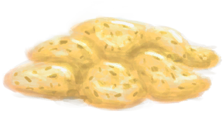
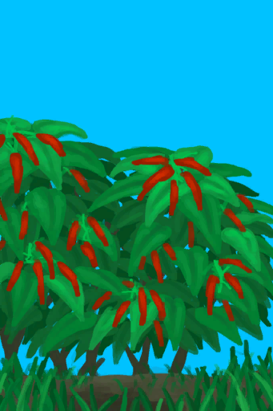
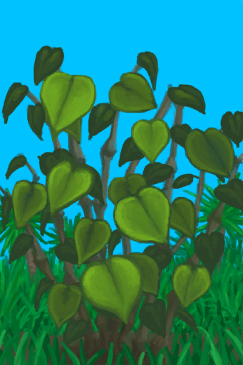
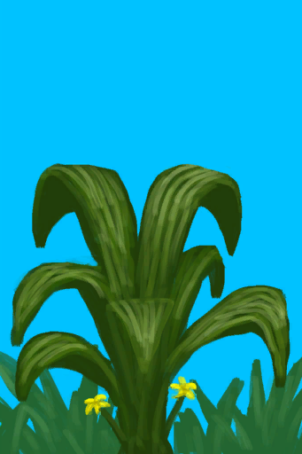

# Herbology(Skill)  
> Shows how good you are at recognizing and dealing with plants and mushrooms. Unlocks new recipes as it gets higher.  
> This skill unlocks different useful <b>blueprints</b> related to plants and medicine while also increasing your <b>chances</b> of finding useful plants while exploring.  It can be increased by <b>harvesting</b> plants and sometimes by <b>crafting</b> products with them.  
  

<b>Base Value: </b> 0 
  

<b>Value Range: </b> 0 ~ 150 
  

<b>Base Rate: </b> - 
  

<b>Staleness: </b>Staleness multiplier 80% in 3h(stack:2) 
  
## Change By  
<table class="table table-bordered" data-toggle="table"  ><thead style=""><tr ><th  style="text-align:left;vertical-align:top;"  >From</th><th  style="text-align:left;vertical-align:top;"  >Operation</th><th  style="text-align:left;vertical-align:top;"  data-sortable="true"  >Value</th></tr></thead><tr ><td  style="text-align:left;vertical-align:top;"  >[

[Aloe Gel(BluePrint)](Bp_AloeGel.md)](Bp_AloeGel.md)</td><td  style="text-align:left;vertical-align:top;"  >Craft BluePrint</td><td  style="text-align:left;vertical-align:top;"  >1</td></tr><tr ><td  style="text-align:left;vertical-align:top;"  >[

[Brimstone Gel(BluePrint)](Bp_BrimstoneGel.md)](Bp_BrimstoneGel.md)</td><td  style="text-align:left;vertical-align:top;"  >Craft BluePrint</td><td  style="text-align:left;vertical-align:top;"  >1</td></tr><tr ><td  style="text-align:left;vertical-align:top;"  >[

[Bug Repellant(BluePrint)](Bp_BugRepellent.md)](Bp_BugRepellent.md)</td><td  style="text-align:left;vertical-align:top;"  >Craft BluePrint</td><td  style="text-align:left;vertical-align:top;"  >1</td></tr><tr ><td  style="text-align:left;vertical-align:top;"  >[

[Crop Plot(BluePrint)](Bp_CropPlot.md)](Bp_CropPlot.md)</td><td  style="text-align:left;vertical-align:top;"  >Craft BluePrint</td><td  style="text-align:left;vertical-align:top;"  >1</td></tr><tr ><td  style="text-align:left;vertical-align:top;"  >[

[Mushroom Bed(BluePrint)](Bp_MushroomBed.md)](Bp_MushroomBed.md)</td><td  style="text-align:left;vertical-align:top;"  >Craft BluePrint</td><td  style="text-align:left;vertical-align:top;"  >1</td></tr><tr ><td  style="text-align:left;vertical-align:top;"  >[

[Brimstone Pesticide(BluePrint)](Bp_PesticideBrimstone.md)](Bp_PesticideBrimstone.md)</td><td  style="text-align:left;vertical-align:top;"  >Craft BluePrint</td><td  style="text-align:left;vertical-align:top;"  >1</td></tr><tr ><td  style="text-align:left;vertical-align:top;"  >[

[Chilli Pesticide(BluePrint)](Bp_PesticideChilli.md)](Bp_PesticideChilli.md)</td><td  style="text-align:left;vertical-align:top;"  >Craft BluePrint</td><td  style="text-align:left;vertical-align:top;"  >1</td></tr><tr ><td  style="text-align:left;vertical-align:top;"  >[

[Cinchona Powder(BluePrint)](Bp_Quinine.md)](Bp_Quinine.md)</td><td  style="text-align:left;vertical-align:top;"  >Craft BluePrint</td><td  style="text-align:left;vertical-align:top;"  >1</td></tr><tr ><td  style="text-align:left;vertical-align:top;"  >[

[Rice Paddy(BluePrint)](Bp_RicePaddy.md)](Bp_RicePaddy.md)</td><td  style="text-align:left;vertical-align:top;"  >Craft BluePrint</td><td  style="text-align:left;vertical-align:top;"  >1</td></tr><tr ><td  style="text-align:left;vertical-align:top;"  >[

[Ginger](Ginger.md)](Ginger.md)</td><td  style="text-align:left;vertical-align:top;"  >Grind Root ** With：**[“Hammer”](tag_Hammer.md)</td><td  style="text-align:left;vertical-align:top;"  >1</td></tr><tr ><td  style="text-align:left;vertical-align:top;"  >[

[Dried Ginger](GingerDried.md)](GingerDried.md)</td><td  style="text-align:left;vertical-align:top;"  >Grind Root ** With：**[“Hammer”](tag_Hammer.md)</td><td  style="text-align:left;vertical-align:top;"  >1</td></tr><tr ><td  style="text-align:left;vertical-align:top;"  >[

[Jasmine Flowers](JasmineFlowers.md)](JasmineFlowers.md)</td><td  style="text-align:left;vertical-align:top;"  >Grind ** With：**[“Hammer”](tag_Hammer.md)</td><td  style="text-align:left;vertical-align:top;"  >1</td></tr><tr ><td  style="text-align:left;vertical-align:top;"  >[

[Kava Root](KavaRoot.md)](KavaRoot.md)</td><td  style="text-align:left;vertical-align:top;"  >Grind Root ** With：**[“Hammer”](tag_Hammer.md)</td><td  style="text-align:left;vertical-align:top;"  >1</td></tr><tr ><td  style="text-align:left;vertical-align:top;"  >[

[Dried Kava Root](KavaRootDried.md)](KavaRootDried.md)</td><td  style="text-align:left;vertical-align:top;"  >Grind Root ** With：**[“Hammer”](tag_Hammer.md)</td><td  style="text-align:left;vertical-align:top;"  >1</td></tr><tr ><td  style="text-align:left;vertical-align:top;"  >[

[Lemongrass](LemongrassStalks.md)](LemongrassStalks.md)</td><td  style="text-align:left;vertical-align:top;"  >Grind ** With：**[“Hammer”](tag_Hammer.md)</td><td  style="text-align:left;vertical-align:top;"  >1</td></tr><tr ><td  style="text-align:left;vertical-align:top;"  >[

[Snake Grass](SnakeGrass.md)](SnakeGrass.md)</td><td  style="text-align:left;vertical-align:top;"  >Grind ** With：**[“Hammer”](tag_Hammer.md)</td><td  style="text-align:left;vertical-align:top;"  >1</td></tr><tr ><td  style="text-align:left;vertical-align:top;"  >[

[Aloe Vera](AloeVera.md)](AloeVera.md)</td><td  style="text-align:left;vertical-align:top;"  >Harvest Leaves</td><td  style="text-align:left;vertical-align:top;"  >1</td></tr><tr ><td  style="text-align:left;vertical-align:top;"  >[

[Assorted Mushrooms](AssortedMushroomsPlant.md)](AssortedMushroomsPlant.md)</td><td  style="text-align:left;vertical-align:top;"  >Harvest</td><td  style="text-align:left;vertical-align:top;"  >1</td></tr><tr ><td  style="text-align:left;vertical-align:top;"  >[

[Chilli Plant](ChiliPlant.md)](ChiliPlant.md)</td><td  style="text-align:left;vertical-align:top;"  >Harvest Chilies</td><td  style="text-align:left;vertical-align:top;"  >1</td></tr><tr ><td  style="text-align:left;vertical-align:top;"  >[

[Ginger Plant](GingerPlant.md)](GingerPlant.md)</td><td  style="text-align:left;vertical-align:top;"  >Harvest Roots</td><td  style="text-align:left;vertical-align:top;"  >1</td></tr><tr ><td  style="text-align:left;vertical-align:top;"  >[

[Kava Plant](KavaPlant.md)](KavaPlant.md)</td><td  style="text-align:left;vertical-align:top;"  >Harvest Roots</td><td  style="text-align:left;vertical-align:top;"  >1</td></tr><tr ><td  style="text-align:left;vertical-align:top;"  >[

[Lemongrass](Lemongrass.md)](Lemongrass.md)</td><td  style="text-align:left;vertical-align:top;"  >Harvest</td><td  style="text-align:left;vertical-align:top;"  >1</td></tr><tr ><td  style="text-align:left;vertical-align:top;"  >[

[Magic Mushrooms](MagicMushroomsPlant.md)](MagicMushroomsPlant.md)</td><td  style="text-align:left;vertical-align:top;"  >Harvest</td><td  style="text-align:left;vertical-align:top;"  >1</td></tr><tr ><td  style="text-align:left;vertical-align:top;"  >[

[Palm Bush](PalmBush.md)](PalmBush.md)</td><td  style="text-align:left;vertical-align:top;"  >Harvest</td><td  style="text-align:left;vertical-align:top;"  >1</td></tr><tr ><td  style="text-align:left;vertical-align:top;"  >[

[Snakegrass Patch](SnakegrassPatch.md)](SnakegrassPatch.md)</td><td  style="text-align:left;vertical-align:top;"  >Harvest</td><td  style="text-align:left;vertical-align:top;"  >1</td></tr><tr ><td  style="text-align:left;vertical-align:top;"  >[

[Spider Lily](SpiderLily.md)](SpiderLily.md)</td><td  style="text-align:left;vertical-align:top;"  >Harvest Leaves</td><td  style="text-align:left;vertical-align:top;"  >1</td></tr><tr ><td  style="text-align:left;vertical-align:top;"  >[

[Weevil Lily](WeevilLily.md)](WeevilLily.md)</td><td  style="text-align:left;vertical-align:top;"  >Harvest Leaves</td><td  style="text-align:left;vertical-align:top;"  >1</td></tr><tr ><td  style="text-align:left;vertical-align:top;"  >[

[Wild Yam](YamPlant.md)](YamPlant.md)</td><td  style="text-align:left;vertical-align:top;"  >Dig Up Tubers</td><td  style="text-align:left;vertical-align:top;"  >1</td></tr><tr ><td  style="text-align:left;vertical-align:top;"  >[

[Wild Yam](YamPlant.md)](YamPlant.md)</td><td  style="text-align:left;vertical-align:top;"  >Dig Up Tubers ** With：**[“Shovel”](tag_Shovel.md)</td><td  style="text-align:left;vertical-align:top;"  >1</td></tr><tr ><td  style="text-align:left;vertical-align:top;"  >[

[Almond Tree Crop Plot](CropPlotAlmondTree.md)](CropPlotAlmondTree.md)</td><td  style="text-align:left;vertical-align:top;"  >Destroy</td><td  style="text-align:left;vertical-align:top;"  >0.5</td></tr><tr ><td  style="text-align:left;vertical-align:top;"  >[

[Aloe Vera Crop Plot](CropPlotAloeVera.md)](CropPlotAloeVera.md)</td><td  style="text-align:left;vertical-align:top;"  >Destroy</td><td  style="text-align:left;vertical-align:top;"  >0.5</td></tr><tr ><td  style="text-align:left;vertical-align:top;"  >[

[Banana Crop Plot](CropPlotBananaTree.md)](CropPlotBananaTree.md)</td><td  style="text-align:left;vertical-align:top;"  >Destroy</td><td  style="text-align:left;vertical-align:top;"  >0.5</td></tr><tr ><td  style="text-align:left;vertical-align:top;"  >[

[Chili Crop Plot](CropPlotChilies.md)](CropPlotChilies.md)</td><td  style="text-align:left;vertical-align:top;"  >Destroy</td><td  style="text-align:left;vertical-align:top;"  >0.5</td></tr><tr ><td  style="text-align:left;vertical-align:top;"  >[

[China Rose Crop Plot](CropPlotChinaRose.md)](CropPlotChinaRose.md)</td><td  style="text-align:left;vertical-align:top;"  >Destroy</td><td  style="text-align:left;vertical-align:top;"  >0.5</td></tr><tr ><td  style="text-align:left;vertical-align:top;"  >[

[Cinchona Crop Plot](CropPlotCinchonaTree.md)](CropPlotCinchonaTree.md)</td><td  style="text-align:left;vertical-align:top;"  >Destroy</td><td  style="text-align:left;vertical-align:top;"  >0.5</td></tr><tr ><td  style="text-align:left;vertical-align:top;"  >[

[Coffee Crop Plot](CropPlotCoffee.md)](CropPlotCoffee.md)</td><td  style="text-align:left;vertical-align:top;"  >Destroy</td><td  style="text-align:left;vertical-align:top;"  >0.5</td></tr><tr ><td  style="text-align:left;vertical-align:top;"  >[

[Ginger Crop Plot](CropPlotGinger.md)](CropPlotGinger.md)</td><td  style="text-align:left;vertical-align:top;"  >Destroy</td><td  style="text-align:left;vertical-align:top;"  >0.5</td></tr><tr ><td  style="text-align:left;vertical-align:top;"  >[

[Jasmine Crop Plot](CropPlotJasmine.md)](CropPlotJasmine.md)</td><td  style="text-align:left;vertical-align:top;"  >Destroy</td><td  style="text-align:left;vertical-align:top;"  >0.5</td></tr><tr ><td  style="text-align:left;vertical-align:top;"  >[

[Kava Crop Plot](CropPlotKava.md)](CropPlotKava.md)</td><td  style="text-align:left;vertical-align:top;"  >Destroy</td><td  style="text-align:left;vertical-align:top;"  >0.5</td></tr><tr ><td  style="text-align:left;vertical-align:top;"  >[

[Lemon Grass Crop Plot](CropPlotLemonGrass.md)](CropPlotLemonGrass.md)</td><td  style="text-align:left;vertical-align:top;"  >Destroy</td><td  style="text-align:left;vertical-align:top;"  >0.5</td></tr><tr ><td  style="text-align:left;vertical-align:top;"  >[

[Mango Crop Plot](CropPlotMangoTree.md)](CropPlotMangoTree.md)</td><td  style="text-align:left;vertical-align:top;"  >Destroy</td><td  style="text-align:left;vertical-align:top;"  >0.5</td></tr><tr ><td  style="text-align:left;vertical-align:top;"  >[

[Nipa Palm Crop Plot](CropPlotNipaPalm.md)](CropPlotNipaPalm.md)</td><td  style="text-align:left;vertical-align:top;"  >Destroy</td><td  style="text-align:left;vertical-align:top;"  >0.5</td></tr><tr ><td  style="text-align:left;vertical-align:top;"  >[

[Palm Bush Crop Plot](CropPlotPalmBush.md)](CropPlotPalmBush.md)</td><td  style="text-align:left;vertical-align:top;"  >Destroy</td><td  style="text-align:left;vertical-align:top;"  >0.5</td></tr><tr ><td  style="text-align:left;vertical-align:top;"  >[

[Palm Tree Crop Plot](CropPlotPalmTree.md)](CropPlotPalmTree.md)</td><td  style="text-align:left;vertical-align:top;"  >Destroy</td><td  style="text-align:left;vertical-align:top;"  >0.5</td></tr><tr ><td  style="text-align:left;vertical-align:top;"  >[

[Rice Crop Plot](CropPlotRice.md)](CropPlotRice.md)</td><td  style="text-align:left;vertical-align:top;"  >Destroy</td><td  style="text-align:left;vertical-align:top;"  >0.5</td></tr><tr ><td  style="text-align:left;vertical-align:top;"  >[

[Ruined Crop Plot](CropPlotRuined.md)](CropPlotRuined.md)</td><td  style="text-align:left;vertical-align:top;"  >Destroy</td><td  style="text-align:left;vertical-align:top;"  >0.5</td></tr><tr ><td  style="text-align:left;vertical-align:top;"  >[

[Sago Palm Crop Plot](CropPlotSagoPalm.md)](CropPlotSagoPalm.md)</td><td  style="text-align:left;vertical-align:top;"  >Destroy</td><td  style="text-align:left;vertical-align:top;"  >0.5</td></tr><tr ><td  style="text-align:left;vertical-align:top;"  >[

[Snake Grass Crop Plot](CropPlotSnakeGrass.md)](CropPlotSnakeGrass.md)</td><td  style="text-align:left;vertical-align:top;"  >Destroy</td><td  style="text-align:left;vertical-align:top;"  >0.5</td></tr><tr ><td  style="text-align:left;vertical-align:top;"  >[

[Spider Lily Crop Plot](CropPlotSpiderLily.md)](CropPlotSpiderLily.md)</td><td  style="text-align:left;vertical-align:top;"  >Destroy</td><td  style="text-align:left;vertical-align:top;"  >0.5</td></tr><tr ><td  style="text-align:left;vertical-align:top;"  >[

[Weevil Lily Crop Plot](CropPlotWeevilLily.md)](CropPlotWeevilLily.md)</td><td  style="text-align:left;vertical-align:top;"  >Destroy</td><td  style="text-align:left;vertical-align:top;"  >0.5</td></tr><tr ><td  style="text-align:left;vertical-align:top;"  >[

[Wild Jujube Crop Plot](CropPlotWildJujube.md)](CropPlotWildJujube.md)</td><td  style="text-align:left;vertical-align:top;"  >Destroy</td><td  style="text-align:left;vertical-align:top;"  >0.5</td></tr><tr ><td  style="text-align:left;vertical-align:top;"  >[

[Yam Crop Plot](CropPlotYam.md)](CropPlotYam.md)</td><td  style="text-align:left;vertical-align:top;"  >Destroy</td><td  style="text-align:left;vertical-align:top;"  >0.5</td></tr><tr ><td  style="text-align:left;vertical-align:top;"  >[

[Spider Lily Leaves](SpiderLilyLeaves.md)](SpiderLilyLeaves.md)</td><td  style="text-align:left;vertical-align:top;"  >Grind Leaves ** With：**[“Hammer”](tag_Hammer.md)</td><td  style="text-align:left;vertical-align:top;"  >0.5</td></tr><tr ><td  style="text-align:left;vertical-align:top;"  >[

[Dried Spider Lily Leaves](SpiderLilyLeavesDried.md)](SpiderLilyLeavesDried.md)</td><td  style="text-align:left;vertical-align:top;"  >Grind Leaves ** With：**[“Hammer”](tag_Hammer.md)</td><td  style="text-align:left;vertical-align:top;"  >0.5</td></tr><tr ><td  style="text-align:left;vertical-align:top;"  >[

[Weevil Lily Leaves](WeevilLilyLeaves.md)](WeevilLilyLeaves.md)</td><td  style="text-align:left;vertical-align:top;"  >Make bandage</td><td  style="text-align:left;vertical-align:top;"  >0.5</td></tr><tr ><td  style="text-align:left;vertical-align:top;"  >[

[Coffee Bush](CoffeePlant.md)](CoffeePlant.md)</td><td  style="text-align:left;vertical-align:top;"  >Harvest</td><td  style="text-align:left;vertical-align:top;"  >0.5</td></tr><tr ><td  style="text-align:left;vertical-align:top;"  >[

[Nipa Palm](NipaPalm.md)](NipaPalm.md)</td><td  style="text-align:left;vertical-align:top;"  >Cut Nipa Fruit ** With：**[“Cutter”](tag_Cutter.md) , [“Axe”](tag_Axe.md)</td><td  style="text-align:left;vertical-align:top;"  >0.5</td></tr><tr ><td  style="text-align:left;vertical-align:top;"  >[

[Puffballs](PuffballsPlant.md)](PuffballsPlant.md)</td><td  style="text-align:left;vertical-align:top;"  >Harvest</td><td  style="text-align:left;vertical-align:top;"  >0.5</td></tr></tbody></table>  
  
## Required By  
<table class="table table-bordered" data-toggle="table"  ><thead style=""><tr ><th  style="text-align:left;vertical-align:top;"  >From</th><th  style="text-align:left;vertical-align:top;"  >Operation</th><th  style="text-align:left;vertical-align:top;"  data-sortable="true"  >Value</th></tr></thead><tr ><td  style="text-align:left;vertical-align:top;"  >[Herbology Improved!(Event)](Event_SkillHerbology4.md)</td><td  style="text-align:left;vertical-align:top;"  >Event</td><td  style="text-align:left;vertical-align:top;"  >150</td></tr><tr ><td  style="text-align:left;vertical-align:top;"  >[Herbology Improved!(Event)](Event_SkillHerbology3.md)</td><td  style="text-align:left;vertical-align:top;"  >Event</td><td  style="text-align:left;vertical-align:top;"  >70 ~ 150</td></tr><tr ><td  style="text-align:left;vertical-align:top;"  >[Herbology Improved!(Event)](Event_SkillHerbology2.md)</td><td  style="text-align:left;vertical-align:top;"  >Event</td><td  style="text-align:left;vertical-align:top;"  >30 ~ 150</td></tr><tr ><td  style="text-align:left;vertical-align:top;"  >[Herbology Improved!(Event)](Event_SkillHerbology1.md)</td><td  style="text-align:left;vertical-align:top;"  >Event</td><td  style="text-align:left;vertical-align:top;"  >10 ~ 150</td></tr><tr ><td  style="text-align:left;vertical-align:top;"  >[Assorted Mushrooms](AssortedMushrooms.md)</td><td  style="text-align:left;vertical-align:top;"  >影响</td><td  style="text-align:left;vertical-align:top;"  >0 ~ 150</td></tr><tr ><td  style="text-align:left;vertical-align:top;"  >[Bay](Bay.md)</td><td  style="text-align:left;vertical-align:top;"  >影响</td><td  style="text-align:left;vertical-align:top;"  >0 ~ 150</td></tr><tr ><td  style="text-align:left;vertical-align:top;"  >[Beach](Beach.md)</td><td  style="text-align:left;vertical-align:top;"  >影响</td><td  style="text-align:left;vertical-align:top;"  >0 ~ 150</td></tr><tr ><td  style="text-align:left;vertical-align:top;"  >[Deep Jungle(Jungle)](DeepJungle.md)</td><td  style="text-align:left;vertical-align:top;"  >影响</td><td  style="text-align:left;vertical-align:top;"  >0 ~ 150</td></tr><tr ><td  style="text-align:left;vertical-align:top;"  >[Desolate Beach](DesolateBeach.md)</td><td  style="text-align:left;vertical-align:top;"  >影响</td><td  style="text-align:left;vertical-align:top;"  >0 ~ 150</td></tr><tr ><td  style="text-align:left;vertical-align:top;"  >[Eastern Grasslands](GrasslandsE.md)</td><td  style="text-align:left;vertical-align:top;"  >影响</td><td  style="text-align:left;vertical-align:top;"  >0 ~ 150</td></tr><tr ><td  style="text-align:left;vertical-align:top;"  >[Western Grasslands](GrasslandsW.md)</td><td  style="text-align:left;vertical-align:top;"  >影响</td><td  style="text-align:left;vertical-align:top;"  >0 ~ 150</td></tr><tr ><td  style="text-align:left;vertical-align:top;"  >[Eastern Highlands](HighlandsEastern.md)</td><td  style="text-align:left;vertical-align:top;"  >影响</td><td  style="text-align:left;vertical-align:top;"  >0 ~ 150</td></tr><tr ><td  style="text-align:left;vertical-align:top;"  >[Western Highlands](HighlandsWestern.md)</td><td  style="text-align:left;vertical-align:top;"  >影响</td><td  style="text-align:left;vertical-align:top;"  >0 ~ 150</td></tr><tr ><td  style="text-align:left;vertical-align:top;"  >[Jungle](Jungle.md)</td><td  style="text-align:left;vertical-align:top;"  >影响</td><td  style="text-align:left;vertical-align:top;"  >0 ~ 150</td></tr><tr ><td  style="text-align:left;vertical-align:top;"  >[Jungle Highlands](JungleHighlands.md)</td><td  style="text-align:left;vertical-align:top;"  >影响</td><td  style="text-align:left;vertical-align:top;"  >0 ~ 150</td></tr><tr ><td  style="text-align:left;vertical-align:top;"  >[Mangrove Forest](Mangroves.md)</td><td  style="text-align:left;vertical-align:top;"  >影响</td><td  style="text-align:left;vertical-align:top;"  >0 ~ 150</td></tr><tr ><td  style="text-align:left;vertical-align:top;"  >[Jungle Outskirts(Outskirts)](Outskirts.md)</td><td  style="text-align:left;vertical-align:top;"  >影响</td><td  style="text-align:left;vertical-align:top;"  >0 ~ 150</td></tr><tr ><td  style="text-align:left;vertical-align:top;"  >[Secret Valley](SecretValley.md)</td><td  style="text-align:left;vertical-align:top;"  >影响</td><td  style="text-align:left;vertical-align:top;"  >0 ~ 150</td></tr><tr ><td  style="text-align:left;vertical-align:top;"  >[Wetland Jungle(Wetlands)](Wetlands.md)</td><td  style="text-align:left;vertical-align:top;"  >影响</td><td  style="text-align:left;vertical-align:top;"  >0 ~ 150</td></tr></tbody></table>  
  

