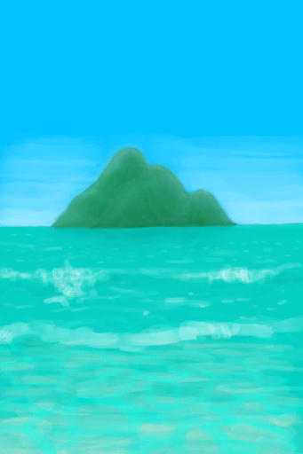

# Insight(Skill)  
> Shows how deep your understanding of reality is.  
  

<b>Base Value: </b> 0 
  

<b>Value Range: </b> 0 ~ 150 
  

<b>Base Rate: </b> - 
  

<b>Staleness: </b>Staleness multiplier 80% in 3h(stack:2) 
  
## Change By  
<table class="table table-bordered" data-toggle="table"  ><thead style=""><tr ><th  style="text-align:left;vertical-align:top;"  >From</th><th  style="text-align:left;vertical-align:top;"  >Operation</th><th  style="text-align:left;vertical-align:top;"  data-sortable="true"  >Value</th></tr></thead><tr ><td  style="text-align:left;vertical-align:top;"  >[

[Ambrosia Flask](CoconutFlaskAmbrosia.md)](CoconutFlaskAmbrosia.md)(未实装)</td><td  style="text-align:left;vertical-align:top;"  >Drink</td><td  style="text-align:left;vertical-align:top;"  >150</td></tr><tr ><td  style="text-align:left;vertical-align:top;"  >[

[Divine Insight(Event)](Event_GodExperience1g.md)](Event_GodExperience1g.md)</td><td  style="text-align:left;vertical-align:top;"  >HOLD ON TIGHT!</td><td  style="text-align:left;vertical-align:top;"  >25</td></tr><tr ><td  style="text-align:left;vertical-align:top;"  >[

[Void Insight(Event)](Event_VoidExperience1g.md)](Event_VoidExperience1g.md)</td><td  style="text-align:left;vertical-align:top;"  >My mind is breaking!</td><td  style="text-align:left;vertical-align:top;"  >25</td></tr><tr ><td  style="text-align:left;vertical-align:top;"  >[

[Weston(Special2e)(Event)](Event_WestonSpecial2e.md)](Event_WestonSpecial2e.md)</td><td  style="text-align:left;vertical-align:top;"  >Uhm...</td><td  style="text-align:left;vertical-align:top;"  >20</td></tr><tr ><td  style="text-align:left;vertical-align:top;"  >[

[Weston(Special3d)(Event)](Event_WestonSpecial3d.md)](Event_WestonSpecial3d.md)</td><td  style="text-align:left;vertical-align:top;"  >Okay...</td><td  style="text-align:left;vertical-align:top;"  >20</td></tr><tr ><td  style="text-align:left;vertical-align:top;"  >[

[Weston(Special4e)(Event)](Event_WestonSpecial4e.md)](Event_WestonSpecial4e.md)</td><td  style="text-align:left;vertical-align:top;"  >Continue</td><td  style="text-align:left;vertical-align:top;"  >20</td></tr><tr ><td  style="text-align:left;vertical-align:top;"  >[

[You had an epiphany!(Event)](Event_SkillInsight1.md)](Event_SkillInsight1.md)</td><td  style="text-align:left;vertical-align:top;"  >Continue</td><td  style="text-align:left;vertical-align:top;"  >10</td></tr><tr ><td  style="text-align:left;vertical-align:top;"  >[

[You had an epiphany!(Event)](Event_SkillInsight2.md)](Event_SkillInsight2.md)</td><td  style="text-align:left;vertical-align:top;"  >Continue</td><td  style="text-align:left;vertical-align:top;"  >10</td></tr><tr ><td  style="text-align:left;vertical-align:top;"  >[

[You had an epiphany!(Event)](Event_SkillInsight3.md)](Event_SkillInsight3.md)</td><td  style="text-align:left;vertical-align:top;"  >Continue</td><td  style="text-align:left;vertical-align:top;"  >10</td></tr><tr ><td  style="text-align:left;vertical-align:top;"  >[

[You had an epiphany!(Event)](Event_SkillInsight4.md)](Event_SkillInsight4.md)</td><td  style="text-align:left;vertical-align:top;"  >Continue</td><td  style="text-align:left;vertical-align:top;"  >10</td></tr><tr ><td  style="text-align:left;vertical-align:top;"  >[

[Void Insight(Event)](Event_SpiritsEverywhere1g.md)](Event_SpiritsEverywhere1g.md)(未实装)</td><td  style="text-align:left;vertical-align:top;"  >UNBEARABLE MIND PAIN!</td><td  style="text-align:left;vertical-align:top;"  >10</td></tr><tr ><td  style="text-align:left;vertical-align:top;"  >[

[Divine Insight(Event)](Event_HuntedExperience1g.md)](Event_HuntedExperience1g.md)(未实装)</td><td  style="text-align:left;vertical-align:top;"  >HOLD ON TIGHT!</td><td  style="text-align:left;vertical-align:top;"  >5</td></tr><tr ><td  style="text-align:left;vertical-align:top;"  >[

[Watcher(Event)](Event_WatchedExperience1gGod.md)](Event_WatchedExperience1gGod.md)</td><td  style="text-align:left;vertical-align:top;"  >Become the Watcher</td><td  style="text-align:left;vertical-align:top;"  >5</td></tr><tr ><td  style="text-align:left;vertical-align:top;"  >[

[Watcher(Event)](Event_WatchedExperience1gVoid.md)](Event_WatchedExperience1gVoid.md)</td><td  style="text-align:left;vertical-align:top;"  >Nothing is watching you</td><td  style="text-align:left;vertical-align:top;"  >5</td></tr><tr ><td  style="text-align:left;vertical-align:top;"  >[

[The Enemy has been defeated!(Event)](Event_EnemyFightSuccess.md)](Event_EnemyFightSuccess.md)</td><td  style="text-align:left;vertical-align:top;"  >Victory!</td><td  style="text-align:left;vertical-align:top;"  >2</td></tr><tr ><td  style="text-align:left;vertical-align:top;"  >[

[The Hunter was defeated!(Event)](Event_HunterFightSuccess.md)](Event_HunterFightSuccess.md)</td><td  style="text-align:left;vertical-align:top;"  >Victory!</td><td  style="text-align:left;vertical-align:top;"  >2</td></tr></tbody></table>  
  
## Required By  
<table class="table table-bordered" data-toggle="table"  ><thead style=""><tr ><th  style="text-align:left;vertical-align:top;"  >From</th><th  style="text-align:left;vertical-align:top;"  >Operation</th><th  style="text-align:left;vertical-align:top;"  data-sortable="true"  >Value</th></tr></thead><tr ><td  style="text-align:left;vertical-align:top;"  >[Weston(Special5c)(Event)](Event_WestonSpecial5c.md)</td><td  style="text-align:left;vertical-align:top;"  >It's working.</td><td  style="text-align:left;vertical-align:top;"  >150</td></tr><tr ><td  style="text-align:left;vertical-align:top;"  >[Weston](Weston.md)</td><td  style="text-align:left;vertical-align:top;"  >I'm ready Wes</td><td  style="text-align:left;vertical-align:top;"  >125 ~ 150</td></tr><tr ><td  style="text-align:left;vertical-align:top;"  >[You had an epiphany!(Event)](Event_SkillInsight4.md)</td><td  style="text-align:left;vertical-align:top;"  >Event</td><td  style="text-align:left;vertical-align:top;"  >100</td></tr><tr ><td  style="text-align:left;vertical-align:top;"  >[You had an epiphany!(Event)](Event_SkillInsight3.md)</td><td  style="text-align:left;vertical-align:top;"  >Event</td><td  style="text-align:left;vertical-align:top;"  >75 ~ 100</td></tr><tr ><td  style="text-align:left;vertical-align:top;"  >[Weston(Special5c)(Event)](Event_WestonSpecial5c.md)</td><td  style="text-align:left;vertical-align:top;"  >Not working...</td><td  style="text-align:left;vertical-align:top;"  >0 ~ 149</td></tr></tbody></table>  
  

