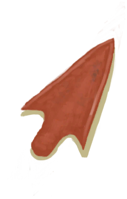

# Metalworking(Skill)  
> Shows how good you are at working with metal. Unlocks new recipes as it gets higher.  
> "Metalworking allows to craft useful tools out of <b>Copper</b>.  The greater your skill the more complex and advanced your crafts can be. At its lower levels you should be able to craft <b>Knives  
  

<b>Base Value: </b> 0 
  

<b>Value Range: </b> 0 ~ 150 
  

<b>Base Rate: </b> - 
  

<b>Staleness: </b>Staleness multiplier 80% in 3h(stack:2) 
  
## Change By  
<table class="table table-bordered" data-toggle="table"  ><thead style=""><tr ><th  style="text-align:left;vertical-align:top;"  >From</th><th  style="text-align:left;vertical-align:top;"  >Operation</th><th  style="text-align:left;vertical-align:top;"  data-sortable="true"  >Value</th></tr></thead><tr ><td  style="text-align:left;vertical-align:top;"  >[

[Copper Bottle(BluePrint)](Bp_CopperBottle.md)](Bp_CopperBottle.md)</td><td  style="text-align:left;vertical-align:top;"  >Craft BluePrint</td><td  style="text-align:left;vertical-align:top;"  >2</td></tr><tr ><td  style="text-align:left;vertical-align:top;"  >[

[Copper Necklace(BluePrint)](Bp_CopperNecklace.md)](Bp_CopperNecklace.md)</td><td  style="text-align:left;vertical-align:top;"  >Craft BluePrint</td><td  style="text-align:left;vertical-align:top;"  >2</td></tr><tr ><td  style="text-align:left;vertical-align:top;"  >[

[Copper Eating Utensils(BluePrint)](Bp_EatingUtensilsCopper.md)](Bp_EatingUtensilsCopper.md)</td><td  style="text-align:left;vertical-align:top;"  >Craft BluePrint</td><td  style="text-align:left;vertical-align:top;"  >2</td></tr><tr ><td  style="text-align:left;vertical-align:top;"  >[

[Copper Jar(BluePrint)](Bp_CopperJar.md)](Bp_CopperJar.md)</td><td  style="text-align:left;vertical-align:top;"  >Craft BluePrint</td><td  style="text-align:left;vertical-align:top;"  >1</td></tr><tr ><td  style="text-align:left;vertical-align:top;"  >[

[Copper Needles(BluePrint)](Bp_CopperNeedles.md)](Bp_CopperNeedles.md)</td><td  style="text-align:left;vertical-align:top;"  >Craft BluePrint</td><td  style="text-align:left;vertical-align:top;"  >1</td></tr><tr ><td  style="text-align:left;vertical-align:top;"  >[

[Copper Sheet(BluePrint)](Bp_CopperSheet.md)](Bp_CopperSheet.md)</td><td  style="text-align:left;vertical-align:top;"  >Craft BluePrint</td><td  style="text-align:left;vertical-align:top;"  >0.5</td></tr><tr ><td  style="text-align:left;vertical-align:top;"  >[

[Blunt Axe Head](AxeHeadBlunt.md)](AxeHeadBlunt.md)</td><td  style="text-align:left;vertical-align:top;"  >Sharpen ** With：**[Stone](Stone.md) , [Heavy Stone](StoneHeavy.md)</td><td  style="text-align:left;vertical-align:top;"  >0.5</td></tr><tr ><td  style="text-align:left;vertical-align:top;"  >[

[Blunt Knife](KnifeCopperBlunt.md)](KnifeCopperBlunt.md)</td><td  style="text-align:left;vertical-align:top;"  >Sharpen ** With：**[Stone](Stone.md) , [Heavy Stone](StoneHeavy.md)</td><td  style="text-align:left;vertical-align:top;"  >0.5</td></tr><tr ><td  style="text-align:left;vertical-align:top;"  >[

[Grandfather's Blunt Knife](KnifeGrandpaBlunt.md)](KnifeGrandpaBlunt.md)</td><td  style="text-align:left;vertical-align:top;"  >Sharpen ** With：**[Stone](Stone.md) , [Heavy Stone](StoneHeavy.md) , [Sulphurous Stone](StoneHeavyBrimstone.md)</td><td  style="text-align:left;vertical-align:top;"  >0.5</td></tr><tr ><td  style="text-align:left;vertical-align:top;"  >[

[Blunt Spear Head](SpearHeadBlunt.md)](SpearHeadBlunt.md)</td><td  style="text-align:left;vertical-align:top;"  >Sharpen ** With：**[Stone](Stone.md) , [Heavy Stone](StoneHeavy.md)</td><td  style="text-align:left;vertical-align:top;"  >0.5</td></tr><tr ><td  style="text-align:left;vertical-align:top;"  >[

[Blunt Survival Axe](AxeSurvivalBlunt.md)](AxeSurvivalBlunt.md)</td><td  style="text-align:left;vertical-align:top;"  >Sharpen ** With：**[Stone](Stone.md) , [Heavy Stone](StoneHeavy.md)</td><td  style="text-align:left;vertical-align:top;"  >0.25</td></tr><tr ><td  style="text-align:left;vertical-align:top;"  >[

[Blunt Knife](KnifeMilitaryBlunt.md)](KnifeMilitaryBlunt.md)</td><td  style="text-align:left;vertical-align:top;"  >Sharpen ** With：**[Stone](Stone.md) , [Heavy Stone](StoneHeavy.md)</td><td  style="text-align:left;vertical-align:top;"  >0.25</td></tr></tbody></table>  
  
## Required By  
<table class="table table-bordered" data-toggle="table"  ><thead style=""><tr ><th  style="text-align:left;vertical-align:top;"  >From</th><th  style="text-align:left;vertical-align:top;"  >Operation</th><th  style="text-align:left;vertical-align:top;"  data-sortable="true"  >Value</th></tr></thead><tr ><td  style="text-align:left;vertical-align:top;"  >[Metalworking Improved!(Event)](Event_SkillMetalworking4.md)</td><td  style="text-align:left;vertical-align:top;"  >Event</td><td  style="text-align:left;vertical-align:top;"  >150</td></tr><tr ><td  style="text-align:left;vertical-align:top;"  >[Crafting Improved!(Event)](Event_SkillMetalworking3.md)</td><td  style="text-align:left;vertical-align:top;"  >Event</td><td  style="text-align:left;vertical-align:top;"  >70 ~ 150</td></tr><tr ><td  style="text-align:left;vertical-align:top;"  >[Metalworking Improved!(Event)](Event_SkillMetalworking2.md)</td><td  style="text-align:left;vertical-align:top;"  >Event</td><td  style="text-align:left;vertical-align:top;"  >30 ~ 150</td></tr><tr ><td  style="text-align:left;vertical-align:top;"  >[Metalworking Improved!(Event)](Event_SkillMetalworking1.md)</td><td  style="text-align:left;vertical-align:top;"  >Event</td><td  style="text-align:left;vertical-align:top;"  >10 ~ 150</td></tr><tr ><td  style="text-align:left;vertical-align:top;"  >[Copper Decoration](CopperDecoration_Mold.md)</td><td  style="text-align:left;vertical-align:top;"  >影响</td><td  style="text-align:left;vertical-align:top;"  >1 ~ 150</td></tr></tbody></table>  
  

