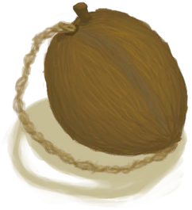
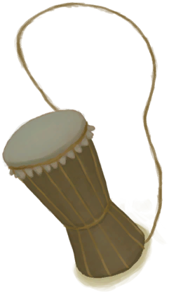

# Percussion(Skill)  
> Shows how good you are at playing percussive instruments. Unlocks new rhythms as it gets higher.  
> "This skill allows you to play <b>Drums</b> and other percussive instruments.  The higher your skill the more <b>Rhythms</b> you can play. Different Rhythms have different effects and durations. They generally increase your <b>Morale</b>  
  

<b>Base Value: </b> 0 
  

<b>Value Range: </b> 0 ~ 150 
  

<b>Base Rate: </b> - 
  

<b>Staleness: </b>Staleness multiplier 80% in 3h(stack:2) 
  
## Change By  
<table class="table table-bordered" data-toggle="table"  ><thead style=""><tr ><th  style="text-align:left;vertical-align:top;"  >From</th><th  style="text-align:left;vertical-align:top;"  >Operation</th><th  style="text-align:left;vertical-align:top;"  data-sortable="true"  >Value</th></tr></thead><tr ><td  style="text-align:left;vertical-align:top;"  >[

[Ambrosia Flask](CoconutFlaskAmbrosia.md)](CoconutFlaskAmbrosia.md)(未实装)</td><td  style="text-align:left;vertical-align:top;"  >Skills</td><td  style="text-align:left;vertical-align:top;"  >150</td></tr><tr ><td  style="text-align:left;vertical-align:top;"  >[

[Drum(Event)](Event_DrumMenu.md)](Event_DrumMenu.md)(未实装)</td><td  style="text-align:left;vertical-align:top;"  >Practice</td><td  style="text-align:left;vertical-align:top;"  >1</td></tr><tr ><td  style="text-align:left;vertical-align:top;"  >[

[Drum(Event)](Event_DrumMenu.md)](Event_DrumMenu.md)(未实装)</td><td  style="text-align:left;vertical-align:top;"  >Flowing Rythm</td><td  style="text-align:left;vertical-align:top;"  >1</td></tr><tr ><td  style="text-align:left;vertical-align:top;"  >[

[Drum(Event)](Event_DrumMenu.md)](Event_DrumMenu.md)(未实装)</td><td  style="text-align:left;vertical-align:top;"  >Intense Rythm</td><td  style="text-align:left;vertical-align:top;"  >1</td></tr><tr ><td  style="text-align:left;vertical-align:top;"  >[

[Drum](Drum.md)](Drum.md)</td><td  style="text-align:left;vertical-align:top;"  >Practice</td><td  style="text-align:left;vertical-align:top;"  >1</td></tr><tr ><td  style="text-align:left;vertical-align:top;"  >[

[Drum](Drum.md)](Drum.md)</td><td  style="text-align:left;vertical-align:top;"  >Flowing Rhythm</td><td  style="text-align:left;vertical-align:top;"  >1</td></tr><tr ><td  style="text-align:left;vertical-align:top;"  >[

[Drum](Drum.md)](Drum.md)</td><td  style="text-align:left;vertical-align:top;"  >Intense Rhythm</td><td  style="text-align:left;vertical-align:top;"  >1</td></tr><tr ><td  style="text-align:left;vertical-align:top;"  >[

[Drum](Drum.md)](Drum.md)</td><td  style="text-align:left;vertical-align:top;"  >Drum Trance</td><td  style="text-align:left;vertical-align:top;"  >1</td></tr><tr ><td  style="text-align:left;vertical-align:top;"  >[

[Lizard Drum](LizardDrum.md)](LizardDrum.md)</td><td  style="text-align:left;vertical-align:top;"  >Practice</td><td  style="text-align:left;vertical-align:top;"  >1</td></tr><tr ><td  style="text-align:left;vertical-align:top;"  >[

[Lizard Drum](LizardDrum.md)](LizardDrum.md)</td><td  style="text-align:left;vertical-align:top;"  >Flowing Rhythm</td><td  style="text-align:left;vertical-align:top;"  >1</td></tr><tr ><td  style="text-align:left;vertical-align:top;"  >[

[Lizard Drum](LizardDrum.md)](LizardDrum.md)</td><td  style="text-align:left;vertical-align:top;"  >Intense Rhythm</td><td  style="text-align:left;vertical-align:top;"  >1</td></tr><tr ><td  style="text-align:left;vertical-align:top;"  >[

[Lizard Drum](LizardDrum.md)](LizardDrum.md)</td><td  style="text-align:left;vertical-align:top;"  >Drum Trance</td><td  style="text-align:left;vertical-align:top;"  >1</td></tr><tr ><td  style="text-align:left;vertical-align:top;"  >[

[Lizard Drum](LizardDrum.md)](LizardDrum.md)</td><td  style="text-align:left;vertical-align:top;"  >Summoning Rhythm</td><td  style="text-align:left;vertical-align:top;"  >1</td></tr></tbody></table>  
  
## Required By  
<table class="table table-bordered" data-toggle="table"  ><thead style=""><tr ><th  style="text-align:left;vertical-align:top;"  >From</th><th  style="text-align:left;vertical-align:top;"  >Operation</th><th  style="text-align:left;vertical-align:top;"  data-sortable="true"  >Value</th></tr></thead><tr ><td  style="text-align:left;vertical-align:top;"  >[Percussion Improved!(Event)](Event_SkillPercussion4.md)</td><td  style="text-align:left;vertical-align:top;"  >Event</td><td  style="text-align:left;vertical-align:top;"  >150</td></tr><tr ><td  style="text-align:left;vertical-align:top;"  >[Drum](Drum.md)</td><td  style="text-align:left;vertical-align:top;"  >Drum Trance</td><td  style="text-align:left;vertical-align:top;"  >75 ~ 150</td></tr><tr ><td  style="text-align:left;vertical-align:top;"  >[Lizard Drum](LizardDrum.md)</td><td  style="text-align:left;vertical-align:top;"  >Drum Trance</td><td  style="text-align:left;vertical-align:top;"  >75 ~ 150</td></tr><tr ><td  style="text-align:left;vertical-align:top;"  >[Percussion Improved!(Event)](Event_SkillPercussion3.md)</td><td  style="text-align:left;vertical-align:top;"  >Event</td><td  style="text-align:left;vertical-align:top;"  >70 ~ 150</td></tr><tr ><td  style="text-align:left;vertical-align:top;"  >[Drum(Event)](Event_DrumMenu.md)</td><td  style="text-align:left;vertical-align:top;"  >Intense Rythm</td><td  style="text-align:left;vertical-align:top;"  >30 ~ 150</td></tr><tr ><td  style="text-align:left;vertical-align:top;"  >[Drum](Drum.md)</td><td  style="text-align:left;vertical-align:top;"  >Intense Rhythm</td><td  style="text-align:left;vertical-align:top;"  >30 ~ 150</td></tr><tr ><td  style="text-align:left;vertical-align:top;"  >[Lizard Drum](LizardDrum.md)</td><td  style="text-align:left;vertical-align:top;"  >Intense Rhythm</td><td  style="text-align:left;vertical-align:top;"  >30 ~ 150</td></tr><tr ><td  style="text-align:left;vertical-align:top;"  >[Lizard Drum](LizardDrum.md)</td><td  style="text-align:left;vertical-align:top;"  >Summoning Rhythm</td><td  style="text-align:left;vertical-align:top;"  >30 ~ 150</td></tr><tr ><td  style="text-align:left;vertical-align:top;"  >[Percussion Improved!(Event)](Event_SkillPercussion2.md)</td><td  style="text-align:left;vertical-align:top;"  >Event</td><td  style="text-align:left;vertical-align:top;"  >30 ~ 150</td></tr><tr ><td  style="text-align:left;vertical-align:top;"  >[Drum(Event)](Event_DrumMenu.md)</td><td  style="text-align:left;vertical-align:top;"  >Flowing Rythm</td><td  style="text-align:left;vertical-align:top;"  >10 ~ 150</td></tr><tr ><td  style="text-align:left;vertical-align:top;"  >[Drum](Drum.md)</td><td  style="text-align:left;vertical-align:top;"  >Flowing Rhythm</td><td  style="text-align:left;vertical-align:top;"  >10 ~ 150</td></tr><tr ><td  style="text-align:left;vertical-align:top;"  >[Lizard Drum](LizardDrum.md)</td><td  style="text-align:left;vertical-align:top;"  >Flowing Rhythm</td><td  style="text-align:left;vertical-align:top;"  >10 ~ 150</td></tr><tr ><td  style="text-align:left;vertical-align:top;"  >[Percussion Improved!(Event)](Event_SkillPercussion1.md)</td><td  style="text-align:left;vertical-align:top;"  >Event</td><td  style="text-align:left;vertical-align:top;"  >10 ~ 150</td></tr><tr ><td  style="text-align:left;vertical-align:top;"  >[Drum(Event)](Event_DrumMenu.md)</td><td  style="text-align:left;vertical-align:top;"  >Practice</td><td  style="text-align:left;vertical-align:top;"  >0 ~ 10</td></tr><tr ><td  style="text-align:left;vertical-align:top;"  >[Drum](Drum.md)</td><td  style="text-align:left;vertical-align:top;"  >Practice</td><td  style="text-align:left;vertical-align:top;"  >0 ~ 30</td></tr><tr ><td  style="text-align:left;vertical-align:top;"  >[Lizard Drum](LizardDrum.md)</td><td  style="text-align:left;vertical-align:top;"  >Practice</td><td  style="text-align:left;vertical-align:top;"  >0 ~ 30</td></tr></tbody></table>  
  

