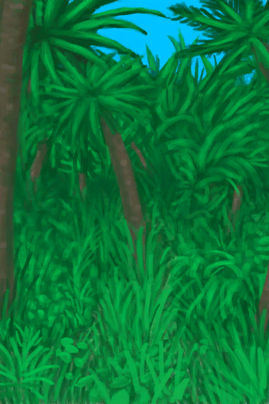

# Stealth(Skill)  
> Shows how good you are at staying unnoticed. Lowers your chances of being hurt by animals when retreating.  
> This skill can help you escape from animal encounters <b>unharmed</b>.  To increase it you should just train by retreating during such encounters.  
  

<b>Base Value: </b> 0 
  

<b>Value Range: </b> 0 ~ 150 
  

<b>Base Rate: </b> - 
  

<b>Staleness: </b>Staleness multiplier 80% in 3h(stack:2) 
  
## Change By  
<table class="table table-bordered" data-toggle="table"  ><thead style=""><tr ><th  style="text-align:left;vertical-align:top;"  >From</th><th  style="text-align:left;vertical-align:top;"  >Operation</th><th  style="text-align:left;vertical-align:top;"  data-sortable="true"  >Value</th></tr></thead><tr ><td  style="text-align:left;vertical-align:top;"  >[

[I see a Boar!(Event)](Event_BoarFight.md)](Event_BoarFight.md)</td><td  style="text-align:left;vertical-align:top;"  >Retreat</td><td  style="text-align:left;vertical-align:top;"  >1</td></tr><tr ><td  style="text-align:left;vertical-align:top;"  >[

[Spitting Cobra!(Event)](Event_CobraFight.md)](Event_CobraFight.md)</td><td  style="text-align:left;vertical-align:top;"  >Retreat</td><td  style="text-align:left;vertical-align:top;"  >1</td></tr><tr ><td  style="text-align:left;vertical-align:top;"  >[

[Attack Drone!(Event)](Event_DroneFight.md)](Event_DroneFight.md)</td><td  style="text-align:left;vertical-align:top;"  >Retreat</td><td  style="text-align:left;vertical-align:top;"  >1</td></tr><tr ><td  style="text-align:left;vertical-align:top;"  >[

[The Enemy is here!(Event)](Event_EnemyFight.md)](Event_EnemyFight.md)</td><td  style="text-align:left;vertical-align:top;"  >Flee</td><td  style="text-align:left;vertical-align:top;"  >1</td></tr><tr ><td  style="text-align:left;vertical-align:top;"  >[

[The Hunter is here(Event)](Event_HunterFight.md)](Event_HunterFight.md)</td><td  style="text-align:left;vertical-align:top;"  >Flee</td><td  style="text-align:left;vertical-align:top;"  >1</td></tr><tr ><td  style="text-align:left;vertical-align:top;"  >[

[The Macaques attack!(Event)](Event_MacaqueDenFight.md)](Event_MacaqueDenFight.md)</td><td  style="text-align:left;vertical-align:top;"  >Retreat</td><td  style="text-align:left;vertical-align:top;"  >1</td></tr><tr ><td  style="text-align:left;vertical-align:top;"  >[

[A Macaque!(Event)](Event_MacaqueFight.md)](Event_MacaqueFight.md)</td><td  style="text-align:left;vertical-align:top;"  >Retreat</td><td  style="text-align:left;vertical-align:top;"  >1</td></tr><tr ><td  style="text-align:left;vertical-align:top;"  >[

[A Macaque!(Event)](Event_MacaqueFightRaid.md)](Event_MacaqueFightRaid.md)</td><td  style="text-align:left;vertical-align:top;"  >Retreat</td><td  style="text-align:left;vertical-align:top;"  >1</td></tr><tr ><td  style="text-align:left;vertical-align:top;"  >[

[A Macaque!(Event)](Event_MacaqueUndeadFight.md)](Event_MacaqueUndeadFight.md)(未实装)</td><td  style="text-align:left;vertical-align:top;"  >Retreat</td><td  style="text-align:left;vertical-align:top;"  >1</td></tr><tr ><td  style="text-align:left;vertical-align:top;"  >[

[A Monitor Lizard!(Event)(Cave)](Event_MonitorFight.md)](Event_MonitorFight.md)</td><td  style="text-align:left;vertical-align:top;"  >Retreat</td><td  style="text-align:left;vertical-align:top;"  >1</td></tr><tr ><td  style="text-align:left;vertical-align:top;"  >[

[A Monitor Lizard!(Event)(Cave)](Event_MonitorFight.md)](Event_MonitorFight.md)</td><td  style="text-align:left;vertical-align:top;"  >Take Picture!</td><td  style="text-align:left;vertical-align:top;"  >1</td></tr><tr ><td  style="text-align:left;vertical-align:top;"  >[

[A Seahound!(Event)](Event_SeahoundFight.md)](Event_SeahoundFight.md)</td><td  style="text-align:left;vertical-align:top;"  >Retreat</td><td  style="text-align:left;vertical-align:top;"  >1</td></tr><tr ><td  style="text-align:left;vertical-align:top;"  >[

[A Shark!(Event)](Event_SharkFight.md)](Event_SharkFight.md)</td><td  style="text-align:left;vertical-align:top;"  >Retreat</td><td  style="text-align:left;vertical-align:top;"  >1</td></tr><tr ><td  style="text-align:left;vertical-align:top;"  >[

[Old Trail(Event)](Event_BoarTrailOld.md)](Event_BoarTrailOld.md)</td><td  style="text-align:left;vertical-align:top;"  >Follow Trail</td><td  style="text-align:left;vertical-align:top;"  >0.5</td></tr><tr ><td  style="text-align:left;vertical-align:top;"  >[

[Recent Trail(Event)](Event_BoarTrailRecent.md)](Event_BoarTrailRecent.md)</td><td  style="text-align:left;vertical-align:top;"  >Follow Trail</td><td  style="text-align:left;vertical-align:top;"  >0.5</td></tr></tbody></table>  
  
## Required By  
<table class="table table-bordered" data-toggle="table"  ><thead style=""><tr ><th  style="text-align:left;vertical-align:top;"  >From</th><th  style="text-align:left;vertical-align:top;"  >Operation</th><th  style="text-align:left;vertical-align:top;"  data-sortable="true"  >Value</th></tr></thead><tr ><td  style="text-align:left;vertical-align:top;"  >[Spitting Cobra!(Event)](Event_CobraFight.md)</td><td  style="text-align:left;vertical-align:top;"  >影响</td><td  style="text-align:left;vertical-align:top;"  >1 ~ 150</td></tr><tr ><td  style="text-align:left;vertical-align:top;"  >[Attack Drone!(Event)](Event_DroneFight.md)</td><td  style="text-align:left;vertical-align:top;"  >影响</td><td  style="text-align:left;vertical-align:top;"  >1 ~ 150</td></tr><tr ><td  style="text-align:left;vertical-align:top;"  >[The Enemy is here!(Event)](Event_EnemyFight.md)</td><td  style="text-align:left;vertical-align:top;"  >影响</td><td  style="text-align:left;vertical-align:top;"  >1 ~ 150</td></tr><tr ><td  style="text-align:left;vertical-align:top;"  >[The Hunter is here(Event)](Event_HunterFight.md)</td><td  style="text-align:left;vertical-align:top;"  >影响</td><td  style="text-align:left;vertical-align:top;"  >1 ~ 150</td></tr><tr ><td  style="text-align:left;vertical-align:top;"  >[The Macaques attack!(Event)](Event_MacaqueDenFight.md)</td><td  style="text-align:left;vertical-align:top;"  >影响</td><td  style="text-align:left;vertical-align:top;"  >1 ~ 150</td></tr><tr ><td  style="text-align:left;vertical-align:top;"  >[A Macaque!(Event)](Event_MacaqueFight.md)</td><td  style="text-align:left;vertical-align:top;"  >影响</td><td  style="text-align:left;vertical-align:top;"  >1 ~ 150</td></tr><tr ><td  style="text-align:left;vertical-align:top;"  >[A Macaque!(Event)](Event_MacaqueFightRaid.md)</td><td  style="text-align:left;vertical-align:top;"  >影响</td><td  style="text-align:left;vertical-align:top;"  >1 ~ 150</td></tr><tr ><td  style="text-align:left;vertical-align:top;"  >[A Macaque!(Event)](Event_MacaqueUndeadFight.md)</td><td  style="text-align:left;vertical-align:top;"  >影响</td><td  style="text-align:left;vertical-align:top;"  >1 ~ 150</td></tr><tr ><td  style="text-align:left;vertical-align:top;"  >[A Monitor Lizard!(Event)(Cave)](Event_MonitorFight.md)</td><td  style="text-align:left;vertical-align:top;"  >影响</td><td  style="text-align:left;vertical-align:top;"  >1 ~ 150</td></tr><tr ><td  style="text-align:left;vertical-align:top;"  >[A Seahound!(Event)](Event_SeahoundFight.md)</td><td  style="text-align:left;vertical-align:top;"  >影响</td><td  style="text-align:left;vertical-align:top;"  >1 ~ 150</td></tr><tr ><td  style="text-align:left;vertical-align:top;"  >[Old Trail(Event)](Event_BoarTrailOld.md)</td><td  style="text-align:left;vertical-align:top;"  >影响</td><td  style="text-align:left;vertical-align:top;"  >0 ~ 100</td></tr><tr ><td  style="text-align:left;vertical-align:top;"  >[Recent Trail(Event)](Event_BoarTrailRecent.md)</td><td  style="text-align:left;vertical-align:top;"  >影响</td><td  style="text-align:left;vertical-align:top;"  >0 ~ 100</td></tr></tbody></table>  
  

